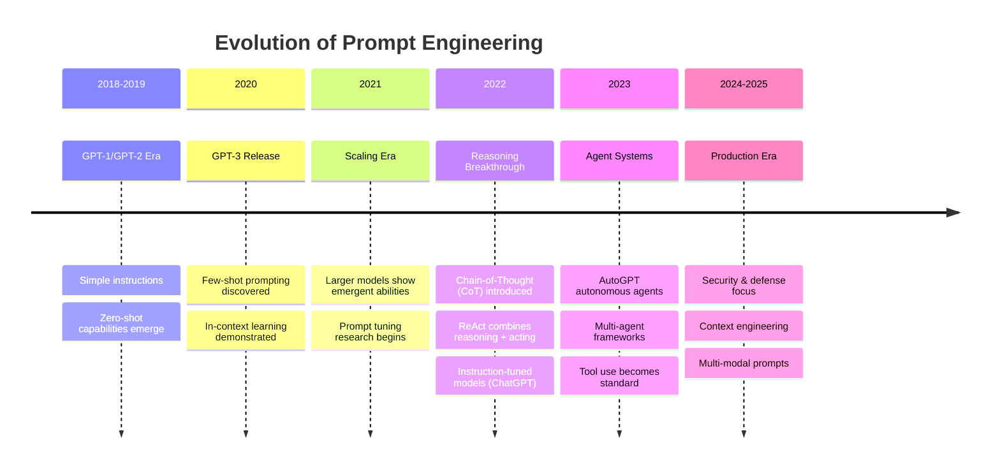
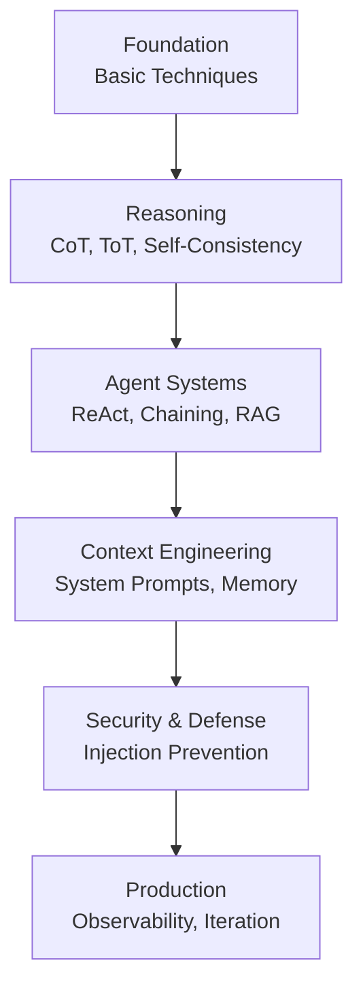
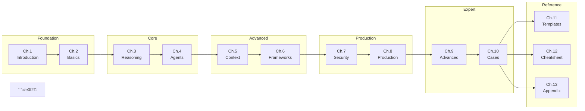

# Chapter 1: Introduction

> [中文版](zh/01-introduction.md)

---

## 1.1 What is Prompt Engineering

Prompt Engineering is the art and science of designing effective inputs (prompts) to elicit desired outputs from Large Language Models (LLMs). It bridges the gap between human intent and machine understanding, transforming vague ideas into precise instructions that AI systems can execute reliably.

### Definition

At its core, Prompt Engineering involves:

- **Crafting clear instructions** that communicate exactly what you want the model to do
- **Providing appropriate context** to guide the model's understanding
- **Structuring outputs** to ensure responses are parseable and useful
- **Iterating and refining** based on model behavior and task requirements

### Why It Matters

The same model can produce dramatically different results depending on how you phrase your request. A well-engineered prompt can:

- Improve accuracy by 30-50% on complex reasoning tasks
- Reduce hallucinations and factual errors
- Enable consistent, reproducible outputs
- Unlock capabilities the model already has but needs help accessing

### The Prompt Engineering Mindset

Effective Prompt Engineering requires shifting from "asking questions" to "programming with language":

| Traditional Query | Engineered Prompt |
|-------------------|-------------------|
| "Summarize this" | "Summarize the following text in 3 bullet points, focusing on key findings and actionable insights" |
| "Write code" | "Write a Python function that takes a list of integers and returns the sum of all even numbers. Include type hints and a docstring with example usage" |
| "Is this positive?" | "Classify the sentiment of the following text as POSITIVE, NEGATIVE, or NEUTRAL. Text: [input]\n\nSentiment:" |

---

## 1.2 Evolution History of Prompts

The field of Prompt Engineering has evolved rapidly alongside advances in language models. Understanding this evolution helps practitioners appreciate why certain techniques work and how to select appropriate approaches for different tasks.

### Timeline of Key Developments



### Evolution of Complexity

```mermaid
graph TD
    A[Simple Instructions<br/>2018-2020] --> B[Few-Shot Prompting<br/>2020-2021]
    B --> C[Chain-of-Thought<br/>2022]
    C --> D[ReAct Agent<br/>2022-2023]
    D --> E[Multi-Agent Systems<br/>2023-2024]
    E --> F[Context Engineering<br/>2024-2025]
``` E fill:#fce4ec
```

### Key Milestones

**2018-2020: The Pre-Prompt Era**
- Early GPT models required minimal prompting
- Simple instructions often sufficient
- Limited understanding of context and nuance

**2020-2021: Few-Shot Learning Discovery**
- Researchers discovered that providing examples in the prompt dramatically improves performance
- "In-context learning" becomes a key concept
- Prompts grow from sentences to paragraphs

**2022: The Reasoning Revolution**
- **Chain-of-Thought (CoT)**: Wei et al. showed that asking models to "think step by step" unlocks reasoning capabilities
- **ReAct**: Yao et al. combined reasoning with tool use, enabling agents that can search, calculate, and act
- ChatGPT demonstrates the power of instruction tuning and conversational prompts

**2023: The Agent Explosion**
- AutoGPT popularizes autonomous agents that can pursue goals independently
- Multi-agent frameworks (CrewAI, AutoGen) enable collaborative AI systems
- Prompts become complex systems with memory, tools, and planning

**2024-2025: Production Maturity**
- Focus shifts to security, reliability, and observability
- Context engineering emerges as a discipline
- Prompt injection defense becomes critical
- Standardization and best practices solidify

---

## 1.3 Why Systematic Learning is Needed

Prompt Engineering might seem simple at first, write some text, get a response. But as tasks grow complex, ad-hoc approaches hit limits. Systematic learning provides the framework to tackle increasingly sophisticated challenges.

### The Pitfalls of Ad-Hoc Prompting

Without systematic knowledge, practitioners commonly face:

1. **Inconsistency**: Prompts that work today may fail tomorrow with slight input variations
2. **Brittleness**: Small changes in wording cause large changes in output quality
3. **Scalability Issues**: Techniques that work for simple tasks break down for complex workflows
4. **Security Vulnerabilities**: Unintentional exposure to prompt injection and jailbreak attacks
5. **Maintenance Nightmare**: Undocumented prompts become impossible to debug or improve

### Benefits of Systematic Learning

**Reliability**: Understanding underlying principles lets you design prompts that work consistently across different inputs and model versions.

**Efficiency**: Knowing which technique to apply saves hours of trial and error. A well-chosen CoT prompt can solve in one call what might take dozens of iterations with basic prompting.

**Composability**: Systematic knowledge enables building complex systems from simple, well-understood components.

**Debuggability**: Structured approaches make it easier to identify where things go wrong and how to fix them.

**Transferability**: Principles learned apply across different models (GPT, Claude, Llama, etc.) and use cases.

### The Knowledge Pyramid



---

## 1.4 Tutorial Learning Roadmap

This tutorial is structured to take you from foundational concepts to production-ready expertise. Each chapter builds upon the previous, creating a comprehensive understanding of Prompt Engineering.

### Learning Path Overview



### Chapter Guide

| Chapter | Title | What You Will Learn | Time |
|---------|-------|---------------------|------|
| **1** | Introduction | What Prompt Engineering is, its evolution, and why systematic learning matters | 30 min |
| **2** | Basic Prompting | Zero-Shot, Few-Shot, Meta Prompting, and fundamental design principles | 1 hour |
| **3** | Reasoning Enhancement | Chain-of-Thought, Tree of Thoughts, Self-Consistency, and Reflexion | 1.5 hours |
| **4** | Agents & Tools | ReAct framework, Prompt Chaining, RAG, and structured output control | 2 hours |
| **5** | Context Engineering | Context hierarchy, System Prompt design, and token optimization | 1.5 hours |
| **6** | Framework Analysis | Deep dive into AutoGPT, CrewAI, Claude Code, and other frameworks | 2 hours |
| **7** | Security & Defense | Prompt injection types, defense strategies, and ML-based detection | 1.5 hours |
| **8** | Production Practices | Design checklists, observability, and continuous iteration | 2 hours |
| **9** | Advanced Topics | Multi-agent orchestration, skills systems, and dynamic prompt building | 2 hours |
| **10** | Case Studies | Real-world implementations: coding assistants, research agents, security audits | 3 hours |
| **11** | Template Library | Ready-to-use templates for common tasks and scenarios | Reference |
| **12** | Cheatsheet | Quick reference for techniques, formats, and best practices | Reference |
| **13** | Appendix | Academic papers, resources, glossary, and source index | Reference |

### Recommended Learning Paths

**Beginner Path (~4 hours)**
1. Chapter 1: Introduction (understand the landscape)
2. Chapter 2: Basic Prompting (master fundamentals)
3. Chapter 3: Reasoning Enhancement (add reasoning capabilities)
4. Chapter 11-12: Templates & Cheatsheet (start using immediately)

**Developer Path (~10 hours)**
1. Complete Chapters 1-8 (full foundation)
2. Focus on Chapter 6 (framework analysis)
3. Practice with Chapter 10 (case studies)
4. Keep Chapter 11-12 handy for reference

**Expert Path (on-demand)**
1. Skim Chapters 1-2 if needed
2. Jump to Chapters 9-10 for advanced topics
3. Deep dive into specific frameworks from Chapter 6
4. Use Chapter 13 for research references

---

## 1.5 How to Effectively Use This Tutorial

To get the most out of this tutorial, follow these guidelines:

### Active Learning

**Practice as You Read**: Don't just read the examples, try them yourself. Use an LLM interface (ChatGPT, Claude, etc.) to experiment with each technique as you learn it.

**Modify and Experiment**: Take the provided templates and modify them. Change wording, add constraints, try different formats. This builds intuition for what works.

**Build a Prompt Library**: As you progress, collect prompts that work well for your use cases. Chapter 11 provides a starting point, but your personal library will be more valuable.

### Cross-Reference

**Link Between Chapters**: Concepts build on each other. If you encounter a term you don't understand, check the Appendix or earlier chapters.

**Compare Techniques**: When multiple approaches exist (e.g., different CoT variants), try them side-by-side to understand trade-offs.

**Check the Source**: Chapter 13 lists all academic papers and resources. For deeper understanding, read the original research.

### Apply to Real Problems

**Start with Your Use Case**: Instead of abstract exercises, apply techniques to problems you actually face.

**Iterate in Production**: The Production chapter (Ch.8) emphasizes that Prompt Engineering doesn't end at deployment. Monitor, measure, and improve.

**Share and Learn**: Join communities discussing Prompt Engineering. Share your prompts and learn from others' approaches.

### Keep Updated

The field evolves rapidly. While this tutorial captures best practices as of 2024-2025, new techniques emerge constantly. Stay curious and keep learning.

---

## Summary

In this chapter, we covered:

- **What Prompt Engineering is**: The discipline of crafting effective inputs for LLMs to produce desired outputs
- **Evolution history**: From simple instructions to complex agent systems, spanning 2018-2025
- **Why systematic learning matters**: Moving beyond ad-hoc prompting to reliable, scalable approaches
- **Learning roadmap**: A 13-chapter journey from basics to expert-level knowledge
- **How to use this tutorial**: Active learning, cross-referencing, and real-world application

You're now ready to begin your journey into the art and science of Prompt Engineering. Let's start with the fundamentals in Chapter 2: Basic Prompting.

---

## Next Steps

→ Continue to [Chapter 2: Basic Prompting](./02-basics.md)

Or jump to:
- [Chapter 11: Template Library](./11-templates.md) for ready-to-use prompts
- [Chapter 12: Cheatsheet](./12-cheatsheet.md) for quick reference
