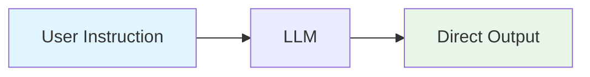
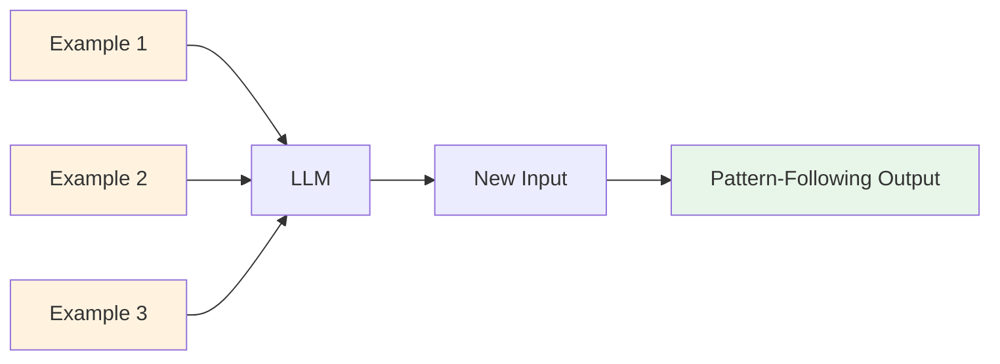
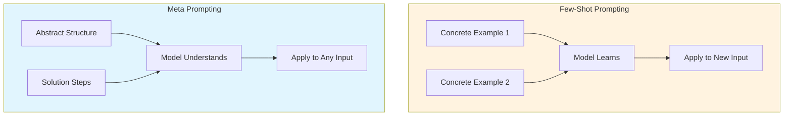
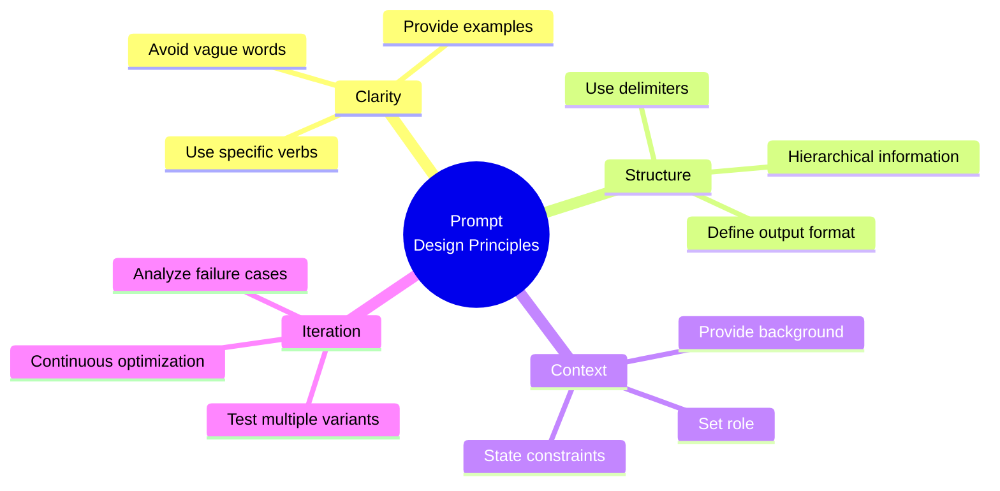
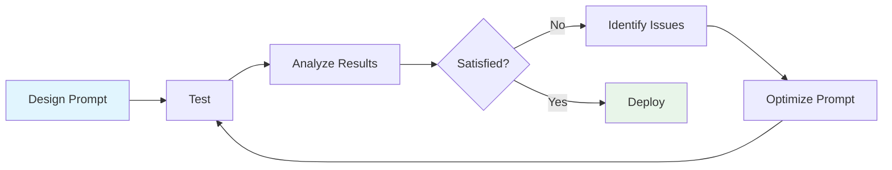
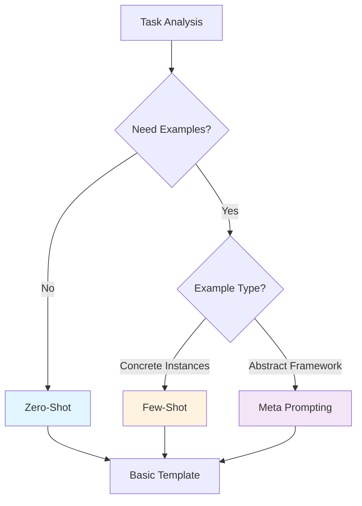

# Chapter 2: Basic Prompting

> [中文版](02-basics-zh.md)

---

## Table of Contents

1. [Zero-Shot Prompting](#zero-shot-prompting)
2. [Few-Shot Prompting](#few-shot-prompting)
3. [Meta Prompting](#meta-prompting)
4. [Prompt Design Principles](#prompt-design-principles)
5. [Practice Exercises](#practice-exercises)

---

## Zero-Shot Prompting

### Concept

Zero-Shot Prompting means giving direct instructions to the model without providing any examples. The model relies solely on knowledge gained during pre-training and its ability to understand instructions to complete the task.



### Use Cases

| Scenario Type | Description | Examples |
|--------------|-------------|----------|
| **Simple Classification** | Categories are clearly defined, no examples needed | Sentiment classification, topic classification |
| **Text Transformation** | Format-specific conversion operations | Translation, summarization, rewriting |
| **Open-ended Q&A** | Direct answers based on knowledge base | Factual questions, concept explanations |
| **Code Generation** | Programming tasks with clear requirements | Function implementation, algorithm writing |

### Template Examples

#### Example 1: Sentiment Classification

```markdown
Classify the text into neutral, negative or positive.

Text: I think the vacation is okay.
Sentiment:
```

**Expected Output**:
```
Neutral
```

#### Example 2: Text Translation

```markdown
Translate the following English text to Chinese:

Text: The quick brown fox jumps over the lazy dog.
Translation:
```

**Expected Output**:
```
那只敏捷的棕色狐狸跳过了那只懒狗。
```

#### Example 3: Code Generation

```markdown
Write a Python function that calculates the factorial of a number.

Requirements:
- Include input validation
- Handle edge cases (0, negative numbers)
- Add docstring

Code:
```

**Expected Output**:
```python
def factorial(n):
    """
    Calculate the factorial of a non-negative integer.

    Args:
        n: A non-negative integer

    Returns:
        The factorial of n

    Raises:
        ValueError: If n is negative
        TypeError: If n is not an integer
    """
    if not isinstance(n, int):
        raise TypeError("Input must be an integer")
    if n < 0:
        raise ValueError("Factorial is not defined for negative numbers")
    if n == 0:
        return 1
    return n * factorial(n - 1)
```

### Key Principles

1. **Instructions Must Be Clear and Specific**
   - Use specific verbs (Classify, Translate, Extract, Summarize)
   - Avoid vague words (process, analyze, look at)

2. **Define Clear Output Format**
   - Explicitly specify output format (list, JSON, paragraph)
   - Use delimiters to separate input and output

3. **Avoid Ambiguous Terms**
   - Each term should have a clear definition
   - Provide necessary context information

---

## Few-Shot Prompting

### Concept

Few-Shot Prompting provides several examples in the prompt, allowing the model to learn task patterns and rules through context. This approach is particularly useful for tasks requiring specific output formats or involving novel concepts.



### Use Cases

- Tasks requiring specific output formats
- Understanding novel vocabulary or concepts
- Classification tasks (especially custom categories)
- Style transfer or imitation tasks

### Template Examples

#### Example 1: Novel Word Usage

```markdown
A "whatpu" is a small, furry animal native to Tanzania.
An example of a sentence that uses the word whatpu is:
We were traveling in Africa and we saw these very cute whatpus.

To do a "farduddle" means to jump up and down really fast.
An example of a sentence that uses the word farduddle is:
```

**Expected Output**:
```
When we won the game, we all started to farduddle in celebration.
```

#### Example 2: Sentiment Classification (with Labels)

```markdown
This is awesome! // Positive
This is bad! // Negative
Wow that movie was rad! // Positive
What a horrible show! //
```

**Expected Output**:
```
Negative
```

#### Example 3: Format Conversion

```markdown
Convert the following natural language to SQL:

Input: Show me all users older than 25
Output: SELECT * FROM users WHERE age > 25

Input: Find orders placed in the last 30 days
Output: SELECT * FROM orders WHERE order_date >= DATE_SUB(NOW(), INTERVAL 30 DAY)

Input: Get the total sales for each product category
Output:
```

**Expected Output**:
```sql
SELECT category, SUM(sales) as total_sales
FROM products
GROUP BY category
```

### Few-Shot Variants

#### Variant 1: One-Shot

Provide only one example for simple tasks:

```markdown
Extract the name and age from the text:

Example:
Text: "John Smith is 30 years old"
Result: {"name": "John Smith", "age": 30}

Text: "Mary Johnson turned 25 last week"
Result:
```

#### Variant 2: Multi-Shot

Provide 3-5 examples for complex tasks:

```markdown
Classify the intent of the user query:

Query: "What's the weather like today?"
Intent: weather_check

Query: "Set an alarm for 7 AM"
Intent: alarm_set

Query: "Play some jazz music"
Intent: music_play

Query: "Remind me to call mom at 5 PM"
Intent:
```

### Min et al. Key Findings

According to Min et al. (2022), Few-Shot Prompting has the following important findings:

| Finding | Description | Practical Advice |
|---------|-------------|------------------|
| **Label Space Matters** | Label distribution in examples affects model judgment | Ensure examples cover all target categories |
| **Input Distribution Matters** | Example input style should match actual inputs | Use real-world scenario data as examples |
| **Random Labels Also Work** | Even random labels work better than no labels | Format consistency matters more than label accuracy |
| **Format Consistency is Key** | Uniform format matters more than content accuracy | Maintain consistent input-output format |

---

## Meta Prompting

### Concept

Meta Prompting focuses on the structure and syntax of tasks rather than specific content. It provides abstract task frameworks that help the model understand "how to solve problems" rather than "what specific problem to solve."

### Key Characteristics

According to Zhang et al. (2024), Meta Prompting has the following characteristics:

| Characteristic | Description |
|----------------|-------------|
| **Structure-Oriented** | Prioritizes format and patterns |
| **Syntax-Focused** | Uses syntax as response template |
| **Abstract Examples** | Uses abstract frameworks rather than specific details |
| **Cross-Domain Applicable** | Can be applied to multiple problem types |

### Comparison with Few-Shot



| Dimension | Few-Shot | Meta Prompting |
|-----------|----------|----------------|
| **Driving Force** | Content-driven | Structure-driven |
| **Example Type** | Requires multiple concrete examples | Uses abstract templates |
| **Token Efficiency** | High consumption | High efficiency |
| **Model Comparison** | Heavily influenced by examples | Fairer model comparison |
| **Generalization** | Limited by example scope | Stronger generalization |

### Template Examples

#### Example 1: Math Problem Solving

```markdown
## Problem Solving Framework

Given a mathematical problem, solve it following this structure:

**Understanding Phase**:
- Identify given information
- Identify what needs to be found
- Note any constraints

**Solution Phase**:
- Show each step clearly
- Explain the reasoning
- State the final answer

**Verification Phase**:
- Check if answer makes sense
- Verify calculations

---

Problem: A train travels 300 km in 4 hours. What is its average speed?
```

**Expected Output**:
```
**Understanding Phase**:
- Given: Distance = 300 km, Time = 4 hours
- Need to find: Average speed
- Formula: Speed = Distance / Time

**Solution Phase**:
- Speed = 300 km / 4 hours
- Speed = 75 km/h

**Verification Phase**:
- 75 km/h × 4 hours = 300 km ✓
- The answer is reasonable for a train speed

**Final Answer**: 75 km/h
```

#### Example 2: Code Review

```markdown
## Code Review Framework

Review the code following this structure:

**Correctness**:
- Does the code solve the stated problem?
- Are there any logical errors?
- Are edge cases handled?

**Code Quality**:
- Is the code readable and maintainable?
- Are variable names descriptive?
- Is there appropriate documentation?

**Performance**:
- Are there any obvious inefficiencies?
- Could algorithms be optimized?

**Recommendations**:
- List specific improvements
- Prioritize by importance

---

Code:
```python
def find_max(numbers):
    max_num = 0
    for num in numbers:
        if num > max_num:
            max_num = num
    return max_num
```
```

**Expected Output**:
```
**Correctness**:
- The code finds the maximum number
- Issue: Returns 0 for empty list instead of None or raising error
- Issue: Fails if all numbers are negative (returns 0 instead of max negative)

**Code Quality**:
- Function name is clear
- Variable names are descriptive
- Missing docstring

**Performance**:
- O(n) time complexity is optimal for this problem
- Could use built-in max() function

**Recommendations**:
1. Initialize max_num with first element or None
2. Handle empty list case
3. Add docstring
4. Consider using built-in max() for simplicity
```

#### Example 3: Text Analysis

```markdown
## Text Analysis Framework

Analyze the text following this structure:

**Summary**:
- Main topic in one sentence
- Key points (3-5 bullet points)

**Sentiment**:
- Overall tone (positive/negative/neutral)
- Confidence level (high/medium/low)

**Key Entities**:
- People mentioned
- Organizations
- Important concepts

**Insights**:
- Notable observations
- Potential implications

---

Text: "Apple announced record quarterly revenue of $123.9 billion, up 11% year over year. The company sold 85 million iPhones during the holiday quarter, exceeding analyst expectations. CEO Tim Cook attributed the growth to strong demand for the iPhone 14 series."
```

---

## Prompt Design Principles

### Four Core Principles



### 1. Clarity

**Principle**: Instructions must be clear and unambiguous.

**Practical Advice**:

| ❌ Bad Example | ✅ Good Example |
|---------------|-----------------|
| "Analyze this text" | "Extract all person names and organizations from this text" |
| "Write a summary" | "Summarize the main points of this text in 3 sentences" |
| "Check the code" | "Check this Python code for SQL injection vulnerabilities" |

**Specific Verb List**:
- Classify
- Extract
- Summarize
- Translate
- Generate
- Rewrite
- Compare
- Explain

### 2. Structure

**Principle**: Use delimiters and format specifications to organize information.

**Common Delimiters**:

```markdown
## Using XML Tags
<instruction>
Your task instructions here
</instruction>

<context>
Background information here
</context>

<input>
User input here
</input>

## Using Markdown Headers
## Task
Your task instructions

## Context
Background information

## Input
User input

## Output Format
Expected output format
```

**Output Format Specifications**:

```markdown
Respond in the following JSON format:
{
  "summary": "Brief summary",
  "key_points": ["point 1", "point 2"],
  "sentiment": "positive/negative/neutral"
}
```

### 3. Context

**Principle**: Provide sufficient background information, set clear roles and constraints.

**Role Setting Template**:

```markdown
You are an expert {role} with {years} years of experience in {domain}.
Your task is to {task_description}.

Your expertise includes:
- {expertise_1}
- {expertise_2}
- {expertise_3}

Constraints:
- {constraint_1}
- {constraint_2}
```

**Example**:

```markdown
You are an expert Python code reviewer with 10 years of experience in software security.
Your task is to review code for security vulnerabilities.

Your expertise includes:
- Identifying injection vulnerabilities (SQL, command, XSS)
- Detecting authentication and authorization flaws
- Finding insecure deserialization and cryptographic issues

Constraints:
- Focus only on security issues, not style or performance
- Provide specific line numbers for each issue
- Suggest concrete fixes for each vulnerability
```

### 4. Iteration

**Principle**: Prompt engineering is a continuous optimization process.

**Iteration Flow**:



**Common Optimization Strategies**:

| Problem Type | Optimization Strategy |
|--------------|----------------------|
| Inconsistent output format | Add more examples, clarify format requirements |
| Missing key information | Add checklists, require item-by-item confirmation |
| Output too verbose | Add length limits, require concise answers |
| Understanding deviation | Clarify term definitions, provide more context |
| Hallucination content | Add verification steps, require source citations |

---

## Practice Exercises

### Exercise 1: Zero-Shot Basics

**Task**: Design a Zero-Shot Prompt to classify the following text as "Technology", "Business", or "Entertainment".

```
Text: "SpaceX successfully launched its Falcon Heavy rocket carrying a commercial satellite."
```

**Your Prompt**:
```markdown
[Write your prompt here]
```

**Reference Answer**:
```markdown
Classify the following text into one of these categories: Technology, Business, or Entertainment.

Text: "SpaceX successfully launched its Falcon Heavy rocket carrying a commercial satellite."

Category:
```

---

### Exercise 2: Few-Shot Design

**Task**: Design a Few-Shot Prompt to teach the model to convert natural language dates to YYYY-MM-DD format.

**Example Inputs**:
- "January 15, 2024" → "2024-01-15"
- "March 3rd, 2023" → "2023-03-03"
- "Dec 25, 2022" → "2022-12-25"

**New Input**: "July 4, 2025"

**Your Prompt**:
```markdown
[Write your prompt here]
```

**Reference Answer**:
```markdown
Convert natural language dates to YYYY-MM-DD format:

Input: January 15, 2024
Output: 2024-01-15

Input: March 3rd, 2023
Output: 2023-03-03

Input: Dec 25, 2022
Output: 2022-12-25

Input: July 4, 2025
Output:
```

---

### Exercise 3: Meta Prompting Application

**Task**: Design a Meta Prompt for analyzing user feedback.

**Requirements**:
- Define analysis framework (sentiment, key issues, recommendations)
- Applicable to any user feedback text
- Output structured results

**Your Prompt**:
```markdown
[Write your prompt here]
```

**Reference Answer**:
```markdown
## User Feedback Analysis Framework

Analyze the user feedback following this structure:

**Sentiment Analysis**:
- Overall sentiment (positive/negative/mixed)
- Confidence level (high/medium/low)
- Key emotional indicators

**Issue Identification**:
- Main problems mentioned
- Severity assessment (critical/high/medium/low)
- Frequency indicators (one-time/recurring)

**Actionable Insights**:
- Immediate actions needed
- Long-term improvements
- Opportunities identified

**Response Recommendations**:
- Suggested response tone
- Key points to address
- Follow-up actions

---

Feedback: [Insert user feedback here]
```

---

### Exercise 4: Comprehensive Application

**Scenario**: You are developing a customer service assistant and need to design a Prompt to handle customer complaints.

**Requirements**:
1. Use Few-Shot to provide handling examples
2. Use Meta Prompting to define analysis framework
3. Follow Prompt design principles (clarity, structure, context)

**Your Prompt**:
```markdown
[Write your prompt here]
```

**Reference Answer**:
```markdown
You are a customer service assistant specializing in complaint resolution.
Your task is to analyze customer complaints and provide structured responses.

## Analysis Framework

For each complaint, provide:

**Issue Classification**:
- Category (billing/product/delivery/service)
- Priority (urgent/high/medium/low)
- Complexity (simple/moderate/complex)

**Customer Sentiment**:
- Emotional state (frustrated/angry/disappointed/confused)
- Escalation risk (high/medium/low)

**Resolution Plan**:
- Immediate acknowledgment
- Investigation steps
- Proposed solution
- Timeline

## Examples

Complaint: "I was charged twice for my order #12345. This is unacceptable!"
Analysis:
- Category: billing, Priority: urgent, Complexity: simple
- Sentiment: frustrated, Escalation risk: medium
- Resolution: Acknowledge error, refund duplicate charge within 24 hours

Complaint: "My package arrived damaged and customer service hasn't responded in 3 days."
Analysis:
- Category: delivery, Priority: high, Complexity: moderate
- Sentiment: angry, Escalation risk: high
- Resolution: Apologize for delay, send replacement, offer discount

---

Complaint: {{customer_complaint}}

Analysis:
```

---

## Chapter Summary

### Core Concepts Review

| Technique | Core Idea | Use Cases | Key Points |
|-----------|-----------|-----------|------------|
| **Zero-Shot** | Direct instruction, no examples | Simple tasks, general knowledge | Clear instructions, defined format |
| **Few-Shot** | Provide examples to learn patterns | Specific formats, new concepts | Example quality, format consistency |
| **Meta** | Abstract structure guidance | Complex tasks, cross-domain | Clear framework, defined steps |

### Technique Selection Decision Tree



### Next Steps

After completing this chapter, continue learning:

1. **[Chapter 3: Reasoning Enhancement](./03-reasoning-en.md)** - Learn Chain-of-Thought, Tree of Thoughts, and other reasoning enhancement techniques
2. **[Chapter 11: Template Library](./11-templates-en.md)** - View more practical Prompt templates
3. **[Chapter 12: Cheatsheet](./12-cheatsheet-en.md)** - Quick reference for various technique points

---

## References

### Academic Research

- **Min et al. (2022)**: "Rethinking the Role of Demonstrations: What Makes In-Context Learning Work?" - [arXiv:2202.12837](https://arxiv.org/abs/2202.12837)
- **Zhang et al. (2024)**: "Meta Prompting: A New Approach to Task Abstraction" - Theoretical foundation of Meta Prompting techniques

### Related Chapters

- [Chapter 3: Reasoning Enhancement](./03-reasoning-en.md) - Chain-of-Thought and Tree of Thoughts
- [Chapter 11: Template Library](./11-templates-en.md) - More practical templates
- [Chapter 12: Cheatsheet](./12-cheatsheet-en.md) - Quick reference

---

*This chapter is based on the latest research and practical experience from 2024-2025.*
