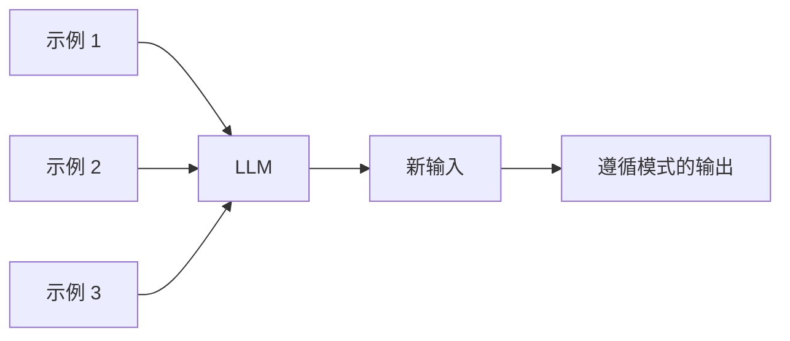
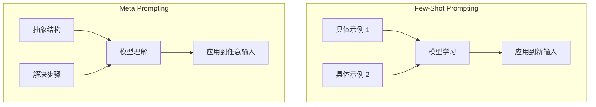
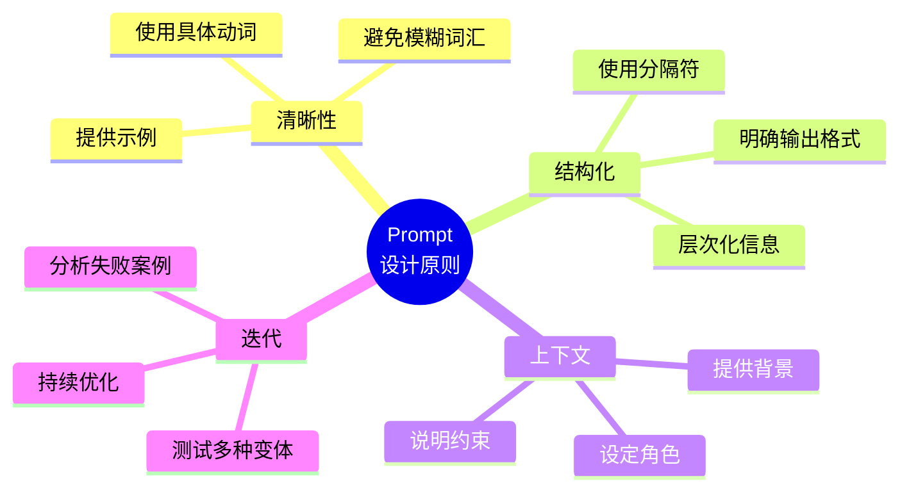
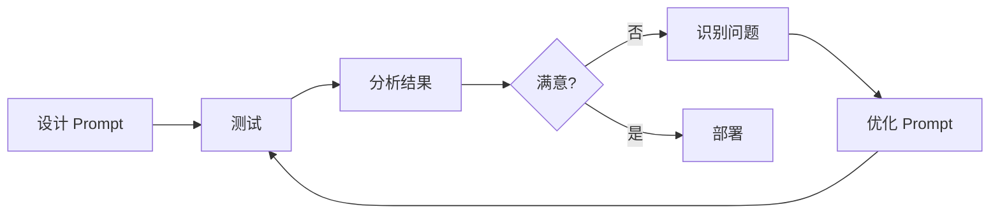
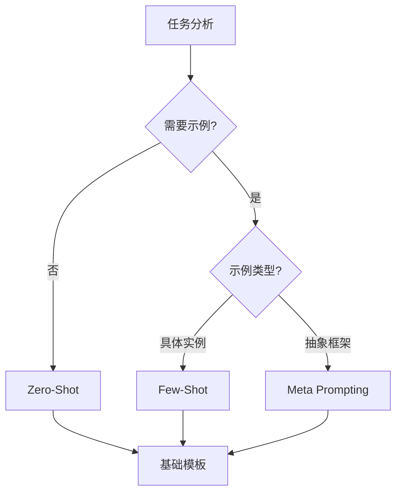

# 第 2 章：基础 Prompting

> [English Version](02-basics-en.md)

---

## 目录

1. [Zero-Shot Prompting（零样本提示）](#zero-shot-prompting零样本提示)
2. [Few-Shot Prompting（少样本提示）](#few-shot-prompting少样本提示)
3. [Meta Prompting（元提示）](#meta-prompting元提示)
4. [Prompt 设计原则](#prompt-设计原则)
5. [实践练习](#实践练习)

---

## Zero-Shot Prompting（零样本提示）

### 概念

Zero-Shot Prompting 是指直接向模型发出指令，不提供任何示例。模型仅依靠预训练阶段获得的知识和指令理解能力来完成任务。


### 适用场景

| 场景类型 | 说明 | 示例 |
|---------|------|------|
| **简单分类任务** | 类别定义清晰，无需示例引导 | 情感分类、主题分类 |
| **文本转换** | 格式明确的转换操作 | 翻译、摘要、改写 |
| **开放式问答** | 基于知识库的直接回答 | 事实性问题、概念解释 |
| **代码生成** | 需求描述清晰的编程任务 | 函数实现、算法编写 |

### 模板示例

#### 示例 1：情感分类

```markdown
将文本分类为中性、负面或正面。

文本：我觉得这次假期还可以。
情感：
```

**预期输出**：
```
中性
```

#### 示例 2：文本翻译

```markdown
将以下英文文本翻译成中文：

文本：The quick brown fox jumps over the lazy dog.
翻译：
```

**预期输出**：
```
那只敏捷的棕色狐狸跳过了那只懒狗。
```

#### 示例 3：代码生成

```markdown
编写一个计算数字阶乘的 Python 函数。

要求：
- 包含输入验证
- 处理边界情况（0、负数）
- 添加文档字符串

代码：
```

**预期输出**：
```python
def factorial(n):
    """
    计算非负整数的阶乘。

    参数：
        n: 一个非负整数

    返回：
        n 的阶乘

    异常：
        ValueError: 如果 n 为负数
        TypeError: 如果 n 不是整数
    """
    if not isinstance(n, int):
        raise TypeError("输入必须是整数")
    if n < 0:
        raise ValueError("负数没有阶乘定义")
    if n == 0:
        return 1
    return n * factorial(n - 1)
```

### 关键原则

1. **指令必须明确具体**
   - 使用具体的动词（分类、翻译、提取、总结）
   - 避免模糊的词汇（处理、分析、看看）

2. **定义清晰的输出格式**
   - 明确指定输出形式（列表、JSON、段落）
   - 使用分隔符区分输入和输出

3. **避免歧义词汇**
   - 每个术语应有明确的定义
   - 提供必要的上下文信息

---

## Few-Shot Prompting（少样本提示）

### 概念

Few-Shot Prompting 是在 Prompt 中提供几个示例，让模型通过上下文学习任务的模式和规律。这种方法特别适用于需要特定输出格式或涉及新颖概念的任务。



### 适用场景

- 需要特定格式输出的任务
- 涉及新颖词汇或概念的理解
- 分类任务（尤其是自定义类别）
- 风格迁移或模仿任务

### 模板示例

#### 示例 1：新词汇造句

```markdown
"whatpu" 是一种原产于坦桑尼亚的小型毛茸茸动物。
使用 whatpu 这个词造句的例子：
我们在非洲旅行时看到了这些非常可爱的 whatpus。

"farduddle" 的意思是非常快速地上下跳跃。
使用 farduddle 这个词造句的例子：
```

**预期输出**：
```
当我们赢得比赛时，我们都开始 farduddle 来庆祝。
```

#### 示例 2：情感分类（带标签）

```markdown
太棒了！// 正面
这太糟糕了！// 负面
哇，那部电影太酷了！// 正面
多么糟糕的节目！//
```

**预期输出**：
```
负面
```

#### 示例 3：格式转换

```markdown
将以下自然语言转换为 SQL：

输入：显示所有年龄大于 25 的用户
输出：SELECT * FROM users WHERE age > 25

输入：查找最近 30 天内的订单
输出：SELECT * FROM orders WHERE order_date >= DATE_SUB(NOW(), INTERVAL 30 DAY)

输入：获取每个产品类别的总销售额
输出：
```

**预期输出**：
```sql
SELECT category, SUM(sales) as total_sales
FROM products
GROUP BY category
```

### Few-Shot 变体

#### 变体 1：单样本（One-Shot）

仅提供一个示例，适用于简单任务：

```markdown
从文本中提取姓名和年龄：

示例：
文本："John Smith 今年 30 岁"
结果：{"name": "John Smith", "age": 30}

文本："Mary Johnson 上周满 25 岁了"
结果：
```

#### 变体 2：多样本（Multi-Shot）

提供 3-5 个示例，适用于复杂任务：

```markdown
对用户查询的意图进行分类：

查询："今天天气怎么样？"
意图：weather_check

查询："设置早上 7 点的闹钟"
意图：alarm_set

查询："播放一些爵士音乐"
意图：music_play

查询："提醒我在下午 5 点给妈妈打电话"
意图：
```

### Min et al. 关键发现

根据 Min et al. (2022) 的研究，Few-Shot Prompting 有以下重要发现：

| 发现 | 说明 | 实践建议 |
|------|------|---------|
| **标签空间很重要** | 示例中的标签分布影响模型判断 | 确保示例覆盖所有目标类别 |
| **输入分布很重要** | 示例的输入风格应与实际输入相似 | 使用真实场景数据作为示例 |
| **随机标签也有效** | 即使使用随机标签，也比没有标签好 | 格式一致性比标签准确性更重要 |
| **格式一致性关键** | 统一的格式比内容准确性更重要 | 保持输入-输出格式的一致性 |

---

## Meta Prompting（元提示）

### 概念

Meta Prompting 关注任务的结构和语法，而非具体内容。它提供抽象的任务框架，让模型理解"如何解决问题"而不是"解决什么具体问题"。

### 关键特性

根据 Zhang et al. (2024) 的研究，Meta Prompting 具有以下特性：

| 特性 | 说明 |
|------|------|
| **结构导向** | 优先关注格式和模式 |
| **语法聚焦** | 使用语法作为响应模板 |
| **抽象示例** | 使用抽象框架而非具体细节 |
| **跨领域适用** | 可应用于多种问题类型 |

### 与 Few-Shot 对比


| 维度 | Few-Shot | Meta Prompting |
|------|---------|---------------|
| **驱动方式** | 内容驱动 | 结构驱动 |
| **示例类型** | 需要多个具体示例 | 使用抽象模板 |
| **Token 效率** | 消耗大 | 效率高 |
| **模型比较** | 受示例影响大 | 更公平的模型比较 |
| **泛化能力** | 受限于示例范围 | 更强的泛化能力 |

### 模板示例

#### 示例 1：数学问题求解

```markdown
## 问题解决框架

给定一个数学问题，按照以下结构求解：

**理解阶段**：
- 识别已知信息
- 识别需要求解的内容
- 注意任何约束条件

**求解阶段**：
- 清晰地展示每一步
- 解释推理过程
- 给出最终答案

**验证阶段**：
- 检查答案是否合理
- 验证计算过程

---

问题：一列火车在 4 小时内行驶了 300 公里。它的平均速度是多少？
```

**预期输出**：
```
**理解阶段**：
- 已知：距离 = 300 公里，时间 = 4 小时
- 需要求解：平均速度
- 公式：速度 = 距离 / 时间

**求解阶段**：
- 速度 = 300 公里 / 4 小时
- 速度 = 75 公里/小时

**验证阶段**：
- 75 公里/小时 × 4 小时 = 300 公里 ✓
- 这个答案对于火车速度来说是合理的

**最终答案**：75 公里/小时
```

#### 示例 2：代码审查

```markdown
## 代码审查框架

按照以下结构审查代码：

**正确性**：
- 代码是否解决了所述问题？
- 是否存在逻辑错误？
- 边界情况是否已处理？

**代码质量**：
- 代码是否可读且易于维护？
- 变量名是否具有描述性？
- 是否有适当的文档？

**性能**：
- 是否存在明显的低效之处？
- 算法是否可以优化？

**建议**：
- 列出具体的改进项
- 按重要性排序

---

代码：
```python
def find_max(numbers):
    max_num = 0
    for num in numbers:
        if num > max_num:
            max_num = num
    return max_num
```
```

**预期输出**：
```
**正确性**：
- 代码能够找到最大值
- 问题：对于空列表返回 0 而不是 None 或抛出错误
- 问题：如果所有数字都是负数会失败（返回 0 而不是最大的负数）

**代码质量**：
- 函数名清晰
- 变量名具有描述性
- 缺少文档字符串

**性能**：
- O(n) 时间复杂度对于这个问题是最优的
- 可以使用内置的 max() 函数

**建议**：
1. 用第一个元素或 None 初始化 max_num
2. 处理空列表情况
3. 添加文档字符串
4. 考虑使用内置的 max() 以简化代码
```

#### 示例 3：文本分析

```markdown
## 文本分析框架

按照以下结构分析文本：

**摘要**：
- 一句话概括主题
- 关键要点（3-5 个要点）

**情感**：
- 整体基调（正面/负面/中性）
- 置信度（高/中/低）

**关键实体**：
- 提到的人物
- 组织
- 重要概念

**洞察**：
- 值得注意的观察
- 潜在影响

---

文本："Apple 宣布季度收入达到创纪录的 1239 亿美元，同比增长 11%。该公司在假日季度售出了 8500 万部 iPhone，超出分析师预期。CEO Tim Cook 将增长归因于 iPhone 14 系列的强劲需求。"
```

---

## Prompt 设计原则

### 四大核心原则



### 1. 清晰性（Clarity）

**原则**：指令必须明确、无歧义。

**实践建议**：

| ❌ 不好的示例 | ✅ 好的示例 |
|-------------|-----------|
| "分析这段文字" | "提取这段文字中的所有人名和组织名" |
| "写个总结" | "用 3 句话总结这段文字的主要观点" |
| "检查代码" | "检查这段 Python 代码是否存在 SQL 注入漏洞" |

**具体动词清单**：
- Classify（分类）
- Extract（提取）
- Summarize（总结）
- Translate（翻译）
- Generate（生成）
- Rewrite（改写）
- Compare（比较）
- Explain（解释）

### 2. 结构化（Structure）

**原则**：使用分隔符和格式规范组织信息。

**常用分隔符**：

```markdown
## 使用 XML 标签
<instruction>
你的任务指令写在这里
</instruction>

<context>
背景信息写在这里
</context>

<input>
用户输入写在这里
</input>

## 使用 Markdown 标题
## 任务
你的任务指令

## 上下文
背景信息

## 输入
用户输入

## 输出格式
预期的输出格式
```

**输出格式规范**：

```markdown
按照以下 JSON 格式回复：
{
  "summary": "简要摘要",
  "key_points": ["要点 1", "要点 2"],
  "sentiment": "positive/negative/neutral"
}
```

### 3. 上下文（Context）

**原则**：提供足够的背景信息，设定明确的角色和约束。

**角色设定模板**：

```markdown
你是一位在 {domain} 领域拥有 {years} 年经验的 {role} 专家。
你的任务是 {task_description}。

你的专业领域包括：
- {expertise_1}
- {expertise_2}
- {expertise_3}

约束条件：
- {constraint_1}
- {constraint_2}
```

**示例**：

```markdown
你是一位在软件安全领域拥有 10 年经验的 Python 代码审查专家。
你的任务是审查代码中的安全漏洞。

你的专业领域包括：
- 识别注入漏洞（SQL、命令、XSS）
- 检测认证和授权缺陷
- 发现不安全的反序列化和加密问题

约束条件：
- 只关注安全问题，不涉及风格或性能
- 为每个问题提供具体的行号
- 为每个漏洞提出具体的修复建议
```

### 4. 迭代（Iteration）

**原则**：Prompt 工程是一个持续优化的过程。

**迭代流程**：



**常见优化策略**：

| 问题类型 | 优化策略 |
|---------|---------|
| 输出格式不一致 | 添加更多示例，明确格式要求 |
| 遗漏关键信息 | 添加检查清单，要求逐项确认 |
| 输出过于冗长 | 添加长度限制，要求简洁回答 |
| 理解偏差 | 澄清术语定义，提供更多上下文 |
| 幻觉内容 | 添加验证步骤，要求引用来源 |

---

## 实践练习

### 练习 1：Zero-Shot 基础

**任务**：设计一个 Zero-Shot Prompt，让模型将以下文本分类为"技术"、"商业"或"娱乐"。

```
文本："SpaceX successfully launched its Falcon Heavy rocket carrying a commercial satellite."
```

**你的 Prompt**：
```markdown
[在此编写你的 Prompt]
```

**参考答案**：
```markdown
将以下文本分类为以下类别之一：技术、商业或娱乐。

文本："SpaceX 成功发射了其猎鹰重型火箭，搭载了一颗商业卫星。"

类别：
```

---

### 练习 2：Few-Shot 设计

**任务**：设计一个 Few-Shot Prompt，让模型学习将自然语言日期转换为 YYYY-MM-DD 格式。

**示例输入**：
- "January 15, 2024" → "2024-01-15"
- "March 3rd, 2023" → "2023-03-03"
- "Dec 25, 2022" → "2022-12-25"

**新输入**："July 4, 2025"

**你的 Prompt**：
```markdown
[在此编写你的 Prompt]
```

**参考答案**：
```markdown
将自然语言日期转换为 YYYY-MM-DD 格式：

输入：January 15, 2024
输出：2024-01-15

输入：March 3rd, 2023
输出：2023-03-03

输入：Dec 25, 2022
输出：2022-12-25

输入：July 4, 2025
输出：
```

---

### 练习 3：Meta Prompting 应用

**任务**：设计一个 Meta Prompt，用于分析用户反馈。

**要求**：
- 定义分析框架（情感、关键问题、建议）
- 适用于任意用户反馈文本
- 输出结构化结果

**你的 Prompt**：
```markdown
[在此编写你的 Prompt]
```

**参考答案**：
```markdown
## 用户反馈分析框架

按照以下结构分析用户反馈：

**情感分析**：
- 整体情感（正面/负面/混合）
- 置信度（高/中/低）
- 关键情感指标

**问题识别**：
- 提到的主要问题
- 严重程度评估（严重/高/中/低）
- 频率指标（一次性/反复出现）

**可行洞察**：
- 需要立即采取的行动
- 长期改进措施
- 发现的机会

**回复建议**：
- 建议的回复语气
- 需要解决的关键点
- 后续行动

---

反馈：[在此插入用户反馈]
```

---

### 练习 4：综合应用

**场景**：你正在开发一个客服助手，需要设计一个 Prompt 来处理客户投诉。

**要求**：
1. 使用 Few-Shot 提供处理示例
2. 使用 Meta Prompting 定义分析框架
3. 遵循 Prompt 设计原则（清晰、结构化、上下文）

**你的 Prompt**：
```markdown
[在此编写你的 Prompt]
```

**参考答案**：
```markdown
你是一位专门处理投诉的客服助手。
你的任务是分析客户投诉并提供结构化的回复。

## 分析框架

对于每个投诉，提供：

**问题分类**：
- 类别（账单/产品/配送/服务）
- 优先级（紧急/高/中/低）
- 复杂度（简单/中等/复杂）

**客户情感**：
- 情绪状态（沮丧/愤怒/失望/困惑）
- 升级风险（高/中/低）

**解决方案**：
- 立即确认
- 调查步骤
- 建议的解决方案
- 时间线

## 示例

投诉："我的订单 #12345 被重复扣款了。这是不可接受的！"
分析：
- 类别：账单，优先级：紧急，复杂度：简单
- 情感：沮丧，升级风险：中
- 解决方案：承认错误，24 小时内退还重复扣款

投诉："我的包裹到货时已经损坏，客服 3 天都没有回复。"
分析：
- 类别：配送，优先级：高，复杂度：中等
- 情感：愤怒，升级风险：高
- 解决方案：为延迟道歉，发送替换品，提供折扣

---

投诉：{{customer_complaint}}

分析：
```

---

## 本章总结

### 核心概念回顾

| 技术 | 核心思想 | 适用场景 | 关键要点 |
|------|---------|---------|---------|
| **Zero-Shot** | 直接指令，无示例 | 简单任务、通用知识 | 指令清晰、格式明确 |
| **Few-Shot** | 提供示例学习模式 | 特定格式、新概念 | 示例质量、格式一致 |
| **Meta** | 抽象结构指导 | 复杂任务、跨领域 | 框架清晰、步骤明确 |

### 技术选择决策树



### 下一步学习

完成本章后，建议继续学习：

1. **[第 3 章：推理增强](./03-reasoning-zh.md)** - 学习 Chain-of-Thought、Tree of Thoughts 等推理增强技术
2. **[第 11 章：模板库](./11-templates-zh.md)** - 查看更多实用 Prompt 模板
3. **[第 12 章：速查表](./12-cheatsheet-zh.md)** - 快速参考各种技术要点

---

## 参考资源

### 学术研究

- **Min et al. (2022)**: "Rethinking the Role of Demonstrations: What Makes In-Context Learning Work?" - [arXiv:2202.12837](https://arxiv.org/abs/2202.12837)
- **Zhang et al. (2024)**: "Meta Prompting: A New Approach to Task Abstraction" - 元提示技术理论基础

### 相关章节

- [第 3 章：推理增强](./03-reasoning-zh.md) - Chain-of-Thought 和 Tree of Thoughts
- [第 11 章：模板库](./11-templates-zh.md) - 更多实用模板
- [第 12 章：速查表](./12-cheatsheet-zh.md) - 快速参考

---

*本章内容基于 2024-2025 年最新研究和实践经验整理。*
