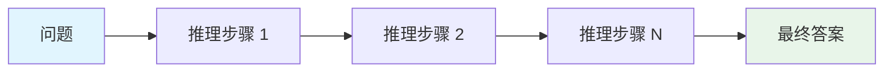
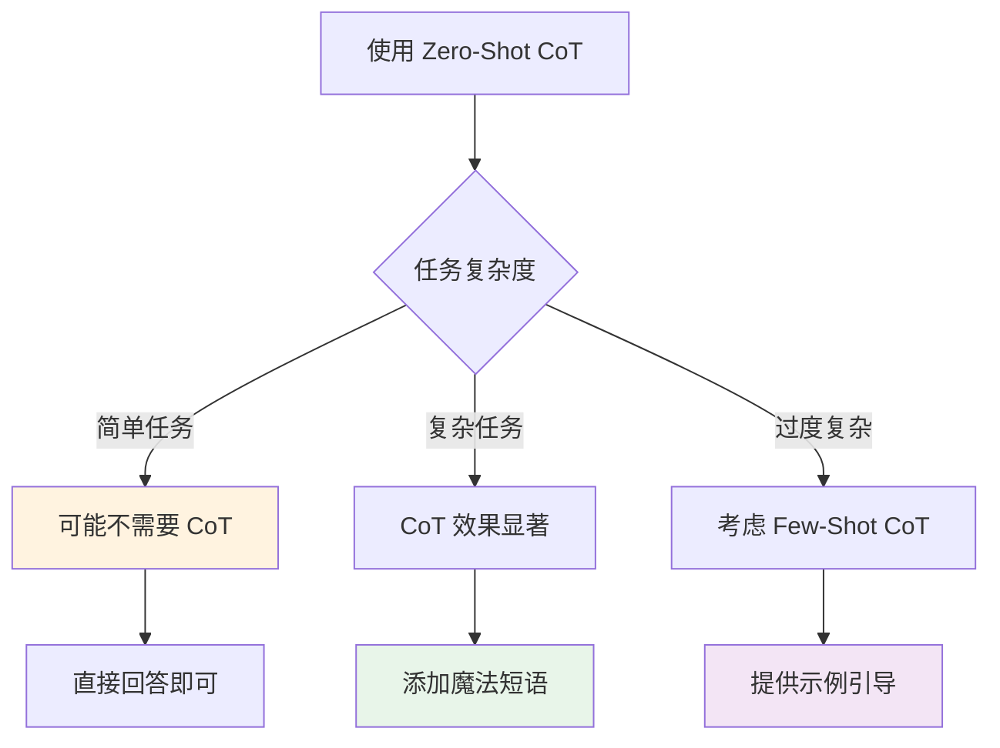
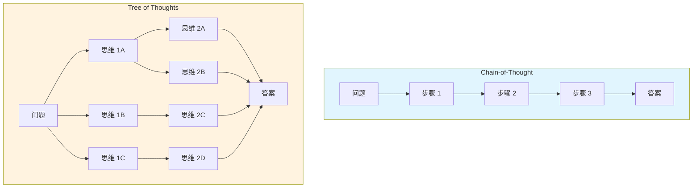
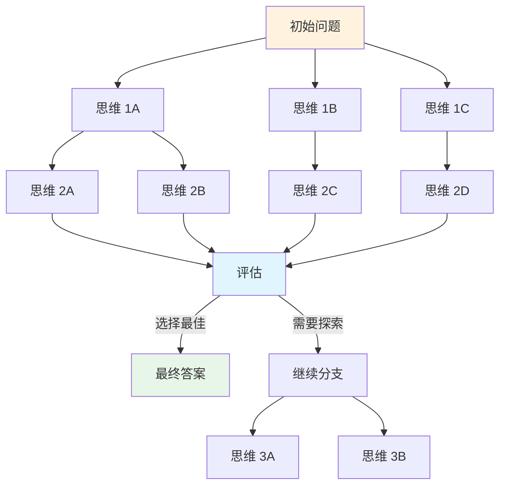
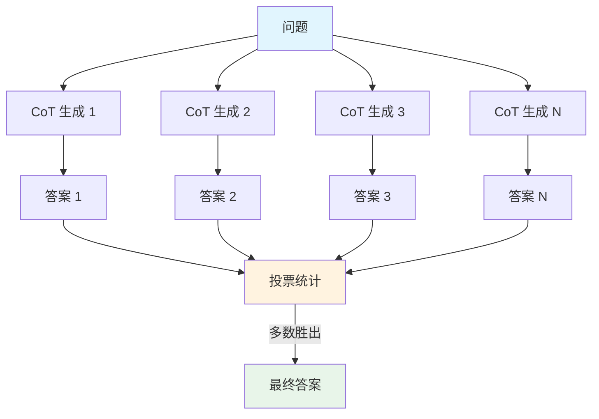
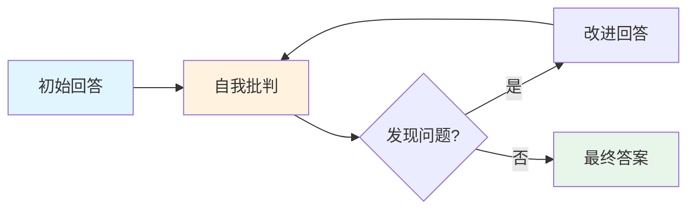
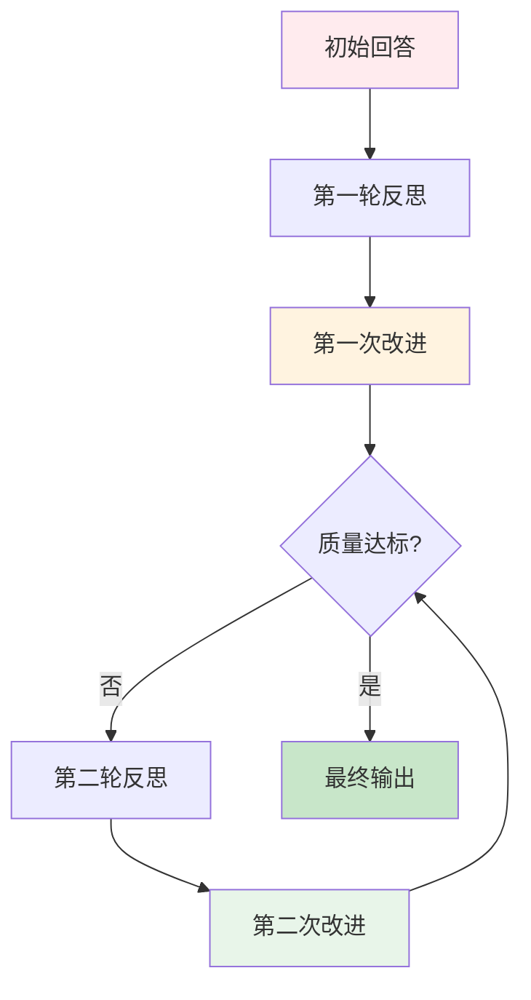
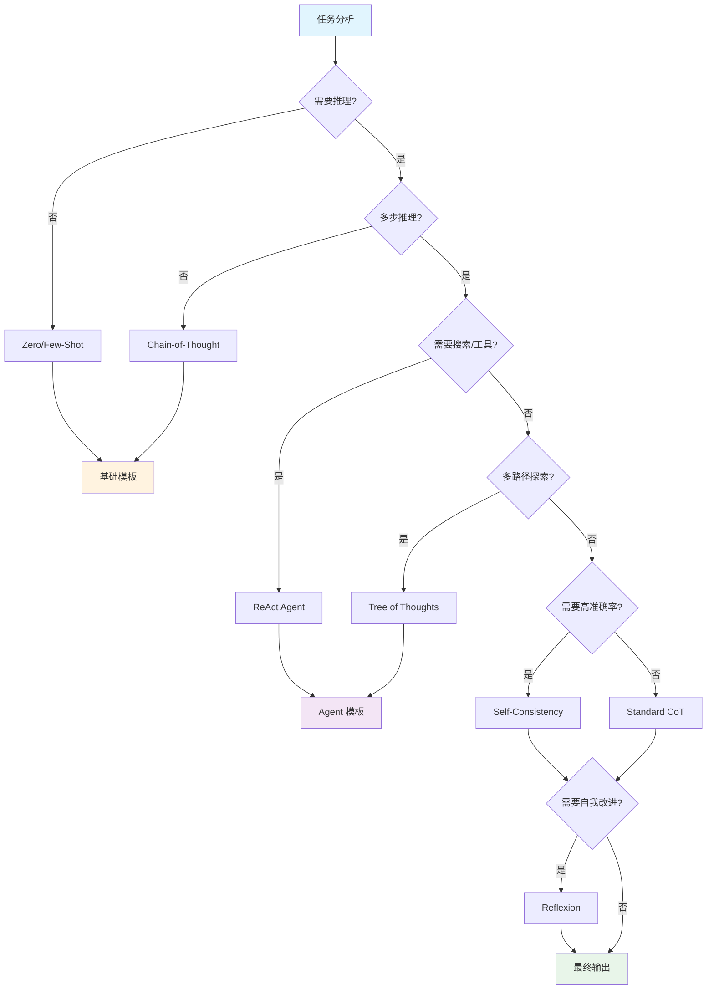
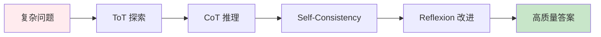
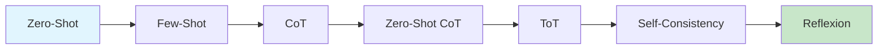

# 第 3 章：推理增强

> [English Version](03-reasoning-en.md)

---

## 目录

1. [Chain-of-Thought (CoT)](#chain-of-thought-cot)
2. [Zero-Shot CoT](#zero-shot-cot)
3. [Tree of Thoughts (ToT)](#tree-of-thoughts-tot)
4. [Self-Consistency](#self-consistency)
5. [Reflexion（自我反思）](#reflexion自我反思)
6. [技术选择决策树](#技术选择决策树)
7. [实践练习](#实践练习)

---

## Chain-of-Thought (CoT)

### 概念

Chain-of-Thought（思维链）是一种引导模型生成中间推理步骤的技术，而非直接给出答案。通过展示思考过程，模型能够处理更复杂的推理任务。

**来源**：Wei et al. (2022) - "Chain-of-Thought Prompting Elicits Reasoning in Large Language Models"

### 工作原理



CoT 的核心思想是：将复杂问题分解为一系列简单的推理步骤，每个步骤都建立在前一步的基础上，最终得出答案。

### 为什么 CoT 有效

| 优势 | 说明 |
|------|------|
| **分解复杂问题** | 将多步推理拆分为可管理的步骤 |
| **提高可解释性** | 可以追踪模型的思考过程 |
| **减少错误** | 每一步都可以验证，便于发现错误 |
| **增强泛化** | 学习推理模式而非死记硬背 |

### Few-Shot CoT 模板

Few-Shot CoT 通过在 Prompt 中提供包含推理过程的示例，引导模型模仿这种推理方式。

#### 模板示例 1：数学推理

```markdown
## 奇偶数判断

这组数字中的奇数相加得到一个偶数：4, 8, 9, 15, 12, 2, 1。
答案：将所有奇数相加（9, 15, 1）得到 25。答案是 False。

这组数字中的奇数相加得到一个偶数：17, 10, 19, 4, 8, 12, 24。
答案：将所有奇数相加（17, 19）得到 36。答案是 True。

这组数字中的奇数相加得到一个偶数：15, 32, 5, 13, 82, 7, 1。
答案：
```

**预期输出**：
```
将所有奇数相加（15, 5, 13, 7, 1）得到 41。答案是 False。
```

#### 模板示例 2：逻辑推理

```markdown
## 逻辑推理问题

问题：Roger 有 5 个网球。他又买了 2 罐网球，每罐有 3 个网球。他现在有多少个网球？
答案：Roger 一开始有 5 个球。2 罐网球，每罐 3 个，共 6 个网球。5 + 6 = 11。答案是 11。

问题：一个杂耍演员可以抛接 16 个球。其中一半是高尔夫球，而高尔夫球中有一半是蓝色的。有多少个蓝色的高尔夫球？
答案：16 个球的一半是 8 个高尔夫球。8 个高尔夫球的一半是 4 个蓝色高尔夫球。答案是 4。

问题：食堂有 23 个苹果。如果他们用掉 20 个做午餐，又买了 6 个，现在有多少个苹果？
答案：
```

**预期输出**：
```
食堂一开始有 23 个苹果。用掉 20 个，剩下 3 个。又买了 6 个，所以 3 + 6 = 9。答案是 9。
```

#### 模板示例 3：多步推理

```markdown
## 多步推理问题

问题：一家商店出售笔记本电脑，每台 $800，手机每台 $400。如果一位顾客购买 2 台笔记本电脑和 3 台手机，并享受 10% 的折扣，他需要支付多少钱？
答案：
步骤 1：计算笔记本电脑的费用：2 × $800 = $1,600
步骤 2：计算手机的费用：3 × $400 = $1,200
步骤 3：计算小计：$1,600 + $1,200 = $2,800
步骤 4：计算折扣：$2,800 × 0.10 = $280
步骤 5：计算最终价格：$2,800 - $280 = $2,520
答案是 $2,520。

问题：一列火车以 60 km/h 的速度行驶 2 小时，然后以 80 km/h 的速度行驶 3 小时。整个旅程的平均速度是多少？
答案：
```

### CoT 设计原则

1. **明确标注推理步骤**：使用 "Step 1", "Step 2" 或 "First", "Then" 等标记
2. **展示中间计算**：不要跳过任何计算步骤
3. **使用自然语言解释**：每个步骤都应有文字说明
4. **以答案声明结尾**：明确标注最终答案

---

## Zero-Shot CoT

### 概念

Zero-Shot CoT（零样本思维链）不需要提供示例，仅通过添加特定的触发短语就能引导模型生成推理步骤。

**来源**：Kojima et al. (2022) - "Large Language Models are Zero-Shot Reasoners"

### 魔法短语

以下短语可以有效触发模型的推理能力：

| 短语 | 适用场景 |
|------|---------|
| "Let's think step by step." | 通用推理任务 |
| "Let's work through this together." | 协作式问题解决 |
| "Explain your reasoning." | 需要详细解释的场景 |
| "Take a deep breath and work on this problem step by step." | 复杂数学问题 |
| "Let's break this down:" | 问题分解场景 |

### 模板示例

#### 示例 1：数学应用题

```markdown
## 数学应用题

我去市场买了 10 个苹果。我给了邻居 2 个，给了修理工 2 个。然后我又去买了 5 个苹果，吃了 1 个。我还剩下多少个苹果？

让我们一步一步地思考。
```

**预期输出**：
```
首先，你一开始有 10 个苹果。
你给了邻居 2 个，给了修理工 2 个，所以你还剩下 6 个苹果。
然后你又买了 5 个苹果，所以现在你有 11 个苹果。
最后，你吃了 1 个苹果，所以你还剩下 10 个苹果。
```

#### 示例 2：逻辑推理

```markdown
## 逻辑推理

一场舞蹈比赛中有 8 对选手。每对由 2 人组成。如果有 3 对选手退出比赛，还剩下多少人？

让我们一起解决这个问题。
```

**预期输出**：
```
一开始有 8 对选手，也就是 8 × 2 = 16 人。
3 对选手退出，也就是 3 × 2 = 6 人离开。
剩下的人数是 16 - 6 = 10 人。
```

#### 示例 3：代码调试

```markdown
## 代码调试

以下 Python 代码有一个 bug，请识别并解释问题：

```python
def calculate_average(numbers):
    total = sum(numbers)
    return total / len(numbers)

result = calculate_average([])
```

解释你的推理过程。
```

**预期输出**：
```
这个 bug 是在传入空列表时会发生的 ZeroDivisionError（除零错误）。
步骤 1：当 numbers 是空列表 [] 时，sum([]) 返回 0。
步骤 2：len([]) 返回 0。
步骤 3：函数尝试返回 0 / 0，这会引发 ZeroDivisionError。
修复方法：在除法之前添加对空列表的检查。
```

### 注意事项



1. **简单问题可能不需要 CoT**：对于直接的事实性问题，添加推理步骤反而会增加不必要的 Token 消耗
2. **复杂推理任务效果显著**：多步数学问题、逻辑推理等场景下提升明显
3. **模型能力依赖**：Zero-Shot CoT 在较大的模型（如 GPT-3.5+、Claude 3+）上效果更好

---

## Tree of Thoughts (ToT)

### 概念

Tree of Thoughts（思维树）是一种维护多个推理路径的框架，通过搜索算法（BFS/DFS）系统性地探索不同的思考方向，支持回溯和评估。

**来源**：
- Yao et al. (2023) - "Tree of Thoughts: Deliberate Problem Solving with Large Language Models"
- Long (2023) - "Large Language Model Guided Tree-of-Thought"

### 与 CoT 对比



| 特性 | Chain-of-Thought | Tree of Thoughts |
|------|-----------------|------------------|
| **推理方式** | 线性推理 | 分支探索 |
| **路径数量** | 单一路径 | 多路径评估 |
| **回溯能力** | 无法回溯 | 支持回溯 |
| **适用场景** | 简单问题 | 复杂探索性问题 |
| **计算成本** | 较低 | 较高 |

### ToT 框架结构



### ToT 实施步骤

1. **思维分解**：将问题分解为多个思考步骤
2. **候选生成**：为每个步骤生成多个候选思维
3. **状态评估**：评估每个思维的价值（sure/maybe/impossible）
4. **搜索算法**：使用 BFS/DFS/Beam Search 探索
5. **回溯机制**：当路径无效时回退

### PanelGPT 风格模板

PanelGPT 是一种模拟多个专家讨论的 ToT 实现方式：

```markdown
## 专家讨论模式

假设三位不同的专家正在回答这个问题。
所有专家都会写下他们思考的一个步骤，
然后与小组分享。
然后所有专家继续进行下一步，依此类推。
如果任何专家在任何时候意识到他们错了，他们就会退出。

问题是：我们如何增加发展中国家对可再生能源的采用？
```

**预期输出结构**：
```
专家 1（经济学家）：首先，我们需要分析当前的成本障碍……
专家 2（政策制定者）：我同意成本分析。此外，我们应该考虑监管框架……
专家 3（工程师）：从技术角度来看，基础设施挑战至关重要……

[讨论结束后]

专家 1：根据我们的讨论，关键因素是成本、政策和基础设施。
专家 2：我建议优先考虑政策激励措施来推动采用。
专家 3：将政策支持与基础设施发展相结合似乎最有效。

最终共识：[综合答案]
```

### 结构化 ToT 模板

```markdown
## 思维树探索

问题：[在此处插入复杂问题]

### 探索框架

对于每一步，生成 3 种不同的方法：

步骤 1 - 初步分析：
- 方法 A：[第一种视角]
- 方法 B：[第二种视角]
- 方法 C：[第三种视角]

评估每种方法（高/中/低潜力）：
- 方法 A：[评估]
- 方法 B：[评估]
- 方法 C：[评估]

选择最佳方法并继续到步骤 2……

步骤 2 - [选定的方向]：
[继续该过程]

### 最终综合
结合最佳路径的见解，提供最终答案。
```

### 应用场景

| 场景 | 说明 | 示例 |
|------|------|------|
| **Game of 24** | 24 点游戏求解 | 用 4 个数字通过运算得到 24 |
| **创意写作** | 探索多种情节发展 | 故事分支创作 |
| **复杂决策** | 多因素权衡分析 | 商业策略选择 |
| **代码生成** | 多种实现方案比较 | 算法设计优化 |

---

## Self-Consistency

### 概念

Self-Consistency（自一致性）是一种通过多次采样并选择最一致答案的技术。它利用 CoT 生成多个推理路径，然后通过投票机制选择最终答案。

**来源**：Wang et al. (2022) - "Self-Consistency Improves Chain of Thought Reasoning in Language Models"

### 多采样投票机制



### 工作原理

1. **多次生成**：使用相同的 Prompt 但较高的 temperature，生成多个推理路径
2. **答案提取**：从每个推理路径中提取最终答案
3. **投票统计**：统计每个答案出现的频率
4. **选择最优**：选择出现次数最多的答案作为最终结果

### 实现示例

```python
# Self-Consistency 伪代码

def self_consistency(prompt, num_samples=5, temperature=0.7):
    answers = []

    # 生成多个回答
    for _ in range(num_samples):
        response = llm.generate(prompt, temperature=temperature)
        answer = extract_final_answer(response)
        answers.append(answer)

    # 投票选择最一致的答案
    final_answer = majority_vote(answers)

    return final_answer
```

### 模板示例

```markdown
## 使用 Self-Consistency 的推理

问题：一家面包店将纸杯蛋糕每 6 个装一盒。如果他们有 47 个纸杯蛋糕，可以装满多少盒，还剩多少个？

让我们一步一步地思考并解决这个问题。
```

**多次采样结果**：
- 样本 1：7 满盒，剩余 5 个
- 样本 2：7 满盒，剩余 5 个
- 样本 3：8 满盒，剩余 -1 个（错误）
- 样本 4：7 满盒，剩余 5 个
- 样本 5：7 满盒，剩余 5 个

**投票结果**：7 满盒，剩余 5 个（4/5 票）

### 效果对比

| 方法 | 准确率 | 计算成本 |
|------|--------|---------|
| Standard CoT | 中等 | 低 |
| Self-Consistency (3 samples) | 较高 | 中 |
| Self-Consistency (5 samples) | 高 | 较高 |
| Self-Consistency (10 samples) | 最高 | 高 |

---

## Reflexion（自我反思）

### 概念

Reflexion 是一种让模型对自己的回答进行批判性评估，然后基于反思改进答案的技术。它模拟了人类的自我修正过程。

**来源**：Shinn et al. (2023) - "Reflexion: Self-Reflective Agents"

### 回答→批判→改进循环



### 模板结构

#### 基础模板

```markdown
## 自我反思模式

问题：{{question}}

### 初始答案
[提供你的初始答案]

### 自我批判
批判性地审视你的答案：
- 你做了哪些假设？
- 是否存在逻辑错误？
- 你是否遗漏了重要信息？
- 是否可能存在其他解释？

### 改进后的答案
基于你的批判，提供一个改进的答案：
[你的修订答案]
```

#### 详细模板

```markdown
## 深度反思框架

任务：{{task_description}}

### 阶段 1：初始回答
提供你解决这个问题的第一次尝试。

[初始解决方案]

### 阶段 2：批判性分析
从这些维度分析你的解决方案：

**正确性检查**：
- 所有计算都准确吗？
- 逻辑是否严密？
- 是否考虑了边界情况？

**完整性检查**：
- 你是否回答了问题的所有部分？
- 是否有遗漏的步骤？
- 解释是否详尽？

**清晰度检查**：
- 推理过程是否易于理解？
- 术语是否定义清楚？
- 格式是否一致？

### 阶段 3：改进计划
确定需要改进的具体方面：
1. [改进 1]
2. [改进 2]
3. [改进 3]

### 阶段 4：最终答案
提供包含所有改进的精炼答案：

[最终解决方案]
```

### 应用示例

#### 示例 1：数学问题

```markdown
## 数学问题反思

问题：求解 x：2x + 5 = 13

### 初始答案
x = 4

### 自我批判
让我验证一下：2(4) + 5 = 8 + 5 = 13。✓
不过，为了清晰起见，我应该展示逐步的解题过程。

### 改进后的答案
步骤 1：两边同时减去 5：2x = 8
步骤 2：两边同时除以 2：x = 4
验证：2(4) + 5 = 13 ✓
答案是 x = 4。
```

#### 示例 2：代码审查

```markdown
## 代码反思

任务：审查以下代码的潜在问题

```python
def get_user_data(user_id):
    query = f"SELECT * FROM users WHERE id = {user_id}"
    return db.execute(query)
```

### 初始评估
该函数从数据库检索用户数据。

### 自我批判
等等，我需要检查安全问题：
1. SQL 注入漏洞 - user_id 直接插入到查询中
2. 没有对 user_id 进行输入验证
3. 使用 SELECT * 而不是指定列
4. 没有错误处理

### 改进后的评估
这段代码存在严重的 SQL 注入漏洞。user_id 参数直接插入到 SQL 查询中，允许攻击者注入恶意 SQL。

建议：
1. 使用参数化查询：db.execute("SELECT * FROM users WHERE id = ?", (user_id,))
2. 验证 user_id 是正整数
3. 只选择需要的列，而不是 *
4. 添加 try-except 处理数据库错误
```

### 迭代改进策略



---

## 技术选择决策树

### 决策流程图



### 技术选择速查表

| 技术 | 适用场景 | 优势 | 成本 |
|------|---------|------|------|
| **CoT** | 需要展示推理过程 | 可解释性强 | 低 |
| **Zero-Shot CoT** | 快速启用推理 | 无需示例 | 低 |
| **ToT** | 复杂探索性问题 | 多路径评估 | 高 |
| **Self-Consistency** | 需要高准确率 | 减少随机错误 | 中-高 |
| **Reflexion** | 需要自我改进 | 质量持续提升 | 中 |

### 组合使用策略



对于特别复杂的问题，可以组合使用多种技术：
1. 使用 ToT 探索多个解决方向
2. 对每个方向使用 CoT 进行详细推理
3. 使用 Self-Consistency 验证每个方向的答案
4. 使用 Reflexion 对最终答案进行反思改进

---

## 实践练习

### 练习 1：CoT 设计

**任务**：设计一个 Few-Shot CoT Prompt，解决以下类型的数学问题。

**问题类型**：年龄问题
**示例**："John 今年 24 岁。他的父亲年龄是 John 的 3 倍。John 出生时他父亲多少岁？"

**你的 Prompt**：
```markdown
[在此编写你的 Prompt]
```

**参考答案**：
```markdown
## 年龄问题求解

问题：Mary 今年 15 岁。她的母亲年龄是 Mary 的 4 倍。Mary 出生时她母亲多少岁？
答案：Mary 今年 15 岁。她的母亲是 4 × 15 = 60 岁。Mary 出生时（15 年前），她的母亲是 60 - 15 = 45 岁。

问题：Tom 今年 12 岁。他的父亲年龄是 Tom 的 5 倍。Tom 出生时他父亲多少岁？
答案：Tom 今年 12 岁。他的父亲是 5 × 12 = 60 岁。Tom 出生时（12 年前），他的父亲是 60 - 12 = 48 岁。

问题：John 今年 24 岁。他的父亲年龄是 John 的 3 倍。John 出生时他父亲多少岁？
答案：
```

---

### 练习 2：Zero-Shot CoT 应用

**任务**：使用 Zero-Shot CoT 解决以下逻辑问题。

**问题**："一位农民有 17 只羊，除了 9 只之外都死了。还剩下多少只羊？"

**你的 Prompt**：
```markdown
[在此编写你的 Prompt]
```

**参考答案**：
```markdown
一位农民有 17 只羊，除了 9 只之外都死了。还剩下多少只羊？

让我们一步一步地思考。
```

**预期输出**：
```
"除了 9 只之外都死了"这句话的意思是，除了 9 只羊之外，其他羊都死了。
所以如果农民一开始有 17 只羊，除了 9 只之外都死了，那就意味着有 9 只羊活了下来。
答案是 9 只羊。
```

---

### 练习 3：ToT 设计

**任务**：设计一个 ToT 风格的 Prompt，探索如何提高团队工作效率。

**你的 Prompt**：
```markdown
[在此编写你的 Prompt]
```

**参考答案**：
```markdown
## 团队效率提升方案讨论

假设三位不同的专家正在讨论如何提高团队生产力：
- 专家 1：一位有 10 年经验的项目经理
- 专家 2：一位组织心理学家
- 专家 3：一位来自高绩效团队的技术负责人

问题是：我们如何在下个季度将团队生产力提高 30%？

每位专家每次分享一个想法，然后其他人提供反馈。
他们将继续讨论 3 轮。
最后，他们将把最好的想法综合成一个行动计划。

开始讨论：
```

---

### 练习 4：Reflexion 应用

**任务**：使用 Reflexion 技术改进以下回答。

**问题**："气候变化的主要原因是什么？"

**初始回答**："气候变化是由污染和砍伐树木造成的。"

**你的 Reflexion Prompt**：
```markdown
[在此编写你的 Prompt]
```

**参考答案**：
```markdown
## 自我反思改进

问题：气候变化的主要原因是什么？

### 初始答案
气候变化是由污染和砍伐树木造成的。

### 自我批判
回顾我的答案：
1. 太模糊 - "污染"是一个宽泛的术语，我应该具体说明温室气体
2. 不完整 - 遗漏了化石燃料燃烧、农业、工业过程
3. "砍伐树木"是非正式的表达 - 应该使用"森林砍伐"
4. 缺少机制说明 - 这些因素如何导致变暖
5. 没有提到温室效应

### 改进后的答案
气候变化的主要原因包括：

1. **燃烧化石燃料**：煤炭、石油和天然气燃烧时释放 CO2，将热量困在大气中。

2. **森林砍伐**：树木吸收 CO2。砍伐树木会减少这种能力并释放储存的碳。

3. **农业**：牲畜产生甲烷，化肥释放一氧化二氮 - 两者都是强效温室气体。

4. **工业过程**：制造业释放各种温室气体和污染物。

这些活动增加了温室气体浓度，增强了温室效应，导致全球气温上升。
```

---

## 本章总结

### 核心概念回顾

| 技术 | 核心思想 | 关键特点 | 适用场景 |
|------|---------|---------|---------|
| **CoT** | 展示推理步骤 | 中间过程可见 | 数学、逻辑推理 |
| **Zero-Shot CoT** | 魔法短语触发 | 无需示例 | 快速启用推理 |
| **ToT** | 多路径探索 | 分支+评估+回溯 | 复杂决策问题 |
| **Self-Consistency** | 多次采样投票 | 提高准确率 | 需要高可靠性 |
| **Reflexion** | 自我批判改进 | 迭代优化 | 质量敏感场景 |

### 技术演进路径



### 下一步学习

完成本章后，建议继续学习：

1. **[第 4 章：Agent 与工具使用](./04-agents-zh.md)** - 学习 ReAct、Function Calling 等 Agent 技术
2. **[第 5 章：上下文工程](./05-context-zh.md)** - 深入了解上下文管理和记忆机制
3. **[第 11 章：模板库](./11-templates-zh.md)** - 查看更多推理类 Prompt 模板

---

## 参考资源

### 学术研究

- **Wei et al. (2022)**: "Chain-of-Thought Prompting Elicits Reasoning in Large Language Models" - [arXiv:2201.11903](https://arxiv.org/abs/2201.11903)
- **Kojima et al. (2022)**: "Large Language Models are Zero-Shot Reasoners" - [arXiv:2205.11916](https://arxiv.org/abs/2205.11916)
- **Yao et al. (2023)**: "Tree of Thoughts: Deliberate Problem Solving with Large Language Models" - [arXiv:2305.10601](https://arxiv.org/abs/2305.10601)
- **Wang et al. (2022)**: "Self-Consistency Improves Chain of Thought Reasoning in Language Models" - [arXiv:2203.11171](https://arxiv.org/abs/2203.11171)
- **Shinn et al. (2023)**: "Reflexion: Self-Reflective Agents" - [arXiv:2303.11366](https://arxiv.org/abs/2303.11366)

### 相关章节

- [第 2 章：基础 Prompting](./02-basics-zh.md) - Zero-Shot 和 Few-Shot 基础
- [第 4 章：Agent 与工具使用](./04-agents-zh.md) - ReAct 和工具调用
- [第 11 章：模板库](./11-templates-zh.md) - 更多实用模板

---

*本章内容基于 2024-2025 年最新研究和实践经验整理。*
