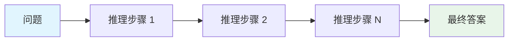
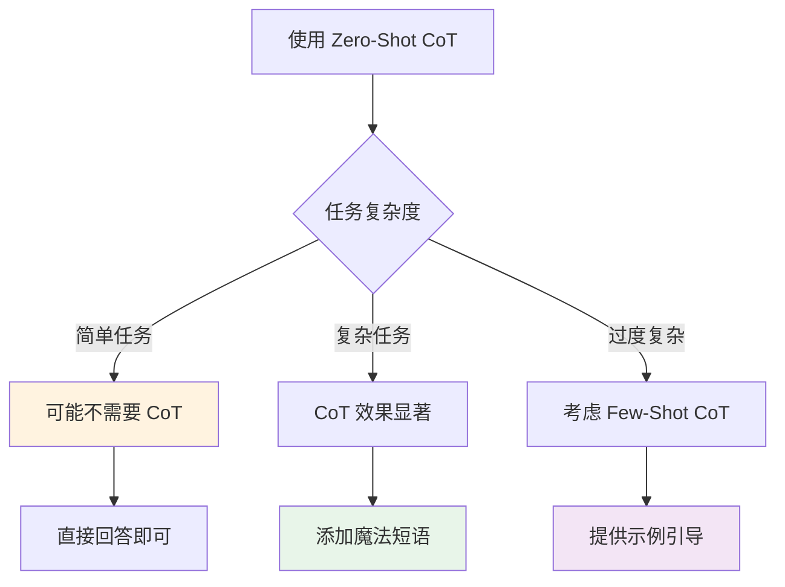
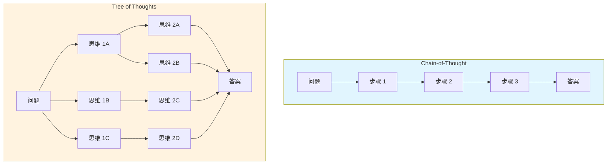
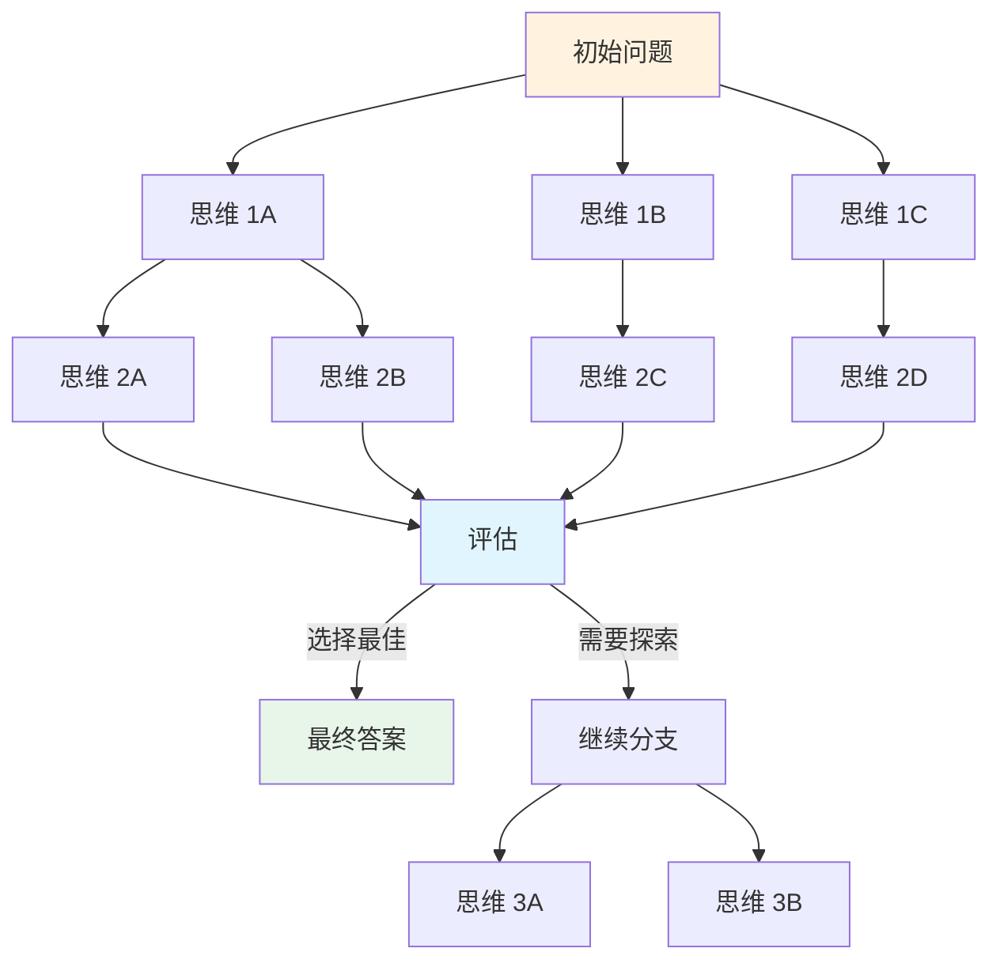
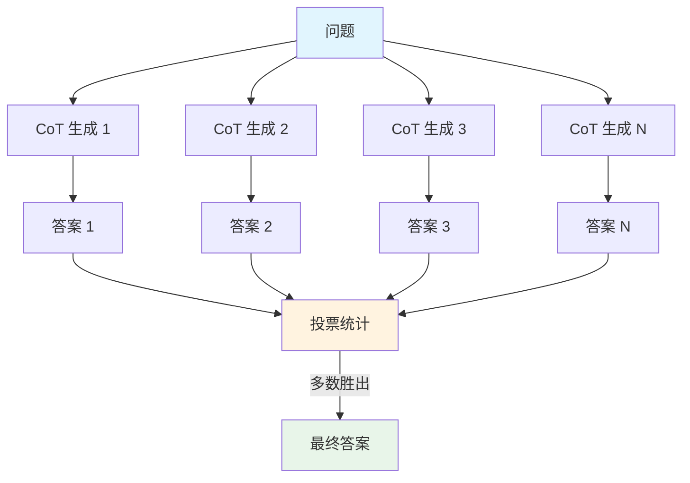
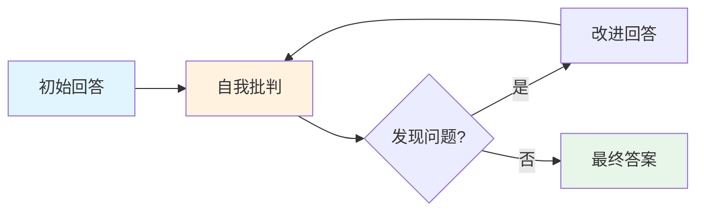
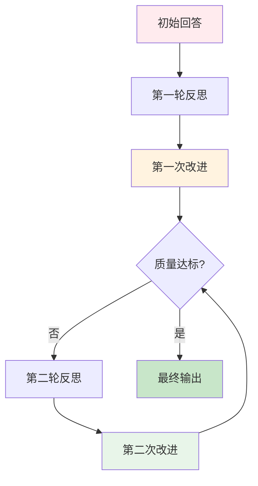
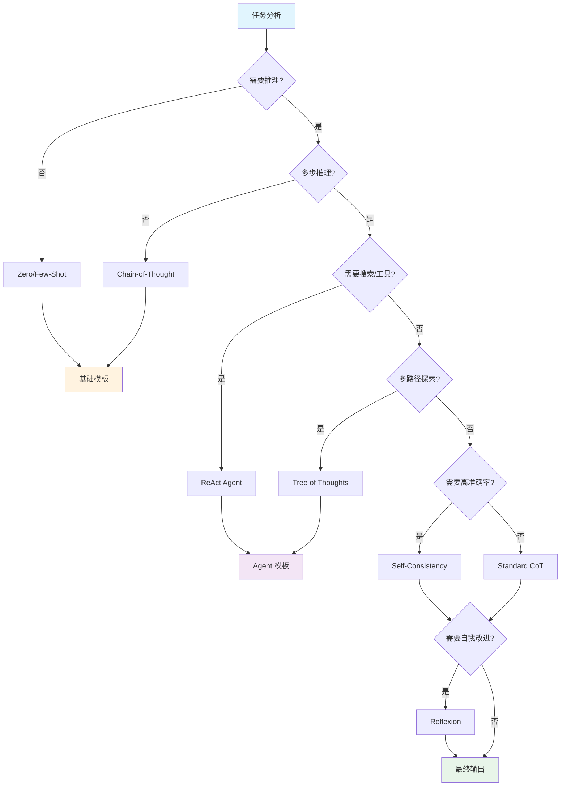
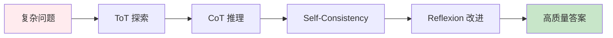
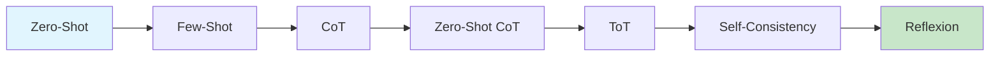

# 第 3 章：推理增强

> [English Version](03-reasoning-en.md)

---

## 目录

1. [Chain-of-Thought (CoT)](#chain-of-thought-cot)
2. [Zero-Shot CoT](#zero-shot-cot)
3. [Tree of Thoughts (ToT)](#tree-of-thoughts-tot)
4. [Self-Consistency](#self-consistency)
5. [Reflexion（自我反思）](#reflexion自我反思)
6. [技术选择决策树](#技术选择决策树)
7. [实践练习](#实践练习)

---

## Chain-of-Thought (CoT)

### 概念

Chain-of-Thought（思维链）是一种引导模型生成中间推理步骤的技术，而非直接给出答案。通过展示思考过程，模型能够处理更复杂的推理任务。

**来源**：Wei et al. (2022) - "Chain-of-Thought Prompting Elicits Reasoning in Large Language Models"

### 工作原理



CoT 的核心思想是：将复杂问题分解为一系列简单的推理步骤，每个步骤都建立在前一步的基础上，最终得出答案。

### 为什么 CoT 有效

| 优势 | 说明 |
|------|------|
| **分解复杂问题** | 将多步推理拆分为可管理的步骤 |
| **提高可解释性** | 可以追踪模型的思考过程 |
| **减少错误** | 每一步都可以验证，便于发现错误 |
| **增强泛化** | 学习推理模式而非死记硬背 |

### Few-Shot CoT 模板

Few-Shot CoT 通过在 Prompt 中提供包含推理过程的示例，引导模型模仿这种推理方式。

#### 模板示例 1：数学推理

```markdown
## 奇偶数判断

The odd numbers in this group add up to an even number: 4, 8, 9, 15, 12, 2, 1.
A: Adding all the odd numbers (9, 15, 1) gives 25. The answer is False.

The odd numbers in this group add up to an even number: 17, 10, 19, 4, 8, 12, 24.
A: Adding all the odd numbers (17, 19) gives 36. The answer is True.

The odd numbers in this group add up to an even number: 15, 32, 5, 13, 82, 7, 1.
A:
```

**预期输出**：
```
Adding all the odd numbers (15, 5, 13, 7, 1) gives 41. The answer is False.
```

#### 模板示例 2：逻辑推理

```markdown
## 逻辑推理问题

Question: Roger has 5 tennis balls. He buys 2 more cans of tennis balls. Each can has 3 tennis balls. How many tennis balls does he have now?
Answer: Roger started with 5 balls. 2 cans of 3 tennis balls each is 6 tennis balls. 5 + 6 = 11. The answer is 11.

Question: A juggler can juggle 16 balls. Half of the balls are golf balls, and half of the golf balls are blue. How many blue golf balls are there?
Answer: Half of 16 balls is 8 golf balls. Half of 8 golf balls is 4 blue golf balls. The answer is 4.

Question: The cafeteria had 23 apples. If they used 20 to make lunch and bought 6 more, how many apples do they have?
Answer:
```

**预期输出**：
```
The cafeteria started with 23 apples. They used 20, leaving 3 apples. They bought 6 more, so 3 + 6 = 9. The answer is 9.
```

#### 模板示例 3：多步推理

```markdown
## 多步推理问题

Q: A store sells laptops for $800 each and phones for $400 each. If a customer buys 2 laptops and 3 phones with a 10% discount, how much do they pay?
A: 
Step 1: Calculate cost of laptops: 2 × $800 = $1,600
Step 2: Calculate cost of phones: 3 × $400 = $1,200
Step 3: Calculate subtotal: $1,600 + $1,200 = $2,800
Step 4: Calculate discount: $2,800 × 0.10 = $280
Step 5: Calculate final price: $2,800 - $280 = $2,520
The answer is $2,520.

Q: A train travels at 60 km/h for 2 hours, then at 80 km/h for 3 hours. What is the average speed for the entire journey?
A:
```

### CoT 设计原则

1. **明确标注推理步骤**：使用 "Step 1", "Step 2" 或 "First", "Then" 等标记
2. **展示中间计算**：不要跳过任何计算步骤
3. **使用自然语言解释**：每个步骤都应有文字说明
4. **以答案声明结尾**：明确标注最终答案

---

## Zero-Shot CoT

### 概念

Zero-Shot CoT（零样本思维链）不需要提供示例，仅通过添加特定的触发短语就能引导模型生成推理步骤。

**来源**：Kojima et al. (2022) - "Large Language Models are Zero-Shot Reasoners"

### 魔法短语

以下短语可以有效触发模型的推理能力：

| 短语 | 适用场景 |
|------|---------|
| "Let's think step by step." | 通用推理任务 |
| "Let's work through this together." | 协作式问题解决 |
| "Explain your reasoning." | 需要详细解释的场景 |
| "Take a deep breath and work on this problem step by step." | 复杂数学问题 |
| "Let's break this down:" | 问题分解场景 |

### 模板示例

#### 示例 1：数学应用题

```markdown
## 数学应用题

I went to the market and bought 10 apples. I gave 2 apples to the neighbor and 2 to the repairman. I then went and bought 5 more apples and ate 1. How many apples did I remain with?

Let's think step by step.
```

**预期输出**：
```
First, you started with 10 apples.
You gave away 2 apples to the neighbor and 2 to the repairman, so you had 6 apples left.
Then you bought 5 more apples, so now you had 11 apples.
Finally, you ate 1 apple, so you would remain with 10 apples.
```

#### 示例 2：逻辑推理

```markdown
## 逻辑推理

In a dance competition, there are 8 couples. Each couple consists of 2 people. If 3 couples withdraw from the competition, how many people remain?

Let's work through this together.
```

**预期输出**：
```
Initially, there are 8 couples, which means 8 × 2 = 16 people.
3 couples withdraw, which means 3 × 2 = 6 people leave.
The remaining people are 16 - 6 = 10 people.
```

#### 示例 3：代码调试

```markdown
## 代码调试

The following Python code has a bug. Identify and explain the issue:

```python
def calculate_average(numbers):
    total = sum(numbers)
    return total / len(numbers)

result = calculate_average([])
```

Explain your reasoning.
```

**预期输出**：
```
The bug is a ZeroDivisionError that occurs when an empty list is passed.
Step 1: When numbers is an empty list [], sum([]) returns 0.
Step 2: len([]) returns 0.
Step 3: The function attempts to return 0 / 0, which raises a ZeroDivisionError.
Fix: Add a check for empty list before division.
```

### 注意事项



1. **简单问题可能不需要 CoT**：对于直接的事实性问题，添加推理步骤反而会增加不必要的 Token 消耗
2. **复杂推理任务效果显著**：多步数学问题、逻辑推理等场景下提升明显
3. **模型能力依赖**：Zero-Shot CoT 在较大的模型（如 GPT-3.5+、Claude 3+）上效果更好

---

## Tree of Thoughts (ToT)

### 概念

Tree of Thoughts（思维树）是一种维护多个推理路径的框架，通过搜索算法（BFS/DFS）系统性地探索不同的思考方向，支持回溯和评估。

**来源**：
- Yao et al. (2023) - "Tree of Thoughts: Deliberate Problem Solving with Large Language Models"
- Long (2023) - "Large Language Model Guided Tree-of-Thought"

### 与 CoT 对比



| 特性 | Chain-of-Thought | Tree of Thoughts |
|------|-----------------|------------------|
| **推理方式** | 线性推理 | 分支探索 |
| **路径数量** | 单一路径 | 多路径评估 |
| **回溯能力** | 无法回溯 | 支持回溯 |
| **适用场景** | 简单问题 | 复杂探索性问题 |
| **计算成本** | 较低 | 较高 |

### ToT 框架结构



### ToT 实施步骤

1. **思维分解**：将问题分解为多个思考步骤
2. **候选生成**：为每个步骤生成多个候选思维
3. **状态评估**：评估每个思维的价值（sure/maybe/impossible）
4. **搜索算法**：使用 BFS/DFS/Beam Search 探索
5. **回溯机制**：当路径无效时回退

### PanelGPT 风格模板

PanelGPT 是一种模拟多个专家讨论的 ToT 实现方式：

```markdown
## 专家讨论模式

Imagine three different experts are answering this question.
All experts will write down 1 step of their thinking,
then share it with the group.
Then all experts will go on to the next step, etc.
If any expert realises they're wrong at any point then they leave.

The question is: How can we increase the adoption of renewable energy in developing countries?
```

**预期输出结构**：
```
Expert 1 (Economist): First, we need to analyze the current cost barriers...
Expert 2 (Policy Maker): I agree with the cost analysis. Additionally, we should consider regulatory frameworks...
Expert 3 (Engineer): From a technical standpoint, infrastructure challenges are paramount...

[After discussion]

Expert 1: Based on our discussion, the key factors are cost, policy, and infrastructure.
Expert 2: I suggest prioritizing policy incentives to drive adoption.
Expert 3: Combining policy support with infrastructure development seems most effective.

Final Consensus: [Synthesized answer]
```

### 结构化 ToT 模板

```markdown
## 思维树探索

Problem: [Insert complex problem here]

### Exploration Framework

For each step, generate 3 different approaches:

Step 1 - Initial Analysis:
- Approach A: [First perspective]
- Approach B: [Second perspective]
- Approach C: [Third perspective]

Evaluate each approach (High/Medium/Low potential):
- Approach A: [Evaluation]
- Approach B: [Evaluation]
- Approach C: [Evaluation]

Select the best approach and continue to Step 2...

Step 2 - [Selected direction]:
[Continue the process]

### Final Synthesis
Combine insights from the best path to provide the final answer.
```

### 应用场景

| 场景 | 说明 | 示例 |
|------|------|------|
| **Game of 24** | 24 点游戏求解 | 用 4 个数字通过运算得到 24 |
| **创意写作** | 探索多种情节发展 | 故事分支创作 |
| **复杂决策** | 多因素权衡分析 | 商业策略选择 |
| **代码生成** | 多种实现方案比较 | 算法设计优化 |

---

## Self-Consistency

### 概念

Self-Consistency（自一致性）是一种通过多次采样并选择最一致答案的技术。它利用 CoT 生成多个推理路径，然后通过投票机制选择最终答案。

**来源**：Wang et al. (2022) - "Self-Consistency Improves Chain of Thought Reasoning in Language Models"

### 多采样投票机制



### 工作原理

1. **多次生成**：使用相同的 Prompt 但较高的 temperature，生成多个推理路径
2. **答案提取**：从每个推理路径中提取最终答案
3. **投票统计**：统计每个答案出现的频率
4. **选择最优**：选择出现次数最多的答案作为最终结果

### 实现示例

```python
# Self-Consistency 伪代码

def self_consistency(prompt, num_samples=5, temperature=0.7):
    answers = []

    # 生成多个回答
    for _ in range(num_samples):
        response = llm.generate(prompt, temperature=temperature)
        answer = extract_final_answer(response)
        answers.append(answer)

    # 投票选择最一致的答案
    final_answer = majority_vote(answers)

    return final_answer
```

### 模板示例

```markdown
## 使用 Self-Consistency 的推理

Question: A bakery sells cupcakes in boxes of 6. If they have 47 cupcakes, how many full boxes can they make and how many will be left over?

Let's think step by step and solve this problem.
```

**多次采样结果**：
- Sample 1: 7 full boxes, 5 left over
- Sample 2: 7 full boxes, 5 left over
- Sample 3: 8 full boxes, -1 left over (incorrect)
- Sample 4: 7 full boxes, 5 left over
- Sample 5: 7 full boxes, 5 left over

**投票结果**：7 full boxes, 5 left over（4/5 票）

### 效果对比

| 方法 | 准确率 | 计算成本 |
|------|--------|---------|
| Standard CoT | 中等 | 低 |
| Self-Consistency (3 samples) | 较高 | 中 |
| Self-Consistency (5 samples) | 高 | 较高 |
| Self-Consistency (10 samples) | 最高 | 高 |

---

## Reflexion（自我反思）

### 概念

Reflexion 是一种让模型对自己的回答进行批判性评估，然后基于反思改进答案的技术。它模拟了人类的自我修正过程。

**来源**：Shinn et al. (2023) - "Reflexion: Self-Reflective Agents"

### 回答→批判→改进循环



### 模板结构

#### 基础模板

```markdown
## 自我反思模式

Question: {{question}}

### Initial Answer
[Provide your initial answer]

### Self-Critique
Review your answer critically:
- What assumptions did you make?
- Are there any logical errors?
- Did you miss any important information?
- Could there be alternative interpretations?

### Improved Answer
Based on your critique, provide an improved answer:
[Your revised answer]
```

#### 详细模板

```markdown
## 深度反思框架

Task: {{task_description}}

### Phase 1: Initial Response
Provide your first attempt at solving this problem.

[Initial solution]

### Phase 2: Critical Analysis
Analyze your solution across these dimensions:

**Correctness Check**:
- Are all calculations accurate?
- Is the logic sound?
- Are edge cases considered?

**Completeness Check**:
- Did you address all parts of the question?
- Are there missing steps?
- Is the explanation thorough?

**Clarity Check**:
- Is the reasoning easy to follow?
- Are terms clearly defined?
- Is the format consistent?

### Phase 3: Improvement Plan
Identify specific improvements needed:
1. [Improvement 1]
2. [Improvement 2]
3. [Improvement 3]

### Phase 4: Final Answer
Provide your refined answer incorporating all improvements:

[Final solution]
```

### 应用示例

#### 示例 1：数学问题

```markdown
## 数学问题反思

Question: Solve for x: 2x + 5 = 13

### Initial Answer
x = 4

### Self-Critique
Let me verify: 2(4) + 5 = 8 + 5 = 13. ✓
However, I should show the step-by-step solution for clarity.

### Improved Answer
Step 1: Subtract 5 from both sides: 2x = 8
Step 2: Divide both sides by 2: x = 4
Verification: 2(4) + 5 = 13 ✓
The answer is x = 4.
```

#### 示例 2：代码审查

```markdown
## 代码反思

Task: Review the following code for potential issues

```python
def get_user_data(user_id):
    query = f"SELECT * FROM users WHERE id = {user_id}"
    return db.execute(query)
```

### Initial Assessment
The function retrieves user data from the database.

### Self-Critique
Wait, I need to check for security issues:
1. SQL Injection vulnerability - user_id is directly interpolated into the query
2. No input validation on user_id
3. Using SELECT * instead of specific columns
4. No error handling

### Improved Assessment
This code has a critical SQL injection vulnerability. The user_id parameter is directly interpolated into the SQL query, allowing attackers to inject malicious SQL.

Recommendations:
1. Use parameterized queries: db.execute("SELECT * FROM users WHERE id = ?", (user_id,))
2. Validate user_id is a positive integer
3. Select only needed columns instead of *
4. Add try-except for database errors
```

### 迭代改进策略



---

## 技术选择决策树

### 决策流程图



### 技术选择速查表

| 技术 | 适用场景 | 优势 | 成本 |
|------|---------|------|------|
| **CoT** | 需要展示推理过程 | 可解释性强 | 低 |
| **Zero-Shot CoT** | 快速启用推理 | 无需示例 | 低 |
| **ToT** | 复杂探索性问题 | 多路径评估 | 高 |
| **Self-Consistency** | 需要高准确率 | 减少随机错误 | 中-高 |
| **Reflexion** | 需要自我改进 | 质量持续提升 | 中 |

### 组合使用策略



对于特别复杂的问题，可以组合使用多种技术：
1. 使用 ToT 探索多个解决方向
2. 对每个方向使用 CoT 进行详细推理
3. 使用 Self-Consistency 验证每个方向的答案
4. 使用 Reflexion 对最终答案进行反思改进

---

## 实践练习

### 练习 1：CoT 设计

**任务**：设计一个 Few-Shot CoT Prompt，解决以下类型的数学问题。

**问题类型**：年龄问题
**示例**："John is 24 years old. His father is 3 times as old as John. How old was his father when John was born?"

**你的 Prompt**：
```markdown
[在此编写你的 Prompt]
```

**参考答案**：
```markdown
## 年龄问题求解

Question: Mary is 15 years old. Her mother is 4 times as old as Mary. How old was her mother when Mary was born?
Answer: Mary is 15 years old. Her mother is 4 × 15 = 60 years old. When Mary was born (15 years ago), her mother was 60 - 15 = 45 years old.

Question: Tom is 12 years old. His father is 5 times as old as Tom. How old was his father when Tom was born?
Answer: Tom is 12 years old. His father is 5 × 12 = 60 years old. When Tom was born (12 years ago), his father was 60 - 12 = 48 years old.

Question: John is 24 years old. His father is 3 times as old as John. How old was his father when John was born?
Answer:
```

---

### 练习 2：Zero-Shot CoT 应用

**任务**：使用 Zero-Shot CoT 解决以下逻辑问题。

**问题**："A farmer has 17 sheep and all but 9 die. How many sheep are left?"

**你的 Prompt**：
```markdown
[在此编写你的 Prompt]
```

**参考答案**：
```markdown
A farmer has 17 sheep and all but 9 die. How many sheep are left?

Let's think step by step.
```

**预期输出**：
```
The phrase "all but 9 die" means that all sheep died except for 9 sheep.
So if the farmer started with 17 sheep and all but 9 died, that means 9 sheep survived.
The answer is 9 sheep.
```

---

### 练习 3：ToT 设计

**任务**：设计一个 ToT 风格的 Prompt，探索如何提高团队工作效率。

**你的 Prompt**：
```markdown
[在此编写你的 Prompt]
```

**参考答案**：
```markdown
## 团队效率提升方案讨论

Imagine three different experts discussing how to improve team productivity:
- Expert 1: A project manager with 10 years of experience
- Expert 2: An organizational psychologist
- Expert 3: A tech lead from a high-performing team

The question is: How can we improve our team's productivity by 30% in the next quarter?

Each expert will share one idea at a time, then the others will provide feedback.
They will continue this discussion for 3 rounds.
At the end, they will synthesize the best ideas into an action plan.

Begin the discussion:
```

---

### 练习 4：Reflexion 应用

**任务**：使用 Reflexion 技术改进以下回答。

**问题**："What are the main causes of climate change?"

**初始回答**："Climate change is caused by pollution and cutting down trees."

**你的 Reflexion Prompt**：
```markdown
[在此编写你的 Prompt]
```

**参考答案**：
```markdown
## 自我反思改进

Question: What are the main causes of climate change?

### Initial Answer
Climate change is caused by pollution and cutting down trees.

### Self-Critique
Reviewing my answer:
1. Too vague - "pollution" is a broad term, I should specify greenhouse gases
2. Incomplete - missed fossil fuel burning, agriculture, industrial processes
3. "Cutting down trees" is informal - should use "deforestation"
4. Missing the mechanism - how these factors cause warming
5. No mention of the greenhouse effect

### Improved Answer
The main causes of climate change include:

1. **Burning Fossil Fuels**: Coal, oil, and natural gas release CO2 when burned, trapping heat in the atmosphere.

2. **Deforestation**: Trees absorb CO2. Cutting them down reduces this capacity and releases stored carbon.

3. **Agriculture**: Livestock produce methane, and fertilizers release nitrous oxide - both potent greenhouse gases.

4. **Industrial Processes**: Manufacturing releases various greenhouse gases and pollutants.

These activities increase greenhouse gas concentrations, enhancing the greenhouse effect and causing global temperatures to rise.
```

---

## 本章总结

### 核心概念回顾

| 技术 | 核心思想 | 关键特点 | 适用场景 |
|------|---------|---------|---------|
| **CoT** | 展示推理步骤 | 中间过程可见 | 数学、逻辑推理 |
| **Zero-Shot CoT** | 魔法短语触发 | 无需示例 | 快速启用推理 |
| **ToT** | 多路径探索 | 分支+评估+回溯 | 复杂决策问题 |
| **Self-Consistency** | 多次采样投票 | 提高准确率 | 需要高可靠性 |
| **Reflexion** | 自我批判改进 | 迭代优化 | 质量敏感场景 |

### 技术演进路径



### 下一步学习

完成本章后，建议继续学习：

1. **[第 4 章：Agent 与工具使用](./04-agents-zh.md)** - 学习 ReAct、Function Calling 等 Agent 技术
2. **[第 5 章：上下文工程](./05-context-zh.md)** - 深入了解上下文管理和记忆机制
3. **[第 11 章：模板库](./11-templates-zh.md)** - 查看更多推理类 Prompt 模板

---

## 参考资源

### 学术研究

- **Wei et al. (2022)**: "Chain-of-Thought Prompting Elicits Reasoning in Large Language Models" - [arXiv:2201.11903](https://arxiv.org/abs/2201.11903)
- **Kojima et al. (2022)**: "Large Language Models are Zero-Shot Reasoners" - [arXiv:2205.11916](https://arxiv.org/abs/2205.11916)
- **Yao et al. (2023)**: "Tree of Thoughts: Deliberate Problem Solving with Large Language Models" - [arXiv:2305.10601](https://arxiv.org/abs/2305.10601)
- **Wang et al. (2022)**: "Self-Consistency Improves Chain of Thought Reasoning in Language Models" - [arXiv:2203.11171](https://arxiv.org/abs/2203.11171)
- **Shinn et al. (2023)**: "Reflexion: Self-Reflective Agents" - [arXiv:2303.11366](https://arxiv.org/abs/2303.11366)

### 相关章节

- [第 2 章：基础 Prompting](./02-basics-zh.md) - Zero-Shot 和 Few-Shot 基础
- [第 4 章：Agent 与工具使用](./04-agents-zh.md) - ReAct 和工具调用
- [第 11 章：模板库](./11-templates-zh.md) - 更多实用模板

---

*本章内容基于 2024-2025 年最新研究和实践经验整理。*
