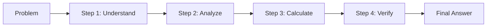
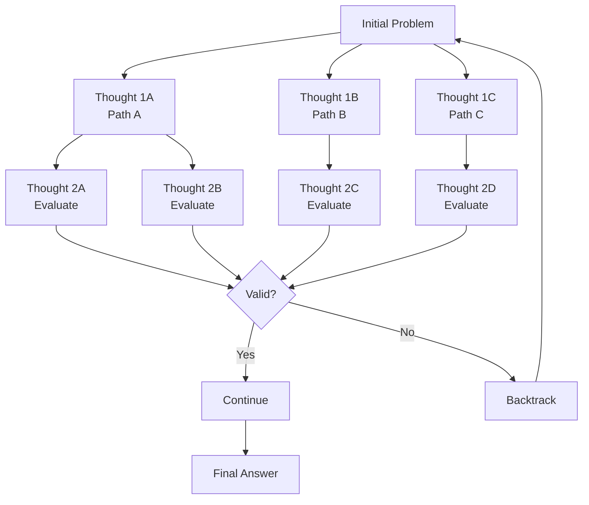
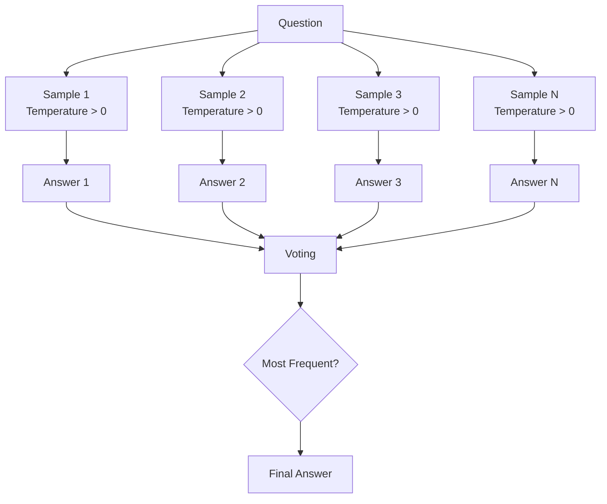
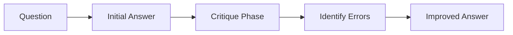
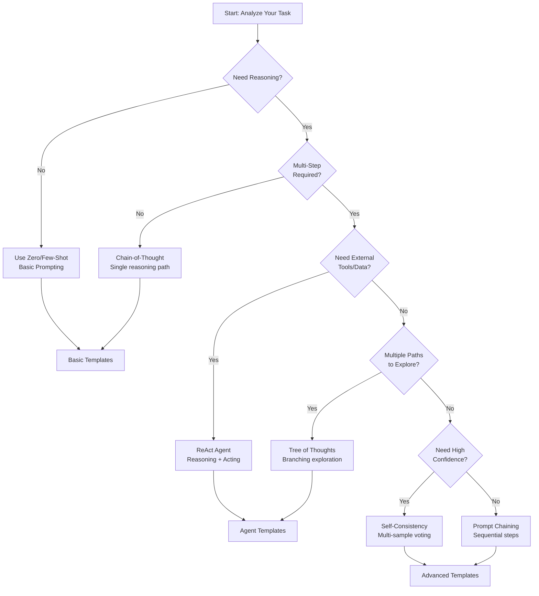

# Chapter 3: Reasoning Enhancement

> [中文版](zh/03-reasoning.md)

---

## 3.1 Chain-of-Thought (CoT) Prompting

### Concept

Chain-of-Thought (CoT) prompting is a technique that guides language models to generate intermediate reasoning steps before arriving at a final answer. Instead of jumping directly to conclusions, the model "thinks out loud," breaking complex problems into manageable steps.

**Source**: Wei et al. (2022) - "Chain-of-Thought Prompting Elicits Reasoning in Large Language Models"

### How It Works

The core insight behind CoT is that language models, when explicitly prompted to show their work, can solve problems that would otherwise be beyond their reach. By generating intermediate reasoning steps, the model:

1. **Decomposes** complex problems into simpler sub-problems
2. **Allocates** more computation to difficult reasoning steps
3. **Provides** interpretable reasoning traces for debugging
4. **Generalizes** to novel problem types through demonstrated patterns



### Few-Shot CoT Template

The classic approach provides examples that demonstrate the reasoning pattern:

```markdown
## Odd/Even Number Sum Problem

The odd numbers in this group add up to an even number: 4, 8, 9, 15, 12, 2, 1.
A: Adding all the odd numbers (9, 15, 1) gives 25. The answer is False.

The odd numbers in this group add up to an even number: 17, 10, 19, 4, 8, 12, 24.
A: Adding all the odd numbers (17, 19) gives 36. The answer is True.

The odd numbers in this group add up to an even number: 15, 32, 5, 13, 82, 7, 1.
A:
```

**Expected Output**:
```
Adding all the odd numbers (15, 5, 13, 7, 1) gives 41. The answer is False.
```

### Key Characteristics

| Aspect | Description |
|--------|-------------|
| **Input** | Problem + reasoning examples |
| **Output** | Step-by-step reasoning + answer |
| **Best For** | Math, logic, multi-step reasoning |
| **Model Size** | Most effective with 100B+ parameters |

### When to Use CoT

CoT prompting excels in scenarios requiring:

- **Mathematical reasoning**: Word problems, arithmetic, algebra
- **Logical deduction**: Syllogisms, puzzles, causal reasoning
- **Multi-step planning**: Recipes, instructions, workflows
- **Symbolic manipulation**: Code execution, regex matching

---

## 3.2 Zero-Shot CoT

### Concept

Zero-Shot CoT achieves reasoning capabilities without providing examples. Instead, it uses specific "magic phrases" that trigger the model's internal reasoning patterns. This approach is more efficient since it doesn't consume tokens on examples.

**Source**: Kojima et al. (2022) - "Large Language Models are Zero-Shot Reasoners"

### Magic Phrases

These simple additions to your prompt can dramatically improve reasoning:

| Phrase | Effectiveness | Use Case |
|--------|---------------|----------|
| `"Let's think step by step"` | High | General reasoning |
| `"Let's work through this together"` | High | Collaborative tone |
| `"Explain your reasoning"` | Medium | Explanation tasks |
| `"Take a deep breath and work on this problem step by step"` | High | Complex problems |
| `"Break this down into steps"` | Medium | Task decomposition |

### Template Examples

**Basic Math Problem**:

```markdown
I went to the market and bought 10 apples. I gave 2 apples to the neighbor
and 2 to the repairman. I then went and bought 5 more apples and ate 1.
How many apples did I remain with?

Let's think step by step.
```

**Expected Output**:
```
First, you started with 10 apples.
You gave away 2 apples to the neighbor and 2 to the repairman, so you had 6 apples left.
Then you bought 5 more apples, so now you had 11 apples.
Finally, you ate 1 apple, so you would remain with 10 apples.
```

**Logic Puzzle**:

```markdown
A juggler has 16 balls. Half are golf balls. Half of the golf balls are blue.
How many blue golf balls are there?

Let's work through this together.
```

**Expected Output**:
```
Total balls: 16
Half are golf balls: 16 / 2 = 8 golf balls
Half of golf balls are blue: 8 / 2 = 4 blue golf balls
There are 4 blue golf balls.
```

### Caveats and Limitations

While Zero-Shot CoT is powerful, be aware of these limitations:

1. **Simple Problems May Not Benefit**
   - For straightforward questions, CoT can add unnecessary verbosity
   - Example: "What is 2+2?" doesn't need step-by-step reasoning

2. **Model-Dependent Effectiveness**
   - Works best with instruction-tuned models (GPT-3.5+, Claude, etc.)
   - Base models may not respond to magic phrases

3. **Reasoning Can Still Be Flawed**
   - The model may generate plausible-sounding but incorrect steps
   - Always verify critical reasoning outputs

4. **Token Cost**
   - Reasoning steps consume additional tokens
   - Balance between thoroughness and efficiency

5. **Overthinking Simple Tasks**
   - May overcomplicate straightforward questions
   - Consider task complexity before applying CoT

---

## 3.3 Tree of Thoughts (ToT)

### Concept

Tree of Thoughts (ToT) extends CoT by maintaining a tree structure of reasoning paths. Instead of linear reasoning, ToT explores multiple possibilities, evaluates them, and can backtrack when paths prove unproductive. This approach mirrors human problem-solving where we consider alternatives and revise our thinking.

**Source**: Yao et al. (2023), Long (2023)

### Comparison: CoT vs ToT

| Feature | Chain-of-Thought | Tree of Thoughts |
|---------|------------------|------------------|
| **Structure** | Linear chain | Branching tree |
| **Paths** | Single path | Multiple paths explored |
| **Backtracking** | Not supported | Full backtracking support |
| **Exploration** | Greedy, one step at a time | Systematic (BFS/DFS/Beam Search) |
| **Best For** | Straightforward reasoning | Complex, exploratory problems |
| **Token Cost** | Lower | Higher |

### ToT Framework



### Implementation Steps

1. **Thought Decomposition**: Break the problem into discrete thinking steps
2. **Candidate Generation**: For each step, generate multiple candidate thoughts
3. **State Evaluation**: Assess each thought's viability (sure/maybe/impossible)
4. **Search Algorithm**: Use BFS, DFS, or Beam Search to explore the tree
5. **Backtracking**: When a path fails, return to previous decision points

### PanelGPT Template

This template simulates multiple experts collaborating:

```markdown
Imagine three different experts are answering this question.
All experts will write down 1 step of their thinking,
then share it with the group.
Then all experts will go on to the next step, etc.
If any expert realises they're wrong at any point then they leave.

The question is: [Insert question here]
```

**Example - Game of 24**:

```markdown
Imagine three different experts are solving this 24 game.
All experts will write down 1 step of their thinking,
then share it with the group.
Then all experts will go on to the next step, etc.
If any expert realises they're wrong at any point then they leave.

The numbers are: 4, 9, 10, 13

Expert 1: Let me try multiplication-based approaches.
Expert 2: I'll explore addition and subtraction combinations.
Expert 3: I'll look for division opportunities.

Expert 1: 4 * 9 = 36, then I need to get to 24 from 36 using 10 and 13.
Expert 2: 13 - 10 = 3, and 36 - 3 = 33, not 24.
Expert 3: 36 / (13 - 10) = 36 / 3 = 12, not 24.

Expert 1: Let me try 13 - 9 = 4, then I have 4, 4, 10.
Expert 2: 4 * 4 = 16, 16 + 10 = 26, close but not 24.
Expert 3: 10 - 4 = 6, 4 * 6 = 24! That works.

Solution: (13 - 9) * (10 - 4) = 24
```

### Applications

ToT excels in scenarios requiring exploration:

- **Game playing**: Chess, 24-point game, Sudoku
- **Creative writing**: Story branching, plot development
- **Strategic planning**: Business decisions, resource allocation
- **Mathematical proofs**: Exploring multiple proof paths
- **Code generation**: Considering different algorithmic approaches

---

## 3.4 Self-Consistency

### Concept

Self-Consistency improves reasoning accuracy by generating multiple answers to the same question and selecting the most frequent one. This approach leverages the fact that correct answers tend to cluster while hallucinations are more random.

**Source**: Wang et al. (2022) - "Self-Consistency Improves Chain of Thought Reasoning in Language Models"

### Multi-Sampling Voting Mechanism



### Implementation

**Python Pseudocode**:

```python
def self_consistency(prompt, n_samples=5, temperature=0.7):
    """Generate multiple answers and vote for the most common."""
    answers = []

    for _ in range(n_samples):
        # Generate with higher temperature for diversity
        response = model.generate(prompt, temperature=temperature)
        answer = extract_final_answer(response)
        answers.append(answer)

    # Vote for most common answer
    final_answer = majority_vote(answers)
    confidence = count_votes(final_answer) / n_samples

    return final_answer, confidence, answers
```

### Template Example

```markdown
Question: A store sells notebooks for $3 each and pens for $2 each.
If Maria buys 4 notebooks and 6 pens, how much does she spend?

Let's think step by step and solve this carefully.
```

**Multiple Samples**:
- Sample 1: "4 notebooks * $3 = $12, 6 pens * $2 = $12, Total = $24"
- Sample 2: "Notebooks: 4 * 3 = 12, Pens: 6 * 2 = 12, Total: 24"
- Sample 3: "4 * $3 = $12 for notebooks, 6 * $2 = $12 for pens, $24 total"
- Sample 4: "3*4=12, 2*6=12, 12+12=24"
- Sample 5: "Total = 4*3 + 6*2 = 12 + 12 = 24"

**Voting Result**: $24 (5/5 votes) - High confidence

### When to Use Self-Consistency

| Scenario | Benefit |
|----------|---------|
| **High-stakes decisions** | Reduces impact of single hallucination |
| **Arithmetic problems** | Catches calculation errors |
| **Multiple-choice questions** | Identifies consensus answer |
| **Open-ended reasoning** | Finds most robust conclusion |

### Trade-offs

- **Cost**: N times the API calls and tokens
- **Latency**: Must wait for all samples
- **Diminishing returns**: Benefits plateau after 5-10 samples

---

## 3.5 Reflexion

### Concept

Reflexion is a self-improvement technique where the model critiques its own output and generates an improved version. By explicitly asking for self-criticism, you tap into the model's ability to evaluate quality and identify errors.

**Source**: Shinn et al. (2023) - "Reflexion: Self-Reflective Agents"

### Answer → Critique → Improve Template



### Template Structure

```markdown
Question: {{question}}

Please follow this three-step process:

Step 1 - Initial Answer:
Provide your initial answer to the question.

Step 2 - Critique:
Critically evaluate your answer above. What might be wrong?
What assumptions did you make? What did you miss?
Be thorough and honest in your self-criticism.

Step 3 - Improved Answer:
Based on your critique, provide an improved, corrected answer.
```

### Example

**Question**: "If a train travels 120 km in 2 hours, then stops for 30 minutes,
 then travels another 180 km in 3 hours, what is the average speed
 for the entire journey?"

**Step 1 - Initial Answer**:
```
Total distance = 120 + 180 = 300 km
Total time = 2 + 3 = 5 hours
Average speed = 300 / 5 = 60 km/h
```

**Step 2 - Critique**:
```
Wait, I made an error. I forgot to include the 30-minute stop time
in the total time calculation. The stop time should be added to the
travel time. Also, I should convert 30 minutes to 0.5 hours for
consistent units.
```

**Step 3 - Improved Answer**:
```
Total distance = 120 + 180 = 300 km
Total time = 2 hours + 0.5 hours + 3 hours = 5.5 hours
Average speed = 300 km / 5.5 hours = 54.55 km/h
```

### Variations

**Code Review Template**:

```markdown
Task: Write a function to {{task_description}}

Step 1 - Code:
[Write your initial solution]

Step 2 - Review:
Review your code for:
- Edge cases not handled
- Potential bugs
- Performance issues
- Style improvements

Step 3 - Final Code:
[Provide the improved version]
```

**Creative Writing Template**:

```markdown
Task: Write a {{content_type}} about {{topic}}

Step 1 - Draft:
[Write your initial draft]

Step 2 - Analysis:
Analyze your draft for:
- Clarity and coherence
- Engagement level
- Accuracy of information
- Tone appropriateness

Step 3 - Revision:
[Provide the polished version]
```

### Best Practices

1. **Be Specific in Critique Instructions**: Guide what to look for
2. **Allow Multiple Iterations**: For complex tasks, repeat the cycle
3. **Separate Steps Clearly**: Use explicit markers between phases
4. **Encourage Honesty**: The model should be critical, not defensive

---

## 3.6 Technology Selection Decision Tree

Choosing the right reasoning technique depends on your task characteristics. Use this decision tree to guide your selection:



### Quick Reference Guide

| Technique | When to Use | Token Cost | Complexity |
|-----------|-------------|------------|------------|
| **Zero-Shot** | Simple tasks, quick answers | Low | Low |
| **Few-Shot** | Need specific format/style | Medium | Low |
| **CoT** | Multi-step reasoning | Medium | Medium |
| **Zero-Shot CoT** | Quick reasoning boost | Low | Low |
| **ToT** | Exploration, creative tasks | High | High |
| **Self-Consistency** | High-stakes, need accuracy | High (N samples) | Medium |
| **Reflexion** | Self-improvement, quality | Medium | Medium |

### Decision Criteria

**Use CoT when**:
- Problem has clear sequential steps
- Single correct answer exists
- You want interpretable reasoning

**Use ToT when**:
- Multiple approaches possible
- Need to explore alternatives
- Problem has dead ends to avoid

**Use Self-Consistency when**:
- Accuracy is critical
- Can afford multiple API calls
- Answer can be verified

**Use Reflexion when**:
- Quality matters more than speed
- Task benefits from self-review
- Iterative improvement possible

---

## Summary

In this chapter, we explored reasoning enhancement techniques:

- **Chain-of-Thought (CoT)**: Guide models through step-by-step reasoning with examples
- **Zero-Shot CoT**: Trigger reasoning with magic phrases like "Let's think step by step"
- **Tree of Thoughts (ToT)**: Explore multiple reasoning paths with backtracking
- **Self-Consistency**: Improve accuracy through multi-sample voting
- **Reflexion**: Self-critique and iterative improvement

These techniques transform language models from simple pattern matchers into sophisticated reasoning engines capable of tackling complex problems.

---

## Next Steps

→ Continue to [Chapter 4: Agents & Tools](./04-agents-tools.md)

Or review:
- [Chapter 2: Basic Prompting](./02-basics.md) for foundational techniques
- [Chapter 11: Template Library](./11-templates.md) for ready-to-use prompts

---

## References

- Wei et al. (2022). Chain-of-Thought Prompting Elicits Reasoning in Large Language Models. https://arxiv.org/abs/2201.11903
- Kojima et al. (2022). Large Language Models are Zero-Shot Reasoners. https://arxiv.org/abs/2205.11916
- Yao et al. (2023). Tree of Thoughts: Deliberate Problem Solving with Large Language Models. https://arxiv.org/abs/2305.10601
- Wang et al. (2022). Self-Consistency Improves Chain of Thought Reasoning in Language Models. https://arxiv.org/abs/2203.11171
- Shinn et al. (2023). Reflexion: Self-Reflective Agents. https://arxiv.org/abs/2303.11366
