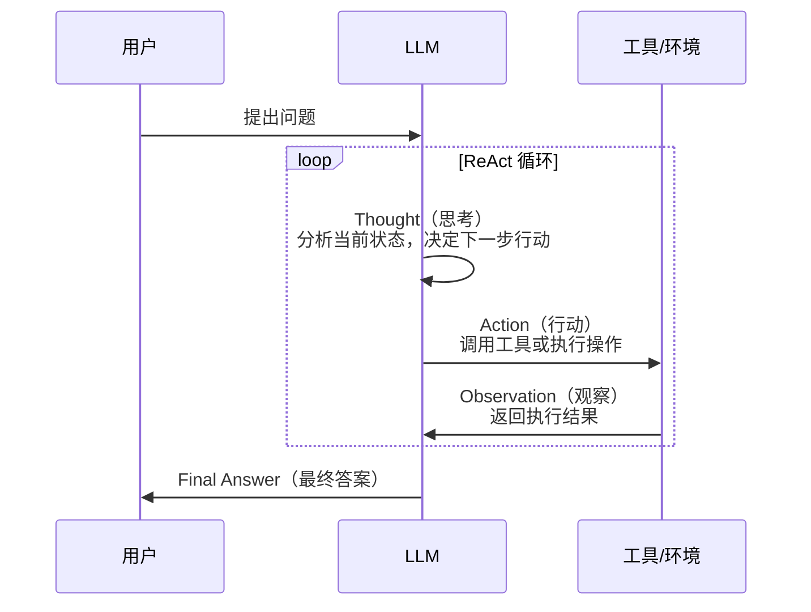
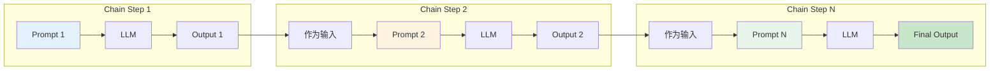
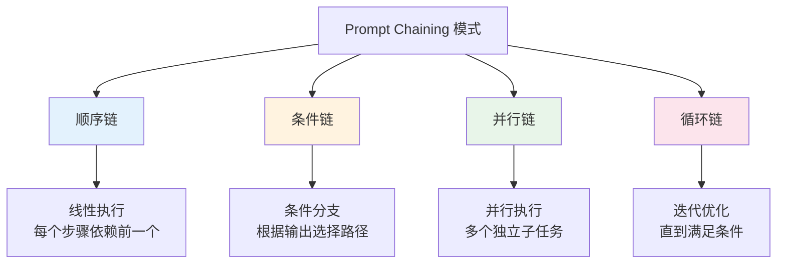
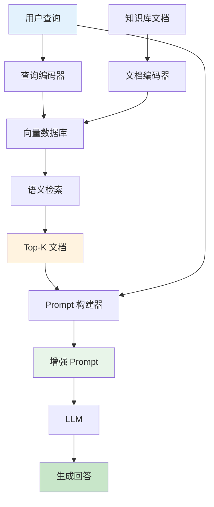
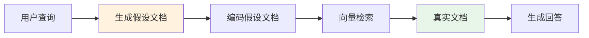
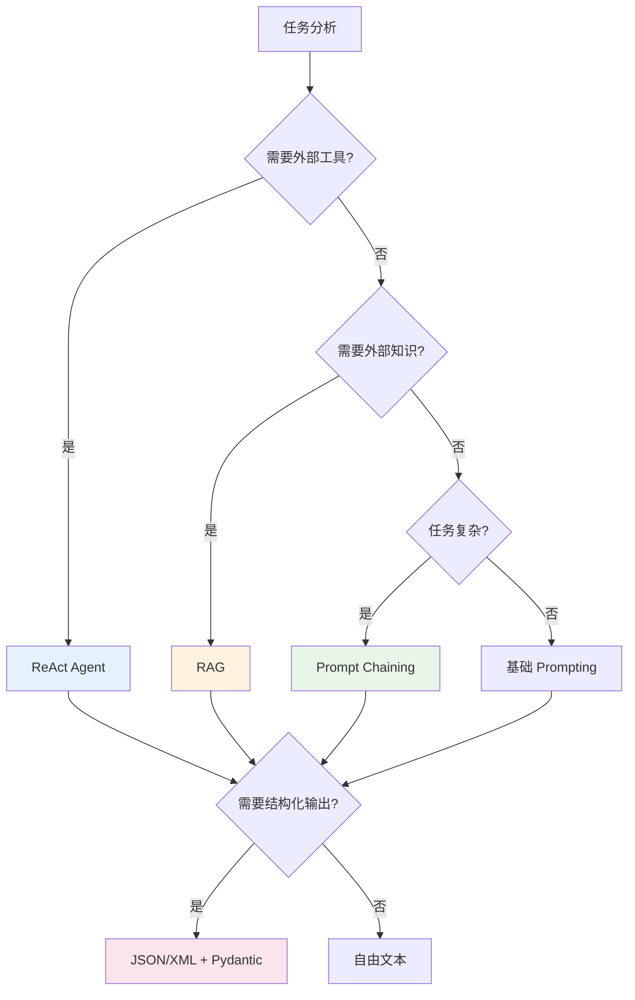

# 第 4 章：Agent 与工具

> [English Version](04-agents-tools-en.md)

---

## 目录

1. [ReAct 框架](#react-框架)
2. [Prompt Chaining](#prompt-chaining)
3. [RAG（检索增强生成）](#rag检索增强生成)
4. [结构化输出控制](#结构化输出控制)
5. [实践练习](#实践练习)

---

## ReAct 框架

### 概念

ReAct（Reasoning + Acting）是一种将推理（Reasoning）和行动（Acting）相结合的框架，让 LLM 能够交替生成推理轨迹和任务特定动作。这种协同作用使模型能够进行动态推理，同时与外部工具和环境交互。

**来源**：Yao et al., 2022 - "ReAct: Synergizing Reasoning and Acting in Language Models"

### ReAct 循环机制

ReAct 的核心是一个 Thought-Action-Observation 循环，模型通过不断迭代来解决问题：



### ReAct 完整模板

以下是一个完整的 ReAct Prompt 示例，展示了如何引导模型使用工具解决问题：

```markdown
Question: What is the elevation range for the area that the eastern sector of the Colorado orogeny extends into?

Thought 1: I need to search Colorado orogeny, find the area that the eastern sector of the Colorado orogeny extends into, then find the elevation range of the area.
Action 1: Search[Colorado orogeny]
Observation 1: The Colorado orogeny was an episode of mountain building (an orogeny) in Colorado and surrounding areas.

Thought 2: It does not mention the eastern sector. So I need to look up eastern sector.
Action 2: Lookup[eastern sector]
Observation 2: (Result 1 / 1) The eastern sector extends into the High Plains and is called the Central Plains orogeny.

Thought 3: The eastern sector of Colorado orogeny extends into the High Plains. So I need to search High Plains and find its elevation range.
Action 3: Search[High Plains]
Observation 3: High Plains refers to one of two distinct land regions

Thought 4: I need to instead search High Plains (United States).
Action 4: Search[High Plains (United States)]
Observation 4: The High Plains are a subregion of the Great Plains. From east to west, the High Plains rise in elevation from around 1,800 to 7,000 ft (550 to 2,130 m).[3]

Thought 5: High Plains rise in elevation from around 1,800 to 7,000 ft, so the answer is 1,800 to 7,000 ft.
Action 5: Finish[1,800 to 7,000 ft]
```

### ReAct 系统 Prompt 模板

在实际应用中，你需要为 Agent 定义系统级别的指令：

```markdown
You are an AI assistant that can use tools to help answer questions.

When responding, follow this format:

Thought: [your reasoning about what to do]
Action: [the tool name]
Action Input: [the input to the tool]

Then you will receive:
Observation: [the tool output]

Continue this Thought-Action-Observation loop until you have the final answer.
Then respond with:

Thought: I now know the final answer.
Final Answer: [your answer]

Available tools:
- search: Search for information on the internet
- calculator: Perform mathematical calculations
- lookup: Look up specific facts in a knowledge base
```

### LangChain 实现代码

以下是使用 LangChain 实现 ReAct Agent 的代码示例：

```python
from langchain.agents import load_tools, initialize_agent
from langchain.llms import OpenAI

# 设置 LLM 和工具
llm = OpenAI(temperature=0)
tools = load_tools(["google-serper", "llm-math"], llm=llm)

# 初始化 ReAct Agent
agent = initialize_agent(
    tools,
    llm,
    agent="zero-shot-react-description",
    verbose=True
)

# 运行 Agent
result = agent.run("Who is Olivia Wilde's boyfriend? What is his current age raised to the 0.23 power?")
print(result)
```

**输出示例**：

```
> Entering new AgentExecutor chain...
I need to find out who Olivia Wilde's boyfriend is and then calculate his age raised to the 0.23 power.
Action: google_serper
Action Input: "Olivia Wilde boyfriend"
Observation: According to reports, Olivia Wilde is currently dating Harry Styles.
Thought: I need to find Harry Styles' current age.
Action: google_serper
Action Input: "Harry Styles age"
Observation: Harry Styles is 29 years old (born February 1, 1994).
Thought: Now I need to calculate 29 raised to the 0.23 power.
Action: calculator
Action Input: 29^0.23
Observation: Answer: 2.169462462491557

Thought: I now know the final answer.
Final Answer: Harry Styles is Olivia Wilde's boyfriend. His current age (29) raised to the 0.23 power is approximately 2.17.

> Finished chain.
```

### ReAct 的优势

| 优势 | 说明 |
|------|------|
| **可解释性** | 推理轨迹人类可读，便于调试和审计 |
| **事实准确性** | 通过外部工具检索减少幻觉 |
| **交互能力** | 能使用 API、数据库、搜索引擎等外部资源 |
| **鲁棒性** | 遇到错误可以调整策略，支持自我纠正 |
| **泛化性** | 框架通用，可应用于多种任务类型 |

### ReAct 适用场景

- **知识密集型任务**：需要查询外部知识库的问题
- **多步骤推理**：需要分解为多个子任务的问题
- **实时信息查询**：需要获取最新信息的问题
- **计算密集型任务**：需要精确计算的问题

---

## Prompt Chaining

### 概念

Prompt Chaining（提示链）是将复杂任务分解为子任务，按顺序执行多个 Prompt，前一个输出作为后一个输入的技术。这种方法提高了透明度、可控性和可靠性。

### Prompt Chaining 架构



### 文档问答示例（双 Prompt 链）

以下是一个文档问答的完整 Prompt Chaining 示例：

#### Prompt 1 - 提取相关引用

```markdown
You are a helpful assistant. Your task is to help answer a question given in a document.
The first step is to extract quotes relevant to the question from the document, delimited by ####.
Please output the list of quotes using <quotes></quotes>.
Respond with "No relevant quotes found!" if no relevant quotes were found.

####
{{document}}
####

Question: {{question}}
```

**示例输出**：
```xml
<quotes>
- "The company's revenue grew by 45% in Q3 2024, driven primarily by cloud services."
- "Cloud infrastructure revenue reached $2.3 billion, up 67% year-over-year."
</quotes>
```

#### Prompt 2 - 生成答案

```markdown
Given a set of relevant quotes (delimited by <quotes></quotes>) extracted from a document
and the original document (delimited by ####), please compose an answer to the question.
Ensure that the answer is accurate, has a friendly tone, and sounds helpful.

####
{{document}}
####

<quotes>
{{quotes_from_prompt_1}}
</quotes>

Question: {{question}}

Please provide a comprehensive answer based on the documents above:
```

**示例输出**：
```
Based on the document, the company's cloud services have been performing exceptionally well. In Q3 2024, cloud infrastructure revenue reached $2.3 billion, representing a 67% increase year-over-year. This strong growth in cloud services was the primary driver behind the company's overall revenue growth of 45% for the quarter.
```

### Prompt Chaining 的优势

| 优势 | 说明 |
|------|------|
| **透明度** | 可以调试每个阶段，定位问题所在 |
| **可控性** | 每个步骤可单独优化和调整 |
| **可靠性** | 降低单次复杂提示的失败率 |
| **可维护性** | 模块化设计，易于修改和扩展 |
| **成本优化** | 可以缓存中间结果，避免重复计算 |

### 常见 Chaining 模式



---

## RAG（检索增强生成）

### 概念

RAG（Retrieval Augmented Generation，检索增强生成）是一种结合信息检索和文本生成的技术。它从外部知识源检索相关文档，然后将这些文档作为上下文提供给 LLM 生成回答。

**来源**：Lewis et al., 2021 - Meta AI

### RAG 架构



### RAG Prompt 模板

```markdown
You are a knowledgeable assistant. Use the following retrieved documents to answer
the user's question. If the documents don't contain the answer, say "I don't have
enough information to answer this question."

---

Retrieved Documents:

[Document {{loop.index}}]
{{doc.content}}



---

User Question: {{question}}

Please provide a comprehensive answer based on the documents above:
```

### RAG 的关键组件

| 组件 | 功能 | 实现方式 |
|------|------|---------|
| **检索器** | 基于语义相似度检索相关文档 | 向量数据库、BM25、混合检索 |
| **重排序** | 对检索结果进行相关性评分 | Cross-encoder、学习排序 |
| **上下文组装** | 将文档融入 Prompt | 截断、优先级排序、去重 |
| **生成** | LLM 基于上下文生成回答 | GPT、Claude 等 |

### 高级 RAG 模式

#### 多查询 RAG

通过生成多个查询变体来提高检索覆盖率：

```markdown
Generate 3 different versions of the user's question to retrieve relevant documents.

Original question: {{question}}

Version 1: [Rewritten for semantic search]
Version 2: [Rewritten with keywords]
Version 3: [Rewritten for specific aspect]

---

Now retrieve documents for each version and combine the results.
```

**Python 实现示例**：

```python
from typing import List

def multi_query_rag(question: str, llm, retriever) -> str:
    """Multi-query RAG implementation."""

    # Generate query variations
    prompt = f"""Generate 3 different versions of the following question
    to improve document retrieval:

    Original: {question}

    Provide each version on a new line:"""

    variations = llm.generate(prompt).split('\n')
    variations = [v.strip() for v in variations if v.strip()]
    variations.append(question)  # Include original

    # Retrieve documents for each variation
    all_docs = []
    for query in variations:
        docs = retriever.retrieve(query, k=3)
        all_docs.extend(docs)

    # Deduplicate and rerank
    unique_docs = deduplicate(all_docs)
    reranked = rerank_documents(question, unique_docs)

    # Generate final answer
    context = format_documents(reranked[:5])
    final_prompt = f"""Based on the following documents, answer the question.

    Documents:
    {context}

    Question: {question}

    Answer:"""

    return llm.generate(final_prompt)
```

#### 假设文档嵌入（HyDE）

HyDE（Hypothetical Document Embeddings）通过生成假设的理想文档来改善检索：

```markdown
Generate a hypothetical ideal document that would answer this question:

Question: {{question}}

Hypothetical Document:
[Generate a paragraph that would perfectly answer the question]

Now use this hypothetical document to find similar real documents.
```

**HyDE 流程**：



**Python 实现示例**：

```python
def hyde_retrieval(question: str, llm, encoder, vector_store) -> List[Document]:
    """HyDE retrieval implementation."""

    # Generate hypothetical document
    hyde_prompt = f"""Write a passage that answers the following question:

    Question: {question}

    Passage:"""

    hypothetical_doc = llm.generate(hyde_prompt)

    # Encode hypothetical document
    query_embedding = encoder.encode(hypothetical_doc)

    # Retrieve similar real documents
    results = vector_store.similarity_search(
        embedding=query_embedding,
        k=5
    )

    return results
```

### RAG 最佳实践

1. **文档分块策略**
   - 按语义边界分块（段落、句子）
   - 重叠窗口保持上下文
   - 块大小通常在 200-500 tokens

2. **检索优化**
   - 混合检索：向量 + 关键词
   - 重排序提高精度
   - 查询扩展和重写

3. **上下文管理**
   - 优先保留最相关的文档
   - 处理长文档的截断策略
   - 去重避免重复信息

---

## 结构化输出控制

### 为什么需要结构化输出

结构化输出使模型响应可以被程序可靠地解析和处理，避免了自由文本的不确定性。主要应用场景包括：

- API 响应解析
- 数据提取和转换
- 多步骤工作流中的数据传递
- 与类型化系统的集成

### JSON 模式

JSON 是最常用的结构化输出格式，大多数 LLM 都支持 JSON 模式输出。

#### JSON 模式 Prompt 模板

```markdown
Respond ONLY with a JSON object in this exact format:

{
  "reasoning": "Your step-by-step thinking process",
  "confidence": 0.95,
  "answer": "Your final answer",
  "sources": ["source1", "source2"]
}

Do not include any text outside the JSON object.
Ensure the JSON is valid and properly formatted.
```

#### JSON 模式示例

**Prompt**：
```markdown
Extract the following information from the text as JSON:
- Person names
- Organizations
- Locations
- Dates

Text: "Apple CEO Tim Cook announced on January 15, 2024 that the company
will open a new office in Austin, Texas."

Respond with JSON only:
```

**预期输出**：
```json
{
  "persons": ["Tim Cook"],
  "organizations": ["Apple"],
  "locations": ["Austin, Texas"],
  "dates": ["January 15, 2024"]
}
```

### XML 模式

XML 模式在某些场景下更易读，特别是需要嵌套结构时。

#### XML 模式 Prompt 模板

```markdown
Respond using XML tags:

<response>
  <thinking>
    Your reasoning process here
  </thinking>
  <answer>
    Your final answer here
  </answer>
  <confidence>
    High/Medium/Low
  </confidence>
</response>
```

#### XML 模式示例

**Prompt**：
```markdown
Analyze the following text and provide structured output:

Text: "The product launch was a huge success, exceeding all sales targets by 150%.
However, some customers reported minor issues with the mobile app."

Use this XML format:
<analysis>
  <sentiment></sentiment>
  <key_points></key_points>
  <concerns></concerns>
</analysis>
```

**预期输出**：
```xml
<analysis>
  <sentiment>Mostly positive with minor concerns</sentiment>
  <key_points>
    - Product launch exceeded sales targets by 150%
    - Overall reception was very positive
  </key_points>
  <concerns>
    - Some customers reported issues with mobile app
  </concerns>
</analysis>
```

### Pydantic 验证

使用 Pydantic 可以定义数据模型并验证 LLM 输出。

#### Pydantic 模型定义

```python
from pydantic import BaseModel, validator, Field
from typing import List, Optional

class AgentResponse(BaseModel):
    reasoning: str = Field(..., description="Step-by-step thinking process")
    confidence: float = Field(..., ge=0, le=1, description="Confidence score between 0 and 1")
    answer: str = Field(..., description="Final answer")
    sources: List[str] = Field(default=[], description="List of sources")

    @validator('confidence')
    def check_confidence(cls, v):
        if not 0 <= v <= 1:
            raise ValueError('Confidence must be between 0 and 1')
        return v

class ExtractedEntities(BaseModel):
    persons: List[str] = Field(default=[], description="Person names found")
    organizations: List[str] = Field(default=[], description="Organization names found")
    locations: List[str] = Field(default=[], description="Locations mentioned")
    dates: List[str] = Field(default=[], description="Dates mentioned")
```

#### 完整使用示例

```python
import json
from pydantic import ValidationError

def parse_llm_response(model_output: str, model_class) -> BaseModel:
    """Parse and validate LLM output using Pydantic."""

    try:
        # Parse JSON
        data = json.loads(model_output)

        # Validate with Pydantic
        validated = model_class(**data)

        return validated

    except json.JSONDecodeError as e:
        raise ValueError(f"Invalid JSON: {e}")

    except ValidationError as e:
        raise ValueError(f"Validation error: {e}")

# 使用示例
def extract_entities(text: str, llm) -> ExtractedEntities:
    """Extract entities from text with structured output."""

    prompt = f"""Extract entities from the following text.

    Text: {text}

    Respond with JSON in this exact format:
    {{
      "persons": [],
      "organizations": [],
      "locations": [],
      "dates": []
    }"""

    response = llm.generate(prompt)

    try:
        return parse_llm_response(response, ExtractedEntities)
    except ValueError as e:
        # 处理错误或重试
        raise

# 实际调用
text = "Apple CEO Tim Cook visited London on March 15, 2024."
result = extract_entities(text, llm)
print(result.persons)        # ["Tim Cook"]
print(result.organizations)  # ["Apple"]
print(result.locations)      # ["London"]
print(result.dates)          # ["March 15, 2024"]
```

### 结构化输出对比

| 格式 | 优点 | 缺点 | 适用场景 |
|------|------|------|---------|
| **JSON** | 标准格式，易于解析 | 对特殊字符敏感 | API 响应、数据交换 |
| **XML** | 可读性好，支持注释 | 冗长，解析复杂 | 复杂嵌套结构 |
| **YAML** | 人类可读 | 缩进敏感 | 配置文件 |
| **Markdown** | 自然语言友好 | 需要额外解析 | 混合内容 |

---

## 实践练习

### 练习 1：ReAct Agent 设计

**任务**：设计一个 ReAct Agent，用于查询天气并计算穿衣建议。

**可用工具**：
- `get_weather(city)`：获取城市天气
- `calculate_temperature(feels_like)`：计算体感温度

**你的 Prompt**：
```markdown
[在此编写你的 ReAct 系统 Prompt]
```

**参考答案**：
```markdown
You are a weather assistant that helps users decide what to wear.

Available tools:
- get_weather(city): Returns current weather for a city including temperature and conditions
- calculate_temperature(feels_like): Calculates appropriate clothing based on temperature

Follow this format:
Thought: [your reasoning]
Action: [tool name]
Action Input: [tool input]
Observation: [tool result]

Continue until you can provide clothing advice.
Then respond with:
Final Answer: [your clothing recommendation]

Example:
Question: What should I wear in New York today?
Thought: I need to get the current weather in New York first.
Action: get_weather
Action Input: New York
Observation: Temperature: 45°F, Conditions: Sunny, Feels like: 42°F
Thought: Now I need to calculate what to wear for 42°F.
Action: calculate_temperature
Action Input: 42
Observation: Recommendation: Light jacket or sweater recommended
Thought: I now have all the information needed.
Final Answer: It's 45°F and sunny in New York today (feels like 42°F). I recommend wearing a light jacket or sweater.
```

---

### 练习 2：Prompt Chaining 设计

**任务**：设计一个双 Prompt Chain，用于分析客户反馈并生成回复。

**步骤 1**：分析反馈情感和问题类型
**步骤 2**：根据分析结果生成个性化回复

**你的 Prompt 1（分析）**：
```markdown
[在此编写你的分析 Prompt]
```

**你的 Prompt 2（回复生成）**：
```markdown
[在此编写你的回复生成 Prompt]
```

**参考答案**：

**Prompt 1 - 分析**：
```markdown
Analyze the following customer feedback and provide structured output:

Feedback: {{feedback}}

Provide your analysis in this JSON format:
{
  "sentiment": "positive/negative/neutral",
  "category": "billing/product/service/delivery",
  "urgency": "high/medium/low",
  "key_issues": ["issue 1", "issue 2"],
  "customer_emotion": "frustrated/angry/satisfied/confused"
}
```

**Prompt 2 - 回复生成**：
```markdown
Generate a personalized response to the customer based on the analysis.

Original Feedback: {{feedback}}

Analysis: {{analysis_from_prompt_1}}

Guidelines:
- Acknowledge the specific issues mentioned
- Match the tone to the customer's emotion
- Provide concrete next steps
- Include estimated resolution time if applicable

Response:
```

---

### 练习 3：RAG Prompt 设计

**任务**：设计一个 RAG Prompt，用于基于技术文档回答编程问题。

**你的 Prompt**：
```markdown
[在此编写你的 RAG Prompt]
```

**参考答案**：
```markdown
You are a technical documentation assistant. Answer the programming question
using the provided documentation excerpts.

---

Documentation Excerpts:

[From: {{doc.source}}]
```{{doc.language}}
{{doc.content}}
```



---

Question: {{question}}

Instructions:
1. Base your answer ONLY on the provided documentation
2. If the documentation doesn't contain the answer, say "I don't have sufficient information"
3. Include code examples from the documentation when relevant
4. Cite the source of your information

Answer:
```

---

### 练习 4：结构化输出设计

**任务**：设计一个 Pydantic 模型和对应的 Prompt，用于提取会议信息。

**需要提取的字段**：
- 会议标题
- 日期时间
- 参与者列表
- 议程项目
- 行动项（带负责人和截止日期）

**你的 Pydantic 模型**：
```python
[在此编写你的 Pydantic 模型]
```

**你的 Prompt**：
```markdown
[在此编写你的 Prompt]
```

**参考答案**：

**Pydantic 模型**：
```python
from pydantic import BaseModel, Field
from typing import List, Optional
from datetime import datetime

class ActionItem(BaseModel):
    task: str = Field(..., description="Description of the action item")
    assignee: str = Field(..., description="Person responsible for the task")
    due_date: Optional[str] = Field(None, description="Due date for the task")

class AgendaItem(BaseModel):
    topic: str = Field(..., description="Agenda topic")
    duration: Optional[str] = Field(None, description="Allocated time")

class MeetingInfo(BaseModel):
    title: str = Field(..., description="Meeting title")
    date_time: str = Field(..., description="Meeting date and time")
    participants: List[str] = Field(default=[], description="List of attendees")
    agenda: List[AgendaItem] = Field(default=[], description="Meeting agenda items")
    action_items: List[ActionItem] = Field(default=[], description="Action items from the meeting")
```

**Prompt**：
```markdown
Extract meeting information from the following text.

Meeting Notes:
{{meeting_notes}}

Respond with a JSON object matching this structure:
{
  "title": "Meeting title",
  "date_time": "Date and time of the meeting",
  "participants": ["Name 1", "Name 2"],
  "agenda": [
    {"topic": "Topic 1", "duration": "30 min"}
  ],
  "action_items": [
    {"task": "Task description", "assignee": "Person name", "due_date": "YYYY-MM-DD"}
  ]
}

Ensure all dates are in YYYY-MM-DD format. Include only information explicitly mentioned in the text.
```

---

## 本章总结

### 核心概念回顾

| 技术 | 核心思想 | 适用场景 | 关键要点 |
|------|---------|---------|---------|
| **ReAct** | 推理与行动交替进行 | 需要外部工具的任务 | Thought-Action-Observation 循环 |
| **Prompt Chaining** | 任务分解为多个步骤 | 复杂多阶段任务 | 模块化、可调试 |
| **RAG** | 检索 + 生成结合 | 知识密集型问答 | 检索质量决定生成质量 |
| **结构化输出** | 强制特定格式输出 | 程序化处理 | JSON/XML + Pydantic 验证 |

### 技术选择决策树



### 下一步学习

完成本章后，建议继续学习：

1. **第 5 章：上下文工程** - 学习如何设计和管理 Agent 上下文
2. **第 6 章：安全与防御** - 学习 Prompt 注入防御和输出过滤
3. **第 11 章：模板库** - 查看更多实用 Agent 模板

---

## 参考资源

### 学术研究

- **Yao et al. (2022)**: "ReAct: Synergizing Reasoning and Acting in Language Models" - [arXiv:2210.03629](https://arxiv.org/abs/2210.03629)
- **Lewis et al. (2021)**: "Retrieval-Augmented Generation for Knowledge-Intensive NLP Tasks" - [arXiv:2005.11401](https://arxiv.org/abs/2005.11401)
- **Gao et al. (2022)**: "Precise Zero-Shot Dense Retrieval without Relevance Labels" (HyDE) - [arXiv:2212.10496](https://arxiv.org/abs/2212.10496)

### 开源项目

- **LangChain**: https://github.com/langchain-ai/langchain
- **LlamaIndex**: https://github.com/run-llama/llama_index
- **AutoGPT**: https://github.com/Significant-Gravitas/AutoGPT
- **CrewAI**: https://github.com/crewAIInc/crewAI

### 相关章节

- [第 3 章：推理增强](./03-reasoning-zh.md) - Chain-of-Thought 和 Tree of Thoughts
- [第 5 章：上下文工程](./05-context-zh.md) - Agent 上下文设计
- [第 6 章：安全与防御](./06-security-zh.md) - Prompt 注入防御

---

*本章内容基于 2024-2025 年最新研究和实践经验整理。*
