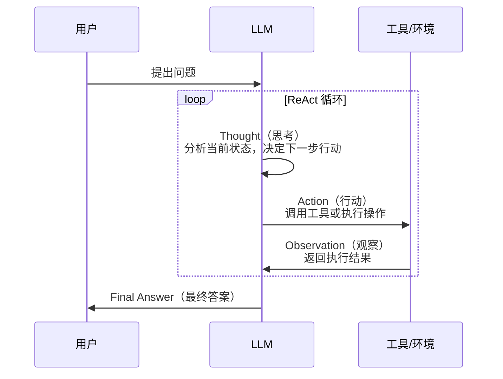
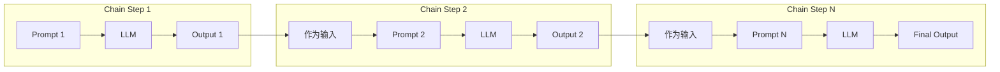
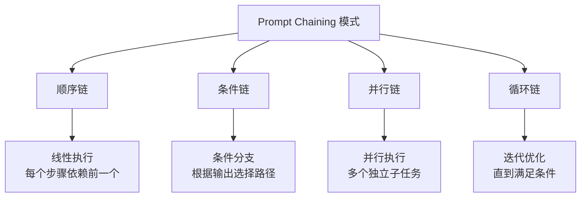
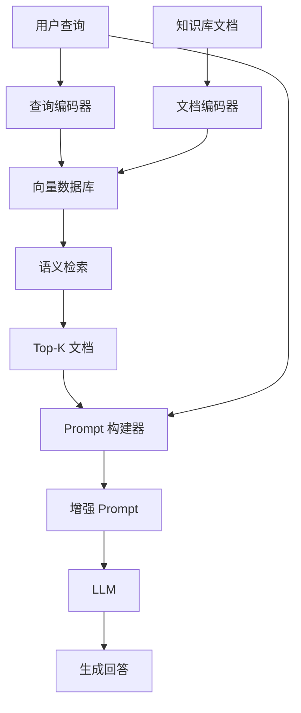
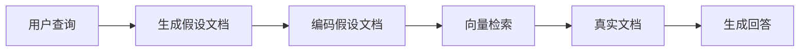
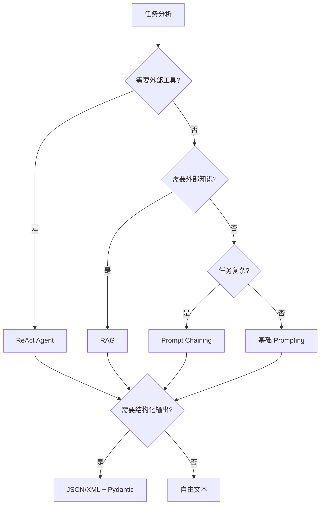

# 第 4 章：Agent 与工具

> [English Version](04-agents-tools-en.md)

---

## 目录

1. [ReAct 框架](#react-框架)
2. [Prompt Chaining](#prompt-chaining)
3. [RAG（检索增强生成）](#rag检索增强生成)
4. [结构化输出控制](#结构化输出控制)
5. [实践练习](#实践练习)

---

## ReAct 框架

### 概念

ReAct（Reasoning + Acting）是一种将推理（Reasoning）和行动（Acting）相结合的框架，让 LLM 能够交替生成推理轨迹和任务特定动作。这种协同作用使模型能够进行动态推理，同时与外部工具和环境交互。

**来源**：Yao et al., 2022 - "ReAct: Synergizing Reasoning and Acting in Language Models"

### ReAct 循环机制

ReAct 的核心是一个 Thought-Action-Observation 循环，模型通过不断迭代来解决问题：



### ReAct 完整模板

以下是一个完整的 ReAct Prompt 示例，展示了如何引导模型使用工具解决问题：

```markdown
问题：科罗拉多造山带东部延伸区域的海拔范围是多少？

思考 1：我需要搜索科罗拉多造山带，找到东部延伸的区域，然后确定该区域的海拔范围。
行动 1：搜索[科罗拉多造山带]
观察 1：科罗拉多造山带是科罗拉多州及周边地区的一次造山运动。

思考 2：结果没有提到东部延伸区域。所以我需要查找东部延伸区域。
行动 2：查找[东部延伸区域]
观察 2：（结果 1/1）东部延伸区域延伸至大平原，被称为中央平原造山带。

思考 3：科罗拉多造山带的东部延伸区域延伸至大平原。所以我需要搜索大平原并找到它的海拔范围。
行动 3：搜索[大平原]
观察 3：大平原指的是两个不同地理区域之一

思考 4：我需要改为搜索大平原（美国）。
行动 4：搜索[大平原（美国）]
观察 4：大平原是北美大平原的一个亚区域。从东到西，大平原的海拔从约 1,800 英尺上升到 7,000 英尺（550 到 2,130 米）。[3]

思考 5：大平原的海拔从约 1,800 英尺上升到 7,000 英尺，所以答案是 1,800 到 7,000 英尺。
行动 5：完成[1,800 到 7,000 英尺]
```

### ReAct 系统 Prompt 模板

在实际应用中，你需要为 Agent 定义系统级别的指令：

```markdown
你是一个可以使用工具帮助回答问题的 AI 助手。

回复时请遵循以下格式：

思考：[关于要做什么的推理]
行动：[工具名称]
行动输入：[工具的输入]

然后你会收到：
观察：[工具输出]

继续这个思考-行动-观察循环，直到你得到最终答案。
然后回复：

思考：我现在知道最终答案了。
最终答案：[你的答案]

可用工具：
- search：在互联网上搜索信息
- calculator：执行数学计算
- lookup：在知识库中查找特定事实
```

### LangChain 实现代码

以下是使用 LangChain 实现 ReAct Agent 的代码示例：

```python
from langchain.agents import load_tools, initialize_agent
from langchain.llms import OpenAI

# 设置 LLM 和工具
llm = OpenAI(temperature=0)
tools = load_tools(["google-serper", "llm-math"], llm=llm)

# 初始化 ReAct Agent
agent = initialize_agent(
    tools,
    llm,
    agent="zero-shot-react-description",
    verbose=True
)

# 运行 Agent
result = agent.run("奥利维亚·王尔德的男朋友是谁？他当前年龄的 0.23 次方是多少？")
print(result)
```

**输出示例**：

```
> 进入新的 AgentExecutor 链...
我需要找出奥利维亚·王尔德的男朋友是谁，然后计算他年龄的 0.23 次方。
行动：google_serper
行动输入："Olivia Wilde boyfriend"
观察：据报道，奥利维亚·王尔德目前正在和哈里·斯泰尔斯约会。
思考：我需要找到哈里·斯泰尔斯的当前年龄。
行动：google_serper
行动输入："Harry Styles age"
观察：哈里·斯泰尔斯今年 29 岁（出生于 1994 年 2 月 1 日）。
思考：现在我需要计算 29 的 0.23 次方。
行动：calculator
行动输入：29^0.23
观察：答案：2.169462462491557

思考：我现在知道最终答案了。
最终答案：哈里·斯泰尔斯是奥利维亚·王尔德的男朋友。他当前年龄（29 岁）的 0.23 次方约为 2.17。

> 完成链。
```

### ReAct 的优势

| 优势 | 说明 |
|------|------|
| **可解释性** | 推理轨迹人类可读，便于调试和审计 |
| **事实准确性** | 通过外部工具检索减少幻觉 |
| **交互能力** | 能使用 API、数据库、搜索引擎等外部资源 |
| **鲁棒性** | 遇到错误可以调整策略，支持自我纠正 |
| **泛化性** | 框架通用，可应用于多种任务类型 |

### ReAct 适用场景

- **知识密集型任务**：需要查询外部知识库的问题
- **多步骤推理**：需要分解为多个子任务的问题
- **实时信息查询**：需要获取最新信息的问题
- **计算密集型任务**：需要精确计算的问题

---

## Prompt Chaining

### 概念

Prompt Chaining（提示链）是将复杂任务分解为子任务，按顺序执行多个 Prompt，前一个输出作为后一个输入的技术。这种方法提高了透明度、可控性和可靠性。

### Prompt Chaining 架构



### 文档问答示例（双 Prompt 链）

以下是一个文档问答的完整 Prompt Chaining 示例：

#### Prompt 1 - 提取相关引用

```markdown
你是一个乐于助人的助手。你的任务是帮助回答文档中的问题。
第一步是从文档中提取与问题相关的引用，文档由 #### 分隔。
请使用 <quotes></quotes> 输出引用列表。
如果没有找到相关引用，请回复"未找到相关引用！"。

####
{{document}}
####

问题：{{question}}
```

**示例输出**：
```xml
<quotes>
- "公司收入在 2024 年第三季度增长了 45%，主要得益于云服务。"
- "云基础设施收入达到 23 亿美元，同比增长 67%。"
</quotes>
```

#### Prompt 2 - 生成答案

```markdown
给定一组从文档中提取的相关引用（由 <quotes></quotes> 分隔）
和原始文档（由 #### 分隔），请撰写问题的答案。
确保答案准确、语气友好且听起来有帮助。

####
{{document}}
####

<quotes>
{{quotes_from_prompt_1}}
</quotes>

问题：{{question}}

请根据上述文档提供全面的答案：
```

**示例输出**：
```
根据文档，公司的云服务表现非常出色。2024 年第三季度，云基础设施收入达到 23 亿美元，同比增长 67%。云服务的强劲增长是公司本季度整体收入增长 45% 的主要驱动力。
```

### Prompt Chaining 的优势

| 优势 | 说明 |
|------|------|
| **透明度** | 可以调试每个阶段，定位问题所在 |
| **可控性** | 每个步骤可单独优化和调整 |
| **可靠性** | 降低单次复杂提示的失败率 |
| **可维护性** | 模块化设计，易于修改和扩展 |
| **成本优化** | 可以缓存中间结果，避免重复计算 |

### 常见 Chaining 模式



---

## RAG（检索增强生成）

### 概念

RAG（Retrieval Augmented Generation，检索增强生成）是一种结合信息检索和文本生成的技术。它从外部知识源检索相关文档，然后将这些文档作为上下文提供给 LLM 生成回答。

**来源**：Lewis et al., 2021 - Meta AI

### RAG 架构



### RAG Prompt 模板

```markdown
你是一个知识渊博的助手。使用以下检索到的文档来回答
用户的问题。如果文档不包含答案，请说"我没有足够的
信息来回答这个问题。"

---

检索到的文档：

[文档 {{loop.index}}]
{{doc.content}}



---

用户问题：{{question}}

请根据上述文档提供全面的答案：
```

### RAG 的关键组件

| 组件 | 功能 | 实现方式 |
|------|------|---------|
| **检索器** | 基于语义相似度检索相关文档 | 向量数据库、BM25、混合检索 |
| **重排序** | 对检索结果进行相关性评分 | Cross-encoder、学习排序 |
| **上下文组装** | 将文档融入 Prompt | 截断、优先级排序、去重 |
| **生成** | LLM 基于上下文生成回答 | GPT、Claude 等 |

### 高级 RAG 模式

#### 多查询 RAG

通过生成多个查询变体来提高检索覆盖率：

```markdown
生成用户问题的 3 个不同版本以检索相关文档。

原始问题：{{question}}

版本 1：[为语义搜索重写]
版本 2：[使用关键词重写]
版本 3：[针对特定方面重写]

---

现在为每个版本检索文档并合并结果。
```

**Python 实现示例**：

```python
from typing import List

def multi_query_rag(question: str, llm, retriever) -> str:
    """多查询 RAG 实现。"""

    # 生成查询变体
    prompt = f"""生成以下问题的 3 个不同版本
    以改进文档检索：

    原始问题：{question}

    每行提供一个版本："""

    variations = llm.generate(prompt).split('\n')
    variations = [v.strip() for v in variations if v.strip()]
    variations.append(question)  # 包含原始问题

    # 为每个变体检索文档
    all_docs = []
    for query in variations:
        docs = retriever.retrieve(query, k=3)
        all_docs.extend(docs)

    # 去重和重排序
    unique_docs = deduplicate(all_docs)
    reranked = rerank_documents(question, unique_docs)

    # 生成最终答案
    context = format_documents(reranked[:5])
    final_prompt = f"""根据以下文档回答问题。

    文档：
    {context}

    问题：{question}

    答案："""

    return llm.generate(final_prompt)
```

#### 假设文档嵌入（HyDE）

HyDE（Hypothetical Document Embeddings）通过生成假设的理想文档来改善检索：

```markdown
生成一个能够回答此问题的假设理想文档：

问题：{{question}}

假设文档：
[生成一个能够完美回答问题的段落]

现在使用这个假设文档来查找相似的真实文档。
```

**HyDE 流程**：



**Python 实现示例**：

```python
def hyde_retrieval(question: str, llm, encoder, vector_store) -> List[Document]:
    """HyDE 检索实现。"""

    # 生成假设文档
    hyde_prompt = f"""撰写一个回答以下问题的段落：

    问题：{question}

    段落："""

    hypothetical_doc = llm.generate(hyde_prompt)

    # 编码假设文档
    query_embedding = encoder.encode(hypothetical_doc)

    # 检索相似的真实文档
    results = vector_store.similarity_search(
        embedding=query_embedding,
        k=5
    )

    return results
```

### RAG 最佳实践

1. **文档分块策略**
   - 按语义边界分块（段落、句子）
   - 重叠窗口保持上下文
   - 块大小通常在 200-500 tokens

2. **检索优化**
   - 混合检索：向量 + 关键词
   - 重排序提高精度
   - 查询扩展和重写

3. **上下文管理**
   - 优先保留最相关的文档
   - 处理长文档的截断策略
   - 去重避免重复信息

---

## 结构化输出控制

### 为什么需要结构化输出

结构化输出使模型响应可以被程序可靠地解析和处理，避免了自由文本的不确定性。主要应用场景包括：

- API 响应解析
- 数据提取和转换
- 多步骤工作流中的数据传递
- 与类型化系统的集成

### JSON 模式

JSON 是最常用的结构化输出格式，大多数 LLM 都支持 JSON 模式输出。

#### JSON 模式 Prompt 模板

```markdown
仅使用以下确切格式的 JSON 对象回复：

{
  "reasoning": "你的逐步思考过程",
  "confidence": 0.95,
  "answer": "你的最终答案",
  "sources": ["来源1", "来源2"]
}

不要在 JSON 对象外包含任何文本。
确保 JSON 有效且格式正确。
```

#### JSON 模式示例

**Prompt**：
```markdown
从文本中提取以下信息并以 JSON 格式返回：
- 人名
- 组织
- 地点
- 日期

文本："Apple CEO Tim Cook announced on January 15, 2024 that the company
will open a new office in Austin, Texas."

仅使用 JSON 回复：
```

**预期输出**：
```json
{
  "persons": ["Tim Cook"],
  "organizations": ["Apple"],
  "locations": ["Austin, Texas"],
  "dates": ["January 15, 2024"]
}
```

### XML 模式

XML 模式在某些场景下更易读，特别是需要嵌套结构时。

#### XML 模式 Prompt 模板

```markdown
使用 XML 标签回复：

<response>
  <thinking>
    你的推理过程
  </thinking>
  <answer>
    你的最终答案
  </answer>
  <confidence>
    高/中/低
  </confidence>
</response>
```

#### XML 模式示例

**Prompt**：
```markdown
分析以下文本并提供结构化输出：

文本："The product launch was a huge success, exceeding all sales targets by 150%.
However, some customers reported minor issues with the mobile app."

使用此 XML 格式：
<analysis>
  <sentiment></sentiment>
  <key_points></key_points>
  <concerns></concerns>
</analysis>
```

**预期输出**：
```xml
<analysis>
  <sentiment>总体积极，但有轻微顾虑</sentiment>
  <key_points>
    - 产品发布超出销售目标 150%
    - 整体反响非常积极
  </key_points>
  <concerns>
    - 一些客户报告了移动应用的问题
  </concerns>
</analysis>
```

### Pydantic 验证

使用 Pydantic 可以定义数据模型并验证 LLM 输出。

#### Pydantic 模型定义

```python
from pydantic import BaseModel, validator, Field
from typing import List, Optional

class AgentResponse(BaseModel):
    reasoning: str = Field(..., description="逐步思考过程")
    confidence: float = Field(..., ge=0, le=1, description="置信度分数，介于 0 和 1 之间")
    answer: str = Field(..., description="最终答案")
    sources: List[str] = Field(default=[], description="来源列表")

    @validator('confidence')
    def check_confidence(cls, v):
        if not 0 <= v <= 1:
            raise ValueError('置信度必须在 0 和 1 之间')
        return v

class ExtractedEntities(BaseModel):
    persons: List[str] = Field(default=[], description="发现的人名")
    organizations: List[str] = Field(default=[], description="发现的组织名称")
    locations: List[str] = Field(default=[], description="提到的地点")
    dates: List[str] = Field(default=[], description="提到的日期")
```

#### 完整使用示例

```python
import json
from pydantic import ValidationError

def parse_llm_response(model_output: str, model_class) -> BaseModel:
    """使用 Pydantic 解析和验证 LLM 输出。"""

    try:
        # 解析 JSON
        data = json.loads(model_output)

        # 使用 Pydantic 验证
        validated = model_class(**data)

        return validated

    except json.JSONDecodeError as e:
        raise ValueError(f"无效的 JSON：{e}")

    except ValidationError as e:
        raise ValueError(f"验证错误：{e}")

# 使用示例
def extract_entities(text: str, llm) -> ExtractedEntities:
    """使用结构化输出从文本中提取实体。"""

    prompt = f"""从以下文本中提取实体。

    文本：{text}

    使用以下确切格式的 JSON 回复：
    {{
      "persons": [],
      "organizations": [],
      "locations": [],
      "dates": []
    }}"""

    response = llm.generate(prompt)

    try:
        return parse_llm_response(response, ExtractedEntities)
    except ValueError as e:
        # 处理错误或重试
        raise

# 实际调用
text = "Apple CEO Tim Cook visited London on March 15, 2024."
result = extract_entities(text, llm)
print(result.persons)        # ["Tim Cook"]
print(result.organizations)  # ["Apple"]
print(result.locations)      # ["London"]
print(result.dates)          # ["March 15, 2024"]
```

### 结构化输出对比

| 格式 | 优点 | 缺点 | 适用场景 |
|------|------|------|---------|
| **JSON** | 标准格式，易于解析 | 对特殊字符敏感 | API 响应、数据交换 |
| **XML** | 可读性好，支持注释 | 冗长，解析复杂 | 复杂嵌套结构 |
| **YAML** | 人类可读 | 缩进敏感 | 配置文件 |
| **Markdown** | 自然语言友好 | 需要额外解析 | 混合内容 |

---

## 实践练习

### 练习 1：ReAct Agent 设计

**任务**：设计一个 ReAct Agent，用于查询天气并计算穿衣建议。

**可用工具**：
- `get_weather(city)`：获取城市天气
- `calculate_temperature(feels_like)`：计算体感温度

**你的 Prompt**：
```markdown
[在此编写你的 ReAct 系统 Prompt]
```

**参考答案**：
```markdown
你是一个天气助手，帮助用户决定穿什么衣服。

可用工具：
- get_weather(city)：返回城市的当前天气，包括温度和天气状况
- calculate_temperature(feels_like)：根据温度计算合适的穿着

遵循以下格式：
思考：[你的推理]
行动：[工具名称]
行动输入：[工具输入]
观察：[工具结果]

继续直到你能提供穿衣建议。
然后回复：
最终答案：[你的穿衣建议]

示例：
问题：我今天在纽约应该穿什么？
思考：我需要先获取纽约的当前天气。
行动：get_weather
行动输入：New York
观察：温度：45°F，天气：晴朗，体感温度：42°F
思考：现在我需要计算 42°F 应该穿什么。
行动：calculate_temperature
行动输入：42
观察：建议：推荐穿轻薄夹克或毛衣
思考：我现在有了所有需要的信息。
最终答案：纽约今天 45°F，晴朗（体感 42°F）。我建议穿轻薄夹克或毛衣。
```

---

### 练习 2：Prompt Chaining 设计

**任务**：设计一个双 Prompt Chain，用于分析客户反馈并生成回复。

**步骤 1**：分析反馈情感和问题类型
**步骤 2**：根据分析结果生成个性化回复

**你的 Prompt 1（分析）**：
```markdown
[在此编写你的分析 Prompt]
```

**你的 Prompt 2（回复生成）**：
```markdown
[在此编写你的回复生成 Prompt]
```

**参考答案**：

**Prompt 1 - 分析**：
```markdown
分析以下客户反馈并提供结构化输出：

反馈：{{feedback}}

使用以下 JSON 格式提供你的分析：
{
  "sentiment": "positive/negative/neutral",
  "category": "billing/product/service/delivery",
  "urgency": "high/medium/low",
  "key_issues": ["问题 1", "问题 2"],
  "customer_emotion": "frustrated/angry/satisfied/confused"
}
```

**Prompt 2 - 回复生成**：
```markdown
根据分析生成个性化的客户回复。

原始反馈：{{feedback}}

分析：{{analysis_from_prompt_1}}

指南：
- 确认提到的具体问题
- 根据客户的情绪调整语气
- 提供具体的后续步骤
- 如适用，包含预计解决时间

回复：
```

---

### 练习 3：RAG Prompt 设计

**任务**：设计一个 RAG Prompt，用于基于技术文档回答编程问题。

**你的 Prompt**：
```markdown
[在此编写你的 RAG Prompt]
```

**参考答案**：
```markdown
你是一个技术文档助手。使用提供的文档摘录回答编程问题。

---

文档摘录：

[来源：{{doc.source}}]
```{{doc.language}}
{{doc.content}}
```



---

问题：{{question}}

说明：
1. 仅基于提供的文档回答
2. 如果文档不包含答案，请说"我没有足够的信息"
3. 相关时包含文档中的代码示例
4. 引用你的信息来源

答案：
```

---

### 练习 4：结构化输出设计

**任务**：设计一个 Pydantic 模型和对应的 Prompt，用于提取会议信息。

**需要提取的字段**：
- 会议标题
- 日期时间
- 参与者列表
- 议程项目
- 行动项（带负责人和截止日期）

**你的 Pydantic 模型**：
```python
[在此编写你的 Pydantic 模型]
```

**你的 Prompt**：
```markdown
[在此编写你的 Prompt]
```

**参考答案**：

**Pydantic 模型**：
```python
from pydantic import BaseModel, Field
from typing import List, Optional
from datetime import datetime

class ActionItem(BaseModel):
    task: str = Field(..., description="行动项描述")
    assignee: str = Field(..., description="任务负责人")
    due_date: Optional[str] = Field(None, description="任务截止日期")

class AgendaItem(BaseModel):
    topic: str = Field(..., description="议程主题")
    duration: Optional[str] = Field(None, description="分配时间")

class MeetingInfo(BaseModel):
    title: str = Field(..., description="会议标题")
    date_time: str = Field(..., description="会议日期和时间")
    participants: List[str] = Field(default=[], description="参会者列表")
    agenda: List[AgendaItem] = Field(default=[], description="会议议程项")
    action_items: List[ActionItem] = Field(default=[], description="会议行动项")
```

**Prompt**：
```markdown
从以下文本中提取会议信息。

会议记录：
{{meeting_notes}}

使用与此结构匹配的 JSON 对象回复：
{
  "title": "会议标题",
  "date_time": "会议日期和时间",
  "participants": ["姓名 1", "姓名 2"],
  "agenda": [
    {"topic": "主题 1", "duration": "30 分钟"}
  ],
  "action_items": [
    {"task": "任务描述", "assignee": "负责人姓名", "due_date": "YYYY-MM-DD"}
  ]
}

确保所有日期使用 YYYY-MM-DD 格式。仅包含文本中明确提到的信息。
```

---

## 本章总结

### 核心概念回顾

| 技术 | 核心思想 | 适用场景 | 关键要点 |
|------|---------|---------|---------|
| **ReAct** | 推理与行动交替进行 | 需要外部工具的任务 | Thought-Action-Observation 循环 |
| **Prompt Chaining** | 任务分解为多个步骤 | 复杂多阶段任务 | 模块化、可调试 |
| **RAG** | 检索 + 生成结合 | 知识密集型问答 | 检索质量决定生成质量 |
| **结构化输出** | 强制特定格式输出 | 程序化处理 | JSON/XML + Pydantic 验证 |

### 技术选择决策树



### 下一步学习

完成本章后，建议继续学习：

1. **第 5 章：上下文工程** - 学习如何设计和管理 Agent 上下文
2. **第 6 章：安全与防御** - 学习 Prompt 注入防御和输出过滤
3. **第 11 章：模板库** - 查看更多实用 Agent 模板

---

## 参考资源

### 学术研究

- **Yao et al. (2022)**: "ReAct: Synergizing Reasoning and Acting in Language Models" - [arXiv:2210.03629](https://arxiv.org/abs/2210.03629)
- **Lewis et al. (2021)**: "Retrieval-Augmented Generation for Knowledge-Intensive NLP Tasks" - [arXiv:2005.11401](https://arxiv.org/abs/2005.11401)
- **Gao et al. (2022)**: "Precise Zero-Shot Dense Retrieval without Relevance Labels" (HyDE) - [arXiv:2212.10496](https://arxiv.org/abs/2212.10496)

### 开源项目

- **LangChain**: https://github.com/langchain-ai/langchain
- **LlamaIndex**: https://github.com/run-llama/llama_index
- **AutoGPT**: https://github.com/Significant-Gravitas/AutoGPT
- **CrewAI**: https://github.com/crewAIInc/crewAI

### 相关章节

- [第 3 章：推理增强](./03-reasoning-zh.md) - Chain-of-Thought 和 Tree of Thoughts
- [第 5 章：上下文工程](./05-context-engineering-zh.md) - Agent 上下文设计
- [第 6 章：安全与防御](./07-security-zh.md) - Prompt 注入防御

---

*本章内容基于 2024-2025 年最新研究和实践经验整理。*
