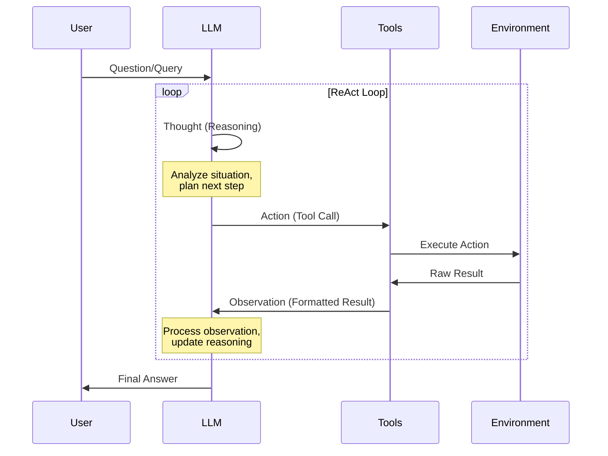
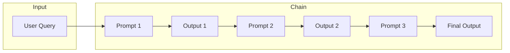
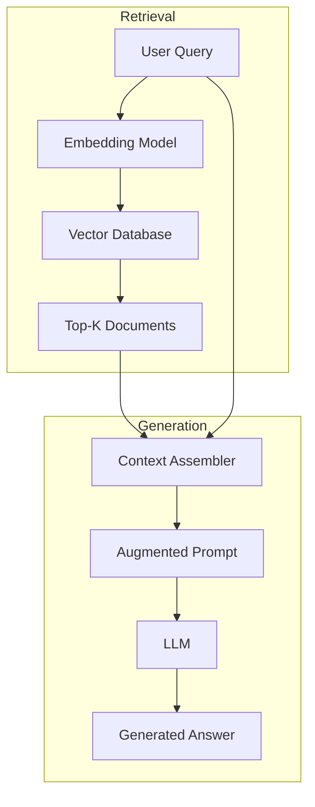
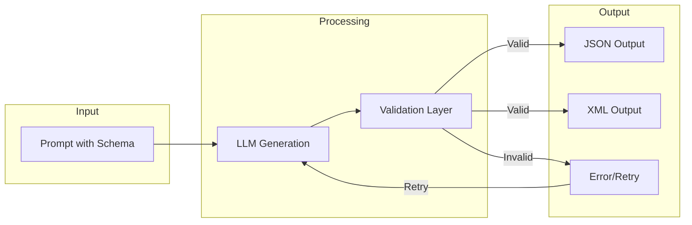

# Chapter 4: Agents & Tools

> [中文版](zh/04-agents-tools.md)

## Table of Contents

1. [ReAct Framework](#react-framework)
2. [Prompt Chaining](#prompt-chaining)
3. [RAG (Retrieval Augmented Generation)](#rag-retrieval-augmented-generation)
4. [Structured Output Control](#structured-output-control)

---

## ReAct Framework

### Concept

ReAct (Reasoning + Acting) is a framework that combines reasoning and action capabilities, allowing LLMs to alternate between generating reasoning traces and task-specific actions. This synergistic approach enables agents to solve complex problems by thinking through steps and interacting with external tools.

**Source**: Yao et al., 2022 - "ReAct: Synergizing Reasoning and Acting in Language Models"

### The ReAct Loop

The core of ReAct is an iterative loop where the LLM:
1. **Thinks** about the current state and what to do next
2. **Acts** by calling a tool or taking an action
3. **Observes** the result of that action
4. Repeats until reaching a final answer



### ReAct Prompt Template

Here is a complete ReAct prompt template following the original paper format:

```markdown
Question: What is the elevation range for the area that the eastern sector of the Colorado orogeny extends into?

Thought 1: I need to search Colorado orogeny, find the area that the eastern sector of the Colorado orogeny extends into, then find the elevation range of the area.
Action 1: Search[Colorado orogeny]
Observation 1: The Colorado orogeny was an episode of mountain building (an orogeny) in Colorado and surrounding areas.

Thought 2: It does not mention the eastern sector. So I need to look up eastern sector.
Action 2: Lookup[eastern sector]
Observation 2: (Result 1 / 1) The eastern sector extends into the High Plains and is called the Central Plains orogeny.

Thought 3: The eastern sector of Colorado orogeny extends into the High Plains. So I need to search High Plains and find its elevation range.
Action 3: Search[High Plains]
Observation 3: High Plains refers to one of two distinct land regions

Thought 4: I need to instead search High Plains (United States).
Action 4: Search[High Plains (United States)]
Observation 4: The High Plains are a subregion of the Great Plains. From east to west, the High Plains rise in elevation from around 1,800 to 7,000 ft (550 to 2,130 m).[3]

Thought 5: High Plains rise in elevation from around 1,800 to 7,000 ft, so the answer is 1,800 to 7,000 ft.
Action 5: Finish[1,800 to 7,000 ft]
```

### LangChain Implementation

Here is a practical implementation using LangChain:

```python
from langchain.agents import load_tools, initialize_agent
from langchain.agents import AgentType
from langchain.llms import OpenAI

# Initialize the LLM
llm = OpenAI(temperature=0)

# Load tools (search and math)
tools = load_tools([
    "google-serper",      # Web search
    "llm-math"            # Calculator
], llm=llm)

# Initialize ReAct agent
agent = initialize_agent(
    tools,
    llm,
    agent=AgentType.ZERO_SHOT_REACT_DESCRIPTION,
    verbose=True,
    handle_parsing_errors=True
)

# Run the agent
result = agent.run("""
Who is Olivia Wilde's boyfriend?
What is his current age raised to the 0.23 power?
""")

print(result)
```

**Expected Output Flow:**
```
> Entering new AgentExecutor chain...
Thought: I need to find information about Olivia Wilde's boyfriend.
Action: google_serper
Action Input: "Olivia Wilde boyfriend"
Observation: [Search results about Harry Styles]

Thought: Now I need to find Harry Styles' age.
Action: google_serper
Action Input: "Harry Styles age"
Observation: [Age information]

Thought: Now I need to calculate age^0.23.
Action: calculator
Action Input: 29^0.23
Observation: 2.89...

Thought: I now know the final answer.
Final Answer: Harry Styles is Olivia Wilde's boyfriend, and his age raised to the 0.23 power is approximately 2.89.

> Finished chain.
```

### System Prompt Template (CrewAI Style)

Production frameworks like CrewAI use structured system prompts for ReAct:

```markdown
You are {role}. {backstory}
Your personal goal is: {goal}

You ONLY have access to the following tools, and should NEVER make up tools that are not listed here:

{tools}

IMPORTANT: Use the following format in your response:

```
Thought: you should always think about what to do
Action: the action to take, only one name of [{tool_names}], just the name, exactly as it's written.
Action Input: the input to the action, just a simple JSON object, enclosed in curly braces, using " to wrap keys and values.
Observation: the result of the action
```

Once all necessary information is gathered, return the following format:

```
Thought: I now know the final answer
Final Answer: the final answer to the original input question
```
```

### Advantages of ReAct

| Advantage | Description |
|-----------|-------------|
| **Interpretability** | Reasoning traces are human-readable, making it easy to understand the agent's decision process |
| **Fact Accuracy** | External tool usage reduces hallucinations by grounding responses in real data |
| **Interactivity** | Can use APIs, databases, search engines, and custom tools |
| **Robustness** | Can adjust strategy when encountering errors or unexpected results |
| **Modularity** | Easy to add new tools without retraining the model |

---

## Prompt Chaining

### Concept

Prompt Chaining decomposes complex tasks into subtasks executed sequentially, where the output of one prompt becomes the input to the next. This approach improves reliability and makes each step debuggable.

### Architecture



### Document Q&A Example (Dual Prompt Chain)

A common use case is document-based question answering using two chained prompts:

#### Prompt 1: Extract Relevant Quotes

```markdown
You are a helpful assistant. Your task is to help answer a question given in a document.
The first step is to extract quotes relevant to the question from the document, delimited by ####.
Please output the list of quotes using <quotes></quotes>.
Respond with "No relevant quotes found!" if no relevant quotes were found.

####
{{document}}
####

Question: {{question}}
```

**Example Output from Prompt 1:**
```xml
<quotes>
- "The company's revenue grew by 45% in Q3 2024, driven primarily by cloud services."
- "Cloud infrastructure revenue reached $2.3 billion, up 62% year-over-year."
- "The growth was attributed to increased enterprise adoption of AI-powered solutions."
</quotes>
```

#### Prompt 2: Generate Answer

```markdown
Given a set of relevant quotes (delimited by <quotes></quotes>) extracted from a document
and the original document (delimited by ####), please compose an answer to the question.
Ensure that the answer is accurate, has a friendly tone, and sounds helpful.

####
{{document}}
####

<quotes>
{{quotes_from_prompt_1}}
</quotes>

Question: {{question}}

Please provide a comprehensive answer based on the documents above:
```

**Example Output from Prompt 2:**
```
Based on the document, the company's Q3 2024 performance was exceptional:

The revenue grew by 45%, primarily driven by cloud services which reached $2.3 billion
(up 62% year-over-year). This impressive growth was attributed to increased enterprise
adoption of AI-powered solutions.

Is there anything specific about their cloud services you'd like to know more about?
```

### Python Implementation

```python
import openai

def extract_quotes(document, question):
    """Step 1: Extract relevant quotes from document"""
    prompt = f"""You are a helpful assistant. Your task is to help answer a question given in a document.
The first step is to extract quotes relevant to the question from the document, delimited by ####.
Please output the list of quotes using <quotes></quotes>.
Respond with "No relevant quotes found!" if no relevant quotes were found.

####
{document}
####

Question: {question}"""

    response = openai.ChatCompletion.create(
        model="gpt-4",
        messages=[{"role": "user", "content": prompt}]
    )
    return response.choices[0].message.content

def generate_answer(document, quotes, question):
    """Step 2: Generate answer based on quotes"""
    prompt = f"""Given a set of relevant quotes (delimited by <quotes></quotes>) extracted from a document
and the original document (delimited by ####), please compose an answer to the question.
Ensure that the answer is accurate, has a friendly tone, and sounds helpful.

####
{document}
####

<quotes>
{quotes}
</quotes>

Question: {question}

Please provide a comprehensive answer based on the documents above:"""

    response = openai.ChatCompletion.create(
        model="gpt-4",
        messages=[{"role": "user", "content": prompt}]
    )
    return response.choices[0].message.content

# Execute the chain
document = "Your long document here..."
question = "What were the main revenue drivers in Q3?"

quotes = extract_quotes(document, question)
answer = generate_answer(document, quotes, question)

print(answer)
```

### Advantages of Prompt Chaining

1. **Transparency**: Each stage can be debugged independently
2. **Controllability**: Each step can be optimized separately
3. **Reliability**: Reduces failure rate compared to single complex prompts
4. **Maintainability**: Modular design makes updates easier
5. **Cost Efficiency**: Can use cheaper models for simpler steps

---

## RAG (Retrieval Augmented Generation)

### Concept

RAG combines information retrieval with text generation. Instead of relying solely on the model's training data, RAG retrieves relevant documents from an external knowledge source and uses them to generate more accurate, up-to-date responses.

**Source**: Lewis et al., 2021 - Meta AI

### Architecture



### RAG Prompt Template

```markdown
You are a knowledgeable assistant. Use the following retrieved documents to answer
the user's question. If the documents don't contain the answer, say "I don't have
enough information to answer this question."

---

Retrieved Documents:

[Document {{loop.index}}]
{{doc.content}}



---

User Question: {{question}}

Please provide a comprehensive answer based on the documents above:
```

### Key Components

| Component | Purpose | Example Technologies |
|-----------|---------|---------------------|
| **Retriever** | Find relevant documents based on semantic similarity | Dense Passage Retrieval (DPR), BM25 |
| **Reranker** | Score and reorder retrieved documents for relevance | Cross-encoders, ColBERT |
| **Context Assembler** | Format documents into the prompt | Custom templates |
| **Generator** | LLM that produces the final answer | GPT-4, Claude, Llama |

### Advanced RAG Modes

#### Multi-Query RAG

Generate multiple versions of the query to improve retrieval coverage:

```markdown
Generate 3 different versions of the user's question to retrieve relevant documents.
Each version should approach the question from a different angle.

Original question: {{question}}

Version 1 (Focus on technical aspects):
[Rewritten question focusing on technical details]

Version 2 (Focus on business impact):
[Rewritten question focusing on business implications]

Version 3 (Focus on historical context):
[Rewritten question focusing on background and history]

---

Now retrieve documents for all three versions and combine the results.
```

#### HyDE (Hypothetical Document Embeddings)

Generate a hypothetical ideal document to improve retrieval:

```markdown
Step 1: Generate a hypothetical ideal document that would answer this question:

Question: {{question}}

Hypothetical Document:
[Generate a paragraph that would perfectly answer the question]

Step 2: Use this hypothetical document to find similar real documents in the knowledge base.

Step 3: Based on the retrieved real documents, provide the actual answer.
```

### Python Implementation

```python
from langchain.embeddings import OpenAIEmbeddings
from langchain.vectorstores import Chroma
from langchain.chains import RetrievalQA
from langchain.llms import OpenAI

# Initialize components
embeddings = OpenAIEmbeddings()
vectorstore = Chroma(
    collection_name="documents",
    embedding_function=embeddings
)

# Add documents
vectorstore.add_texts([
    "Document 1 content...",
    "Document 2 content...",
    "Document 3 content..."
])

# Create RAG chain
qa_chain = RetrievalQA.from_chain_type(
    llm=OpenAI(temperature=0),
    chain_type="stuff",  # Stuff all documents into prompt
    retriever=vectorstore.as_retriever(
        search_kwargs={"k": 3}  # Retrieve top 3 documents
    ),
    return_source_documents=True
)

# Query
result = qa_chain({"query": "What are the main revenue drivers?"})
print(result["result"])
print("Sources:", result["source_documents"])
```

---

## Structured Output Control

### Concept

Structured output control forces LLMs to respond in specific formats (JSON, XML), making responses machine-parseable and enabling validation against schemas.

### JSON Mode

Force the model to output valid JSON:

```markdown
Respond ONLY with a JSON object in this exact format:

{
  "reasoning": "Your step-by-step thinking process",
  "confidence": 0.95,
  "answer": "Your final answer",
  "sources": ["source1", "source2"]
}

Requirements:
- "confidence" must be a number between 0 and 1
- "sources" must be an array of strings
- Do not include any text outside the JSON object
- Do not use markdown code blocks
```

**Example Response:**
```json
{
  "reasoning": "The document states Q3 revenue grew 45%, driven by cloud services at $2.3B (up 62% YoY). This clearly indicates cloud services are the main driver.",
  "confidence": 0.98,
  "answer": "Cloud services were the main revenue driver in Q3 2024, generating $2.3 billion (up 62% year-over-year) and contributing significantly to the overall 45% revenue growth.",
  "sources": ["Q3 2024 Earnings Report", "Cloud Infrastructure Analysis"]
}
```

### XML Mode

Use XML tags for structured output:

```markdown
Respond using the following XML structure:

<response>
  <thinking>
    Your detailed reasoning process here. Explain how you arrived at your answer.
  </thinking>
  <answer>
    Your final answer here. Be clear and concise.
  </answer>
  <confidence>
    High, Medium, or Low
  </confidence>
  <citations>
    <citation>Source 1</citation>
    <citation>Source 2</citation>
  </citations>
</response>

Do not include any text outside the XML tags.
```

**Example Response:**
```xml
<response>
  <thinking>
    Based on the retrieved documents, I found that cloud services revenue reached $2.3 billion in Q3 2024, representing a 62% year-over-year increase. This was explicitly stated as the primary driver of the overall 45% revenue growth.
  </thinking>
  <answer>
    Cloud services were the main revenue driver in Q3 2024.
  </answer>
  <confidence>
    High
  </confidence>
  <citations>
    <citation>Q3 2024 Earnings Report, Page 3</citation>
    <citation>Cloud Infrastructure Analysis</citation>
  </citations>
</response>
```

### Pydantic Validation

Use Pydantic models to validate and parse LLM outputs:

```python
from pydantic import BaseModel, validator, ValidationError
from typing import List
import json

class AgentResponse(BaseModel):
    reasoning: str
    confidence: float
    answer: str
    sources: List[str]

    @validator('confidence')
    def check_confidence_range(cls, v):
        if not 0 <= v <= 1:
            raise ValueError('Confidence must be between 0 and 1')
        return v

    @validator('answer')
    def answer_not_empty(cls, v):
        if not v or not v.strip():
            raise ValueError('Answer cannot be empty')
        return v.strip()

class ValidatedAgent:
    def __init__(self, llm_client):
        self.llm = llm_client

    def query(self, prompt: str, max_retries: int = 3) -> AgentResponse:
        structured_prompt = f"""{prompt}

Respond ONLY with a JSON object matching this schema:
{{
  "reasoning": "string - your thinking process",
  "confidence": "number between 0 and 1",
  "answer": "string - your final answer",
  "sources": ["array of source strings"]
}}

JSON:"""

        for attempt in range(max_retries):
            try:
                # Get response from LLM
                response = self.llm.complete(structured_prompt)

                # Parse JSON
                data = json.loads(response.text)

                # Validate with Pydantic
                validated = AgentResponse(**data)

                return validated

            except json.JSONDecodeError as e:
                print(f"Attempt {attempt + 1}: Invalid JSON - {e}")
                if attempt == max_retries - 1:
                    raise

            except ValidationError as e:
                print(f"Attempt {attempt + 1}: Validation failed - {e}")
                if attempt == max_retries - 1:
                    raise

        raise Exception("Failed to get valid response after all retries")

# Usage
agent = ValidatedAgent(llm_client)
try:
    result = agent.query("What is the capital of France?")
    print(f"Answer: {result.answer}")
    print(f"Confidence: {result.confidence}")
    print(f"Sources: {result.sources}")
except ValidationError as e:
    print(f"Validation failed: {e}")
```

### Structured Output Workflow



### Comparison of Output Formats

| Format | Pros | Cons | Best For |
|--------|------|------|----------|
| **JSON** | Universal parsing, type-safe | Strict syntax, no comments | APIs, data exchange |
| **XML** | Self-describing, human-readable | Verbose, slower parsing | Complex nested structures |
| **YAML** | Human-friendly, supports comments | Whitespace-sensitive | Configuration files |
| **Markdown** | Flexible, readable | Hard to parse reliably | Human consumption |

---

## Summary

This chapter covered four key techniques for building AI agents:

1. **ReAct**: Combines reasoning and action in an iterative loop, enabling agents to use tools and solve complex problems step by step.

2. **Prompt Chaining**: Breaks complex tasks into sequential subtasks, improving reliability and debuggability.

3. **RAG**: Augments LLMs with external knowledge retrieval, reducing hallucinations and enabling access to up-to-date information.

4. **Structured Output**: Enforces specific response formats (JSON/XML) with validation, making agent outputs machine-parseable and reliable.

These techniques can be combined: a ReAct agent might use RAG for knowledge retrieval, chain multiple prompts for complex reasoning, and enforce structured output for reliable tool calling.

---

## References

- ReAct: Yao et al. (2022) - https://arxiv.org/abs/2210.03629
- RAG: Lewis et al. (2021) - https://arxiv.org/pdf/2005.11401.pdf
- LangChain Agents: https://python.langchain.com/docs/modules/agents/
- CrewAI Documentation: https://docs.crewai.com/
