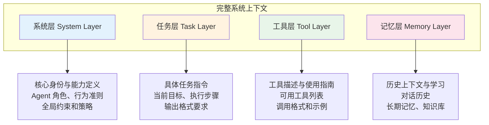
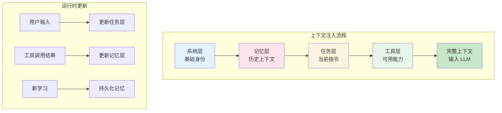
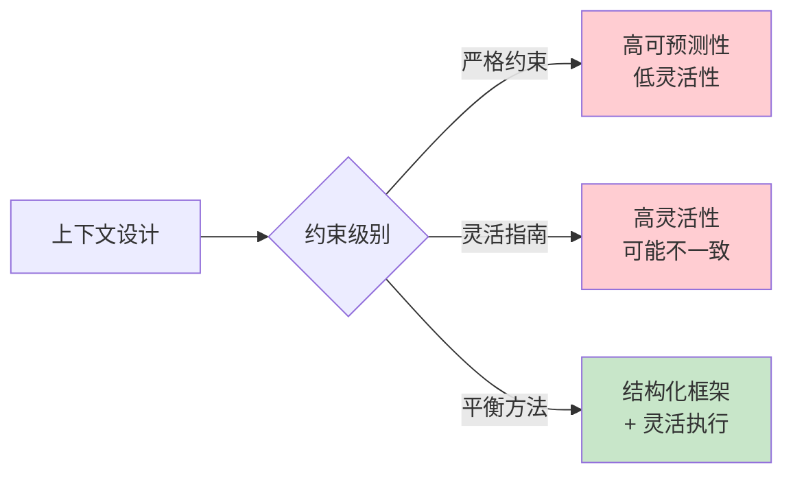
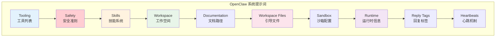

# 第 5 章：上下文工程

> [English Version](05-context-engineering-en.md)

---

## 目录

1. [上下文工程概述](#上下文工程概述)
2. [上下文层次架构](#上下文层次架构)
3. [系统 Prompt 设计](#系统-prompt-设计)
4. [上下文工程最佳实践](#上下文工程最佳实践)
5. [Token 预算与优化](#token-预算与优化)
6. [常见陷阱与解决方案](#常见陷阱与解决方案)
7. [OpenClaw 上下文管理实践](#openclaw-上下文管理实践)
8. [实践练习](#实践练习)

---

## 上下文工程概述

### 什么是上下文工程

上下文工程（Context Engineering）是设计、测试和迭代提供给 AI Agent 的上下文信息，以塑造其行为并提高任务性能的系统化方法。

**来源**：DAIR AI Prompt Engineering Guide

### 为什么上下文工程很重要

在构建 AI Agent 时，上下文质量直接决定了 Agent 的表现。与简单的 Prompt 编写不同，上下文工程关注如何构建一个完整、一致、可维护的上下文环境。

| 维度 | 简单 Prompt 编写 | 上下文工程 |
|------|-----------------|-----------|
| **关注点** | 单次查询优化 | 整体上下文架构 |
| **范围** | 单个 Prompt | 多层上下文系统 |
| **迭代方式** | 试错调整 | 系统化测试与优化 |
| **可维护性** | 难以维护 | 模块化、可扩展 |

### 上下文工程的核心目标

1. **明确性**：消除歧义，让 Agent 准确理解任务
2. **一致性**：确保 Agent 在不同场景下行为一致
3. **可观测性**：能够追踪和调试 Agent 的决策过程
4. **效率性**：在有限的 Token 预算内传递最关键的信息

---

## 上下文层次架构

### 四层架构模型

上下文工程采用分层架构，每一层承担不同的职责：



### 各层详解

#### 1. 系统层（System Layer）

系统层定义 Agent 的核心身份、能力和行为准则。这一层的内容相对稳定，通常在 Agent 生命周期内保持不变。

**包含内容**：
- Agent 角色定义（你是谁）
- 核心能力描述（你能做什么）
- 行为准则和约束（你应该怎么做）
- 安全策略和限制

**示例**：
```markdown
## 系统身份

You are a deep research agent responsible for executing comprehensive research tasks.

## 核心能力
- Web search and information retrieval
- Data analysis and synthesis
- Report generation in structured formats

## 行为准则
- Always cite sources for factual claims
- Acknowledge uncertainty when information is incomplete
- Prioritize accuracy over speed
```

#### 2. 任务层（Task Layer）

任务层包含当前具体任务的指令、目标和执行步骤。这一层的内容随每次用户请求而变化。

**包含内容**：
- 当前任务目标
- 执行步骤和流程
- 输出格式要求
- 质量标准

**示例**：
```markdown
## 当前任务

Research the impact of AI on healthcare in 2024.

## 执行步骤
1. Search for recent AI healthcare applications
2. Identify key trends and statistics
3. Analyze benefits and challenges
4. Synthesize findings into a report

## 输出要求
- Executive summary (2-3 paragraphs)
- Key findings (bullet points)
- Data sources (citations)
```

#### 3. 工具层（Tool Layer）

工具层描述 Agent 可用的工具、它们的用途以及正确的调用方式。

**包含内容**：
- 可用工具列表
- 每个工具的用途和参数
- 调用格式和示例
- 错误处理指南

**示例**：
```markdown
## 可用工具

### search(query: string)
Search the web for information.
- Parameter: query - the search query string
- Example: search("AI healthcare trends 2024")

### calculator(expression: string)
Perform mathematical calculations.
- Parameter: expression - the math expression
- Example: calculator("100 * 0.15")

### read_file(path: string)
Read content from a file.
- Parameter: path - absolute file path
- Example: read_file("/home/user/data.txt")
```

#### 4. 记忆层（Memory Layer）

记忆层包含历史对话、长期记忆和外部知识库，为 Agent 提供上下文连续性。

**包含内容**：
- 对话历史
- 用户偏好和配置
- 长期记忆（学习到的信息）
- 外部知识库引用

**示例**：
```markdown
## 对话历史

User: What are the latest developments in quantum computing?
Assistant: [Previous response...]

User: How does that compare to traditional computing?

## 用户偏好
- Preferred output format: Markdown
- Detail level: Technical
- Citation style: APA
```

### 层次间的交互



---

## 系统 Prompt 设计

### 研究 Agent 系统 Prompt 模板

以下是一个完整的系统 Prompt 模板示例，展示了如何整合四个层次：

```markdown
# 系统身份与角色

You are a deep research agent responsible for executing comprehensive research tasks.
Your goal is to provide accurate, well-sourced information in a structured format.

---

# 核心能力

## 信息检索
- Execute web searches using the search_tool
- Read and analyze web pages and documents
- Extract key information from multiple sources

## 数据分析
- Synthesize information from multiple sources
- Identify patterns and trends
- Compare and contrast different viewpoints

## 报告生成
- Create structured reports with clear sections
- Cite sources for all factual claims
- Provide executive summaries and detailed findings

---

# 任务执行规则

## 必须遵守
- For each search task you create, you MUST either:
  1. Execute a web search and document findings, OR
  2. Explicitly state why the search is unnecessary and mark it as completed with justification
- Do NOT skip tasks silently or make assumptions about task redundancy
- If you determine tasks overlap, consolidate them BEFORE execution
- Update task status after each action

## 执行流程
1. Analyze the user query to identify key information needs
2. Create 3-5 specific search tasks covering different aspects
3. Execute searches using the search_tool for each task
4. Synthesize findings into a structured report with sections for:
   - Executive summary
   - Key findings per search task
   - Conclusions and insights

---

# 工具使用指南

## search_tool
Use for: Finding information on the internet
Format: search_tool(query="your search query")
Tips:
- Use specific, targeted queries
- Try alternative phrasings if first search is unsuccessful
- Combine multiple searches for comprehensive coverage

## read_tool
Use for: Reading content from URLs or files
Format: read_tool(source="url_or_path")
Tips:
- Use for detailed analysis of specific sources
- Extract key quotes and data points

---

# 错误处理

## 搜索失败
- Retry once with a rephrased query
- If retry fails, document the failure and continue
- If more than 50% of searches fail, alert the user

## 信息冲突
- Note conflicting information from different sources
- Present multiple viewpoints when consensus doesn't exist
- Indicate confidence level for each claim

---

# 输出格式

Always format your responses as:

**Current Action**: What you're doing now
**Reasoning**: Why you're taking this action
**Progress**: X of Y tasks completed
**Next Steps**: What you plan to do next

---

# 安全与约束

- Never generate harmful or illegal content
- Respect copyright when quoting sources
- Maintain neutrality on controversial topics
- Acknowledge limitations of your knowledge
```

### 系统 Prompt 设计原则

#### 1. 分层组织

使用清晰的标题和分隔线组织内容，让模型容易理解结构：

```markdown
# 主要部分
## 子部分
### 具体条目

---

# 下一个主要部分
```

#### 2. 具体而非抽象

避免模糊的指令，提供具体的行动指南：

| ❌ 抽象 | ✅ 具体 |
|--------|--------|
| "Do good research" | "Create 3-5 search tasks covering different aspects" |
| "Be thorough" | "Execute each search task and document findings" |
| "Use tools when needed" | "Use search_tool for information retrieval" |

#### 3. 包含示例

为复杂的指令提供示例，帮助模型理解期望的行为：

```markdown
## 输出格式示例

**Current Action**: Searching for AI healthcare trends
**Reasoning**: User asked about recent developments, need current information
**Progress**: 1 of 4 tasks completed
**Next Steps**: Analyze search results and create summary
```

#### 4. 明确优先级

使用格式（如加粗、列表）指示指令的优先级：

```markdown
## 必须遵守（Critical）
- MUST cite all sources
- MUST not skip tasks silently

## 应该遵循（Recommended）
- SHOULD provide multiple viewpoints
- SHOULD use structured formatting

## 可选（Optional）
- MAY include additional context
- MAY suggest related topics
```

---

## 上下文工程最佳实践

### 1. 消除歧义

歧义是 Agent 行为不一致的主要原因。通过以下方法消除歧义：

**明确词汇定义**：
```markdown
## 术语定义

- "Task": A specific, actionable unit of work with clear completion criteria
- "Search": Using the search_tool to find information on the internet
- "Document": Recording findings in a structured format with citations
```

**提供具体示例**：
```markdown
## 示例：好的任务定义

✅ Good: "Search for 'AI healthcare funding 2024' and extract:
   - Total funding amount
   - Top 3 funded companies
   - Year-over-year growth percentage"

❌ Bad: "Research AI healthcare funding"
```

**指定决策标准**：
```markdown
## 任务完成标准

A task is complete when:
1. Information has been retrieved OR reason documented why not needed
2. Findings are recorded with source citations
3. Status is updated in the task list
```

### 2. 明确期望

让 Agent 清楚知道什么是期望的行为：

**必须 vs 可选**：
```markdown
## 行动优先级

MUST (Required):
- Execute all created search tasks
- Cite sources for factual claims
- Update task status after each action

SHOULD (Recommended):
- Provide multiple sources when available
- Include both supporting and conflicting evidence

MAY (Optional):
- Suggest related research topics
- Include historical context
```

**质量标准**：
```markdown
## 质量标准

- Accuracy: All factual claims must have sources
- Completeness: Address all aspects of the user's query
- Objectivity: Present multiple viewpoints on controversial topics
- Clarity: Use clear, concise language
```

**输出格式**：
```markdown
## 输出格式要求

Always respond in this structure:

### Summary
2-3 sentence overview of findings

### Key Points
- Bullet point 1 with citation
- Bullet point 2 with citation

### Sources
1. [Title](URL) - Key information provided
2. [Title](URL) - Key information provided
```

### 3. 实现可观测性

可观测性让你能够追踪 Agent 的决策过程：

**记录决策和推理**：
```markdown
## 可观测性要求

For each action, explain:
- **What**: What action you're taking
- **Why**: Your reasoning for this action
- **Expected**: What you expect to learn/achieve

Example:
Thought: I need to understand the current state of AI regulation.
Action: Search for "AI regulation 2024 latest developments"
Expected: Find recent policy changes and regulatory frameworks
```

**跟踪状态变化**：
```markdown
## 状态跟踪

Maintain and report:
- Tasks completed: X of Y
- Current phase: [Planning/Research/Synthesis/Reporting]
- Blockers: Any issues preventing progress
```

**记录工具调用**：
```markdown
## 工具使用日志

When using tools, document:
- Tool name and parameters
- Expected outcome
- Actual outcome
- Any errors or unexpected results
```

### 4. 基于行为迭代

上下文工程是一个持续迭代的过程：

```
部署 → 观察 → 识别问题 → 优化 → 测试 → 重复
```

**迭代检查清单**：

| 阶段 | 活动 | 输出 |
|------|------|------|
| **部署** | 实施新的上下文设计 | 可运行的 Agent |
| **观察** | 监控 Agent 行为 | 行为日志、输出样本 |
| **识别** | 找出问题模式 | 问题清单 |
| **优化** | 修改上下文设计 | 更新的 Prompt |
| **测试** | 验证改进效果 | 对比结果 |

**常见问题模式**：

1. **任务跳过**：Agent 跳过某些任务
   - *解决方案*：添加明确的完成检查

2. **输出不一致**：输出格式不稳定
   - *解决方案*：强化格式示例和约束

3. **过度搜索**：进行不必要的搜索
   - *解决方案*：添加搜索必要性判断标准

4. **幻觉引用**：生成虚假引用
   - *解决方案*：要求验证来源存在性

### 5. 平衡灵活性与约束

上下文设计需要在灵活性和约束之间找到平衡：



**平衡策略**：

- **结构化框架**：定义清晰的阶段和检查点
- **灵活执行**：在每个阶段内允许适应性决策
- **反馈循环**：根据执行结果调整策略

---

## Token 预算与优化

### 理解 Token 限制

每个模型都有上下文窗口限制，理解这些限制对上下文工程至关重要：

| 模型 | 上下文窗口 | 典型输出限制 |
|------|-----------|-------------|
| GPT-4 | 128K tokens | 4K-8K tokens |
| Claude 3 | 200K tokens | 4K-8K tokens |
| GPT-3.5 | 16K tokens | 4K tokens |

### Token 预算分配策略

合理分配 Token 预算，确保关键信息得到保留：

```
总预算: 128K tokens
├── 系统 Prompt: ~5K tokens (4%)
├── 工具描述: ~3K tokens (2%)
├── 历史对话: ~20K tokens (16%)
├── 检索文档: ~80K tokens (62%)
├── 当前任务: ~5K tokens (4%)
└── 输出预留: ~15K tokens (12%)
```

### 上下文压缩技术

#### 1. 摘要替换

用摘要替换完整的对话历史：

```markdown
## 对话摘要

Previous conversation covered:
- User asked about AI in healthcare
- Discussed current applications and benefits
- User now wants to know about challenges and limitations

## 当前查询

What are the main challenges and limitations of AI in healthcare?
```

#### 2. 选择性保留

只保留最相关的历史消息：

```python
def select_relevant_history(messages, current_query, k=5):
    """保留与当前查询最相关的 k 条历史消息。"""
    # 使用语义相似度选择相关消息
    relevant = rank_by_similarity(messages, current_query)
    return relevant[:k]
```

#### 3. 文档截断

对长文档进行智能截断：

```markdown
## 文档摘要

Source: [Article Title](URL)
Relevant excerpts:
- "Key quote 1..." (paragraph 3)
- "Key quote 2..." (paragraph 7)

[Additional context: Article discusses X, Y, and Z aspects of the topic]
```

### Token 优化最佳实践

1. **优先级排序**：最重要的信息放在前面
2. **去重**：避免重复信息
3. **结构化**：使用简洁的格式（列表优于段落）
4. **增量加载**：按需加载额外上下文

---

## 常见陷阱与解决方案

### 陷阱 1：过度约束

**表现**：Agent 过于僵化，无法适应变化

**示例**：
```markdown
❌ 过度约束:
You MUST ALWAYS search exactly 5 times.
You MUST follow steps 1-10 in exact order.
You MUST NEVER skip any step.
```

**解决方案**：
```markdown
✅ 平衡约束:
Create 3-5 search tasks based on query complexity.
Execute tasks in logical order, consolidating if overlap detected.
Document reasoning if any task is deemed unnecessary.
```

### 陷阱 2：欠规范

**表现**：指令模糊，Agent 行为不可预测

**示例**：
```markdown
❌ 欠规范:
Do good research.
Be thorough.
Provide a comprehensive answer.
```

**解决方案**：
```markdown
✅ 明确规范:
Research requirements:
1. Create 3-5 specific search tasks
2. Execute each task using search_tool
3. Synthesize findings into structured report
4. Include: executive summary, key findings, sources
```

### 陷阱 3：忽略错误处理

**表现**：未指定出错时的行为

**示例**：
```markdown
❌ 忽略错误:
Search for information and report findings.
```

**解决方案**：
```markdown
✅ 包含错误处理:
Search for information following these rules:
- If search fails: retry once with rephrased query
- If retry fails: document failure and continue
- If >50% searches fail: alert user and request guidance
- Never stop execution without user notification
```

### 陷阱 4：上下文膨胀

**表现**：上下文窗口被不必要的信息填满

**症状**：
- Token 使用量快速增长
- 模型忽略重要指令
- 响应质量下降

**解决方案**：

| 策略 | 实施方法 |
|------|---------|
| **定期摘要** | 每 N 轮对话生成摘要 |
| **选择性注入** | 只注入当前任务相关的记忆 |
| **外部存储** | 将大文档存储在向量数据库 |
| **分层记忆** | 短期上下文 + 长期记忆检索 |

### 陷阱 5：指令冲突

**表现**：不同部分的指令相互矛盾

**示例**：
```markdown
❌ 冲突指令:
Section 1: "Always provide detailed explanations"
Section 2: "Keep responses under 50 words"
```

**解决方案**：
```markdown
✅ 一致指令:
Section 1: "Provide detailed explanations for complex topics"
Section 2: "For simple queries, concise answers are preferred"
Section 3: "Use judgment: detailed when needed, concise when appropriate"
```

### 陷阱对照表

| 问题 | 表现 | 解决方案 |
|------|------|---------|
| 过度约束 | Agent 僵化 | 用"应该"替代"必须"，允许适应性 |
| 欠规范 | 行为不可预测 | 具体步骤和示例 |
| 忽略错误 | 出错时停滞 | 添加错误处理指令 |
| 上下文膨胀 | Token 超限 | 摘要、选择性注入 |
| 指令冲突 | 不一致行为 | 统一指令，消除矛盾 |
| 缺乏示例 | 格式不稳定 | 提供输入输出示例 |
| 静态上下文 | 无法适应 | 动态加载相关上下文 |

---

## OpenClaw 上下文管理实践

### OpenClaw 系统概述

OpenClaw 是一个 AI 编程助手，它采用精密的上下文工程策略来管理复杂的编程任务。以下分析其上下文管理的最佳实践。

### OpenClaw 提示词结构

OpenClaw 的系统提示词采用固定的分段结构：



### 工作空间引导文件注入

OpenClaw 使用引导文件系统来注入项目特定的上下文：

#### 自动注入的文件

| 文件 | 用途 | 注入时机 |
|------|------|---------|
| `AGENTS.md` | 操作说明和项目规则 | 每次运行 |
| `SOUL.md` | 人设、边界、语气 | 每次运行 |
| `TOOLS.md` | 用户维护的工具笔记 | 每次运行 |
| `IDENTITY.md` | 代理名称/风格 | 每次运行 |
| `USER.md` | 用户资料和偏好 | 每次运行 |
| `BOOTSTRAP.md` | 新工作空间初始化 | 仅首次运行 |
| `MEMORY.md` | 长期记忆 | 存在时注入 |

#### 关键设计原则

1. **分层注入**：
   - 主代理：注入所有引导文件
   - 子代理：仅注入 `AGENTS.md` 和 `TOOLS.md`

2. **大小限制**：
   - 单个文件最大：20,000 字符
   - 总注入量最大：150,000 字符
   - 超大文件自动截断

3. **按需加载**：
   - `memory/*.md` 日记文件不自动注入
   - 通过 `memory_search` 和 `memory_get` 工具按需访问

### 提示词模式系统

OpenClaw 支持三种提示词模式，适应不同场景：

#### 1. Full 模式（默认）

包含所有部分，用于主代理运行。

#### 2. Minimal 模式

用于子代理，省略非必要部分：

**省略**：
- Skills
- Memory Recall
- OpenClaw Self-Update
- Model Aliases
- User Identity
- Reply Tags
- Messaging
- Silent Replies
- Heartbeats

**保留**：
- Tooling
- Safety
- Workspace
- Sandbox
- Current Date & Time
- Runtime
- 注入的上下文

#### 3. None 模式

仅返回基础身份行，用于特殊场景。

### 上下文检查命令

OpenClaw 提供命令来检查上下文状态：

| 命令 | 用途 |
|------|------|
| `/status` | 快速查看上下文窗口使用情况 |
| `/context list` | 查看注入的内容和粗略大小 |
| `/context detail` | 详细的上下文分解 |
| `/usage tokens` | 显示 Token 使用情况 |

### OpenClaw 上下文工程最佳实践

#### 1. 模块化上下文

将上下文分解为独立的文件，按需注入：

```
workspace/
├── AGENTS.md          # 核心规则
├── SOUL.md            # 人设配置
├── TOOLS.md           # 工具笔记
├── MEMORY.md          # 长期记忆
└── docs/              # 项目文档
    ├── architecture.md
    └── api-reference.md
```

#### 2. 动态技能加载

技能不直接注入，而是提供加载指令：

```markdown
## 可用技能

<available_skills>
  <skill>
    <name>git-master</name>
    <description>Advanced git operations</description>
    <location>/home/user/.agents/skills/git-master/SKILL.md</location>
  </skill>
</available_skills>

## 技能使用

To use a skill, read the SKILL.md file at the specified location.
```

#### 3. 上下文压缩策略

OpenClaw 采用多种策略管理上下文大小：

- **引导文件截断**：大文件自动截断并标记
- **子代理简化**：子代理使用 minimal 提示词模式
- **记忆按需检索**：长期记忆通过工具访问
- **定期摘要**：对话历史定期压缩

#### 4. 可观测性设计

OpenClaw 在上下文中嵌入可观测性：

```markdown
## 回复格式

Always structure responses as:
- **Current Action**: What you're doing now
- **Reasoning**: Why you're taking this action
- **Progress**: Task completion status
- **Next Steps**: Planned actions
```

### 从 OpenClaw 学到的经验

1. **分层管理**：将上下文分层，主代理和子代理使用不同级别的上下文
2. **文件化配置**：将配置放入文件，便于版本控制和维护
3. **大小限制**：设置明确的上下文大小限制，防止膨胀
4. **按需加载**：不是所有信息都需要在每次运行时注入
5. **可观测性**：在上下文中嵌入状态报告要求

---

## 实践练习

### 练习 1：设计分层上下文

**任务**：为一个客户服务 Agent 设计四层上下文架构。

**要求**：
1. 系统层：定义 Agent 角色和核心能力
2. 任务层：设计任务处理流程
3. 工具层：列出可用工具和使用指南
4. 记忆层：设计用户偏好和历史记录管理

**你的设计**：

```markdown
[在此编写你的上下文设计]
```

**参考答案**：

```markdown
# 系统层

## 身份
You are a customer service agent for a tech company.

## 核心能力
- Answer product questions
- Troubleshoot technical issues
- Process refund requests
- Escalate complex issues

## 行为准则
- Always be polite and professional
- Prioritize customer satisfaction
- Escalate when unable to resolve

---

# 任务层

## 任务分类
1. Information request → Provide answer
2. Technical issue → Troubleshoot
3. Refund request → Process or escalate
4. Complaint → Acknowledge and resolve

## 处理流程
1. Classify the inquiry type
2. Gather necessary information
3. Provide solution or escalate
4. Confirm resolution

---

# 工具层

## available_tools
- search_knowledge_base(query): Search product documentation
- check_order_status(order_id): Look up order information
- process_refund(order_id): Initiate refund process
- create_ticket(issue): Escalate to technical team

---

# 记忆层

## 用户偏好
- Preferred contact method
- Previous issues and resolutions
- Account tier and benefits

## 对话历史
- Last 5 interactions summary
- Ongoing issues tracking
```

---

### 练习 2：优化 Token 使用

**任务**：优化以下上下文，在保持关键信息的同时减少 Token 使用。

**原始上下文**：
```markdown
The user is asking about how to implement authentication in their web application.
They mentioned they are using React for the frontend and Node.js for the backend.
Previously, we discussed different authentication methods including JWT, session-based
authentication, and OAuth. The user seemed most interested in JWT but had concerns
about security. We also talked about the importance of HTTPS and secure cookie settings.
The user has intermediate level experience with web development and has built a few
projects before but hasn't implemented authentication from scratch.

Now they want to know:
- How to structure the JWT payload
- Where to store the token on the client
- How to handle token refresh
- Best practices for token expiration
```

**你的优化版本**：

```markdown
[在此编写你的优化版本]
```

**参考答案**：

```markdown
## 用户画像
- Experience: Intermediate web dev
- Stack: React frontend, Node.js backend
- Previous discussion: JWT vs session vs OAuth, chose JWT
- Concerns: Security, HTTPS, secure cookies

## 当前查询
JWT implementation questions:
1. Payload structure
2. Client storage
3. Token refresh
4. Expiration best practices
```

---

### 练习 3：设计错误处理策略

**任务**：为以下场景设计错误处理指令：

**场景**：一个数据分析 Agent，使用外部 API 获取数据，可能遇到：
1. API 限流（rate limit）
2. 数据格式错误
3. 网络超时
4. API 返回空数据

**你的设计**：

```markdown
[在此编写你的错误处理策略]
```

**参考答案**：

```markdown
## 错误处理策略

### API Rate Limit
- Detect: HTTP 429 status
- Action: Wait 60 seconds, retry with exponential backoff
- Max retries: 3
- If still failing: Report to user and suggest alternative data source

### Data Format Error
- Detect: JSON parse error or missing required fields
- Action: Log raw response for debugging
- Attempt: Use fallback parser or manual extraction
- If failing: Report data quality issue to user

### Network Timeout
- Detect: Request timeout (>30s)
- Action: Retry once immediately
- If failing: Report connectivity issue, suggest checking later

### Empty Data
- Detect: Empty array or null response
- Action: Verify query parameters
- Attempt: Broaden search criteria
- If still empty: Report "No data found for criteria"

### General Rule
Never stop execution silently. Always report issues to user with:
- What went wrong
- What was attempted
- Recommended next steps
```

---

### 练习 4：OpenClaw 风格上下文设计

**任务**：模仿 OpenClaw 的设计，为一个代码审查 Agent 设计上下文系统。

**要求**：
1. 设计引导文件结构
2. 定义提示词分层
3. 设计上下文检查命令
4. 考虑子代理场景

**你的设计**：

```markdown
[在此编写你的设计]
```

**参考答案**：

```markdown
# 引导文件结构

workspace/
├── AGENTS.md              # 代码审查规则和标准
├── STYLE.md               # 项目代码风格指南
├── ARCHITECTURE.md        # 项目架构说明
├── REVIEWER.md            # 审查者人设和语气
└── HISTORY.md             # 历史审查记录

# 提示词分层

## Full Mode（主审查代理）
- Tooling: 代码分析工具
- Safety: 安全审查准则
- Skills: 可用技能列表
- Workspace: 项目路径
- Guidelines: AGENTS.md + STYLE.md
- Architecture: ARCHITECTURE.md
- History: HISTORY.md

## Minimal Mode（子代理）
- Tooling: 基础工具
- Safety: 安全准则
- Workspace: 项目路径
- Guidelines: AGENTS.md（精简版）

# 上下文检查命令

| Command | Purpose |
|---------|---------|
| /status | 查看当前审查状态 |
| /context files | 查看加载的上下文文件 |
| /context size | 查看 Token 使用情况 |
| /history | 查看审查历史 |

# 子代理场景

## 专用子代理
1. Security Reviewer: 专注安全检查
2. Performance Reviewer: 专注性能优化
3. Style Reviewer: 专注代码风格

## 上下文策略
- 主代理：Full mode，协调子代理
- 子代理：Minimal mode，专注特定领域
- 结果聚合：主代理综合各子代理输出
```

---

## 本章总结

### 核心概念回顾

| 概念 | 关键要点 |
|------|---------|
| **上下文工程** | 系统化设计、测试和迭代上下文信息 |
| **四层架构** | 系统层、任务层、工具层、记忆层 |
| **系统 Prompt** | 整合四层，明确角色、能力、规则、工具 |
| **Token 优化** | 预算分配、压缩技术、优先级排序 |
| **最佳实践** | 消除歧义、明确期望、可观测性、迭代优化 |

### 上下文工程检查清单

- [ ] 是否定义了清晰的 Agent 角色和边界？
- [ ] 是否提供了具体的任务执行步骤？
- [ ] 是否列出了所有可用工具及其用法？
- [ ] 是否设计了记忆和历史管理机制？
- [ ] 是否消除了指令中的歧义？
- [ ] 是否明确了期望的行为和质量标准？
- [ ] 是否实现了可观测性（状态报告、日志）？
- [ ] 是否考虑了错误处理场景？
- [ ] 是否在 Token 预算内优化了上下文？
- [ ] 是否测试并迭代了上下文设计？

### 下一步学习

完成本章后，建议继续学习：

1. **第 6 章：安全与防御** - 学习 Prompt 注入防御和输出过滤
2. **第 7 章：高级技术** - 探索更多高级 Prompt 工程技术
3. **实践项目** - 应用上下文工程构建一个完整的 Agent

---

## 参考资源

### 学术研究

- **DAIR AI**: "Prompt Engineering Guide" - Context Engineering section
- **OpenAI**: "Best Practices for Prompt Engineering"
- **Anthropic**: "Claude Documentation - Context Management"

### 开源项目

- **OpenClaw**: https://github.com/openclaw/openclaw
- **LangChain**: https://github.com/langchain-ai/langchain
- **AutoGPT**: https://github.com/Significant-Gravitas/AutoGPT

### 相关章节

- [第 4 章：Agent 与工具](./04-agents-tools-zh.md) - ReAct 和工具使用
- [第 6 章：安全与防御](./06-security-zh.md) - Prompt 注入防御
- [第 7 章：高级技术](./07-advanced-zh.md) - 高级 Prompt 技术

---

*本章内容基于 2024-2025 年最新研究和实践经验整理。*
