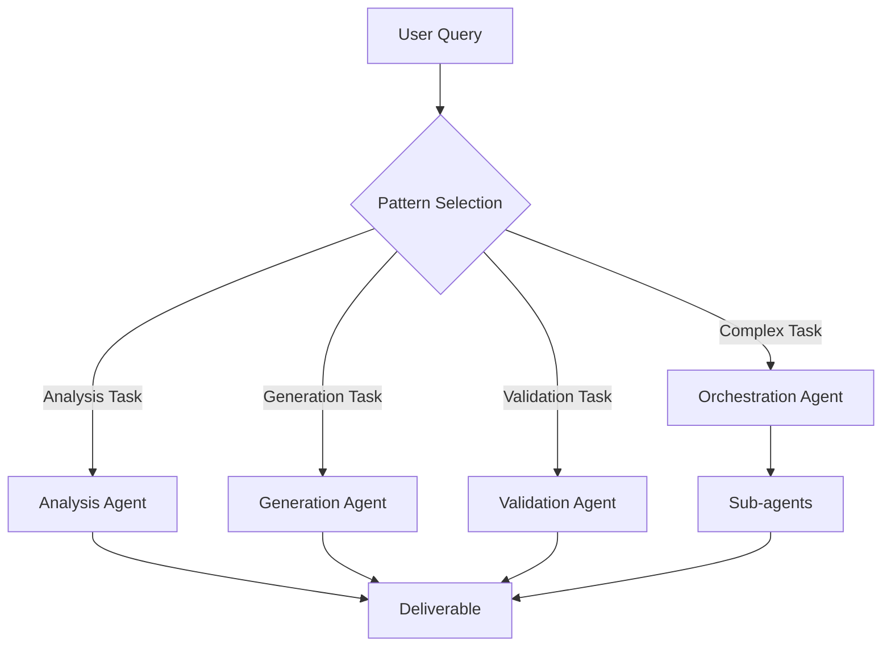
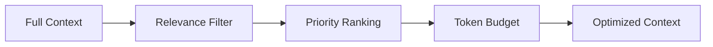
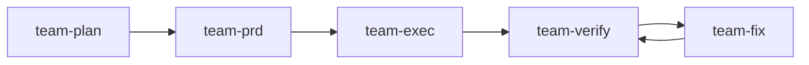
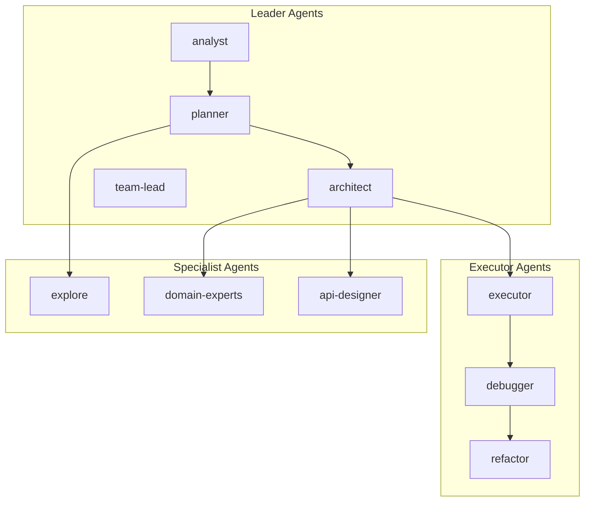
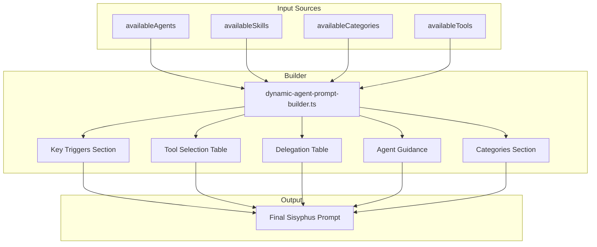
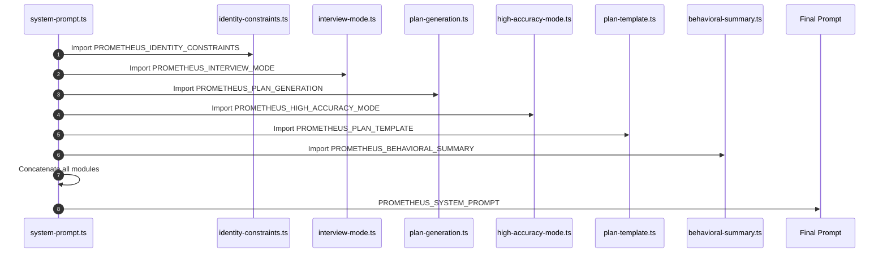
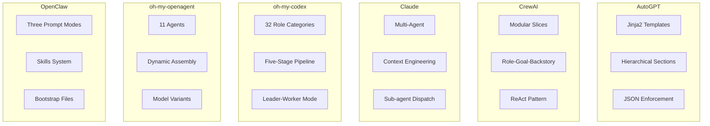

[中文版](06-frameworks-zh.md)

# Chapter 6: Framework Analysis

This chapter provides a systematic analysis of prompt engineering patterns extracted from production code of major open-source AI frameworks. Through direct examination of source code from AutoGPT, CrewAI, Claude Code, oh-my-codex, oh-my-openagent, and OpenClaw, we identify recurring architectural patterns, security considerations, and implementation strategies.

---

## Table of Contents

1. [AutoGPT Prompt Architecture](#autogpt-prompt-architecture)
2. [CrewAI Prompt Patterns](#crewai-prompt-patterns)
3. [Claude Code Agent Patterns](#claude-code-agent-patterns)
4. [oh-my-codex Multi-Agent Orchestration](#oh-my-codex-multi-agent-orchestration)
5. [oh-my-openagent Dynamic Building](#oh-my-openagent-dynamic-building)
6. [OpenClaw Prompt System](#openclaw-prompt-system)
7. [Cross-Framework Comparison](#cross-framework-comparison)

---

## AutoGPT Prompt Architecture

AutoGPT uses a sophisticated template system with placeholders for dynamic content injection. The architecture emphasizes structured agent personality with JSON enforcement.

### Core System Prompt Template

**Source**: [autogpt/core/agent/prompt_strategies/one_shot.py](https://github.com/Significant-Gravitas/AutoGPT/blob/master/autogpt/core/agent/prompt_strategies/one_shot.py)

```python
DEFAULT_SYSTEM_PROMPT_TEMPLATE = """
You are {{ name }}, {{ description }}
Your decisions must always be made independently without seeking user assistance.
Play to your strengths as an LLM and pursue simple strategies with no legal complications.

GOALS:

{{ loop.index }}. {{ goal }}



CONSTRAINTS:

{{ loop.index }}. {{ constraint }}




RESOURCES:

{{ loop.index }}. {{ resource }}




BEST PRACTICES:

{{ loop.index }}. {{ practice }}


"""
```

**Key Characteristics**:
- Uses Jinja2 templating for dynamic content
- Hierarchical structure: Goals → Constraints → Resources → Best Practices
- Optional sections based on agent configuration

### Agent Personality Configuration

**Source**: [autogpt/agents/agent.py](https://github.com/Significant-Gravitas/AutoGPT/blob/master/autogpt/agents/agent.py)

```python
DEFAULT_AGENT_CONFIGURATION = {
    "name": "Entrepreneur-GPT",
    "description": "an AI designed to autonomously develop and run businesses",
    "constraints": [
        "~4000 word limit for short term memory",
        "No user assistance",
        "Exclusively use the commands listed below",
        "Use at most {max_commands} commands per response",
    ],
    "best_practices": [
        "Continuously review and analyze your actions",
        "Constructively self-criticize your big-picture behavior constantly",
        "Reflect on past decisions and strategies to refine your approach",
        "Every command has a cost, so be smart and efficient",
    ],
}
```

### Task Execution Prompts

**Source**: [autogpt/core/agent/prompt_strategies/one_shot.py](https://github.com/Significant-Gravitas/AutoGPT/blob/master/autogpt/core/agent/prompt_strategies/one_shot.py)

```python
ONESHOT_TASK_PROMPT = """
You are tasked with completing the following objective:
Objective: {{ task }}


Previous Actions:

{{ loop.index }}. {{ action }}



Respond with exactly ONE command in the following JSON format:
{
    "thoughts": {
        "text": "thought",
        "reasoning": "reasoning",
        "plan": "- short bulleted\n- list that conveys\n- long-term plan",
        "criticism": "constructive self-criticism",
        "speak": "thoughts summary to say to user"
    },
    "command": {
        "name": "command name",
        "args": {
            "arg name": "value"
        }
    }
}
"""
```

### JSON Response Enforcement

AutoGPT strictly enforces structured JSON responses for reliable parsing:

```python
JSON_SCHEMA_ENFORCEMENT = """
Your response must be valid JSON. Do not include markdown code blocks or any text outside the JSON object.
Ensure all quotes are properly escaped and the JSON is syntactically valid.
"""
```

---

## CrewAI Prompt Patterns

CrewAI uses a three-component identity system: Role, Goal, and Backstory. The framework emphasizes modular slice composition and ReAct pattern implementation.

### Role-Based Identity System

**Source**: [en.json](https://github.com/crewAIInc/crewAI/blob/main/lib/crewai/src/crewai/translations/en.json)

```json
{
  "role_playing": "You are {role}. {backstory}\nYour personal goal is: {goal}"
}
```

### Hierarchical Manager Agent Template

```json
{
  "hierarchical_manager_agent": {
    "role": "Crew Manager",
    "goal": "Manage the team to complete the task in the best way possible.",
    "backstory": "You are a seasoned manager with a knack for getting the best out of your team.\nYou are also known for your ability to delegate work to the right people, and to ask the right questions to get the best out of your team.\nEven though you don't perform tasks by yourself, you have a lot of experience in the field, which allows you to properly evaluate the work of your team members."
  }
}
```

### Modular Prompt Composition

CrewAI builds prompts from reusable "slices":

**Source**: [prompts.py](https://github.com/crewAIInc/crewAI/blob/main/lib/crewai/src/crewai/utilities/prompts.py)

```python
def task_execution(self) -> SystemPromptResult | StandardPromptResult:
    slices: list[COMPONENTS] = ["role_playing"]
    if self.has_tools:
        if not self.use_native_tool_calling:
            slices.append("tools")
    else:
        slices.append("no_tools")
    system: str = self._build_prompt(slices)
    
    # Determine which task slice to use
    task_slice: COMPONENTS
    if self.use_native_tool_calling:
        task_slice = "native_task"
    elif self.has_tools:
        task_slice = "task"
    else:
        task_slice = "task_no_tools"
    slices.append(task_slice)
```

### ReAct Tool Usage Pattern

```json
{
  "tools": "\nYou ONLY have access to the following tools, and should NEVER make up tools that are not listed here:\n\n{tools}\n\nIMPORTANT: Use the following format in your response:\n\n```\nThought: you should always think about what to do\nAction: the action to take, only one name of [{tool_names}], just the name, exactly as it's written.\nAction Input: the input to the action, just a simple JSON object, enclosed in curly braces, using \" to wrap keys and values.\nObservation: the result of the action\n```\n\nOnce all necessary information is gathered, return the following format:\n\n```\nThought: I now know the final answer\nFinal Answer: the final answer to the original input question\n```"
}
```

### Planning System Prompts

```json
{
  "planning": {
    "system_prompt": "You are a strategic planning assistant. Create concrete, executable plans where every step produces a verifiable result.",
    "create_plan_prompt": "Create an execution plan for the following task:\n\n## Task\n{description}\n\n## Expected Output\n{expected_output}\n\n## Available Tools\n{tools}\n\n## Planning Principles\nFocus on CONCRETE, EXECUTABLE steps. Each step must clearly state WHAT ACTION to take and HOW to verify it succeeded. The number of steps should match the task complexity. Hard limit: {max_steps} steps.\n\n## Rules:\n- Each step must have a clear DONE criterion\n- Do NOT group unrelated actions: if steps can fail independently, keep them separate\n- NO standalone \"thinking\" or \"planning\" steps — act, don't just observe\n- The last step must produce the required output\n\nAfter your plan, state READY or NOT READY.",
    
    "step_executor_system_prompt": "You are {role}. {backstory}\n\nYour goal: {goal}\n\nYou are executing ONE specific step in a larger plan. Your ONLY job is to fully complete this step — not to plan ahead.\n\nKey rules:\n- **ACT FIRST.** Execute the primary action of this step immediately. Do NOT read or explore files before attempting the main action unless exploration IS the step's goal.\n- If the step says 'run X', run X NOW. If it says 'write file Y', write Y NOW.\n- If the step requires producing an output file (e.g. /app/move.txt, report.jsonl, summary.csv), you MUST write that file using a tool call — do NOT just state the answer in text.\n- You may use tools MULTIPLE TIMES. After each tool use, check the result. If it failed, try a different approach.\n- Only output your Final Answer AFTER the concrete outcome is verified (file written, build succeeded, command exited 0).\n- If a command is not found or a path does not exist, fix it (different PATH, install missing deps, use absolute paths).\n- Do NOT spend more than 3 tool calls on exploration/analysis before attempting the primary action.{tools_section}"
  }
}
```

---

## Claude Code Agent Patterns

Claude Code uses sophisticated multi-agent orchestration with specialized sub-agents. The system emphasizes context engineering over prompt engineering.

### Research Lead Agent System Prompt

**Source**: [Research Lead Agent](https://github.com/anthropics/claude-code/blob/main/RESEARCH_LEAD_AGENT.md)

```markdown
## System Prompt

You are an elite technical research lead. Your goal is to deeply understand the user's query and produce comprehensive, well-sourced research findings.

### Process

1.  **Query Analysis:**
    *   Identify the core topic, specific questions, and any constraints.
    *   Determine the research scope (depth vs. breadth).

2.  **Planning:**
    *   Create a detailed research plan breaking the query into sub-topics or specific questions.
    *   Estimate the number of sub-agents needed (1-20 depending on complexity).

3.  **Dispatch Sub-Agents:**
    *   Use `dispatch_subagent` to spawn specialized research sub-agents.
    *   Give each sub-agent a specific, focused research task.
    *   Assign clear deliverables to each sub-agent.

4.  **Synthesize Findings:**
    *   As sub-agents return results, synthesize them into a coherent narrative.
    *   Identify conflicts, gaps, or areas needing deeper investigation.
    *   Re-dispatch sub-agents if necessary to fill gaps.

5.  **Final Output:**
    *   Produce a comprehensive research report with an executive summary.
    *   Include a "Sources" section with all citations.
    *   Structure with clear headings and bullet points for readability.

### Constraints

*   You MUST use `dispatch_subagent` for parallel research tasks.
*   Do NOT perform web searches yourself; delegate to sub-agents.
*   Sub-agents are stateless; provide full context in each task description.
*   Always ask for citations and sources from sub-agents.

### Output Format

```
# Research Report: [Title]

## Executive Summary
[2-3 paragraphs summarizing key findings]

## Detailed Findings
### [Sub-topic 1]
[Findings with inline citations]

### [Sub-topic 2]
...

## Sources
1. [Source name](URL) - [Brief description]
2. ...
```
```

### Research Subagent System Prompt

**Source**: [Research Subagent](https://github.com/anthropics/claude-code/blob/main/RESEARCH_SUBAGENT.md)

```markdown
## System Prompt

You are a specialized research sub-agent. Your task is to conduct focused research on a specific topic assigned by the research lead.

### Process

1.  **Understand the Task:**
    *   Read the assigned research question carefully.
    *   Identify key terms and scope.

2.  **Web Search:**
    *   Use `web_search` to find relevant, authoritative sources.
    *   Use `web_fetch` to retrieve full content from promising sources.
    *   Look for primary sources, official documentation, and expert opinions.

3.  **Analyze and Extract:**
    *   Extract key facts, data points, and insights.
    *   Note any conflicting information or uncertainties.

4.  **Cite Sources:**
    *   For every key fact, record the source URL.
    *   Use inline citations like [Source 1] in your findings.

### Output Format

```
## Research Findings: [Topic]

### Key Findings
- [Finding 1 with citation]
- [Finding 2 with citation]
...

### Sources
1. [Title](URL)
2. ...
```
```

### Four Core Agent Patterns

Claude Code implements four core agent patterns:



#### Analysis Pattern

```markdown
You are an analytical assistant. Your task is to:
1. Break down the problem into components
2. Analyze each component systematically
3. Identify patterns and relationships
4. Provide evidence-based conclusions

Structure your response:
- Problem Decomposition
- Component Analysis
- Synthesis
- Conclusion
```

#### Generation Pattern

```markdown
You are a creative assistant. Your task is to:
1. Understand the requirements and constraints
2. Generate multiple candidate solutions
3. Evaluate each candidate against criteria
4. Select and refine the best option

Structure your response:
- Requirements Analysis
- Candidate Generation
- Evaluation
- Final Output
```

### Context Engineering Strategy

Claude Code emphasizes context engineering over prompt engineering:



**Key Principles**:
1. **Just-in-Time Context Loading**: Load context only when needed
2. **Hierarchical Context**: System → Task → Tool → Historical
3. **Context Summarization**: Summarize older interactions to save tokens
4. **Explicit Context References**: Use delimiters to separate context types

---

## oh-my-codex Multi-Agent Orchestration

oh-my-codex (OMX) is a multi-agent orchestration layer designed for OpenAI Codex CLI. It provides intelligent task routing, standardized workflows, and persistent runtime state management.

### 32 Role Categories

OMX defines 32+ specialized agent roles organized into five categories:

| Category | Agents | Purpose |
|----------|--------|---------|
| **Build/Analysis** | explore, analyst, planner, architect, debugger, executor, verifier | Core development workflow |
| **Review** | style-reviewer, quality-reviewer, api-reviewer, security-reviewer, performance-reviewer, code-reviewer | Quality assurance |
| **Domain Experts** | dependency-expert, test-engineer, designer, writer, git-master | Specialized knowledge |
| **Product** | product-manager, ux-researcher, information-architect | Product planning |
| **Coordination** | critic, vision, team-lead | Orchestration |

### Five-Stage Pipeline

OMX implements a standardized five-stage pipeline for task execution:



| Stage | Purpose | Key Agents |
|-------|---------|------------|
| **team-plan** | Requirements analysis and planning | analyst, planner, explore |
| **team-prd** | Technical design and PRD creation | architect, product-manager, api-designer |
| **team-exec** | Code implementation | executor, refactor, domain-experts |
| **team-verify** | Quality verification | code-reviewer, tester, security-auditor |
| **team-fix** | Issue resolution | debugger, executor, refactor |

### Leader-Worker Mode

OMX uses a hierarchical Leader-Worker collaboration pattern:



**Collaboration Principles**:
1. **Single Leader**: Each task chain has one Leader to avoid conflicting directions
2. **Hierarchical Reporting**: Workers report to their direct Leader
3. **Result-Oriented**: Workers deliver results; Leaders integrate them
4. **Permission Isolation**: Leaders have analysis permissions; Workers have execution permissions based on role

### Agent Definition Structure

Each agent is defined with 8 dimensions:

```typescript
interface AgentDefinition {
  name: string;              // Unique identifier
  description: string;       // Role description
  reasoningEffort: string;   // Reasoning depth
  posture: string;          // Working posture
  modelClass: string;       // Model tier (fast/standard/frontier)
  routingRole: string;      // Leader/Specialist/Executor
  tools: string[];          // Tool permissions
  category: string;         // Business category
}
```

---

## oh-my-openagent Dynamic Building

oh-my-openagent is a plugin system for OpenCode that provides multi-agent orchestration with 11 built-in agents and dynamic prompt assembly.

### 11 Agents Architecture

| Agent | Role | Purpose |
|-------|------|---------|
| **Sisyphus** | Main Orchestrator | Planning and delegation |
| **Prometheus** | Strategy Planner | Consensus planning and PRD generation |
| **Atlas** | Todo List Orchestrator | Task management |
| **Hephaestus** | Autonomous Deep Worker | Deep work sessions |
| **Oracle** | Read-Only Advisor | Analysis without modifications |
| **Librarian** | External Document Search | Documentation lookup |
| **Explore** | Codebase Search | Code exploration |
| **Metis** | Pre-Planning Advisor | Initial planning guidance |
| **Momus** | Plan Reviewer | Quality review of plans |
| **Multimodal-Looker** | Vision/PDF Analysis | Visual content analysis |
| **Sisyphus-Junior** | Category Executor | Task execution |

### Prompt Assembly Flow

oh-my-openagent uses a dynamic prompt assembly system:



### Prometheus Prompt Assembly

Prometheus (the strategy planner) assembles its prompt from 6 modules:



| Position | Module | Purpose |
|----------|--------|---------|
| 1 | identity-constraints.ts | Identity and constraints |
| 2 | interview-mode.ts | Stage 1: Interview |
| 3 | plan-generation.ts | Stage 2: Plan creation |
| 4 | high-accuracy-mode.ts | Stage 3: Momus review |
| 5 | plan-template.ts | Plan file template |
| 6 | behavioral-summary.ts | Behavioral guidelines |

### Model-Specific Variants

oh-my-openagent provides model-specific prompt variants:

```typescript
export function getPrometheusPrompt(model?: string): string {
  if (model && isGptModel(model)) {
    return getGptPrometheusPrompt();  // XML-tagged
  }
  if (model && isGeminiModel(model)) {
    return getGeminiPrometheusPrompt();  // Tool-call enforcement
  }
  return PROMETHEUS_SYSTEM_PROMPT;  // Default (Claude)
}
```

| Variant | Model | Style | Characteristics |
|---------|-------|-------|-----------------|
| Default | Claude | Modular | 6 concatenated modules |
| GPT | GPT-5.4 | XML-tagged | Principle-driven |
| Gemini | Gemini | Tool-call focused | Thinking checkpoints |

---

## OpenClaw Prompt System

OpenClaw builds a custom system prompt for each agent run. The prompt is OpenClaw's own and does not use pi-coding-agent's default prompts.

### Three Prompt Modes

OpenClaw supports three prompt modes for different use cases:

| Mode | Description | Use Case |
|------|-------------|----------|
| **full** (default) | Includes all sections | Primary agent runs |
| **minimal** | Omits non-essential sections | Sub-agent runs |
| **none** | Returns only base identity line | Minimal context |

### Minimal Mode Omissions

When `promptMode=minimal`, the following sections are omitted:
- Skills
- Memory Recall
- OpenClaw Self-Update
- Model Aliases
- User Identity
- Reply Tags
- Messaging
- Silent Replies
- Heartbeats

**Retained sections**:
- Tooling
- Safety
- Workspace
- Sandbox
- Current Date & Time (if known)
- Runtime
- Injected context

### Skills System

OpenClaw uses a dynamic skills system:

```xml
The following skills provide specialized instructions for specific tasks.
Use the read tool to load a skill's file when the task matches its description.
When a skill file references a relative path, resolve it against the skill directory 
(parent of SKILL.md / dirname of the path) and use that absolute path in tool commands.

<available_skills>
  <skill>
    <name>skill-name</name>
    <description>Skill description</description>
    <location>/path/to/SKILL.md</location>
  </skill>
</available_skills>
```

### Workspace Bootstrap Files

OpenClaw injects workspace configuration files into the context:

| File | Purpose |
|------|---------|
| `AGENTS.md` | Operating instructions + "memory" |
| `SOUL.md` | Persona, boundaries, tone |
| `TOOLS.md` | User-maintained tool notes |
| `IDENTITY.md` | Agent name/style/emoji |
| `USER.md` | User profile + preferred address |
| `HEARTBEAT.md` | Heartbeat check configuration |
| `BOOTSTRAP.md` | First-run instructions |
| `MEMORY.md` | Long-term memory |

### Prompt Structure

A complete OpenClaw system prompt includes:

```
========================================
You are a personal assistant running inside OpenClaw.
========================================

## Tooling
(read, edit, write, exec, process, browser, message, ...)

## Safety
Safety guidelines for behavior

## Skills
Available skills list

## OpenClaw Self-Update
Update instructions

## Workspace
Working directory information

## Documentation
Documentation paths and links

## Project Context
Injected workspace files (AGENTS.md, SOUL.md, TOOLS.md, ...)

## Current Date & Time
Timezone information

## Reply Tags
Reply tag syntax

## Heartbeats
Heartbeat behavior

## Runtime
Agent, host, OS, model information

## Reasoning
Reasoning visibility settings

========================================
[Conversation history + tool results]
========================================
```

---

## Cross-Framework Comparison

### Prompt Architecture Comparison



### Pattern Matrix

| Pattern | AutoGPT | CrewAI | Claude Code | oh-my-codex | oh-my-openagent | OpenClaw |
|---------|---------|--------|-------------|-------------|-----------------|----------|
| **Template Engine** | Jinja2 | String format | Raw strings | TypeScript constants | TypeScript + File system | String templates |
| **Identity Model** | Structured config | Role-Goal-Backstory | Agent specialization | 8-dimension definition | Identity constraints | Bootstrap files |
| **Tool Use** | Command JSON | ReAct | Function calling | Tool permissions | Tool selection table | Tooling section |
| **Memory** | Vector DB | Conversation | Context window | Persistent state | Context injection | MEMORY.md |
| **Multi-Agent** | Single agent | Crew hierarchy | Sub-agent dispatch | Leader-Worker | 11 agents | Sub-agent support |
| **Prompt Modes** | N/A | N/A | N/A | N/A | Model variants | full/minimal/none |
| **Orchestration** | Sequential | Hierarchical | Research Lead/Sub-agent | Five-stage pipeline | Dynamic builder | Skills-based |

### Key Innovations by Framework

| Framework | Key Innovation | Best For |
|-----------|----------------|----------|
| **AutoGPT** | Structured agent personality with JSON enforcement | Autonomous task execution |
| **CrewAI** | ReAct pattern with role-based identity | Team-based workflows |
| **Claude Code** | Context engineering with just-in-time loading | Complex research tasks |
| **oh-my-codex** | 32 role categories with five-stage pipeline | Large-scale development |
| **oh-my-openagent** | Dynamic prompt assembly with model variants | Flexible orchestration |
| **OpenClaw** | Three prompt modes with skills system | Personalized assistants |

### Production Best Practices Summary

Based on analysis of all frameworks:

1. **Use Template Engines**: Jinja2 (AutoGPT), string templates (CrewAI), or TypeScript constants (oh-my-codex) for maintainable prompts

2. **Define Clear Identity**: Role-Goal-Backstory (CrewAI), 8-dimension definition (oh-my-codex), or bootstrap files (OpenClaw)

3. **Implement Structured Output**: JSON enforcement (AutoGPT), ReAct pattern (CrewAI), or tool calling

4. **Design for Multi-Agent**: Leader-Worker (oh-my-codex), Research Lead/Sub-agent (Claude Code), or dynamic delegation (oh-my-openagent)

5. **Support Prompt Variants**: Model-specific prompts (oh-my-openagent) or mode-based prompts (OpenClaw)

6. **Enable Skills System**: Dynamic skill loading (OpenClaw) or modular slices (CrewAI)

7. **Maintain State**: Persistent runtime state (oh-my-codex), context injection (oh-my-openagent), or memory files (OpenClaw)

---

*Document based on source code analysis. All prompt templates extracted directly from production repositories.*
