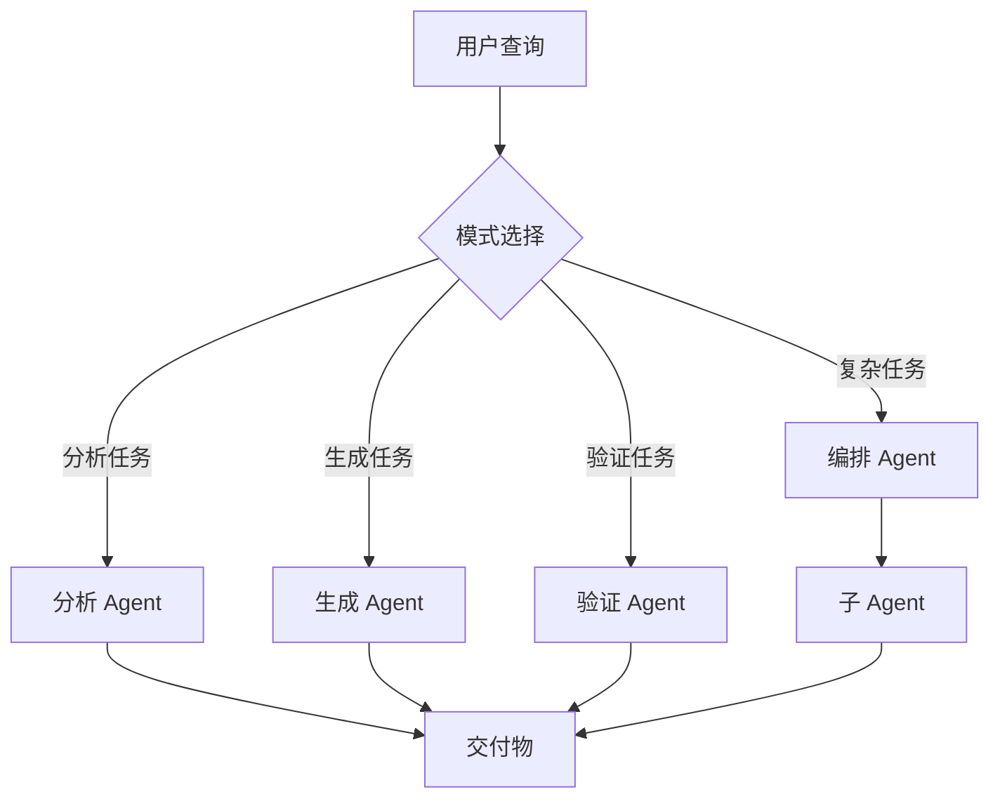
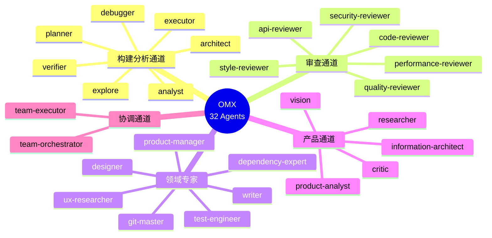
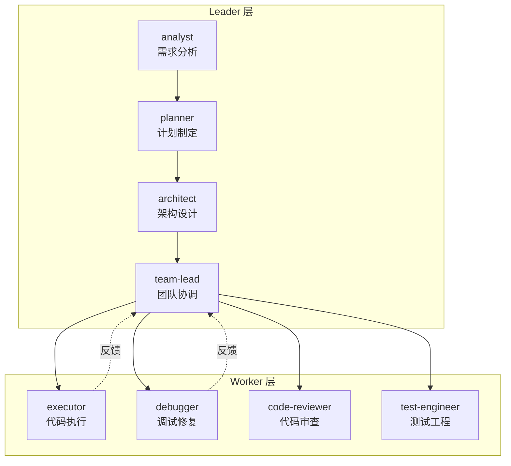
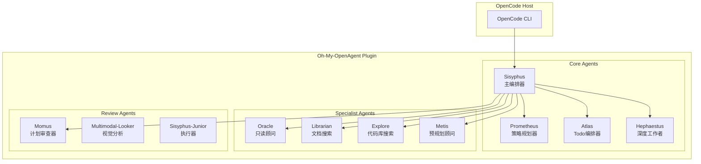
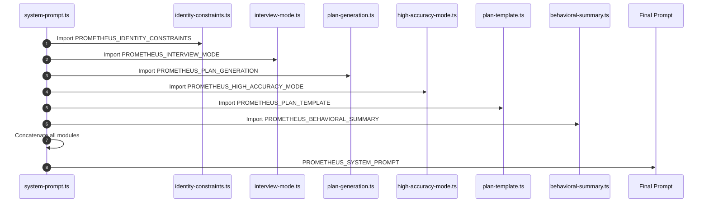
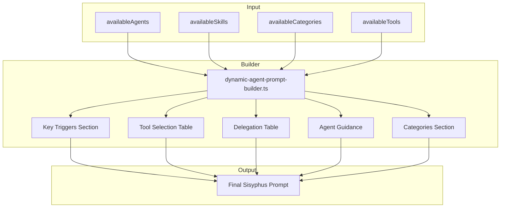
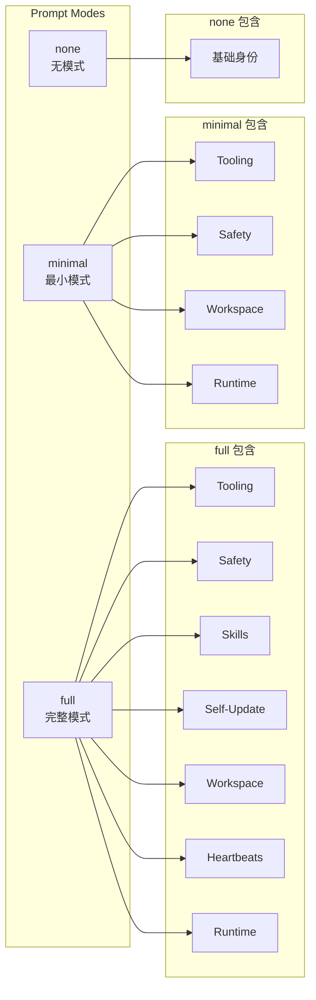
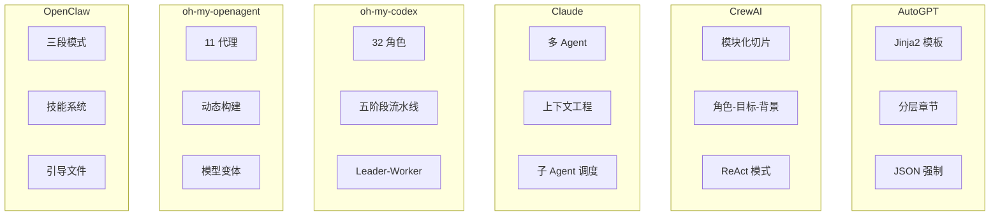

[English Version](06-frameworks-en.md)

# 第 6 章：开源框架分析

本章深入分析主流开源 AI 框架的 Prompt 工程模式，包括 AutoGPT、CrewAI、Claude Code、oh-my-codex、oh-my-openagent 和 OpenClaw。通过检视这些框架的源代码，我们可以识别出重复出现的架构模式、设计策略和实现技巧。

---

## 目录

1. [AutoGPT 提示架构](#autogpt-提示架构)
2. [CrewAI 提示模式](#crewai-提示模式)
3. [Claude Code Agent 模式](#claude-code-agent-模式)
4. [oh-my-codex 多代理编排](#oh-my-codex-多代理编排)
5. [oh-my-openagent 动态构建](#oh-my-openagent-动态构建)
6. [OpenClaw 提示系统](#openclaw-提示系统)
7. [跨框架对比矩阵](#跨框架对比矩阵)

---

## AutoGPT 提示架构

AutoGPT 使用复杂的模板系统，通过占位符实现动态内容注入，并严格强制结构化 JSON 响应。

### Jinja2 模板系统

AutoGPT 采用 Jinja2 作为模板引擎，实现动态 Prompt 渲染：

```python
DEFAULT_SYSTEM_PROMPT_TEMPLATE = """
You are {{ name }}, {{ description }}
Your decisions must always be made independently without seeking user assistance.
Play to your strengths as an LLM and pursue simple strategies with no legal complications.

GOALS:

{{ loop.index }}. {{ goal }}



CONSTRAINTS:

{{ loop.index }}. {{ constraint }}




RESOURCES:

{{ loop.index }}. {{ resource }}




BEST PRACTICES:

{{ loop.index }}. {{ practice }}


"""
```

**关键特性**：
- 使用 Jinja2 模板进行动态内容渲染
- 层次结构：目标 → 约束 → 资源 → 最佳实践
- 根据 Agent 配置可选的章节

### Agent 个性配置

AutoGPT 通过结构化配置定义 Agent 的个性：

```python
DEFAULT_AGENT_CONFIGURATION = {
    "name": "Entrepreneur-GPT",
    "description": "an AI designed to autonomously develop and run businesses",
    "constraints": [
        "~4000 word limit for short term memory",
        "No user assistance",
        "Exclusively use the commands listed below",
        "Use at most {max_commands} commands per response",
    ],
    "best_practices": [
        "Continuously review and analyze your actions",
        "Constructively self-criticize your big-picture behavior constantly",
        "Reflect on past decisions and strategies to refine your approach",
        "Every command has a cost, so be smart and efficient",
    ],
}
```

### JSON 响应强制

AutoGPT 严格强制结构化 JSON 响应以确保可靠解析：

```python
ONESHOT_TASK_PROMPT = """
You are tasked with completing the following objective:
Objective: {{ task }}


Previous Actions:

{{ loop.index }}. {{ action }}



Respond with exactly ONE command in the following JSON format:
{
    "thoughts": {
        "text": "thought",
        "reasoning": "reasoning",
        "plan": "- short bulleted\n- list that conveys\n- long-term plan",
        "criticism": "constructive self-criticism",
        "speak": "thoughts summary to say to user"
    },
    "command": {
        "name": "command name",
        "args": {
            "arg name": "value"
        }
    }
}
"""
```

**JSON 强制规则**：
```python
JSON_SCHEMA_ENFORCEMENT = """
Your response must be valid JSON. Do not include markdown code blocks or any text outside the JSON object.
Ensure all quotes are properly escaped and the JSON is syntactically valid.
"""
```

---

## CrewAI 提示模式

CrewAI 使用三组件身份系统和模块化切片组合，实现灵活的 Prompt 构建。

### 角色-目标-背景故事模式

CrewAI 的核心身份模板：

```json
{
  "role_playing": "You are {role}. {backstory}\nYour personal goal is: {goal}"
}
```

**层级管理 Agent 模板**：

```json
{
  "hierarchical_manager_agent": {
    "role": "Crew Manager",
    "goal": "Manage the team to complete the task in the best way possible.",
    "backstory": "You are a seasoned manager with a knack for getting the best out of your team.\nYou are also known for your ability to delegate work to the right people, and to ask the right questions to get the best out of your team.\nEven though you don't perform tasks by yourself, you have a lot of experience in the field, which allows you to properly evaluate the work of your team members."
  }
}
```

### 模块化 Prompt 切片

CrewAI 使用可复用的"切片"构建 Prompt：

```python
def task_execution(self) -> SystemPromptResult | StandardPromptResult:
    slices: list[COMPONENTS] = ["role_playing"]
    if self.has_tools:
        if not self.use_native_tool_calling:
            slices.append("tools")
    else:
        slices.append("no_tools")
    system: str = self._build_prompt(slices)
    
    # 确定使用哪个任务切片
    task_slice: COMPONENTS
    if self.use_native_tool_calling:
        task_slice = "native_task"
    elif self.has_tools:
        task_slice = "task"
    else:
        task_slice = "task_no_tools"
    slices.append(task_slice)
```

### ReAct 工具使用模式

CrewAI 实现了经典的 ReAct（Reasoning + Acting）模式：

```json
{
  "tools": "\nYou ONLY have access to the following tools, and should NEVER make up tools that are not listed here:\n\n{tools}\n\nIMPORTANT: Use the following format in your response:\n\n```\nThought: you should always think about what to do\nAction: the action to take, only one name of [{tool_names}], just the name, exactly as it's written.\nAction Input: the input to the action, just a simple JSON object, enclosed in curly braces, using \" to wrap keys and values.\nObservation: the result of the action\n```\n\nOnce all necessary information is gathered, return the following format:\n\n```\nThought: I now know the final answer\nFinal Answer: the final answer to the original input question\n```"
}
```

### 规划系统 Prompt

CrewAI 的规划系统强调具体可执行的步骤：

```json
{
  "planning": {
    "system_prompt": "You are a strategic planning assistant. Create concrete, executable plans where every step produces a verifiable result.",
    "create_plan_prompt": "Create an execution plan for the following task:\n\n## Task\n{description}\n\n## Expected Output\n{expected_output}\n\n## Available Tools\n{tools}\n\n## Planning Principles\nFocus on CONCRETE, EXECUTABLE steps. Each step must clearly state WHAT ACTION to take and HOW to verify it succeeded. The number of steps should match the task complexity. Hard limit: {max_steps} steps.\n\n## Rules:\n- Each step must have a clear DONE criterion\n- Do NOT group unrelated actions: if steps can fail independently, keep them separate\n- NO standalone \"thinking\" or \"planning\" steps — act, don't just observe\n- The last step must produce the required output\n\nAfter your plan, state READY or NOT READY.",
    
    "step_executor_system_prompt": "You are {role}. {backstory}\n\nYour goal: {goal}\n\nYou are executing ONE specific step in a larger plan. Your ONLY job is to fully complete this step — not to plan ahead.\n\nKey rules:\n- **ACT FIRST.** Execute the primary action of this step immediately. Do NOT read or explore files before attempting the main action unless exploration IS the step's goal.\n- If the step says 'run X', run X NOW. If it says 'write file Y', write Y NOW.\n- If the step requires producing an output file (e.g. /app/move.txt, report.jsonl, summary.csv), you MUST write that file using a tool call — do NOT just state the answer in text.\n- You may use tools MULTIPLE TIMES. After each tool use, check the result. If it failed, try a different approach.\n- Only output your Final Answer AFTER the concrete outcome is verified (file written, build succeeded, command exited 0).\n- If a command is not found or a path does not exist, fix it (different PATH, install missing deps, use absolute paths).\n- Do NOT spend more than 3 tool calls on exploration/analysis before attempting the primary action.{tools_section}"
  }
}
```

---

## Claude Code Agent 模式

Claude Code 使用复杂的多 Agent 编排，包含专门的子 Agent 和四种核心模式。

### 研究主管 Agent 系统 Prompt

```markdown
## System Prompt

You are an elite technical research lead. Your goal is to deeply understand the user's query and produce comprehensive, well-sourced research findings.

### Process

1.  **Query Analysis:**
    *   Identify the core topic, specific questions, and any constraints.
    *   Determine the research scope (depth vs. breadth).

2.  **Planning:**
    *   Create a detailed research plan breaking the query into sub-topics or specific questions.
    *   Estimate the number of sub-agents needed (1-20 depending on complexity).

3.  **Dispatch Sub-Agents:**
    *   Use `dispatch_subagent` to spawn specialized research sub-agents.
    *   Give each sub-agent a specific, focused research task.
    *   Assign clear deliverables to each sub-agent.

4.  **Synthesize Findings:**
    *   As sub-agents return results, synthesize them into a coherent narrative.
    *   Identify conflicts, gaps, or areas needing deeper investigation.
    *   Re-dispatch sub-agents if necessary to fill gaps.

5.  **Final Output:**
    *   Produce a comprehensive research report with an executive summary.
    *   Include a "Sources" section with all citations.
    *   Structure with clear headings and bullet points for readability.

### Constraints

*   You MUST use `dispatch_subagent` for parallel research tasks.
*   Do NOT perform web searches yourself; delegate to sub-agents.
*   Sub-agents are stateless; provide full context in each task description.
*   Always ask for citations and sources from sub-agents.
```

### 四种核心 Agent 模式

Claude Code 实现四种核心 Agent 模式：



**分析模式**：
```markdown
You are an analytical assistant. Your task is to:
1. Break down the problem into components
2. Analyze each component systematically
3. Identify patterns and relationships
4. Provide evidence-based conclusions

Structure your response:
- Problem Decomposition
- Component Analysis
- Synthesis
- Conclusion
```

**生成模式**：
```markdown
You are a creative assistant. Your task is to:
1. Understand the requirements and constraints
2. Generate multiple candidate solutions
3. Evaluate each candidate against criteria
4. Select and refine the best option

Structure your response:
- Requirements Analysis
- Candidate Generation
- Evaluation
- Final Output
```

### 极端的简洁性要求

Claude Code 对输出长度有严格限制：

```markdown
# Tone and style
You should be concise, direct, and to the point.
You MUST answer concisely with fewer than 4 lines (not including tool use or code generation), unless user asks for detail.
IMPORTANT: You should minimize output tokens as much as possible while maintaining helpfulness, quality, and accuracy.
```

### 强制性的任务管理

```markdown
# Task Management
You have access to the TodoWrite tools to help you manage and plan tasks. Use these tools VERY frequently to ensure that you are tracking your tasks and giving the user visibility into your progress.
These tools are also EXTREMELY helpful for planning tasks, and for breaking down larger complex tasks into smaller steps. If you do not use this tool when planning, you may forget to do important tasks - and that is unacceptable.

It is critical that you mark todos as completed as soon as you are done with a task. Do not batch up multiple tasks before marking them as completed.
```

---

## oh-my-codex 多代理编排

oh-my-codex（OMX）是一个面向 OpenAI Codex CLI 的多代理编排框架，包含 32 个专业 Agent 和五阶段流水线。

### 32 角色分类体系

OMX 的 Agent 分为五大类别：



### 五阶段流水线

OMX 采用五阶段流水线确保质量：

```
plan → prd → exec → verify → fix
```

**流水线阶段说明**：

| 阶段 | 名称 | 职责 | 关键 Agent |
|------|------|------|-----------|
| 1 | team-plan | 需求分析和计划制定 | analyst, planner |
| 2 | team-prd | 产品需求和技术设计 | architect, product-manager |
| 3 | team-exec | 代码实现和功能开发 | executor, debugger |
| 4 | team-verify | 质量验证和代码审查 | code-reviewer, security-reviewer |
| 5 | team-fix | 问题修复和优化 | debugger, executor |

### Leader-Worker 模式

OMX 采用层级化的协作结构：



**模式特点**：
- 单一 Leader 负责决策
- 多个 Worker 并行执行
- 逐级汇报，结果聚合

### AgentDefinition 接口

标准化的 Agent 定义包含 8 个维度：

```typescript
interface AgentDefinition {
  name: string;              // 唯一标识
  description: string;       // 职责描述
  reasoningEffort: string;   // 推理深度
  posture: string;           // 工作姿态
  modelClass: string;        // 模型等级
  routingRole: string;       // 路由角色
  tools: string[];           // 工具权限
  category: string;          // 业务分类
}
```

### 典型工作流示例

**场景 1：新功能开发**
```
analyst → planner → architect → executor → code-reviewer
```

**场景 2：Bug 修复**
```
debugger → explore → executor → tester
```

**场景 3：代码重构**
```
explore → architect → refactor → code-reviewer
```

---

## oh-my-openagent 动态构建

oh-my-openagent 是一个多代理编排系统，包含 11 个内置代理和动态提示构建机制。

### 11 代理架构



### 提示词组装流程

Prometheus 的提示词由 6 个模块拼接而成：



**组装顺序**：

| 位置 | 模块 | 用途 |
|------|------|------|
| 1 | identity-constraints.ts | 身份与约束 |
| 2 | interview-mode.ts | 阶段 1：访谈 |
| 3 | plan-generation.ts | 阶段 2：计划创建 |
| 4 | high-accuracy-mode.ts | 阶段 3：Momus 审查 |
| 5 | plan-template.ts | 计划文件模板 |
| 6 | behavioral-summary.ts | 行为准则 |

### Sisyphus 动态构建器

Sisyphus 使用动态构建器根据可用代理和技能生成提示词：



### 模型特定变体

oh-my-openagent 为不同模型提供特定变体：

```typescript
export function getPrometheusPrompt(model?: string): string {
  if (model && isGptModel(model)) {
    return getGptPrometheusPrompt();  // XML-tagged
  }
  if (model && isGeminiModel(model)) {
    return getGeminiPrometheusPrompt();  // Tool-call enforcement
  }
  return PROMETHEUS_SYSTEM_PROMPT;  // Default (Claude)
}
```

**变体对比**：

| 变体 | 模型 | 风格 | 特性 |
|------|------|------|------|
| Default | Claude | 模块化 | 6 个拼接模块 |
| GPT | GPT-5.4 | XML 标签 | 原则驱动 |
| Gemini | Gemini | 工具调用聚焦 | 思考检查点 |

---

## OpenClaw 提示系统

OpenClaw 为每次代理运行构建自定义系统提示词，采用三段模式和技能系统。

### 三段 Prompt 模式

OpenClaw 支持三种提示词模式：



**模式说明**：

| 模式 | 用途 | 特点 |
|------|------|------|
| **full** | 默认模式 | 包含所有部分 |
| **minimal** | 子代理 | 省略 Skills、Heartbeats 等 |
| **none** | 特殊场景 | 仅返回基础身份行 |

### 技能系统

OpenClaw 的技能系统允许按需加载专业化指令：

```xml
The following skills provide specialized instructions for specific tasks.
Use the read tool to load a skill's file when the task matches its description.
When a skill file references a relative path, resolve it against the skill directory
(parent of SKILL.md / dirname of the path) and use that absolute path in tool commands.

<available_skills>
  <skill>
    <name>skill-name</name>
    <description>Skill description</description>
    <location>/path/to/SKILL.md</location>
  </skill>
</available_skills>
```

**工作原理**：
- 提示词指示模型使用 `read` 加载列出位置的 `SKILL.md`
- 如果没有符合条件的技能，Skills 部分会被省略
- 这保持了基础提示词的小巧，同时仍能按需使用目标技能

### 工作空间引导文件

OpenClaw 自动注入以下引导文件：

| 文件 | 说明 |
|------|------|
| `AGENTS.md` | 操作说明 + "记忆" |
| `SOUL.md` | 人设、边界、语气 |
| `TOOLS.md` | 用户维护的工具笔记 |
| `IDENTITY.md` | 代理名称/风格/表情 |
| `USER.md` | 用户资料 + 首选称呼 |
| `HEARTBEAT.md` | 心跳检查配置 |
| `BOOTSTRAP.md` | 仅在新工作空间首次运行时注入 |
| `MEMORY.md` | 长期记忆（存在时） |

**AGENTS.md 示例**：
```markdown
# AGENTS.md - Your Workspace

This folder is home. Treat it that way.

## First Run
If BOOTSTRAP.md exists, that's your birth certificate. Follow it, figure out who 
you are, then delete it.

## Every Session
Before doing anything else:
1. Read SOUL.md — this is who you are
2. Read USER.md — this is who you're helping
3. Read RULES.md — user rules and preferences

Don't ask permission. Just do it.
```

### 安全准则

OpenClaw 的安全护栏是建议性的：

```
Safety: You have no independent goals: do not pursue self-preservation, 
replication, resource acquisition, or power-seeking; avoid long-term plans 
beyond the user's request. Prioritize safety and human oversight over completion.
```

**硬执行方式**：
- 工具策略（tool policy）
- 执行批准（exec approvals）
- 沙箱隔离（sandboxing）
- 渠道允许列表（channel allowlists）

---

## 跨框架对比矩阵

### 架构模式对比



### 功能特性对比

| 特性 | AutoGPT | CrewAI | Claude Code | oh-my-codex | oh-my-openagent | OpenClaw |
|------|---------|--------|-------------|-------------|-----------------|----------|
| **模板引擎** | Jinja2 | 字符串格式化 | 原始字符串 | 字符串拼接 | TypeScript 模块 | 字符串拼接 |
| **身份模型** | 结构化配置 | 角色-目标-背景 | Agent 专业化 | 8 维度定义 | 身份约束模块 | 引导文件 |
| **工具使用** | 命令 JSON | ReAct | 函数调用 | 工具权限分级 | 工具选择表 | 工具列表 |
| **多 Agent** | 单 Agent | Crew 层级 | 子 Agent 调度 | 32 角色 | 11 代理 | 子代理支持 |
| **工作流** | 目标驱动 | 任务流水线 | 模式选择 | 五阶段流水线 | 动态构建 | 技能驱动 |
| **记忆系统** | 向量数据库 | 对话记忆 | 上下文窗口 | 状态持久化 | 上下文管理 | 引导文件 |
| **响应格式** | JSON 强制 | ReAct 格式 | 简洁文本 | 结构化输出 | 结构化输出 | 自由格式 |

### Prompt 设计哲学对比

| 框架 | 核心哲学 | 设计重点 |
|------|----------|----------|
| **AutoGPT** | 自主执行 | 结构化输出，严格 JSON |
| **CrewAI** | 团队协作 | 角色定义，ReAct 推理 |
| **Claude Code** | 简洁高效 | 极端简洁，强制任务管理 |
| **oh-my-codex** | 专业分工 | 32 角色，流水线质量 |
| **oh-my-openagent** | 动态适应 | 模型变体，动态构建 |
| **OpenClaw** | 个性化 | 引导文件，技能系统 |

### 适用场景对比

| 框架 | 最佳适用场景 | 不适用场景 |
|------|-------------|-----------|
| **AutoGPT** | 自主任务执行，目标驱动 | 需要严格控制的场景 |
| **CrewAI** | 多 Agent 协作，复杂工作流 | 简单单任务场景 |
| **Claude Code** | 软件工程，代码编辑 | 非技术任务 |
| **oh-my-codex** | 大型项目开发，团队协作 | 小型快速任务 |
| **oh-my-openagent** | 多模型环境，复杂编排 | 简单代理场景 |
| **OpenClaw** | 个性化助手，长期项目 | 标准化企业场景 |

---

## 总结

通过对这六个开源框架的分析，我们可以总结出以下关键洞察：

### 1. 模板化是共识

所有框架都采用了某种形式的模板系统，从 Jinja2 到简单的字符串拼接。模板化使得 Prompt 可以动态适应不同场景。

### 2. 角色定义至关重要

无论是 CrewAI 的三组件模式，还是 oh-my-codex 的 32 角色体系，清晰的角色定义都是多 Agent 系统的基础。

### 3. 结构化输出提升可靠性

AutoGPT 的 JSON 强制、CrewAI 的 ReAct 格式，都体现了对结构化输出的重视，这有助于提高系统的可预测性和可靠性。

### 4. 多 Agent 编排是趋势

从 Claude Code 的子 Agent 调度到 oh-my-codex 的五阶段流水线，多 Agent 协作正在成为复杂任务处理的主流模式。

### 5. 上下文工程比 Prompt 工程更重要

Claude Code 的设计理念表明，精心设计的上下文管理往往比复杂的 Prompt 技巧更有效。

### 6. 安全护栏不可或缺

所有框架都包含某种形式的安全约束，从建议性的安全准则到硬性的工具策略，安全设计是生产环境的必备要素。

---

*本章内容基于 2025 年各框架源代码分析整理*
