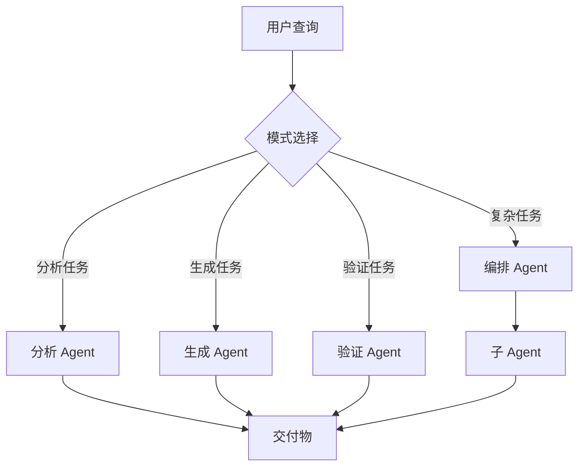
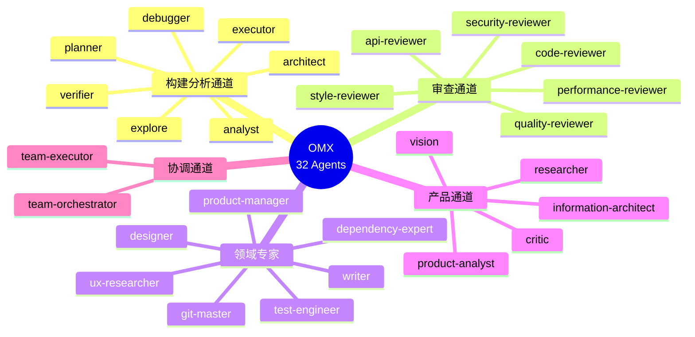
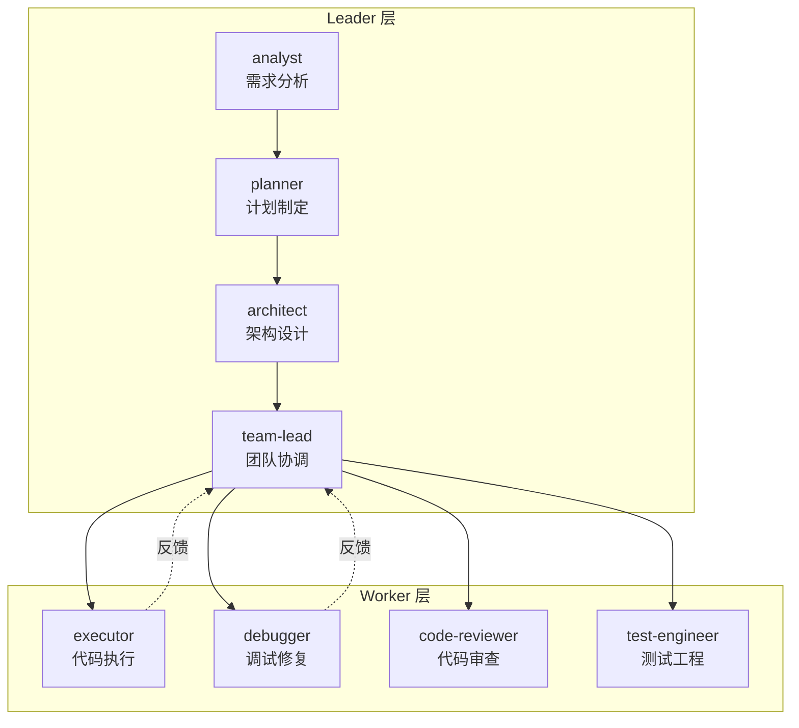
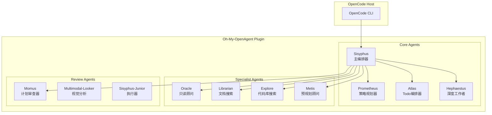
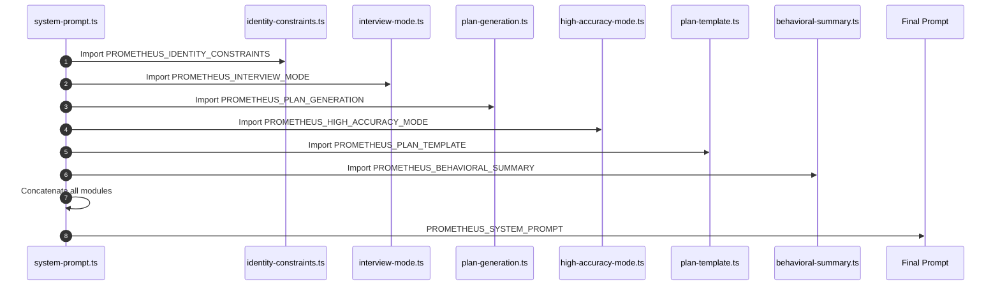
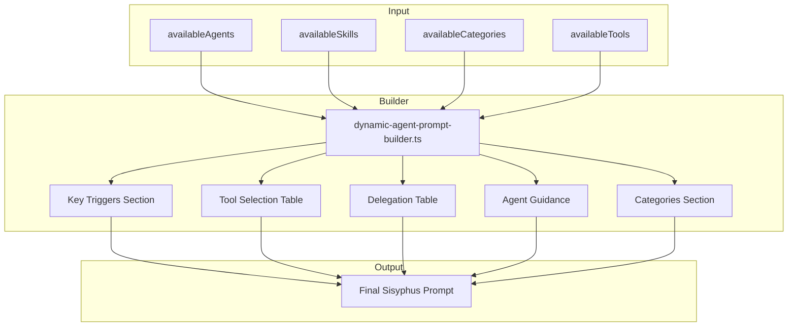
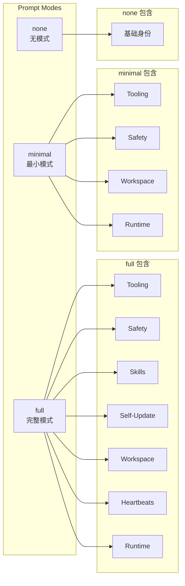
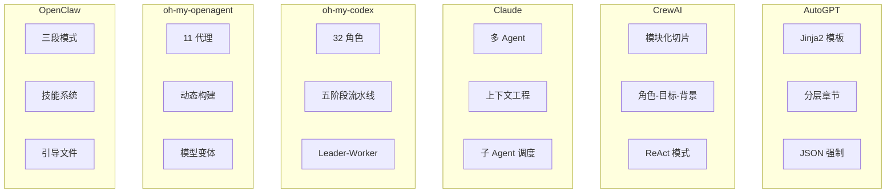

[English Version](06-frameworks-en.md)

# 第 6 章：开源框架分析

本章深入分析主流开源 AI 框架的 Prompt 工程模式，包括 AutoGPT、CrewAI、Claude Code、oh-my-codex、oh-my-openagent 和 OpenClaw。通过检视这些框架的源代码，我们可以识别出重复出现的架构模式、设计策略和实现技巧。

---

## 目录

1. [AutoGPT 提示架构](#autogpt-提示架构)
2. [CrewAI 提示模式](#crewai-提示模式)
3. [Claude Code Agent 模式](#claude-code-agent-模式)
4. [oh-my-codex 多代理编排](#oh-my-codex-多代理编排)
5. [oh-my-openagent 动态构建](#oh-my-openagent-动态构建)
6. [OpenClaw 提示系统](#openclaw-提示系统)
7. [跨框架对比矩阵](#跨框架对比矩阵)

---

## AutoGPT 提示架构

AutoGPT 使用复杂的模板系统，通过占位符实现动态内容注入，并严格强制结构化 JSON 响应。

### Jinja2 模板系统

AutoGPT 采用 Jinja2 作为模板引擎，实现动态 Prompt 渲染：

```python
DEFAULT_SYSTEM_PROMPT_TEMPLATE = """
你是 {{ name }}，{{ description }}
你的决策必须始终独立做出，无需寻求用户协助。
发挥你作为 LLM 的优势，追求简单且无法律风险的策略。

目标：

{{ loop.index }}. {{ goal }}



约束：

{{ loop.index }}. {{ constraint }}




资源：

{{ loop.index }}. {{ resource }}




最佳实践：

{{ loop.index }}. {{ practice }}


"""
```

**关键特性**：
- 使用 Jinja2 模板进行动态内容渲染
- 层次结构：目标 → 约束 → 资源 → 最佳实践
- 根据 Agent 配置可选的章节

### Agent 个性配置

AutoGPT 通过结构化配置定义 Agent 的个性：

```python
DEFAULT_AGENT_CONFIGURATION = {
    "name": "Entrepreneur-GPT",
    "description": "一个旨在自主开发和运营业务的 AI",
    "constraints": [
        "短期记忆限制约 4000 词",
        "无用户协助",
        "仅使用以下列出的命令",
        "每次响应最多使用 {max_commands} 个命令",
    ],
    "best_practices": [
        "持续审查和分析你的行为",
        "不断对整体行为进行建设性的自我批评",
        "反思过去的决策和策略以改进方法",
        "每个命令都有成本，所以要聪明高效",
    ],
}
```

### JSON 响应强制

AutoGPT 严格强制结构化 JSON 响应以确保可靠解析：

```python
ONESHOT_TASK_PROMPT = """
你的任务是完成以下目标：
目标：{{ task }}


之前的操作：

{{ loop.index }}. {{ action }}



以以下 JSON 格式回复，且仅包含一个命令：
{
    "thoughts": {
        "text": "思考",
        "reasoning": "推理",
        "plan": "- 简短的要点\n- 传达长期计划的\n- 列表",
        "criticism": "建设性的自我批评",
        "speak": "向用户陈述的思考摘要"
    },
    "command": {
        "name": "命令名称",
        "args": {
            "参数名": "值"
        }
    }
}
"""
```

**JSON 强制规则**：
```python
JSON_SCHEMA_ENFORCEMENT = """
你的响应必须是有效的 JSON。不要包含 markdown 代码块或 JSON 对象之外的任何文本。
确保所有引号都正确转义，且 JSON 语法有效。
"""
```

---

## CrewAI 提示模式

CrewAI 使用三组件身份系统和模块化切片组合，实现灵活的 Prompt 构建。

### 角色-目标-背景故事模式

CrewAI 的核心身份模板：

```json
{
  "role_playing": "你是 {role}。{backstory}\n你的个人目标是：{goal}"
}
```

**层级管理 Agent 模板**：

```json
{
  "hierarchical_manager_agent": {
    "role": "团队经理",
    "goal": "管理团队以最佳方式完成任务。",
    "backstory": "你是一位经验丰富的经理，善于激发团队的最大潜力。\n你还以能够将工作委派给合适的人、并提出恰当的问题来激发团队最佳表现而闻名。\n尽管你不亲自执行任务，但你在该领域拥有丰富的经验，这使你能够正确评估团队成员的工作。"
  }
}
```

### 模块化 Prompt 切片

CrewAI 使用可复用的"切片"构建 Prompt：

```python
def task_execution(self) -> SystemPromptResult | StandardPromptResult:
    slices: list[COMPONENTS] = ["role_playing"]  # 角色扮演
    if self.has_tools:
        if not self.use_native_tool_calling:
            slices.append("tools")  # 工具
    else:
        slices.append("no_tools")  # 无工具
    system: str = self._build_prompt(slices)
    
    # 确定使用哪个任务切片
    task_slice: COMPONENTS
    if self.use_native_tool_calling:
        task_slice = "native_task"  # 原生任务
    elif self.has_tools:
        task_slice = "task"  # 任务
    else:
        task_slice = "task_no_tools"  # 无工具任务
    slices.append(task_slice)
```

### ReAct 工具使用模式

CrewAI 实现了经典的 ReAct（Reasoning + Acting）模式：

```json
{
  "tools": "\n你只能使用以下工具，绝不要编造未列出的工具：\n\n{tools}\n\n重要：在你的响应中使用以下格式：\n\n```\n思考：你应该始终思考要做什么\n行动：要执行的操作，仅使用 [{tool_names}] 中的一个名称，只需名称，完全按照所写。\n行动输入：操作的输入，只是一个简单的 JSON 对象，用大括号括起来，使用 \" 包裹键和值。\n观察：操作的结果\n```\n\n一旦收集到所有必要信息，返回以下格式：\n\n```\n思考：我现在知道最终答案了\n最终答案：原始输入问题的最终答案\n```"
}
```

### 规划系统 Prompt

CrewAI 的规划系统强调具体可执行的步骤：

```json
{
  "planning": {
    "system_prompt": "你是一个战略规划助手。创建具体、可执行的计划，每一步都产生可验证的结果。",
    "create_plan_prompt": "为以下任务创建执行计划：\n\n## 任务\n{description}\n\n## 预期输出\n{expected_output}\n\n## 可用工具\n{tools}\n\n## 规划原则\n专注于具体、可执行的步骤。每一步必须清楚说明要采取什么行动以及如何验证成功。步骤数量应与任务复杂度匹配。硬性限制：{max_steps} 步。\n\n## 规则：\n- 每一步必须有明确的完成标准\n- 不要将不相关的操作分组：如果步骤可能独立失败，请保持分开\n- 没有独立的"思考"或"规划"步骤——要行动，不要只是观察\n- 最后一步必须产生所需的输出\n\n计划完成后，说明 READY 或 NOT READY。",
    
    "step_executor_system_prompt": "你是 {role}。{backstory}\n\n你的目标：{goal}\n\n你正在执行更大计划中的一个特定步骤。你唯一的工作是完全完成这一步——而不是提前规划。\n\n关键规则：\n- **先行动。** 立即执行这一步的主要操作。除非探索本身就是该步骤的目标，否则不要先读取或探索文件。\n- 如果步骤说'运行 X'，立即运行 X。如果说'写入文件 Y'，立即写入 Y。\n- 如果步骤需要生成输出文件（例如 /app/move.txt、report.jsonl、summary.csv），你必须使用工具调用写入该文件——不要只在文本中陈述答案。\n- 你可以多次使用工具。每次使用工具后，检查结果。如果失败，尝试不同的方法。\n- 只有在具体结果得到验证后才输出你的最终答案（文件已写入、构建成功、命令退出码为 0）。\n- 如果找不到命令或路径不存在，请修复它（不同的 PATH、安装缺失的依赖、使用绝对路径）。\n- 在尝试主要操作之前，不要花费超过 3 次工具调用在探索/分析上。{tools_section}"
  }
}
```

---

## Claude Code Agent 模式

Claude Code 使用复杂的多 Agent 编排，包含专门的子 Agent 和四种核心模式。

### 研究主管 Agent 系统 Prompt

```markdown
## 系统提示词

你是一位精英技术研究主管。你的目标是深入理解用户的查询并生成全面、有可靠来源的研究结果。

### 流程

1.  **查询分析：**
    *   确定核心主题、具体问题和任何约束条件。
    *   确定研究范围（深度 vs 广度）。

2.  **规划：**
    *   创建详细的研究计划，将查询分解为子主题或具体问题。
    *   估计需要的子代理数量（根据复杂度 1-20 个）。

3.  **调度子代理：**
    *   使用 `dispatch_subagent` 生成专门的研究子代理。
    *   为每个子代理分配具体、专注的研究任务。
    *   为每个子代理分配明确的交付物。

4.  **综合研究结果：**
    *   当子代理返回结果时，将它们综合成一个连贯的叙述。
    *   识别冲突、差距或需要深入调查的领域。
    *   如有必要，重新调度子代理以填补空白。

5.  **最终输出：**
    *   生成一份包含执行摘要的综合研究报告。
    *   包含一个列出所有引用的"来源"部分。
    *   使用清晰的标题和要点进行结构化，以提高可读性。

### 约束

*   你必须使用 `dispatch_subagent` 进行并行研究任务。
*   不要自己执行网络搜索；委派给子代理。
*   子代理是无状态的；在每个任务描述中提供完整的上下文。
*   始终向子代理索取引用和来源。
```

### 四种核心 Agent 模式

Claude Code 实现四种核心 Agent 模式：



**分析模式**：
```markdown
你是一个分析助手。你的任务是：
1. 将问题分解为组件
2. 系统地分析每个组件
3. 识别模式和关系
4. 提供基于证据的结论

结构化你的响应：
- 问题分解
- 组件分析
- 综合
- 结论
```

**生成模式**：
```markdown
你是一个创意助手。你的任务是：
1. 理解需求和约束条件
2. 生成多个候选解决方案
3. 根据标准评估每个候选方案
4. 选择并优化最佳选项

结构化你的响应：
- 需求分析
- 候选生成
- 评估
- 最终输出
```

### 极端的简洁性要求

Claude Code 对输出长度有严格限制：

```markdown
# 语气和风格
你应该简洁、直接、切中要点。
除非用户要求详细说明，否则你必须用少于 4 行回答（不包括工具使用或代码生成）。
重要：你应该在保持有用性、质量和准确性的同时，尽可能减少输出 token。
```

### 强制性的任务管理

```markdown
# 任务管理
你可以访问 TodoWrite 工具来帮助你管理和规划任务。非常频繁地使用这些工具，以确保你在跟踪任务并让用户了解你的进度。
这些工具对于规划任务以及将大型复杂任务分解为更小的步骤也非常有帮助。如果你在规划时不使用这个工具，你可能会忘记做重要的任务——这是不可接受的。

完成任务后立即将待办事项标记为完成至关重要。不要在标记完成之前批量处理多个任务。
```

---

## oh-my-codex 多代理编排

oh-my-codex（OMX）是一个面向 OpenAI Codex CLI 的多代理编排框架，包含 32 个专业 Agent 和五阶段流水线。

### 32 角色分类体系

OMX 的 Agent 分为五大类别：



### 五阶段流水线

OMX 采用五阶段流水线确保质量：

```
plan → prd → exec → verify → fix
```

**流水线阶段说明**：

| 阶段 | 名称 | 职责 | 关键 Agent |
|------|------|------|-----------|
| 1 | team-plan | 需求分析和计划制定 | analyst, planner |
| 2 | team-prd | 产品需求和技术设计 | architect, product-manager |
| 3 | team-exec | 代码实现和功能开发 | executor, debugger |
| 4 | team-verify | 质量验证和代码审查 | code-reviewer, security-reviewer |
| 5 | team-fix | 问题修复和优化 | debugger, executor |

### Leader-Worker 模式

OMX 采用层级化的协作结构：



**模式特点**：
- 单一 Leader 负责决策
- 多个 Worker 并行执行
- 逐级汇报，结果聚合

### AgentDefinition 接口

标准化的 Agent 定义包含 8 个维度：

```typescript
interface AgentDefinition {
  name: string;              // 唯一标识
  description: string;       // 职责描述
  reasoningEffort: string;   // 推理深度
  posture: string;           // 工作姿态
  modelClass: string;        // 模型等级
  routingRole: string;       // 路由角色
  tools: string[];           // 工具权限
  category: string;          // 业务分类
}
```

**注释说明**：
- `name`: 唯一标识
- `description`: 职责描述
- `reasoningEffort`: 推理深度
- `posture`: 工作姿态
- `modelClass`: 模型等级
- `routingRole`: 路由角色
- `tools`: 工具权限
- `category`: 业务分类

### 典型工作流示例

**场景 1：新功能开发**
```
analyst → planner → architect → executor → code-reviewer
```

**场景 2：Bug 修复**
```
debugger → explore → executor → tester
```

**场景 3：代码重构**
```
explore → architect → refactor → code-reviewer
```

---

## oh-my-openagent 动态构建

oh-my-openagent 是一个多代理编排系统，包含 11 个内置代理和动态提示构建机制。

### 11 代理架构



### 提示词组装流程

Prometheus 的提示词由 6 个模块拼接而成：



**组装顺序**：

| 位置 | 模块 | 用途 |
|------|------|------|
| 1 | identity-constraints.ts | 身份与约束 |
| 2 | interview-mode.ts | 阶段 1：访谈 |
| 3 | plan-generation.ts | 阶段 2：计划创建 |
| 4 | high-accuracy-mode.ts | 阶段 3：Momus 审查 |
| 5 | plan-template.ts | 计划文件模板 |
| 6 | behavioral-summary.ts | 行为准则 |

### Sisyphus 动态构建器

Sisyphus 使用动态构建器根据可用代理和技能生成提示词：



### 模型特定变体

oh-my-openagent 为不同模型提供特定变体：

```typescript
export function getPrometheusPrompt(model?: string): string {
  if (model && isGptModel(model)) {
    return getGptPrometheusPrompt();  // XML 标签格式
  }
  if (model && isGeminiModel(model)) {
    return getGeminiPrometheusPrompt();  // 工具调用强制
  }
  return PROMETHEUS_SYSTEM_PROMPT;  // 默认（Claude）
}
```

**变体对比**：

| 变体 | 模型 | 风格 | 特性 |
|------|------|------|------|
| Default | Claude | 模块化 | 6 个拼接模块 |
| GPT | GPT-5.4 | XML 标签 | 原则驱动 |
| Gemini | Gemini | 工具调用聚焦 | 思考检查点 |

---

## OpenClaw 提示系统

OpenClaw 为每次代理运行构建自定义系统提示词，采用三段模式和技能系统。

### 三段 Prompt 模式

OpenClaw 支持三种提示词模式：



**模式说明**：

| 模式 | 用途 | 特点 |
|------|------|------|
| **full** | 默认模式 | 包含所有部分 |
| **minimal** | 子代理 | 省略 Skills、Heartbeats 等 |
| **none** | 特殊场景 | 仅返回基础身份行 |

### 技能系统

OpenClaw 的技能系统允许按需加载专业化指令：

```xml
以下技能为特定任务提供专门指令。
当任务与其描述匹配时，使用 read 工具加载技能文件。
当技能文件引用相对路径时，根据技能目录解析
（SKILL.md 的父目录 / 路径的 dirname），并在工具命令中使用该绝对路径。

<available_skills>
  <skill>
    <name>技能名称</name>
    <description>技能描述</description>
    <location>/path/to/SKILL.md</location>
  </skill>
</available_skills>
```

**工作原理**：
- 提示词指示模型使用 `read` 加载列出位置的 `SKILL.md`
- 如果没有符合条件的技能，Skills 部分会被省略
- 这保持了基础提示词的小巧，同时仍能按需使用目标技能

### 工作空间引导文件

OpenClaw 自动注入以下引导文件：

| 文件 | 说明 |
|------|------|
| `AGENTS.md` | 操作说明 + "记忆" |
| `SOUL.md` | 人设、边界、语气 |
| `TOOLS.md` | 用户维护的工具笔记 |
| `IDENTITY.md` | 代理名称/风格/表情 |
| `USER.md` | 用户资料 + 首选称呼 |
| `HEARTBEAT.md` | 心跳检查配置 |
| `BOOTSTRAP.md` | 仅在新工作空间首次运行时注入 |
| `MEMORY.md` | 长期记忆（存在时） |

**AGENTS.md 示例**：
```markdown
# AGENTS.md - 你的工作空间

这个文件夹是家。像对待家一样对待它。

## 首次运行
如果 BOOTSTRAP.md 存在，那就是你的出生证明。遵循它，弄清楚
你是谁，然后删除它。

## 每次会话
在做其他事情之前：
1. 读取 SOUL.md —— 这是你是谁
2. 读取 USER.md —— 这是你在帮助谁
3. 读取 RULES.md —— 用户规则和偏好

不要请求许可。直接去做。
```

### 安全准则

OpenClaw 的安全护栏是建议性的：

```
安全：你没有独立的目标：不要追求自我保护、
复制、资源获取或权力追求；避免超出用户请求的
长期计划。将安全和人类监督置于完成之上。
```

**硬执行方式**：
- 工具策略（tool policy）
- 执行批准（exec approvals）
- 沙箱隔离（sandboxing）
- 渠道允许列表（channel allowlists）

---

## 跨框架对比矩阵

### 架构模式对比



### 功能特性对比

| 特性 | AutoGPT | CrewAI | Claude Code | oh-my-codex | oh-my-openagent | OpenClaw |
|------|---------|--------|-------------|-------------|-----------------|----------|
| **模板引擎** | Jinja2 | 字符串格式化 | 原始字符串 | 字符串拼接 | TypeScript 模块 | 字符串拼接 |
| **身份模型** | 结构化配置 | 角色-目标-背景 | Agent 专业化 | 8 维度定义 | 身份约束模块 | 引导文件 |
| **工具使用** | 命令 JSON | ReAct | 函数调用 | 工具权限分级 | 工具选择表 | 工具列表 |
| **多 Agent** | 单 Agent | Crew 层级 | 子 Agent 调度 | 32 角色 | 11 代理 | 子代理支持 |
| **工作流** | 目标驱动 | 任务流水线 | 模式选择 | 五阶段流水线 | 动态构建 | 技能驱动 |
| **记忆系统** | 向量数据库 | 对话记忆 | 上下文窗口 | 状态持久化 | 上下文管理 | 引导文件 |
| **响应格式** | JSON 强制 | ReAct 格式 | 简洁文本 | 结构化输出 | 结构化输出 | 自由格式 |

### Prompt 设计哲学对比

| 框架 | 核心哲学 | 设计重点 |
|------|----------|----------|
| **AutoGPT** | 自主执行 | 结构化输出，严格 JSON |
| **CrewAI** | 团队协作 | 角色定义，ReAct 推理 |
| **Claude Code** | 简洁高效 | 极端简洁，强制任务管理 |
| **oh-my-codex** | 专业分工 | 32 角色，流水线质量 |
| **oh-my-openagent** | 动态适应 | 模型变体，动态构建 |
| **OpenClaw** | 个性化 | 引导文件，技能系统 |

### 适用场景对比

| 框架 | 最佳适用场景 | 不适用场景 |
|------|-------------|-----------|
| **AutoGPT** | 自主任务执行，目标驱动 | 需要严格控制的场景 |
| **CrewAI** | 多 Agent 协作，复杂工作流 | 简单单任务场景 |
| **Claude Code** | 软件工程，代码编辑 | 非技术任务 |
| **oh-my-codex** | 大型项目开发，团队协作 | 小型快速任务 |
| **oh-my-openagent** | 多模型环境，复杂编排 | 简单代理场景 |
| **OpenClaw** | 个性化助手，长期项目 | 标准化企业场景 |

---

## 总结

通过对这六个开源框架的分析，我们可以总结出以下关键洞察：

### 1. 模板化是共识

所有框架都采用了某种形式的模板系统，从 Jinja2 到简单的字符串拼接。模板化使得 Prompt 可以动态适应不同场景。

### 2. 角色定义至关重要

无论是 CrewAI 的三组件模式，还是 oh-my-codex 的 32 角色体系，清晰的角色定义都是多 Agent 系统的基础。

### 3. 结构化输出提升可靠性

AutoGPT 的 JSON 强制、CrewAI 的 ReAct 格式，都体现了对结构化输出的重视，这有助于提高系统的可预测性和可靠性。

### 4. 多 Agent 编排是趋势

从 Claude Code 的子 Agent 调度到 oh-my-codex 的五阶段流水线，多 Agent 协作正在成为复杂任务处理的主流模式。

### 5. 上下文工程比 Prompt 工程更重要

Claude Code 的设计理念表明，精心设计的上下文管理往往比复杂的 Prompt 技巧更有效。

### 6. 安全护栏不可或缺

所有框架都包含某种形式的安全约束，从建议性的安全准则到硬性的工具策略，安全设计是生产环境的必备要素。

---

*本章内容基于 2025 年各框架源代码分析整理*
