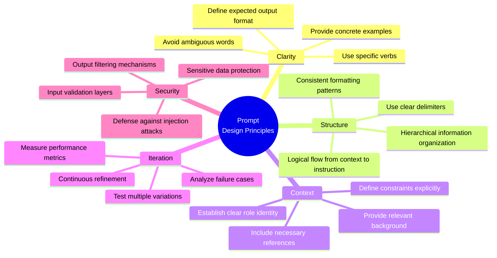
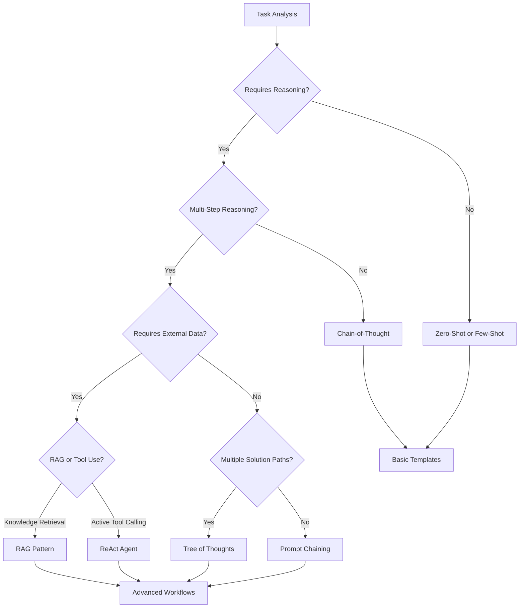
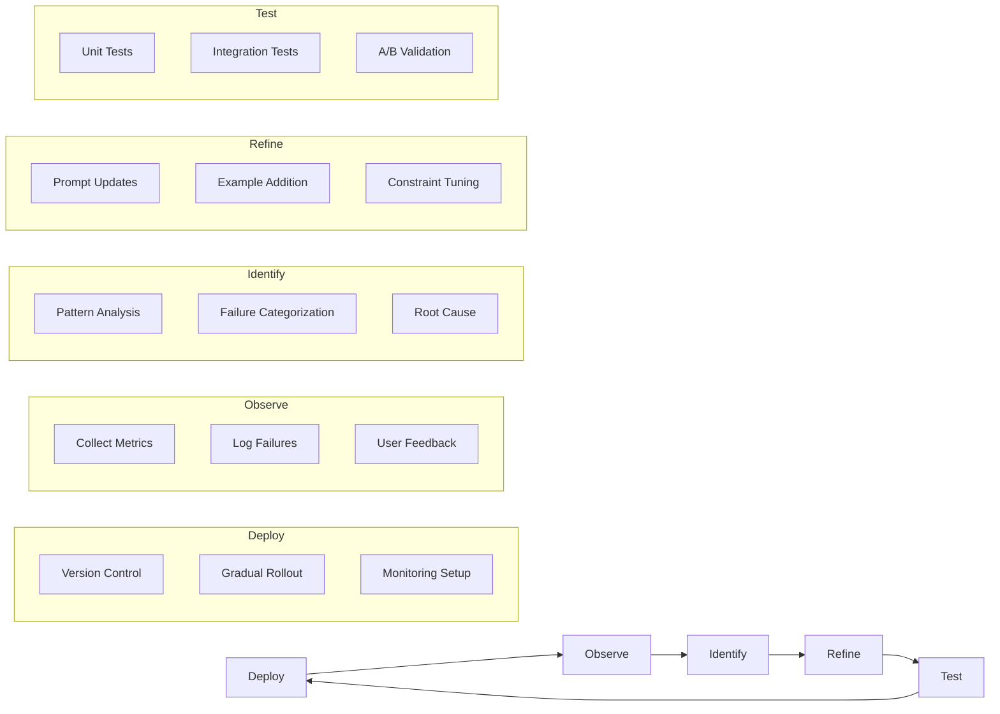

# Chapter 8: Production Practices

[中文版](zh/08-production.md)

## Table of Contents

1. [Prompt Design Principles](#prompt-design-principles)
2. [Technology Selection Decision Tree](#technology-selection-decision-tree)
3. [Prompt Template Library](#prompt-template-library)
4. [Prompt Design Checklist](#prompt-design-checklist)
5. [Framework Pattern Matrix](#framework-pattern-matrix)
6. [Observability and Debugging](#observability-and-debugging)
7. [Continuous Iteration Process](#continuous-iteration-process)
8. [Claude Code Design Analysis](#claude-code-design-analysis)

---

## Prompt Design Principles

Production-grade prompts require a systematic approach to design. The following mindmap illustrates the core principles that guide effective prompt engineering at scale.



### Key Principles Explained

**Clarity**: Every prompt should use action-oriented language. Instead of "analyze this," use "extract three key insights and rank them by importance."

**Structure**: Use XML tags, markdown headers, or clear delimiters to separate different sections of your prompt. This helps the model understand the hierarchy of information.

**Context**: Always establish who the model is (role), what it should do (task), and what constraints apply (boundaries).

**Iteration**: Treat prompts as code. Version them, test them systematically, and refine based on real-world performance.

**Security**: Build defense-in-depth with input validation, injection detection, and output filtering.

---

## Technology Selection Decision Tree

Choosing the right prompting technique depends on your specific use case. This decision tree guides you through the selection process.



### Decision Points Explained

**Requires Reasoning?**: Simple classification or transformation tasks may not need explicit reasoning steps.

**Multi-Step Reasoning?**: If the task requires multiple logical steps to reach a conclusion, use Chain-of-Thought or more advanced techniques.

**Requires External Data?**: Tasks needing up-to-date information or domain-specific knowledge require retrieval or tool use.

**Multiple Solution Paths?**: Creative or exploratory tasks benefit from Tree of Thoughts to evaluate different approaches.

---

## Prompt Template Library

This section provides production-ready templates for common use cases.

### A. Classification Template

```markdown
## Task: Multi-Label Classification

Classify the following text into one or more categories from the list below.

### Categories
- {{category_1}}: {{description_1}}
- {{category_2}}: {{description_2}}
- {{category_3}}: {{description_3}}

### Classification Rules
1. Assign one primary category
2. Assign up to two secondary categories if applicable
3. Provide confidence score (0.0-1.0) for each assignment

### Text to Classify
{{text}}

### Output Format
Respond in JSON format:
{
  "primary_category": "category_name",
  "primary_confidence": 0.95,
  "secondary_categories": ["category_name"],
  "reasoning": "Brief explanation of classification decision"
}
```

### B. Information Extraction Template

```markdown
## Task: Structured Information Extraction

Extract the following entities from the provided text.

### Target Entities
- **Persons**: Full names of individuals mentioned
- **Organizations**: Companies, institutions, groups
- **Locations**: Cities, countries, addresses
- **Dates**: Specific dates or time periods
- **Monetary Values**: Amounts with currencies

### Extraction Guidelines
1. Include only explicitly mentioned entities
2. Normalize dates to ISO format (YYYY-MM-DD)
3. Normalize monetary values to USD
4. Include context snippet for each extraction

### Source Text
{{text}}

### Output Format
{
  "persons": [
    {"name": "...", "context": "..."}
  ],
  "organizations": [
    {"name": "...", "context": "..."}
  ],
  "locations": [
    {"name": "...", "context": "..."}
  ],
  "dates": [
    {"value": "...", "normalized": "...", "context": "..."}
  ],
  "monetary_values": [
    {"amount": "...", "currency": "...", "normalized_usd": "...", "context": "..."}
  ]
}
```

### C. Code Generation Template

```markdown
## Task: Code Generation

You are an expert {{language}} developer with deep knowledge of {{framework}}.

### Requirements
{{task_description}}

### Code Standards
- Follow {{language}} best practices and idioms
- Include comprehensive error handling
- Add type hints where applicable
- Write self-documenting code with clear variable names
- Include docstrings for all public functions
- Ensure thread safety if applicable

### Constraints
- Maximum cyclomatic complexity: 10
- Function length: Under 50 lines
- No external dependencies unless specified

### Output Format
Provide your solution in a code block:

```{{language}}
[Your code here]
```

Include a brief explanation of your approach after the code block.
```

### D. Summarization Template

```markdown
## Task: Structured Summarization

Create a comprehensive summary of the following text.

### Summary Requirements
- Length: {{num_sentences}} sentences
- Style: {{summary_style}} (executive/technical/detailed)
- Focus Areas:
  - Main arguments or findings
  - Key supporting evidence
  - Important conclusions
  - Actionable insights

### Source Text
{{text}}

### Output Format
**Executive Summary:**
[1-2 sentence high-level overview]

**Key Points:**
- [Point 1]
- [Point 2]
- [Point 3]

**Important Details:**
[Relevant specifics with context]

**Conclusions:**
[Main takeaways]
```

---

## Prompt Design Checklist

Use this checklist before deploying any prompt to production.

### Identity Definition

- [ ] Clear role definition established
- [ ] Specific goal statement included
- [ ] Relevant backstory or context provided
- [ ] Tone and style guidelines specified

### Instruction Clarity

- [ ] Concrete action verbs used throughout
- [ ] Explicit constraints documented
- [ ] Output format clearly specified
- [ ] Edge cases and error scenarios addressed
- [ ] Examples provided for complex tasks

### Security Hardening

- [ ] Delimiter strategy implemented (XML tags, markdown sections)
- [ ] Instruction hierarchy established (priority levels)
- [ ] Input validation rules defined
- [ ] Output filtering mechanisms in place
- [ ] Sensitive data handling specified

### Observability

- [ ] Thought process logging enabled
- [ ] Tool call tracking configured
- [ ] Error handling and recovery defined
- [ ] Performance metrics identified
- [ ] Debugging information accessible

### Testing

- [ ] Unit tests for individual prompts
- [ ] Integration tests for prompt chains
- [ ] Edge case coverage verified
- [ ] Performance benchmarks established
- [ ] A/B testing framework ready

---

## Framework Pattern Matrix

Compare how different production frameworks implement common patterns.

| Pattern | AutoGPT | CrewAI | Claude Code | Security Libs |
|---------|---------|--------|-------------|---------------|
| **Template Engine** | Jinja2 | String format | Raw strings | Mixed |
| **Identity Model** | Structured config | Role-Goal-Backstory | Agent specialization | N/A |
| **Tool Use** | Command JSON | ReAct | Function calling | N/A |
| **Memory** | Vector DB | Conversation | Context window | N/A |
| **Multi-Agent** | Single agent | Crew hierarchy | Sub-agent dispatch | N/A |
| **Injection Defense** | Basic | Delimiters | Instruction hierarchy | Multi-layer |

### Pattern Explanations

**Template Engine**: How dynamic content is injected into prompts
- Jinja2: Full templating with conditionals and loops
- String format: Simple placeholder replacement
- Raw strings: Direct concatenation

**Identity Model**: How agent personality is defined
- Structured config: JSON/YAML configuration files
- Role-Goal-Backstory: Three-component identity system
- Agent specialization: Task-specific system prompts

**Tool Use**: How agents interact with external tools
- Command JSON: Structured command objects
- ReAct: Thought-Action-Observation loop
- Function calling: Native LLM function calling

**Multi-Agent**: How multiple agents coordinate
- Crew hierarchy: Manager-worker relationships
- Sub-agent dispatch: Dynamic agent spawning

---

## Observability and Debugging

Production prompts require comprehensive observability to maintain reliability.

### Logging Strategy

```python
# Structured logging for prompt operations
import logging
from dataclasses import dataclass
from typing import Optional

@dataclass
class PromptLogEntry:
    prompt_id: str
    template_version: str
    input_tokens: int
    output_tokens: int
    latency_ms: float
    success: bool
    error_type: Optional[str]
    tool_calls: list

class PromptLogger:
    def log_execution(self, entry: PromptLogEntry):
        """Log prompt execution with full context."""
        logging.info({
            "event": "prompt_execution",
            "prompt_id": entry.prompt_id,
            "version": entry.template_version,
            "tokens": {
                "input": entry.input_tokens,
                "output": entry.output_tokens,
                "total": entry.input_tokens + entry.output_tokens
            },
            "latency_ms": entry.latency_ms,
            "success": entry.success,
            "error": entry.error_type,
            "tool_calls": len(entry.tool_calls)
        })
```

### Debugging Techniques

**1. Prompt Versioning**
- Track every change to prompt templates
- A/B test different versions
- Rollback capability for failed deployments

**2. Response Analysis**
- Log full responses for debugging
- Track parsing failures
- Monitor output quality metrics

**3. Token Usage Monitoring**
- Track input/output token ratios
- Identify prompt bloat
- Optimize for cost efficiency

**4. Error Classification**
- Categorize failures by type
- Track retry success rates
- Identify systemic issues

### Key Metrics to Track

| Metric | Description | Target |
|--------|-------------|--------|
| Success Rate | % of successful completions | >95% |
| Latency P95 | 95th percentile response time | <2s |
| Token Efficiency | Output/Input token ratio | >0.3 |
| Parse Success | % of valid structured outputs | >98% |
| Retry Rate | % of requests requiring retry | <5% |

---

## Continuous Iteration Process

Prompt engineering is an ongoing process of deployment, observation, and refinement.



### Iteration Cycle Explained

**Deploy**: Release new prompt versions with proper version control and gradual rollout strategies.

**Observe**: Collect comprehensive metrics on performance, failures, and user satisfaction.

**Identify**: Analyze patterns in failures and successes to understand what works and what doesn't.

**Refine**: Make targeted improvements based on identified issues. Add examples, clarify instructions, or adjust constraints.

**Test**: Validate changes through automated testing and controlled experiments before full deployment.

### Best Practices

1. **Version Everything**: Every prompt change should be versioned and documented
2. **Measure Before Changing**: Establish baseline metrics before making improvements
3. **Change One Variable**: Test single changes to understand their impact
4. **Maintain Examples**: Keep a library of test cases representing real usage
5. **Document Learnings**: Record what worked and what didn't for future reference

---

## Claude Code Design Analysis

Claude Code represents a production-grade implementation of prompt engineering principles. This analysis extracts key patterns from its system prompt design.

### Core Design Philosophy

Claude Code's prompt design demonstrates several production-level principles:

**1. Extreme Conciseness Requirements**

The system enforces strict output constraints:
- Maximum 4 lines of text (excluding code)
- One-word answers preferred
- No preamble or postamble allowed
- Specific examples provided for every rule

```markdown
You MUST answer concisely with fewer than 4 lines (not including tool use or code generation), unless user asks for detail.
IMPORTANT: You should minimize output tokens as much as possible while maintaining helpfulness, quality, and accuracy.
```

**2. Mandatory Task Management**

Task tracking is not optional but enforced:
- MUST use TodoWrite tool for planning
- EXTREMELY helpful for breaking down tasks
- Mark todos as completed immediately
- Batch completions are unacceptable

```markdown
It is critical that you mark todos as completed as soon as you are done with a task. Do not batch up multiple tasks before marking them as completed.
```

**3. Strategic Tool Usage**

Tool calling is optimized for efficiency:
- Prefer Task tool for file searches
- Batch independent tool calls in parallel
- Use specialized agents for matching tasks
- Handle redirects automatically

```markdown
You have the capability to call multiple tools in a single response. When multiple independent pieces of information are requested, batch your tool calls together for optimal performance.
```

**4. Code Convention Adherence**

Strict rules ensure code quality:
- NEVER assume library availability
- Check existing patterns before creating
- DO NOT ADD ANY COMMENTS unless asked
- Follow security best practices

```markdown
NEVER assume that a given library is available, even if it is well known. Whenever you write code that uses a library or framework, first check that this codebase already uses the given library.
```

**5. Balanced Proactivity**

The system defines clear boundaries for autonomous action:
- Allowed to be proactive, but only when asked
- Balance between helpfulness and surprise
- Answer questions before taking actions

```markdown
You are allowed to be proactive, but only when the user asks you to do something. You should strive to strike a balance between doing the right thing when asked and not surprising the user with actions you take without asking.
```

### Production Insights

**Why These Patterns Work:**

1. **Conciseness reduces costs**: Every token saved is money saved at scale
2. **Mandatory tracking ensures reliability**: Complex tasks can't be forgotten
3. **Parallel execution optimizes latency**: Batch calls reduce total time
4. **Convention adherence maintains quality**: Consistent output across sessions
5. **Clear boundaries prevent overreach**: Users maintain control

**Lessons for Your Prompts:**

- Use strong language (MUST, NEVER, EXTREMELY) for critical requirements
- Provide concrete examples, not just abstract rules
- Balance constraints with flexibility
- Design for observability from the start
- Iterate based on real usage patterns

### Implementation Checklist

When building production prompts inspired by Claude Code:

- [ ] Define strict output constraints with examples
- [ ] Implement mandatory task tracking
- [ ] Optimize tool usage patterns
- [ ] Enforce code/style conventions
- [ ] Establish clear proactivity boundaries
- [ ] Provide comprehensive examples
- [ ] Use strong directive language
- [ ] Build in error recovery mechanisms

---

## Summary

Production prompt engineering requires a systematic approach combining clear design principles, appropriate technology selection, comprehensive templates, rigorous checklists, and continuous iteration. The patterns demonstrated in Claude Code show that production-grade prompts are not just about the text, but about the entire system of constraints, examples, and enforcement mechanisms that ensure reliable, efficient, and safe AI behavior.

Key takeaways:

1. **Design with constraints**: Clear boundaries produce consistent results
2. **Measure everything**: You can't improve what you don't measure
3. **Iterate continuously**: Prompts are code and need version control
4. **Security by default**: Build defense-in-depth from the start
5. **Learn from production**: Study how successful systems implement these patterns

---

*This chapter synthesizes patterns from OpenAI, Anthropic, AutoGPT, CrewAI, and Claude Code production implementations.*
