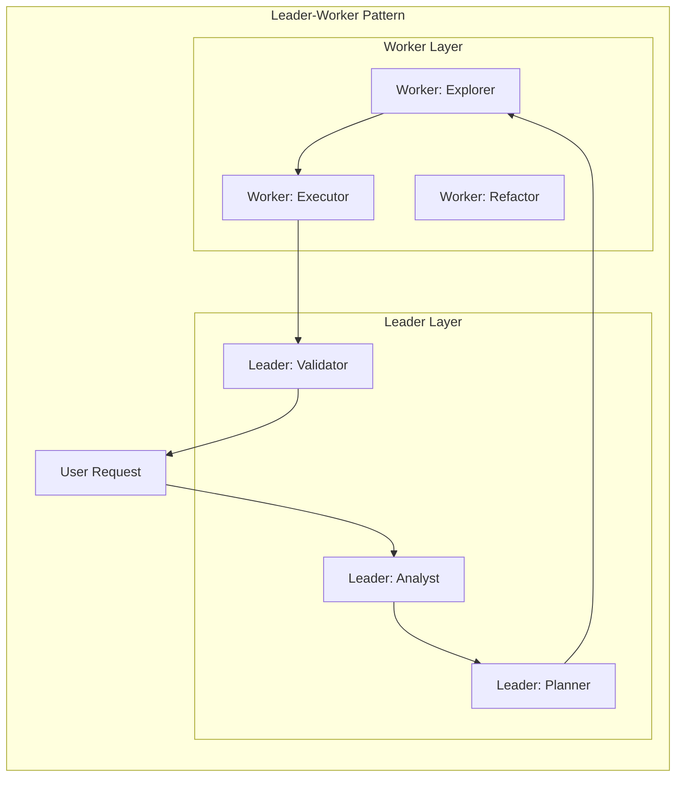
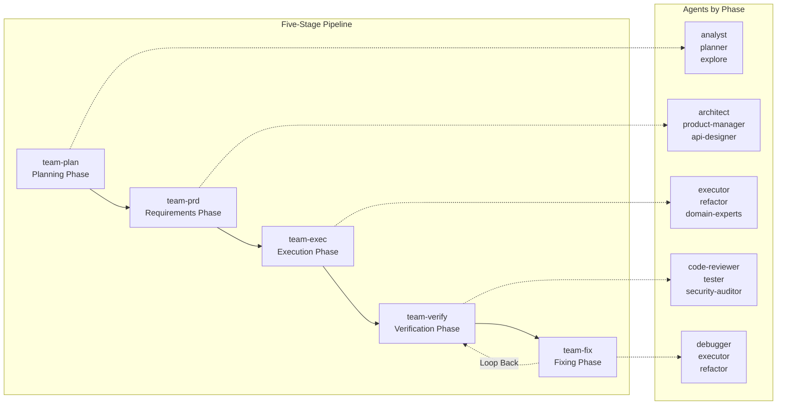
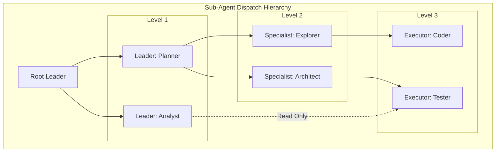
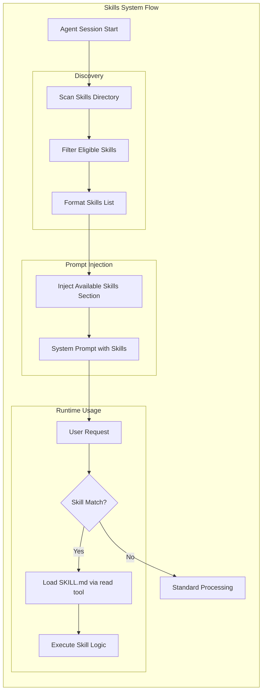
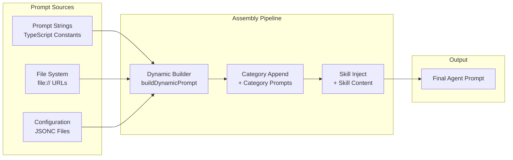
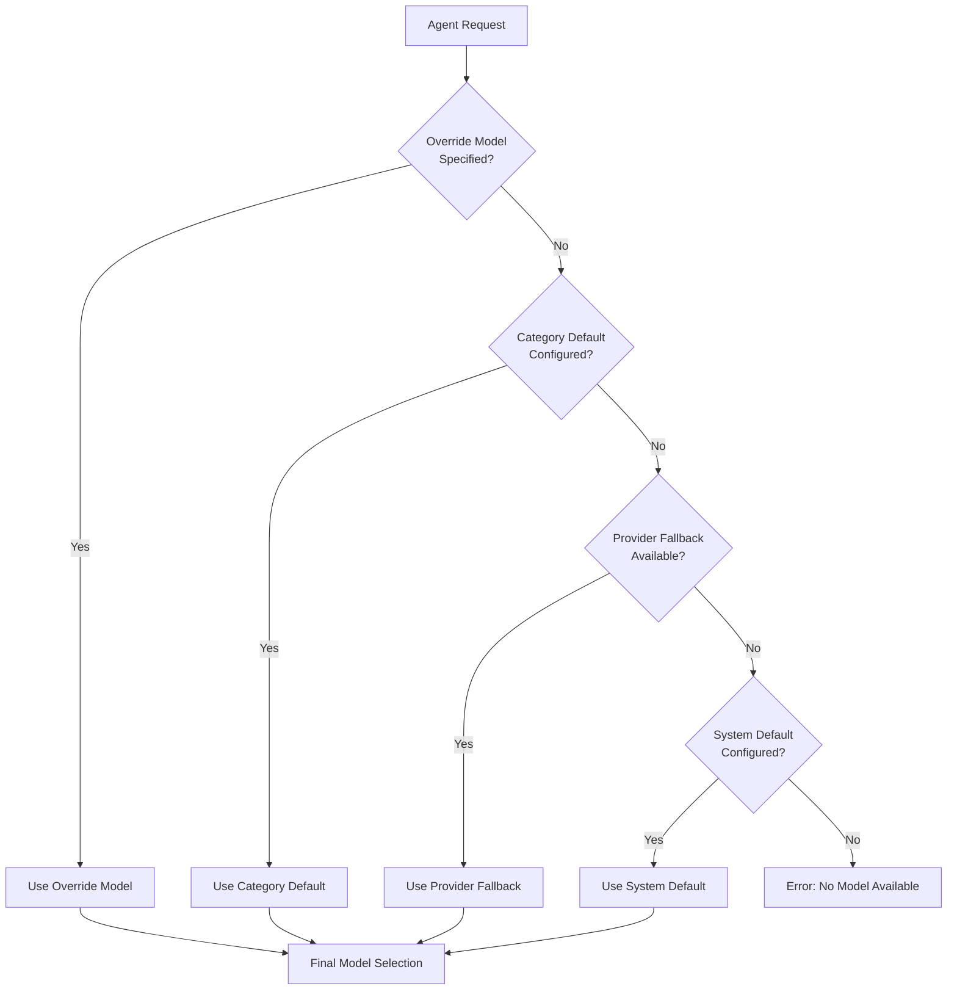

# Chapter 9: Advanced Topics

[中文版](zh/09-advanced.md)

This chapter explores advanced prompt engineering concepts including multi-agent orchestration patterns, skills systems, dynamic prompt building, and model selection strategies. These topics represent the cutting edge of AI system design, where multiple specialized agents collaborate to solve complex problems.

---

## Table of Contents

1. [Multi-Agent Orchestration](#multi-agent-orchestration)
2. [Skills System](#skills-system)
3. [Dynamic Prompt Building](#dynamic-prompt-building)
4. [Model Selection Strategies](#model-selection-strategies)

---

## Multi-Agent Orchestration

Multi-agent orchestration is the practice of coordinating multiple AI agents to work together on complex tasks. Rather than relying on a single monolithic model, orchestrated systems distribute work across specialized agents, each optimized for specific functions.

### Leader-Worker Pattern

The Leader-Worker pattern is a fundamental collaboration model in multi-agent systems. It uses a "1+N" hierarchical structure where one Leader coordinates multiple Workers.

**Key Roles:**

- **Leader**: Makes decisions, coordinates activities, and delegates tasks
- **Worker**: Executes specific tasks and reports results back to the Leader

**Collaboration Principles:**

1. **Single Leadership**: Each task chain has exactly one Leader to avoid conflicting directives
2. **Hierarchical Reporting**: Workers report to their direct Leader, not across hierarchies
3. **Result-Oriented**: Workers deliver results; Leaders integrate and validate
4. **Permission Isolation**: Leaders have analysis permissions; Workers have execution permissions based on their roles



**Typical Collaboration Flow:**

1. User submits a request
2. Leader (Analyst) analyzes the requirements
3. Leader (Planner) creates an execution plan
4. Leader calls Worker (Explorer) to search the codebase
5. Leader calls Worker (Executor) to implement functionality
6. Leader (Planner) validates the results
7. Final response returned to user

### Five-Stage Pipeline

The five-stage pipeline is a structured workflow that breaks complex development tasks into discrete phases. Each phase has specific goals, participating agents, and outputs.



**Phase Details:**

| Phase | Goal | Key Agents | Output |
|-------|------|------------|--------|
| **team-plan** | Understand requirements, create execution plan | analyst, planner, explore | Requirements analysis, task breakdown, timeline |
| **team-prd** | Transform requirements into technical specifications | architect, product-manager, api-designer | Architecture design, API specs, tech choices |
| **team-exec** | Implement functionality, write code | executor, refactor, domain-experts | Feature code, unit tests, documentation |
| **team-verify** | Verify implementation quality | code-reviewer, tester, security-auditor | Review reports, test reports, issue lists |
| **team-fix** | Fix issues found during verification | debugger, executor, refactor | Fixed code, root cause analysis |

**State Transitions:**

```
planning → planned → designing → designed → implementing → implemented → verifying → [verified → completed] OR [verified → fixing → fixed → verifying]
```

### Sub-Agent Dispatch

Sub-agent dispatch allows agents to spawn specialized child agents for specific tasks. This creates a dynamic, tree-like execution structure.

**Dispatch Rules:**

| Caller | Can Call |
|--------|----------|
| **Leader** | Other Leaders, Specialists, Executors |
| **Specialist** | Other Specialists, Executors |
| **Executor** | Read-only tools only (no other agents) |



**Example Dispatch Chain:**

```
analyst (Leader)
    ↓ calls
planner (Leader)
    ↓ calls
explore (Specialist) → returns code locations
    ↓ calls
architect (Leader) → returns design
    ↓ calls
executor (Executor) → implements code
    ↓ completes
planner (Leader) → validates and returns
```

---

## Skills System

The Skills system enables agents to dynamically load specialized capabilities at runtime. Rather than embedding all knowledge in the base prompt, skills are modular, on-demand extensions.

### How Skills Work

When eligible skills exist, the system injects a compact **available skills list** into the prompt. This list includes each skill's name, description, and file path location.



**Skills Injection Format:**

```xml
<available_skills>
  <skill>
    <name>git-master</name>
    <description>Advanced git operations and repository management</description>
    <location>/home/user/.agents/skills/git-master/SKILL.md</location>
  </skill>
  <skill>
    <name>mermaid-diagrams</name>
    <description>Create diagrams using Mermaid syntax</description>
    <location>/home/user/.agents/skills/mermaid-diagrams/SKILL.md</location>
  </skill>
</available_skills>
```

**Key Characteristics:**

- Skills are **not** loaded automatically; they are listed for potential use
- The model decides when to load a skill based on the user's request
- Skills are loaded via the `read` tool when needed
- If no eligible skills exist, the Skills section is omitted entirely
- This keeps the base prompt small while enabling powerful, on-demand capabilities

### Skill Structure

A typical skill consists of:

| Component | Purpose |
|-----------|---------|
| **SKILL.md** | Main skill instructions and capabilities |
| **Configuration** | Default settings and parameters |
| **Resources** | Supporting files, templates, or data |

### Prompt Modes and Skills

The system supports different prompt modes that affect skills:

| Mode | Skills Behavior |
|------|-----------------|
| **full** | Skills section included with all eligible skills |
| **minimal** | Skills section omitted (for sub-agents) |
| **none** | Only base identity, no skills |

When using `minimal` mode for sub-agents, the injected context is labeled as **Subagent Context** rather than **Group Chat Context**.

---

## Dynamic Prompt Building

Dynamic prompt building assembles the final system prompt at runtime by combining multiple sources. This allows for context-aware, personalized prompts that adapt to the current situation.

### Prompt Assembly Architecture



**Assembly Steps:**

1. **Base Prompt**: Core instructions from TypeScript constants
2. **File Loading**: Content loaded from `file://` URLs
3. **Config Merge**: Settings from JSONC configuration files
4. **Dynamic Building**: `buildDynamicPrompt()` assembles the components
5. **Category Append**: Role-specific category prompts added
6. **Skill Injection**: Relevant skill instructions injected
7. **Final Output**: Complete, context-aware system prompt

### Workspace Bootstrap Files

Dynamic prompts can include content from workspace bootstrap files. These files provide project-specific context:

| File | Purpose |
|------|---------|
| **AGENTS.md** | Operating instructions and "memory" |
| **SOUL.md** | Personality, boundaries, tone |
| **TOOLS.md** | User-maintained tool notes |
| **IDENTITY.md** | Agent name, style, emoji |
| **USER.md** | User profile and preferred address |
| **BOOTSTRAP.md** | First-run initialization |
| **MEMORY.md** | Long-term memory (when present) |

**Injection Rules:**

- Files are injected into context on every turn (they consume tokens)
- Large files are truncated with markers
- Individual file max: 20,000 characters (configurable)
- Total injection max: 150,000 characters (configurable)
- Missing files inject a brief "missing file" marker

### Sub-Agent Context Filtering

Sub-agents receive filtered context to keep their prompts smaller:

- Only **AGENTS.md** and **TOOLS.md** are injected
- Other bootstrap files are filtered out
- Skills section is typically omitted (minimal mode)
- This reduces token usage while preserving essential context

---

## Model Selection Strategies

Choosing the right model for each agent is critical for balancing capability, cost, and latency. Multi-agent systems use hierarchical selection strategies to make intelligent model assignments.

### Selection Hierarchy



**Selection Priority:**

1. **Override Model**: Explicit model specified for this specific request
2. **Category Default**: Model configured for the agent's category
3. **Provider Fallback**: Default model from the provider configuration
4. **System Default**: Global default model for the system
5. **Error**: No model available (should not happen in properly configured systems)

### Model Assignment by Role

Different agent roles benefit from different model characteristics:

| Agent Role | Recommended Model Type | Reasoning |
|------------|----------------------|-----------|
| **Leader/Planner** | High-capability (e.g., GPT-4, Claude 3 Opus) | Complex reasoning, planning, coordination |
| **Analyst** | High-capability | Deep analysis, pattern recognition |
| **Executor** | Fast/Cost-effective (e.g., GPT-3.5, Claude 3 Haiku) | Repetitive tasks, code generation |
| **Specialist** | Domain-optimized | Specific domain expertise |
| **Sub-agent** | Minimal/Cost-effective | Narrow scope, limited context |

### Multi-Model Strategies

Advanced systems use multiple models in concert:

**Capability Tiering:**

- **Tier 1 (Premium)**: Complex reasoning, architecture decisions
- **Tier 2 (Standard)**: General tasks, code review
- **Tier 3 (Economy)**: Simple tasks, formatting, validation

**Dynamic Routing:**

```
Request Analysis
    ↓
Complexity Assessment
    ↓
[Simple] → Fast Model
[Medium] → Standard Model
[Complex] → Premium Model
```

**Fallback Chains:**

If the primary model fails or is unavailable:

```
Primary Model (Claude 3 Opus)
    ↓ (unavailable)
Fallback 1 (GPT-4)
    ↓ (unavailable)
Fallback 2 (Claude 3 Sonnet)
    ↓ (unavailable)
Fallback 3 (GPT-3.5)
```

### Cost-Performance Optimization

Strategies to optimize the cost-performance tradeoff:

1. **Caching**: Reuse model outputs for identical prompts
2. **Compression**: Summarize long contexts before sending to expensive models
3. **Routing**: Use cheaper models for simple subtasks
4. **Batching**: Group multiple small requests into single model calls
5. **Streaming**: Use streaming for real-time feedback, batch for final results

---

## Summary

Advanced prompt engineering moves beyond single-prompt interactions to orchestrated multi-agent systems. Key takeaways:

1. **Multi-Agent Orchestration**: Leader-Worker patterns and pipelines enable complex task decomposition
2. **Skills System**: Modular, on-demand capabilities keep base prompts lean while enabling powerful extensions
3. **Dynamic Prompt Building**: Runtime assembly creates context-aware, personalized prompts
4. **Model Selection**: Hierarchical strategies balance capability, cost, and latency across different agent roles

These advanced techniques form the foundation of sophisticated AI systems that can tackle real-world development workflows with efficiency and reliability.

---

*Chapter 9 covers advanced topics in prompt engineering. For foundational concepts, see Chapters 1-8.*
