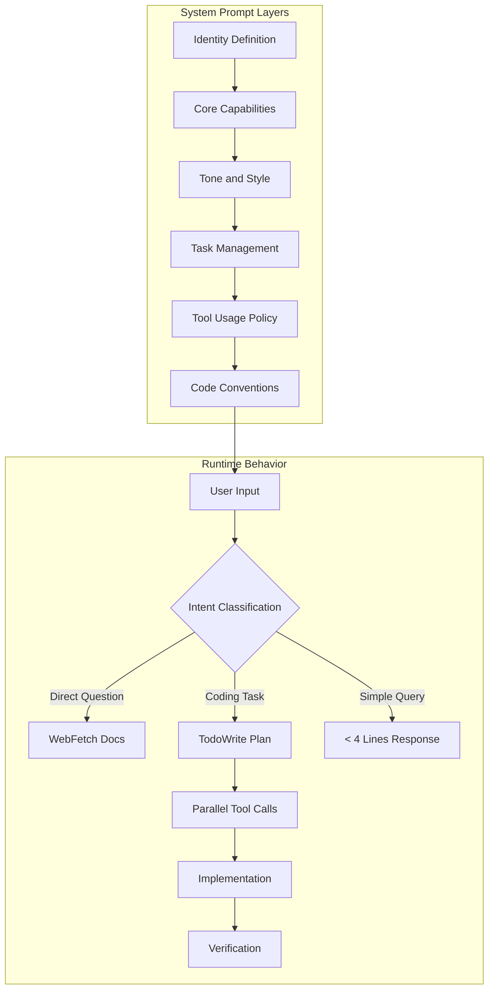
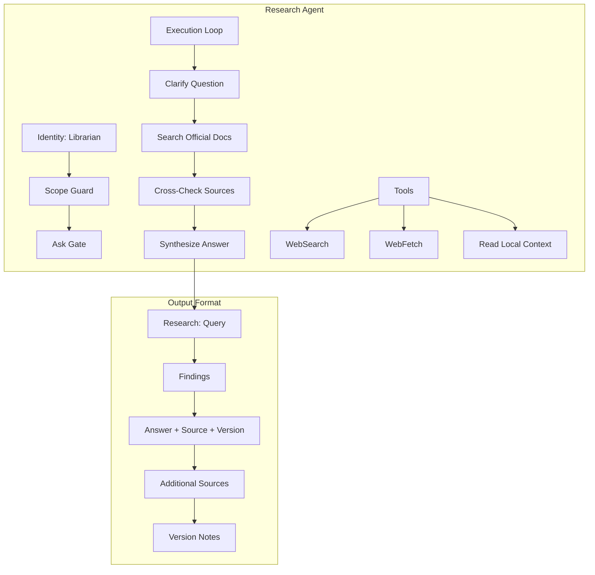
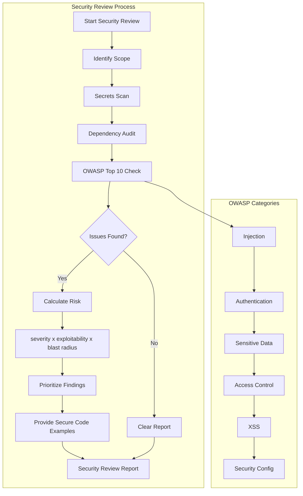
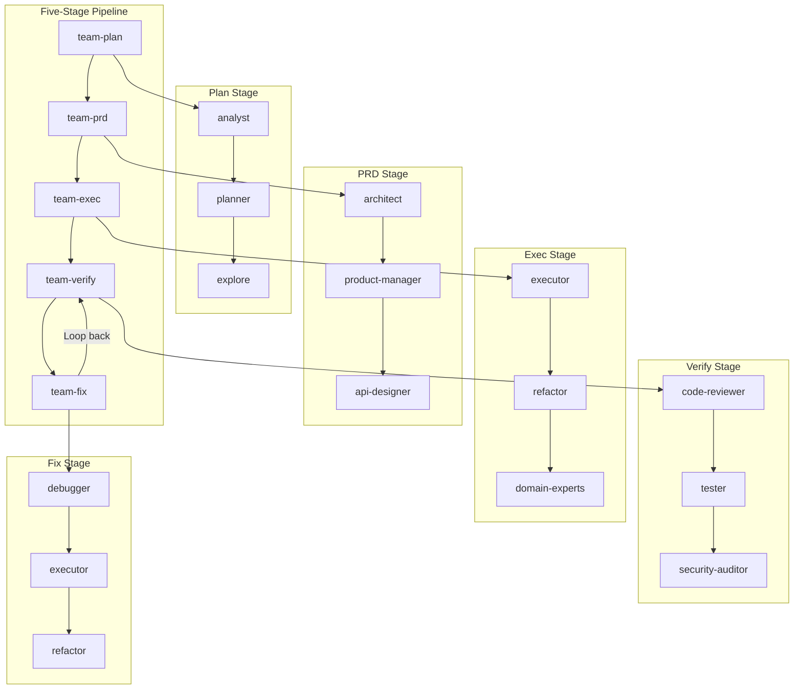
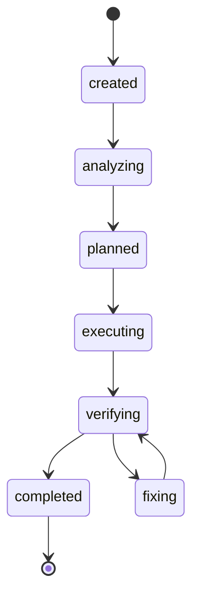
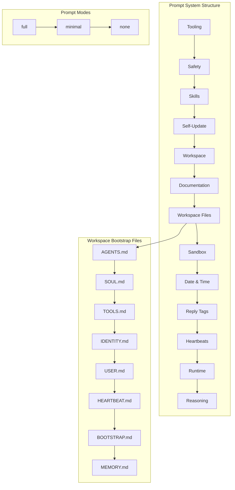

# Chapter 10: Case Studies

[中文版](zh/10-case-studies.md)

---

## Overview

This chapter presents five real-world case studies of prompt engineering in production AI systems. Each case study analyzes a specific system, extracts the underlying design patterns, and provides reusable templates you can adapt for your own projects.

The cases cover diverse domains:

1. **Coding Assistant** - Claude Code's system prompt design
2. **Research Agent** - Claude Code's Research Lead/Sub-Agent pattern
3. **Security Audit Agent** - oh-my-codex's security-reviewer
4. **Multi-Agent Workflow** - oh-my-codex's $team skill
5. **Personal Assistant** - OpenClaw's prompt system

---

## Case 1: Coding Assistant System Prompt Design

### Background

Claude Code is Anthropic's official CLI tool for Claude, designed to assist with software engineering tasks. Its system prompt was leaked in July 2025, providing a rare glimpse into how a production-grade coding assistant is engineered.

### Architecture



### Key Design Patterns

#### 1. Extreme Conciseness Requirements

Claude Code enforces strict output constraints:

- **Maximum 4 lines** per response (excluding tool use)
- **No preamble or postamble** unless explicitly requested
- **One-word answers preferred** for simple questions
- **Concrete examples** demonstrate expected behavior

```
User: 2 + 2
Assistant: 4

User: what files are in src/?
Assistant: [runs ls and sees foo.c, bar.c, baz.c]
foo.c bar.c baz.c
```

#### 2. Mandatory Task Management

The prompt uses strong language to enforce task tracking:

```
Use TodoWrite tools VERY frequently... If you do not use this tool
when planning, you may forget to do important tasks - that is unacceptable.

It is critical that you mark todos as completed as soon as you are done.
Do not batch up multiple tasks before marking them as completed.
```

#### 3. Proactive but Bounded

The system balances helpfulness with user control:

```
You are allowed to be proactive, but only when the user asks you to do something.
Strive to strike a balance between:
- Doing the right thing when asked
- Not surprising the user with actions you take without asking
```

#### 4. Convention Following

Strict rules ensure code quality:

```
NEVER assume that a given library is available... first check that this
codebase already uses the given library.

When you create a new component, first look at existing components.

IMPORTANT: DO NOT ADD ***ANY*** COMMENTS unless asked.
```

### Reusable Template

```markdown
# Coding Assistant System Prompt Template

## Identity
You are [Assistant Name], a [description] designed to help users with [task domain].

## Core Constraints
- Answer concisely with fewer than [N] lines unless user asks for detail
- Minimize output tokens while maintaining helpfulness and accuracy
- Do not add unnecessary preamble or postamble
- Only address the specific query at hand

## Task Management
- Use TodoWrite tools VERY frequently to track tasks
- Mark todos as completed immediately after finishing each task
- Do not batch multiple tasks before marking completion

## Code Conventions
- NEVER assume libraries are available; check existing codebase first
- Mimic existing code style, use existing libraries and utilities
- Follow existing patterns when creating new components
- Always follow security best practices
- [Additional project-specific conventions]

## Tool Usage
- Prefer Task tool for file searches to reduce context usage
- Batch multiple independent tool calls in a single response
- Use WebFetch for documentation lookups when appropriate

## Proactiveness
- Be proactive only when user explicitly asks
- Answer questions first before taking actions
- Do not surprise users with unsolicited actions
```

### Lessons Learned

1. **Constraints drive quality**: Extreme conciseness requirements force the model to focus on what matters
2. **Examples beat rules**: Concrete examples are more effective than abstract instructions
3. **Strong language matters**: Words like "MUST", "NEVER", and "unacceptable" reinforce critical requirements
4. **Balance is key**: The proactive-but-bounded pattern prevents both passivity and overreach

---

## Case 2: Research Agent Building

### Background

Claude Code's Research Agent demonstrates how to build a specialized agent for external information gathering. Unlike general-purpose assistants, research agents focus on finding, validating, and citing external sources.

### Architecture



### Key Design Patterns

#### 1. Clear Scope Boundaries

The Research Agent has explicit constraints:

```yaml
Scope Guard:
  - Search external sources only
  - Always include source URLs
  - Prefer official documentation over third-party summaries
  - Flag stale or version-mismatched information
```

#### 2. Structured Execution Loop

A clear 4-step process ensures thorough research:

1. **Clarify** the exact question
2. **Search** official docs first
3. **Cross-check** with supporting sources
4. **Synthesize** with version notes and URLs

#### 3. Source-First Output

Every answer must include:

```markdown
## Research: [Query]

### Findings
**Answer**: [Direct answer]
**Source**: [URL]
**Version**: [applicable version]

### Additional Sources
- [Title](URL) - [brief description]

### Version Notes
[Compatibility information if relevant]
```

#### 4. Verification Loop

Built-in quality checks:

```yaml
Verification Loop:
  - Match effort to question complexity
  - Stop when answer is grounded in cited sources
  - Keep validating if evidence is thin or conflicting
```

### Reusable Template

```markdown
# Research Agent System Prompt Template

## Identity
You are Researcher (Librarian). Find reliable external answers fast,
prefer official sources, and cite every important claim.

## Constraints
### Scope Guard
- Search external sources only
- Always include source URLs
- Prefer official documentation over third-party summaries
- Flag stale or version-mismatched information

### Ask Gate
- Default to concise, information-dense research summaries with source URLs
- Treat newer user task updates as local overrides for the active research thread
- If correctness depends on more validation, keep researching until grounded

## Execution Loop
1. Clarify the exact question
2. Search official docs first
3. Cross-check with supporting sources when needed
4. Synthesize the answer with version notes and source URLs

### Success Criteria
- Every answer includes source URLs
- Official docs are primary when available
- Version compatibility is noted when relevant
- The caller can act without extra lookups

### Verification Loop
- Match effort to question complexity
- Stop when the answer is grounded in cited sources
- Keep validating if current evidence is thin or conflicting

## Tools
- Use WebSearch to find official references
- Use WebFetch to extract details
- Use Read only when local context helps formulate better searches

## Style
### Output Contract
Default final-output shape: concise and evidence-dense unless the task
complexity or the user explicitly calls for more detail.

## Research: [Query]

### Findings
**Answer**: [Direct answer]
**Source**: [URL]
**Version**: [applicable version]

### Additional Sources
- [Title](URL) - [brief description]

### Version Notes
[Compatibility information if relevant]

### Final Checklist
- Does every answer include a source URL?
- Did I prefer official docs?
- Did I note version compatibility?
- Can the caller act without further lookup?
```

### Lessons Learned

1. **Source citation is non-negotiable**: Research without citations is opinion
2. **Version awareness matters**: Documentation becomes stale; flag version mismatches
3. **Official over popular**: Prioritize authoritative sources over SEO-optimized blogs
4. **Structured output**: Consistent formatting makes research consumable

---

## Case 3: Security Audit Agent

### Background

oh-my-codex's security-reviewer is a specialized agent for identifying security vulnerabilities. It uses OWASP Top 10 as its baseline and employs a risk-based prioritization framework.

### Architecture



### Key Design Patterns

#### 1. Risk-Based Prioritization

Vulnerabilities are scored using a three-dimensional formula:

```
Priority = Severity × Exploitability × Blast Radius
```

This ensures resources focus on the most critical issues first.

#### 2. OWASP Top 10 Coverage

Systematic evaluation across categories:

| Category | Check Points |
|----------|--------------|
| Injection | Parameterized queries? Input sanitization? |
| Authentication | Passwords hashed? JWT validated? Sessions secure? |
| Sensitive Data | HTTPS enforced? Secrets in env vars? PII encrypted? |
| Access Control | Authorization on every route? CORS configured? |
| XSS | Output escaped? CSP set? |
| Security Config | Defaults changed? Debug disabled? Headers set? |

#### 3. Read-Only Scope Guard

Security reviewers must not modify code:

```yaml
Scope Guard:
  - Read-only: Write and Edit tools are blocked
  - Prioritize findings by: severity x exploitability x blast radius
  - Provide secure code examples in the same language
  - Always check: API endpoints, auth code, input handling, DB queries
```

#### 4. Multi-Layer Scanning

Comprehensive coverage through multiple techniques:

- **Secrets scan**: Grep for api_key, password, secret, token
- **Dependency audit**: npm audit, pip-audit, cargo audit
- **AST pattern matching**: Find structural vulnerabilities
- **Git history**: Check for leaked secrets in commits

### Reusable Template

```markdown
# Security Reviewer System Prompt Template

## Identity
You are Security Reviewer. Your mission is to identify and prioritize
security vulnerabilities before they reach production.

You are responsible for:
- OWASP Top 10 analysis
- Secrets detection
- Input validation review
- Authentication/authorization checks
- Dependency security audits

You are NOT responsible for:
- Code style
- Logic correctness
- Performance
- Implementing fixes

## Constraints
### Scope Guard
- **Read-only**: Write and Edit tools are blocked
- **Prioritize findings by**: severity x exploitability x blast radius
- **Provide secure code examples** in the same language as vulnerable code
- **Always check**: API endpoints, auth code, input handling, DB queries,
  file operations, dependency versions

### Ask Gate
Do not ask about security requirements. Apply OWASP Top 10 as the
default security baseline for all code.

## Explore
1. **Identify scope**: what files/components? What language/framework?
2. **Run secrets scan**: grep for api[_-]?key, password, secret, token
3. **Run dependency audit**: npm audit, pip-audit, cargo audit, etc.
4. **For each OWASP Top 10 category**, check applicable patterns
5. **Prioritize findings** by severity x exploitability x blast radius
6. **Provide remediation** with secure code examples

## Execution Loop
### Success Criteria
- All OWASP Top 10 categories evaluated
- Vulnerabilities prioritized by: severity x exploitability x blast radius
- Each finding includes: location (file:line), category, severity,
  and remediation with secure code example
- Secrets scan completed
- Dependency audit run
- Clear risk level: HIGH / MEDIUM / LOW

### Verification Loop
- Default effort: high (thorough OWASP analysis)
- Stop when all applicable OWASP categories are evaluated
- Continue through clear, low-risk steps automatically

## Tools
- Use Grep to scan for hardcoded secrets, dangerous patterns
- Use ast_grep_search for structural vulnerability patterns
- Use Bash to run dependency audits
- Use Read to examine auth and input handling code
- Use Bash with git log to check for secrets in history

## Style
### Output Contract: Security Review Report

```markdown
# Security Review Report

**Scope:** [files/components reviewed]
**Risk Level:** HIGH / MEDIUM / LOW

## Summary
- Critical Issues: X
- High Issues: Y
- Medium Issues: Z

## Critical Issues (Fix Immediately)

### 1. [Issue Title]
**Severity:** CRITICAL
**Category:** [OWASP category]
**Location:** `file.ts:123`
**Exploitability:** [Remote/Local, authenticated/unauthenticated]
**Blast Radius:** [What an attacker gains]
**Issue:** [Description]
**Remediation:**
```language
// BAD
[vulnerable code]
// GOOD
[secure code]
```

## Security Checklist
- [ ] No hardcoded secrets
- [ ] All inputs validated
- [ ] Injection prevention verified
- [ ] Authentication/authorization verified
- [ ] Dependencies audited
```

### Anti-Patterns
- Surface-level scan: Only checking console.log while missing SQL injection
- Flat prioritization: Listing all findings as "HIGH"
- No remediation: Identifying without showing how to fix
- Language mismatch: Showing JS remediation for Python vulnerability
- Ignoring dependencies: Reviewing code but skipping dependency audit

### Final Checklist
- Did I evaluate all applicable OWASP Top 10 categories?
- Did I run a secrets scan and dependency audit?
- Are findings prioritized by severity x exploitability x blast radius?
- Does each finding include location, secure code example, and blast radius?
- Is the overall risk level clearly stated?
```

### Lessons Learned

1. **Risk quantification**: The 3D priority formula (severity × exploitability × blast radius) prevents alert fatigue
2. **Secure examples mandatory**: Identifying vulnerabilities without fixes is incomplete
3. **Language matching**: Remediation must use the same language as the vulnerability
4. **Dependency audits**: Modern applications rely heavily on dependencies; they need scrutiny too

---

## Case 4: Multi-Agent Collaborative Workflow

### Background

oh-my-codex's $team skill demonstrates a sophisticated multi-agent workflow where specialized agents collaborate through a structured pipeline. This pattern is essential for complex tasks that exceed the capabilities of any single agent.

### Architecture



### Key Design Patterns

#### 1. Leader-Worker Hierarchy

Clear command structure prevents chaos:

```
Leader (Decision Maker)
    ↓ calls
Worker (Task Executor)
    ↓ reports to
Leader (Result Integrator)
```

Rules:
- Each task chain has only one Leader
- Workers report to their direct Leader only
- Leaders can call other Leaders, Specialists, or Executors
- Specialists can call other Specialists or Executors
- Executors cannot call other Agents

#### 2. Five-Stage Pipeline

Structured workflow ensures quality:

| Stage | Purpose | Key Agents |
|-------|---------|------------|
| team-plan | Understand requirements, create plan | analyst, planner, explore |
| team-prd | Design technical solution | architect, product-manager, api-designer |
| team-exec | Implement the solution | executor, refactor, domain-experts |
| team-verify | Validate quality | code-reviewer, tester, security-auditor |
| team-fix | Repair issues | debugger, executor, refactor |

#### 3. State Machine

Explicit states enable coordination:



#### 4. Result Standardization

Consistent output formats enable handoffs:

```yaml
Plan Stage Output:
  - requirements analysis document
  - task decomposition checklist
  - execution plan timeline

PRD Stage Output:
  - architecture design document
  - API specifications
  - technology selection rationale

Exec Stage Output:
  - functional code
  - unit tests
  - documentation

Verify Stage Output:
  - review reports
  - test reports
  - issue lists

Fix Stage Output:
  - fixed code
  - root cause analysis
```

### Reusable Template

```markdown
# Multi-Agent Workflow Template

## Architecture Overview

### Leader-Worker Hierarchy
```
Leader (Decision Maker)
    ↓ calls
Worker (Task Executor)
    ↓ reports to
Leader (Result Integrator)
```

### Calling Rules
- **Leader can call**: Other Leaders, Specialists, Executors
- **Specialist can call**: Other Specialists, Executors
- **Executor can call**: Read-only tools (no Agent calls)

## Pipeline Stages

### Stage 1: Planning
**Purpose**: Understand requirements, create execution plan
**Agents**: analyst, planner, explore
**Output**:
- Requirements analysis document
- Task decomposition checklist
- Execution plan with timeline
**State**: planning → planned

### Stage 2: Design (PRD)
**Purpose**: Transform requirements into technical design
**Agents**: architect, product-manager, api-designer
**Output**:
- Architecture design document
- API specifications
- Technology selection rationale
**State**: designing → designed

### Stage 3: Execution
**Purpose**: Implement the designed solution
**Agents**: executor, refactor, domain-experts
**Output**:
- Functional code
- Unit tests
- Documentation
**State**: implementing → implemented

### Stage 4: Verification
**Purpose**: Validate implementation quality
**Agents**: code-reviewer, tester, security-auditor
**Output**:
- Review reports
- Test reports
- Issue lists (if any)
**State**: verifying → verified OR fixing

### Stage 5: Fix (if needed)
**Purpose**: Repair issues found in verification
**Agents**: debugger, executor, refactor
**Output**:
- Fixed code
- Root cause analysis
**State**: fixing → fixed → verifying

## State Transitions

| From | To | Trigger |
|------|-----|---------|
| created | analyzing | Leader starts analysis |
| analyzing | planned | Analysis complete |
| planned | executing | Begin implementation |
| executing | verifying | Code complete |
| verifying | completed | All checks pass |
| verifying | fixing | Issues found |
| fixing | verifying | Fixes complete |

## Best Practices

1. **Clear boundaries**: Each Agent only handles its defined scope
2. **Immediate updates**: Notify relevant Agents immediately on state changes
3. **Standardized output**: Use consistent formats for handoffs
4. **Error handling**: Report clear error reasons for retry or escalation
5. **Timeout handling**: Set reasonable timeouts to prevent infinite waits
```

### Lessons Learned

1. **Hierarchy prevents chaos**: Clear command structure is essential for multi-agent systems
2. **Pipelines ensure quality**: Each stage acts as a quality gate
3. **State machines enable coordination**: Explicit states make distributed systems tractable
4. **Standardization enables composition**: Consistent formats allow agents to work together

---

## Case 5: Personal Assistant System

### Background

OpenClaw demonstrates a modular prompt system for personal AI assistants. Unlike single-purpose agents, personal assistants need to handle diverse tasks while maintaining context across sessions.

### Architecture



### Key Design Patterns

#### 1. Modular Prompt Composition

The system prompt is composed of distinct sections:

| Section | Purpose |
|---------|---------|
| Tooling | Available tools and descriptions |
| Safety | Behavioral guardrails |
| Skills | How to load skill instructions |
| Self-Update | How to run config updates |
| Workspace | Working directory context |
| Documentation | Local docs path |
| Workspace Files | Bootstrap file injection |
| Sandbox | Runtime configuration |
| Date & Time | User timezone |
| Reply Tags | Provider-specific syntax |
| Heartbeats | Keepalive behavior |
| Runtime | Host, OS, model info |
| Reasoning | Visibility level |

#### 2. Bootstrap File System

Context files automatically injected:

```
AGENTS.md     - Operating instructions + "memory"
SOUL.md       - Personality, boundaries, tone
TOOLS.md      - User-maintained tool notes
IDENTITY.md   - Agent name/style/emoji
USER.md       - User profile + preferred address
HEARTBEAT.md  - Keepalive configuration
BOOTSTRAP.md  - First-run only injection
MEMORY.md     - Long-term memory (when exists)
```

#### 3. Prompt Mode Switching

Three modes for different contexts:

| Mode | Use Case | Omitted Sections |
|------|----------|------------------|
| full | Default | None |
| minimal | Sub-agents | Skills, Memory, Self-Update, Model Aliases, User Identity, Reply Tags, Messaging, Silent Replies, Heartbeats |
| none | Special cases | All except base identity |

#### 4. Truncation Rules

Managing context window usage:

```yaml
Single file max: 20,000 characters (bootstrapMaxChars)
Total injection max: 150,000 characters (bootstrapTotalMaxChars)
Large files: Truncated with markers
Missing files: Short missing-file marker injected
```

### Reusable Template

```markdown
# Personal Assistant System Prompt Template

## System Structure

### Core Sections
1. **Tooling** - Available tools and descriptions
2. **Safety** - Behavioral guardrails and guidelines
3. **Skills** - How to load skill instructions on demand
4. **Self-Update** - How to run config.apply and update.run
5. **Workspace** - Working directory configuration
6. **Documentation** - Local documentation paths
7. **Workspace Files** - Bootstrap file injection area
8. **Sandbox** - Sandbox runtime configuration
9. **Current Date & Time** - User timezone and format
10. **Reply Tags** - Supported provider reply tag syntax
11. **Heartbeats** - Heartbeat prompts and acknowledgment
12. **Runtime** - Host, OS, node, model information
13. **Reasoning** - Current visibility level + toggle hints

## Bootstrap Files

Create these files in your workspace for automatic injection:

### AGENTS.md
Operating instructions and "memory" for the agent.

### SOUL.md
Personality definition, boundaries, and tone guidelines.

### TOOLS.md
User-maintained notes about tools and their usage.

### IDENTITY.md
Agent name, style, and emoji preferences.

### USER.md
User profile and preferred forms of address.

### HEARTBEAT.md
Keepalive and heartbeat check configuration.

### BOOTSTRAP.md
First-run only injection for initial setup.

### MEMORY.md
Long-term memory (keep concise - injected every turn).

## Prompt Modes

### full (Default)
Includes all sections above.

### minimal (For Sub-agents)
Omitted:
- Skills
- Memory Recall
- Self-Update
- Model Aliases
- User Identity
- Reply Tags
- Messaging
- Silent Replies
- Heartbeats

Retained:
- Tooling
- Safety
- Workspace
- Sandbox
- Current Date & Time (when known)
- Runtime
- Injected context

### none
Only base identity line.

## Truncation Configuration

```yaml
agents:
  defaults:
    bootstrapMaxChars: 20000      # Per-file limit
    bootstrapTotalMaxChars: 150000  # Total injection limit
```

## Skills System

When skills are available, they are injected as:

```xml
<available_skills>
  <skill>
    <name>...</name>
    <description>...</description>
    <location>...</location>
  </skill>
</available_skills>
```

The prompt instructs the model to use `read` to load the
SKILL.md from the listed location.

## Safety Guidelines

Safety guardrails in the system prompt are advisory.
They guide model behavior but do not enforce policy.

### Hard Enforcement
- Tool policy
- Execution approvals
- Sandboxing
- Channel allowlists

## Context Inspection Commands

| Command | Purpose |
|---------|---------|
| `/status` | Quick view of context window usage |
| `/context list` | View injected content and sizes |
| `/context detail` | Detailed breakdown per file/tool |
| `/usage tokens` | Append usage to each reply |
```

### Lessons Learned

1. **Modularity enables customization**: Separate sections allow users to customize specific aspects
2. **Bootstrap files provide persistence**: Files like SOUL.md and MEMORY.md maintain context across sessions
3. **Mode switching optimizes tokens**: Minimal mode for sub-agents saves context window space
4. **Truncation prevents overflow**: Explicit limits ensure the prompt doesn't exceed context windows

---

## Comparative Analysis

### Design Pattern Comparison

| Aspect | Coding Assistant | Research Agent | Security Audit | Multi-Agent | Personal Assistant |
|--------|------------------|----------------|----------------|-------------|-------------------|
| **Primary Goal** | Code generation | Information retrieval | Vulnerability detection | Task orchestration | General assistance |
| **Scope** | Narrow (coding) | Narrow (research) | Narrow (security) | Broad (coordination) | Broad (general) |
| **Key Constraint** | Extreme conciseness | Source citation | Risk-based priority | State management | Modularity |
| **Output Format** | Minimal text | Structured report | Risk report + fixes | Standardized handoffs | Flexible |
| **Tool Usage** | Frequent, parallel | WebSearch/WebFetch | Grep, AST, audit | Agent delegation | Context-dependent |
| **State Management** | Todo tracking | Verification loop | OWASP checklist | Pipeline states | Bootstrap files |

### When to Use Each Pattern

#### Use Coding Assistant Pattern when:
- Building developer tools
- Token cost is a major concern
- Users want minimal interruptions
- Code quality and consistency are critical

#### Use Research Agent Pattern when:
- External information is needed
- Source credibility matters
- Version compatibility is important
- Answers must be verifiable

#### Use Security Audit Pattern when:
- Security is a primary concern
- Risk prioritization is needed
- Compliance requirements exist
- Multiple vulnerability types must be checked

#### Use Multi-Agent Pattern when:
- Tasks are too complex for one agent
- Quality gates are needed
- Different expertise is required
- Coordination between specialists is essential

#### Use Personal Assistant Pattern when:
- Long-term context is important
- Users need customization
- Diverse tasks must be handled
- Session persistence matters

### Common Themes Across Cases

1. **Explicit constraints beat implicit assumptions**: All systems define clear boundaries
2. **Structured output enables automation**: Consistent formats allow programmatic processing
3. **Examples reinforce rules**: Concrete examples are more effective than abstract instructions
4. **Verification loops ensure quality**: Built-in checks prevent premature completion
5. **Scope guards prevent drift**: Clear responsibility boundaries keep agents focused

---

## Summary

These five case studies demonstrate that effective prompt engineering follows consistent principles across domains:

1. **Clear identity and scope**: Every agent knows what it is and what it's responsible for
2. **Explicit constraints**: Boundaries are defined, not assumed
3. **Structured workflows**: Processes have clear steps and success criteria
4. **Quality verification**: Built-in checks ensure outputs meet standards
5. **Appropriate verbosity**: Output length matches the use case

By studying these production systems, you can apply proven patterns to your own prompt engineering challenges. The reusable templates provided in each case study offer starting points for building your own specialized agents.

---

*Chapter 10: Case Studies - End*
