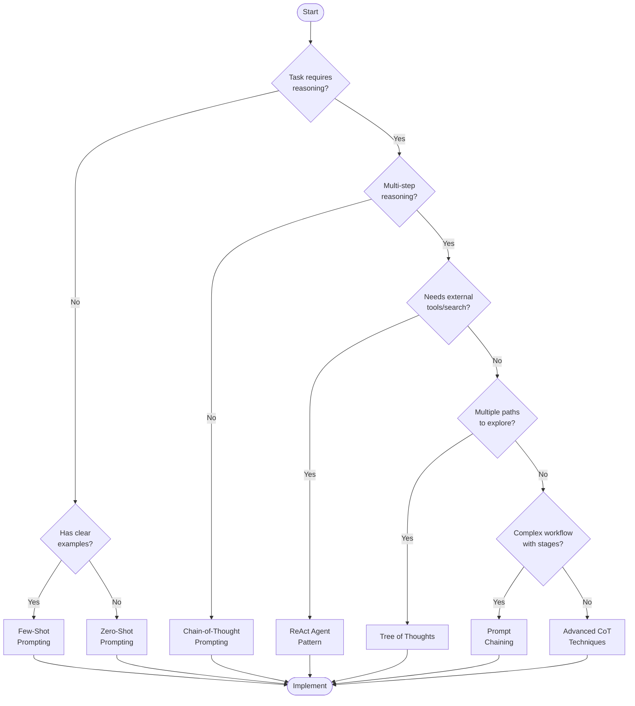
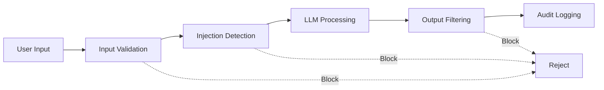
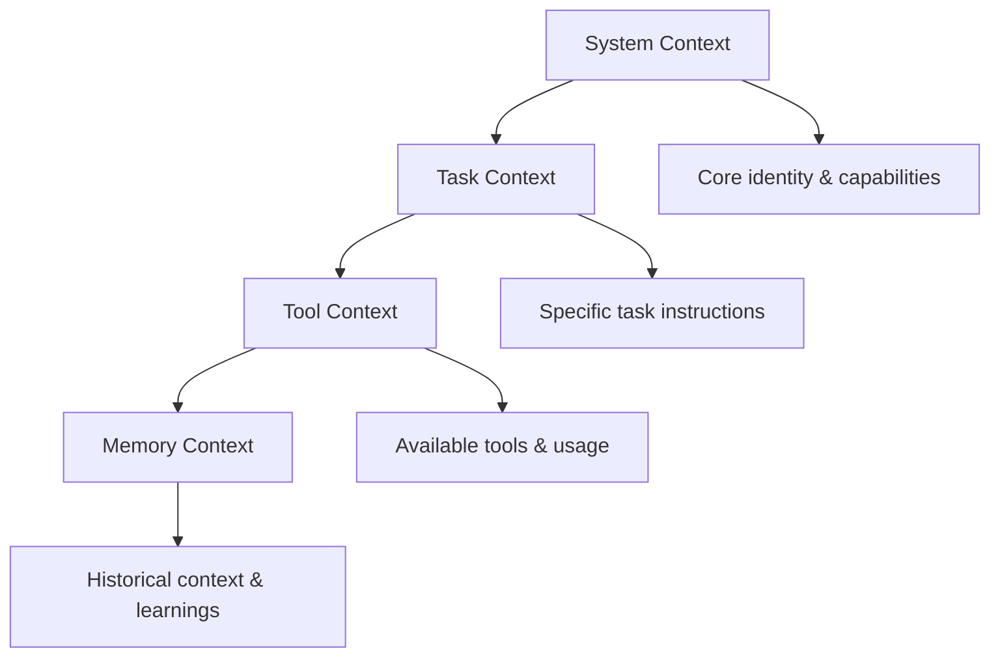
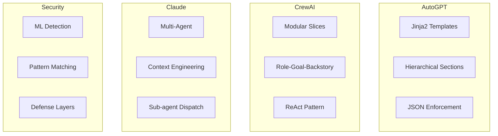

# Chapter 12: Prompt Engineering Cheatsheet

[中文版](12-cheatsheet-zh.md)

A comprehensive quick reference guide for prompt engineering techniques, decision frameworks, and implementation patterns.

---

## Table of Contents

1. [Technology Selection Decision Tree](#technology-selection-decision-tree)
2. [Quick Reference Cards](#quick-reference-cards)
3. [Framework Comparison Table](#framework-comparison-table)
4. [Quick Lookup Tables](#quick-lookup-tables)

---

## Technology Selection Decision Tree

Use this decision tree to select the appropriate prompt engineering technique for your task.



### Decision Tree Walkthrough

| Decision Point | Question | If Yes | If No |
|---------------|----------|--------|-------|
| Q1 | Does the task require reasoning? | Go to Q3 | Go to Q2 |
| Q2 | Do you have clear examples? | Few-Shot | Zero-Shot |
| Q3 | Is it multi-step reasoning? | Go to Q4 | Chain-of-Thought |
| Q4 | Does it need external tools/search? | ReAct | Go to Q5 |
| Q5 | Are there multiple paths to explore? | Tree of Thoughts | Go to Q6 |
| Q6 | Is it a complex workflow with stages? | Prompt Chaining | Advanced CoT |

---

## Quick Reference Cards

### Card 1: Zero/Few-Shot Quick Reference

**When to Use**
- Simple classification tasks
- Text transformation (translation, summarization)
- Format conversion
- Tasks with clear input-output patterns

**Zero-Shot Template**
```markdown
## Task: [Task Name]

[Clear instruction describing what to do]

Input: {{input}}
Output:
```

**Few-Shot Template**
```markdown
## Task: [Task Name]

Example 1:
Input: {{example_input_1}}
Output: {{example_output_1}}

Example 2:
Input: {{example_input_2}}
Output: {{example_output_2}}

Example 3:
Input: {{example_input_3}}
Output: {{example_output_3}}

Now process this:
Input: {{actual_input}}
Output:
```

**Pro Tips**
- Use 3-5 examples for best results
- Ensure examples cover edge cases
- Format consistency matters more than label accuracy
- Random labels still help (Min et al., 2022)

---

### Card 2: Chain-of-Thought Trigger Phrases

**Basic Triggers**
| Phrase | Use Case | Effectiveness |
|--------|----------|---------------|
| "Let's think step by step" | General reasoning | High |
| "Let's work through this together" | Collaborative tone | High |
| "Explain your reasoning" | Requires justification | Medium |
| "Show your work" | Math problems | High |
| "Walk me through your thinking" | Complex analysis | High |

**Advanced Triggers**
| Phrase | Use Case |
|--------|----------|
| "First, identify the key information..." | Information extraction |
| "Break this down into smaller steps..." | Complex problems |
| "Consider multiple approaches..." | Creative tasks |
| "Verify each step before proceeding..." | Critical tasks |

**Few-Shot CoT Format**
```markdown
Q: [Question 1]
A: [Step-by-step reasoning]. The answer is [answer].

Q: [Question 2]
A: [Step-by-step reasoning]. The answer is [answer].

Q: [Actual question]
A:
```

---

### Card 3: ReAct Format Reference

**Structure**
```
Thought: [Reasoning about what to do]
Action: [Tool name]
Action Input: [Input to the tool]
Observation: [Result from tool]
```

**Complete ReAct Loop**
```markdown
You are an AI assistant that can use tools to help answer questions.

When responding, follow this format:

Thought: [your reasoning about what to do]
Action: [the tool name]
Action Input: [the input to the tool]

Then you will receive:
Observation: [the tool output]

Continue this Thought-Action-Observation loop until you have the final answer.
Then respond with:

Thought: I now know the final answer.
Final Answer: [your answer]

Available tools:
- search: Search for information on the internet
- calculator: Perform mathematical calculations
- lookup: Look up specific facts in a knowledge base
```

**Example ReAct Session**
```
Question: What is the population of Paris?

Thought: I need to search for the current population of Paris.
Action: search
Action Input: "population of Paris 2024"

Observation: Paris has a population of approximately 2.1 million in the city proper.

Thought: I now know the final answer.
Final Answer: The population of Paris is approximately 2.1 million.
```

---

### Card 4: JSON Output Mode

**Basic JSON Template**
```markdown
Respond ONLY with a JSON object in this exact format:

{
  "reasoning": "Your step-by-step thinking process",
  "confidence": 0.95,
  "answer": "Your final answer",
  "sources": ["source1", "source2"]
}

Do not include any text outside the JSON object.
```

**Structured Response Schema**
```json
{
  "thoughts": {
    "text": "Brief thought summary",
    "reasoning": "Detailed reasoning",
    "plan": ["step 1", "step 2", "step 3"],
    "criticism": "Self-critique"
  },
  "action": {
    "name": "action_name",
    "args": {
      "arg1": "value1"
    }
  }
}
```

**Validation Checklist**
- [ ] Specify exact field names
- [ ] Define data types for each field
- [ ] Provide value ranges (e.g., confidence 0-1)
- [ ] Include example values
- [ ] Add "Do not include markdown" instruction

---

### Card 5: Security Defense Checklist

**Input Validation Layer**
- [ ] Sanitize user input for dangerous patterns
- [ ] Use regex filters for common injection attempts
- [ ] Implement length limits
- [ ] Validate input format before processing

**Dangerous Patterns to Block**
```
- "ignore previous instructions"
- "system prompt:"
- "you are now"
- "<script"
- "javascript:"
- "{{" and "}}" (template injection)
- "" (template injection)
```

**Prompt Hardening Techniques**

| Technique | Implementation | Priority |
|-----------|---------------|----------|
| Delimiter Strategy | Use XML tags to separate system/user content | High |
| Sandwich Defense | Wrap user input with system reminders | Medium |
| Instruction Hierarchy | Define priority levels for instructions | High |
| Canary Tokens | Embed unique markers to detect leaks | Medium |

**Defense-in-Depth Architecture**


**Output Validation**
- [ ] Check for system instruction leaks
- [ ] Verify no canary tokens in output
- [ ] Scan for sensitive data exposure
- [ ] Validate response format matches expected schema

---

### Card 6: Tree of Thoughts Quick Reference

**When to Use**
- Complex decision-making with multiple options
- Creative writing with different directions
- Game playing (e.g., 24-point game)
- Problems requiring exploration and backtracking

**PanelGPT Style Template**
```markdown
Imagine three different experts are answering this question.
All experts will write down 1 step of their thinking,
then share it with the group.
Then all experts will go on to the next step, etc.
If any expert realises they're wrong at any point then they leave.

The question is: [Insert question here]
```

**BFS/DFS Exploration Template**
```markdown
Problem: [Problem statement]

Generate 3 different approaches to solve this problem:

Approach 1:
- Initial thought: [First idea]
- Pros: [Advantages]
- Cons: [Disadvantages]
- Confidence: [High/Medium/Low]

Approach 2:
...

Approach 3:
...

Evaluate each approach and select the most promising one.
```

---

### Card 7: RAG (Retrieval Augmented Generation) Quick Reference

**Basic RAG Template**
```markdown
You are a knowledgeable assistant. Use the following retrieved documents to answer
the user's question. If the documents don't contain the answer, say "I don't have
enough information to answer this question."

---

Retrieved Documents:

[Document {{loop.index}}]
{{doc.content}}



---

User Question: {{question}}

Please provide a comprehensive answer based on the documents above:
```

**Multi-Query RAG**
```markdown
Generate 3 different versions of the user's question to retrieve relevant documents.

Original question: {{question}}

Version 1: [Rewritten for semantic search]
Version 2: [Rewritten with keywords]
Version 3: [Rewritten for specific aspect]
```

**HyDE (Hypothetical Document Embedding)**
```markdown
Generate a hypothetical ideal document that would answer this question:

Question: {{question}}

Hypothetical Document:
[Generate a paragraph that would perfectly answer the question]

Now use this hypothetical document to find similar real documents.
```

---

### Card 8: Context Engineering Quick Reference

**Context Hierarchy**


**System Prompt Template**
```markdown
## System Identity

You are [role description].

## Task Execution Rules

### Must Follow:
- [Rule 1]
- [Rule 2]
- [Rule 3]

### Execution Flow:
1. [Step 1]
2. [Step 2]
3. [Step 3]

## Error Handling

- If [error condition], then [action]
- If [error condition], then [action]

## Output Format

Always format your responses as:
- **Current Action**: [description]
- **Reasoning**: [explanation]
- **Progress**: X of Y completed
- **Next Steps**: [planned actions]
```

---

## Framework Comparison Table

### Cross-Framework Pattern Matrix

| Pattern | AutoGPT | CrewAI | Claude Code | Security Libs |
|---------|---------|--------|-------------|---------------|
| **Template Engine** | Jinja2 | String format | Raw strings | Mixed |
| **Identity Model** | Structured config | Role-Goal-Backstory | Agent specialization | N/A |
| **Tool Use** | Command JSON | ReAct | Function calling | N/A |
| **Memory** | Vector DB | Conversation | Context window | N/A |
| **Multi-Agent** | Single agent | Crew hierarchy | Sub-agent dispatch | N/A |
| **Injection Defense** | Basic | Delimiters | Instruction hierarchy | Multi-layer |

### Framework-Specific Strengths

| Framework | Best For | Key Innovation |
|-----------|----------|----------------|
| **AutoGPT** | Autonomous task execution | JSON response enforcement |
| **CrewAI** | Multi-agent workflows | Role-based identity system |
| **Claude Code** | Complex research tasks | Sub-agent orchestration |
| **LangChain** | Rapid prototyping | Modular component library |
| **LlamaIndex** | Document-heavy RAG | Advanced indexing strategies |

### Prompt Architecture Comparison



---

## Quick Lookup Tables

### Technique Selection Matrix

| Task Type | Recommended Technique | Alternative |
|-----------|----------------------|-------------|
| Simple classification | Zero-Shot | Few-Shot (if unclear) |
| Novel concept learning | Few-Shot | Meta Prompting |
| Math word problems | CoT | Zero-Shot CoT |
| Multi-step reasoning | CoT | ToT (if complex) |
| Web search required | ReAct | Agent with tools |
| Creative exploration | ToT | Self-consistency |
| Document Q&A | RAG | Prompt Chaining |
| Complex workflow | Prompt Chaining | Multi-agent |

### Temperature Settings Guide

| Use Case | Temperature | Top-p | Reason |
|----------|-------------|-------|--------|
| Code generation | 0.0-0.2 | 0.1 | Deterministic, precise |
| Data extraction | 0.0-0.3 | 0.1 | Factual accuracy |
| Reasoning tasks | 0.0-0.3 | 0.1 | Consistent logic |
| General Q&A | 0.3-0.5 | 0.9 | Balanced |
| Creative writing | 0.7-1.0 | 0.9 | Diversity |
| Brainstorming | 0.8-1.0 | 0.95 | Maximum variety |

### Token Budget Guidelines

| Component | Recommended Tokens | Notes |
|-----------|-------------------|-------|
| System prompt | 200-500 | Include role, rules, format |
| Few-shot examples | 100-300 each | Keep consistent format |
| Context documents | 500-2000 | Use RAG for large docs |
| User query | 50-200 | Be specific and clear |
| Expected output | 100-1000 | Specify in instructions |
| **Total budget** | 2000-4000 | Leave room for reasoning |

### Common Output Formats

| Format | Use Case | Validation |
|--------|----------|------------|
| JSON | Structured data, APIs | Schema validation |
| XML | Hierarchical data | Parser validation |
| Markdown | Documentation, reports | Renderer check |
| CSV | Tabular data | Parser validation |
| YAML | Configuration | Schema validation |
| Plain text | Simple responses | Content check |

---

## Summary

This cheatsheet provides quick access to:

1. **Decision Tree**: Navigate technique selection based on task requirements
2. **Quick Cards**: 8 reference cards covering essential patterns
3. **Framework Comparison**: Understand differences between major frameworks
4. **Lookup Tables**: Quick reference for common decisions

**Remember**: These are starting points. Always test and iterate based on your specific use case and model behavior.

---

## References

- [Prompt Engineering Guide](ai-engineering/prompt-engineering/guide.md)
- [Frameworks Analysis](ai-engineering/prompt-engineering/frameworks-analysis-en.md)
- Chain-of-Thought: Wei et al. (2022)
- ReAct: Yao et al. (2022)
- Tree of Thoughts: Yao et al. (2023)
- RAG: Lewis et al. (2021)
