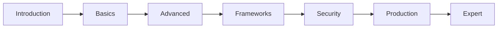
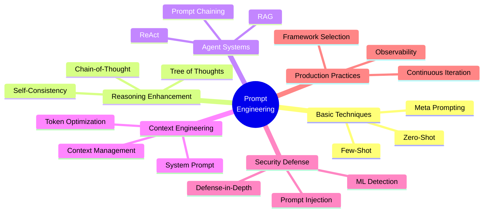

# Prompt Engineering: From Zero to Mastery

> [中文版](README-zh.md)

---

## Tutorial Introduction

This tutorial starts from the basic concepts of Prompt Engineering and gradually delves into reasoning enhancement, Agent systems, context engineering, security defense, and production-level best practices. All content is based on:

- **Academic Research**: Wei et al. (CoT), Yao et al. (ReAct/ToT), Lewis et al. (RAG), etc.
- **Open Source Frameworks**: AutoGPT, CrewAI, Claude Code, oh-my-codex, oh-my-openagent, OpenClaw
- **Security Practices**: OWASP LLM Top 10, LLM Guard, NeMo Guardrails

---

## 🗺️ Learning Path



### Quick Navigation

| Stage | Chapter | Duration | For |
|-------|---------|----------|-----|
| 🟢 Intro | [Ch.1: Introduction](./01-introduction-en.md) | 30 min | Everyone |
| 🔵 Basics | [Ch.2: Basic Prompting](./02-basics-en.md) | 1 hour | Beginners |
| 🟡 Advanced | [Ch.3: Reasoning](./03-reasoning-en.md) | 1.5 hours | Intermediate |
| 🟠 Advanced | [Ch.4: Agents & Tools](./04-agents-tools-en.md) | 2 hours | Intermediate |
| 🟣 Frameworks | [Ch.5: Context Engineering](./05-context-engineering-en.md) | 1.5 hours | Developers |
| 🔴 Frameworks | [Ch.6: Framework Analysis](./06-frameworks-en.md) | 2 hours | Developers |
| 🩷 Security | [Ch.7: Security & Defense](./07-security-en.md) | 1.5 hours | Everyone |
| 🩵 Production | [Ch.8: Production Practices](./08-production-en.md) | 2 hours | Engineers |
| 🟤 Expert | [Ch.9: Advanced Topics](./09-advanced-en.md) | 2 hours | Experts |
| ⚪ Practice | [Ch.10: Case Studies](./10-case-studies-en.md) | 3 hours | Everyone |
| 📎 Templates | [Ch.11: Template Library](./11-templates-en.md) | Reference | Everyone |
| 📋 Cheatsheet | [Ch.12: Cheatsheet](./12-cheatsheet-en.md) | Reference | Everyone |
| 📚 Appendix | [Ch.13: Appendix](./13-appendix-en.md) | Reference | Everyone |

---

## 📖 Directory Structure

```
prompt-engineering-learning/
├── README-zh.md                    ← Chinese Index
├── README-en.md                    ← This file (English Index)
├── 01-introduction-zh.md           ← 第 1 章：导论
├── 01-introduction-en.md           ← Ch.1: Introduction
├── 02-basics-zh.md                 ← 第 2 章：基础 Prompting
├── 02-basics-en.md                 ← Ch.2: Basic Prompting
├── 03-reasoning-zh.md              ← 第 3 章：推理增强
├── 03-reasoning-en.md              ← Ch.3: Reasoning
├── 04-agents-tools-zh.md           ← 第 4 章：Agent 与工具
├── 04-agents-tools-en.md           ← Ch.4: Agents & Tools
├── 05-context-engineering-zh.md    ← 第 5 章：上下文工程
├── 05-context-engineering-en.md    ← Ch.5: Context Engineering
├── 06-frameworks-zh.md             ← 第 6 章：框架分析
├── 06-frameworks-en.md             ← Ch.6: Frameworks
├── 07-security-zh.md               ← 第 7 章：安全防御
├── 07-security-en.md               ← Ch.7: Security
├── 08-production-zh.md             ← 第 8 章：生产实践
├── 08-production-en.md             ← Ch.8: Production
├── 09-advanced-zh.md               ← 第 9 章：高级专题
├── 09-advanced-en.md               ← Ch.9: Advanced
├── 10-case-studies-zh.md           ← 第 10 章：实战案例
├── 10-case-studies-en.md           ← Ch.10: Case Studies
├── 11-templates-zh.md              ← 第 11 章：模板库
├── 11-templates-en.md              ← Ch.11: Templates
├── 12-cheatsheet-zh.md             ← 第 12 章：速查表
├── 12-cheatsheet-en.md             ← Ch.12: Cheatsheet
├── 13-appendix-zh.md               ← 第 13 章：附录
└── 13-appendix-en.md               ← Ch.13: Appendix
```

---

## 🎯 Chapter Highlights

### Ch.1: Introduction
- What is Prompt Engineering
- Evolution history of prompts
- Why systematic learning is needed
- Learning roadmap

### Ch.2: Basic Prompting
- Zero-Shot Prompting
- Few-Shot Prompting
- Meta Prompting
- Prompt design principles

### Ch.3: Reasoning Enhancement
- Chain-of-Thought (CoT)
- Zero-Shot CoT
- Tree of Thoughts (ToT)
- Self-Consistency and Reflexion

### Ch.4: Agents & Tools
- ReAct framework (Reasoning + Acting)
- Prompt Chaining
- RAG (Retrieval Augmented Generation)
- Structured output control

### Ch.5: Context Engineering
- Context hierarchy architecture
- System Prompt design
- Context management strategies
- Token budget and optimization

### Ch.6: Framework Analysis
- AutoGPT prompt architecture
- CrewAI prompt patterns
- Claude Code Agent patterns
- oh-my-codex multi-agent orchestration
- oh-my-openagent dynamic building
- OpenClaw prompt system

### Ch.7: Security & Defense
- Prompt Injection attack types
- Defense strategies (delimiters, sandwich, priority)
- ML detection and heuristic validation
- Defense-in-depth architecture

### Ch.8: Production Practices
- Prompt design checklist
- Framework comparison and selection
- Observability and debugging
- Continuous iteration process

### Ch.9: Advanced Topics
- Multi-Agent orchestration patterns
- Skills system
- Dynamic prompt building
- Model selection strategies

### Ch.10: Case Studies
- Coding assistant system prompt design
- Research Agent building
- Security audit Agent
- Multi-agent collaborative workflow

### Ch.11: Template Library
- Common Prompt template library
- Classification/extraction/code generation/summary templates
- Agent system Prompt templates
- Security hardening templates

### Ch.12: Cheatsheet
- Technology selection decision tree
- Zero/Few-Shot quick reference
- CoT trigger phrases
- ReAct format
- JSON output mode
- Security defense checklist

### Ch.13: Appendix
- Source document index
- Academic research paper list
- Open source project list
- Security resource list
- Glossary (EN-ZH)

---

## 📊 Knowledge Graph



---

## 📝 Learning Recommendations

### Beginner Path (~4 hours)
1. Ch.1 → Ch.2 → Ch.3 → Ch.11-12
2. Focus on understanding basic concepts and templates

### Developer Path (~10 hours)
1. Complete walkthrough of all chapters
2. Focus on Ch.6 Framework Analysis and Ch.8 Production Practices
3. Practice with templates from Ch.11-12

### Expert Path (On-demand deep dive)
1. Jump directly to chapters of interest
2. Focus on Ch.9 Advanced Topics and Ch.10 Case Studies
3. Deep dive into framework implementations with source code

---

## 🔗 References

### Academic Research
- **Chain-of-Thought**: Wei et al. (2022) - [arXiv:2201.11903](https://arxiv.org/abs/2201.11903)
- **ReAct**: Yao et al. (2022) - [arXiv:2210.03629](https://arxiv.org/abs/2210.03629)
- **Tree of Thoughts**: Yao et al. (2023) - [arXiv:2305.10601](https://arxiv.org/abs/2305.10601)
- **RAG**: Lewis et al. (2021) - [arXiv:2005.11401](https://arxiv.org/pdf/2005.11401.pdf)

### Open Source Projects
- **AutoGPT**: https://github.com/Significant-Gravitas/AutoGPT
- **CrewAI**: https://github.com/crewAIInc/crewAI
- **Claude Code**: https://github.com/anthropics/claude-code
- **oh-my-codex**: https://github.com/Yeachan-Heo/oh-my-codex
- **OpenClaw**: https://github.com/openclaw/openclaw

### Security Resources
- **OWASP Top 10 for LLM**: https://owasp.org/www-project-top-10-for-large-language-model-applications/
- **LLM Guard**: https://github.com/protectai/llm-guard
- **NeMo Guardrails**: https://github.com/NVIDIA/NeMo-Guardrails

---

*This tutorial is compiled based on the latest research and production practices from 2024-2026, continuously updated.*
