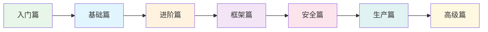
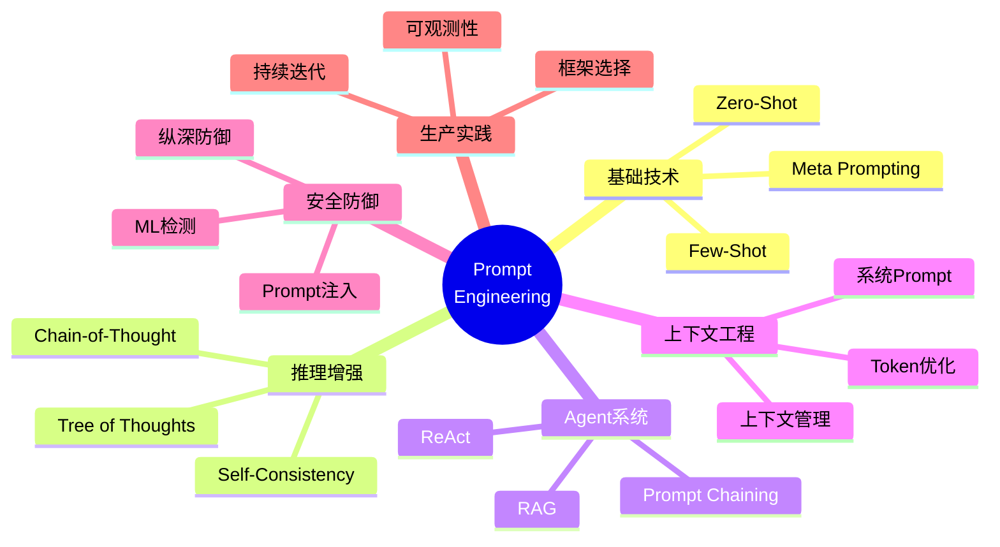

# Prompt Engineering：从零到精通

> [English Version](README-en.md)

---

## 教程简介

本教程从 Prompt Engineering 的基本概念出发，逐步深入到推理增强、Agent 系统、上下文工程、安全防御和生产级最佳实践。所有内容均基于：

- **学术研究**：Wei et al. (CoT)、Yao et al. (ReAct/ToT)、Lewis et al. (RAG) 等
- **开源框架**：AutoGPT、CrewAI、Claude Code、oh-my-codex、oh-my-openagent、OpenClaw
- **安全实践**：OWASP LLM Top 10、LLM Guard、NeMo Guardrails

---

## 🗺️ 学习路径



### 快速导航

| 阶段 | 章节 | 预计时间 | 适合人群 |
|------|------|----------|----------|
| 🟢 入门 | [第 1 章：导论](./01-introduction-zh.md) | 30 分钟 | 所有人 |
| 🔵 基础 | [第 2 章：基础 Prompting](./02-basics-zh.md) | 1 小时 | 初学者 |
| 🟡 进阶 | [第 3 章：推理增强](./03-reasoning-zh.md) | 1.5 小时 | 有基础者 |
| 🟠 进阶 | [第 4 章：Agent 与工具](./04-agents-tools-zh.md) | 2 小时 | 有基础者 |
| 🟣 框架 | [第 5 章：上下文工程](./05-context-engineering-zh.md) | 1.5 小时 | 开发者 |
| 🔴 框架 | [第 6 章：框架分析](./06-frameworks-zh.md) | 2 小时 | 开发者 |
| 🩷 安全 | [第 7 章：安全防御](./07-security-zh.md) | 1.5 小时 | 所有人 |
| 🩵 生产 | [第 8 章：生产实践](./08-production-zh.md) | 2 小时 | 工程师 |
| 🟤 高级 | [第 9 章：高级专题](./09-advanced-zh.md) | 2 小时 | 专家 |
| ⚪ 实战 | [第 10 章：实战案例](./10-case-studies-zh.md) | 3 小时 | 所有人 |
| 📎 模板 | [第 11 章：模板库](./11-templates-zh.md) | 参考 | 所有人 |
| 📋 速查 | [第 12 章：速查表](./12-cheatsheet-zh.md) | 参考 | 所有人 |
| 📚 附录 | [第 13 章：附录](./13-appendix-zh.md) | 参考 | 所有人 |

---

## 📖 目录结构

```
prompt-engineering-learning/
├── README-zh.md                    ← 本文件（中文主索引）
├── README-en.md                    ← English Index
├── 01-introduction-zh.md           ← 第 1 章：导论
├── 01-introduction-en.md           ← Ch.1: Introduction
├── 02-basics-zh.md                 ← 第 2 章：基础 Prompting
├── 02-basics-en.md                 ← Ch.2: Basic Prompting
├── 03-reasoning-zh.md              ← 第 3 章：推理增强
├── 03-reasoning-en.md              ← Ch.3: Reasoning
├── 04-agents-tools-zh.md           ← 第 4 章：Agent 与工具
├── 04-agents-tools-en.md           ← Ch.4: Agents & Tools
├── 05-context-engineering-zh.md    ← 第 5 章：上下文工程
├── 05-context-engineering-en.md    ← Ch.5: Context Engineering
├── 06-frameworks-zh.md             ← 第 6 章：框架分析
├── 06-frameworks-en.md             ← Ch.6: Frameworks
├── 07-security-zh.md               ← 第 7 章：安全防御
├── 07-security-en.md               ← Ch.7: Security
├── 08-production-zh.md             ← 第 8 章：生产实践
├── 08-production-en.md             ← Ch.8: Production
├── 09-advanced-zh.md               ← 第 9 章：高级专题
├── 09-advanced-en.md               ← Ch.9: Advanced
├── 10-case-studies-zh.md           ← 第 10 章：实战案例
├── 10-case-studies-en.md           ← Ch.10: Case Studies
├── 11-templates-zh.md              ← 第 11 章：模板库
├── 11-templates-en.md              ← Ch.11: Templates
├── 12-cheatsheet-zh.md             ← 第 12 章：速查表
├── 12-cheatsheet-en.md             ← Ch.12: Cheatsheet
├── 13-appendix-zh.md               ← 第 13 章：附录
└── 13-appendix-en.md               ← Ch.13: Appendix
```

---

## 🎯 各章要点

### 第 1 章：导论
- 什么是 Prompt Engineering
- Prompt 的演进历史
- 为什么需要系统学习
- 学习路线图

### 第 2 章：基础 Prompting
- Zero-Shot Prompting（零样本提示）
- Few-Shot Prompting（少样本提示）
- Meta Prompting（元提示）
- Prompt 设计原则

### 第 3 章：推理增强
- Chain-of-Thought（思维链）
- Zero-Shot CoT
- Tree of Thoughts（思维树）
- Self-Consistency 与 Reflexion

### 第 4 章：Agent 与工具
- ReAct 框架（Reasoning + Acting）
- Prompt Chaining（提示链）
- RAG（检索增强生成）
- 结构化输出控制

### 第 5 章：上下文工程
- 上下文层次架构
- 系统 Prompt 设计
- 上下文管理策略
- Token 预算与优化

### 第 6 章：框架分析
- AutoGPT 提示架构
- CrewAI 提示模式
- Claude Code Agent 模式
- oh-my-codex 多代理编排
- oh-my-openagent 动态构建
- OpenClaw 提示系统

### 第 7 章：安全防御
- Prompt Injection 攻击类型
- 防御策略（分隔符、三明治、优先级）
- ML 检测与启发式验证
- 纵深防御架构

### 第 8 章：生产实践
- Prompt 设计检查清单
- 框架对比与选择
- 可观测性与调试
- 持续迭代流程

### 第 9 章：高级专题
- 多 Agent 编排模式
- 技能（Skills）系统
- 动态提示构建
- 模型选择策略

### 第 10 章：实战案例
- 编码助手系统提示设计
- 研究 Agent 构建
- 安全审计 Agent
- 多代理协作工作流

### 第 11 章：模板库
- 常用 Prompt 模板库
- 分类/提取/代码生成/总结模板
- Agent 系统 Prompt 模板
- 安全加固模板

### 第 12 章：速查表
- 技术选择决策树
- Zero/Few-Shot 速查
- CoT 触发短语
- ReAct 格式
- JSON 输出模式
- 安全防御清单

### 第 13 章：附录
- 源文档索引表
- 学术研究论文列表
- 开源项目列表
- 安全资源列表
- 术语表（中英对照）

---

## 📊 知识图谱



---

## 📝 学习建议

### 初学者路径（约 4 小时）
1. 第 1 章 → 第 2 章 → 第 3 章 → 第 11-12 章
2. 重点理解基本概念和模板

### 开发者路径（约 10 小时）
1. 完整走读所有章节
2. 重点关注第 6 章框架分析和第 8 章生产实践
3. 动手实践第 11-12 章的模板

### 专家路径（按需深入）
1. 直接跳转到感兴趣的章节
2. 重点研究第 9 章高级专题和第 10 章实战案例
3. 结合源码深入理解框架实现

---

## 🔗 参考资源

### 学术研究
- **Chain-of-Thought**: Wei et al. (2022) - [arXiv:2201.11903](https://arxiv.org/abs/2201.11903)
- **ReAct**: Yao et al. (2022) - [arXiv:2210.03629](https://arxiv.org/abs/2210.03629)
- **Tree of Thoughts**: Yao et al. (2023) - [arXiv:2305.10601](https://arxiv.org/abs/2305.10601)
- **RAG**: Lewis et al. (2021) - [arXiv:2005.11401](https://arxiv.org/pdf/2005.11401.pdf)

### 开源项目
- **AutoGPT**: https://github.com/Significant-Gravitas/AutoGPT
- **CrewAI**: https://github.com/crewAIInc/crewAI
- **Claude Code**: https://github.com/anthropics/claude-code
- **oh-my-codex**: https://github.com/Yeachan-Heo/oh-my-codex
- **OpenClaw**: https://github.com/openclaw/openclaw

### 安全资源
- **OWASP Top 10 for LLM**: https://owasp.org/www-project-top-10-for-large-language-model-applications/
- **LLM Guard**: https://github.com/protectai/llm-guard
- **NeMo Guardrails**: https://github.com/NVIDIA/NeMo-Guardrails

---

*本教程基于 2024-2026 年最新研究和生产实践经验整理，持续更新中。*
