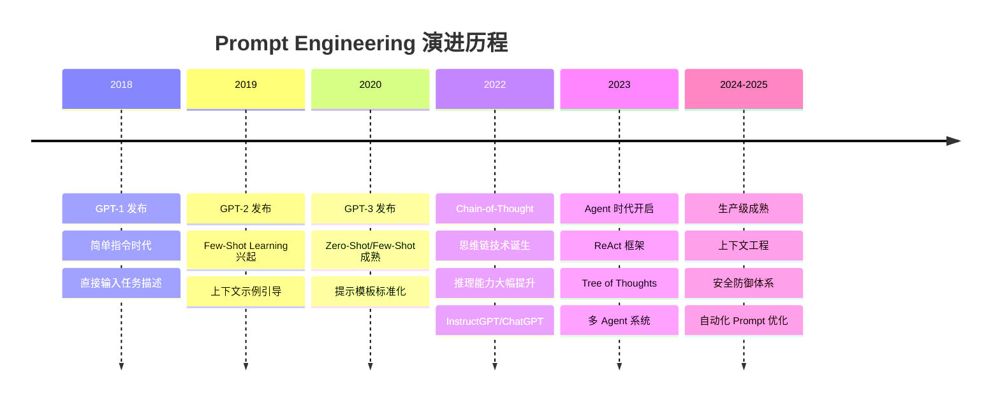
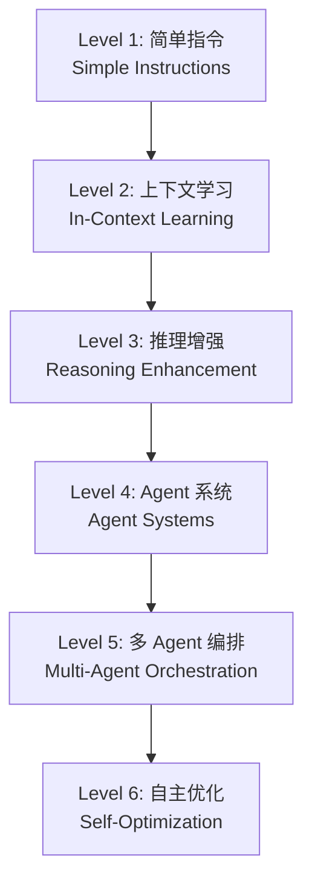
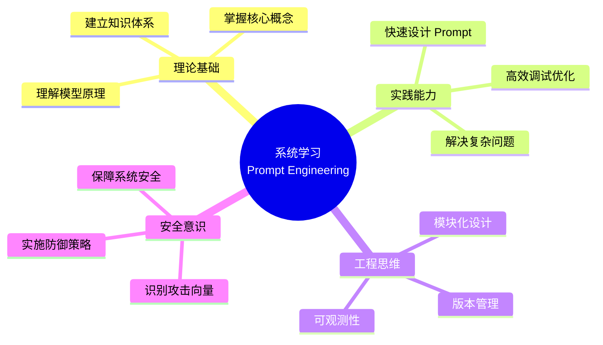
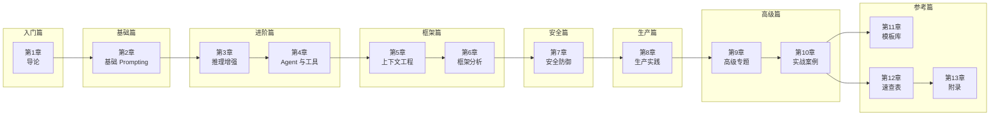
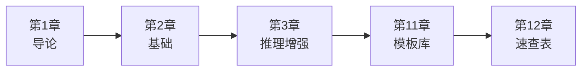
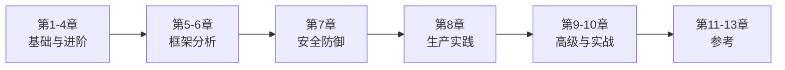
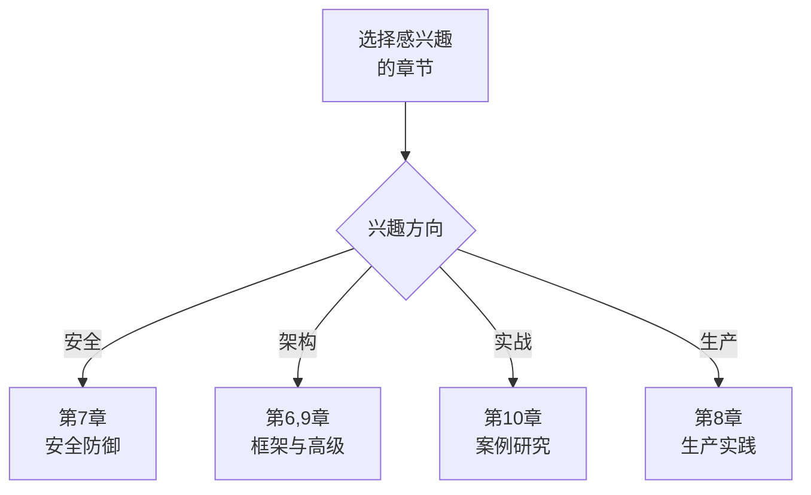

[English Version](../01-introduction.md)

# 第 1 章：导论

欢迎来到 Prompt Engineering 系统学习教程。本章将带你了解 Prompt Engineering 的基本概念、演进历程，以及本教程的学习路径。

---

## 1. 什么是 Prompt Engineering

**Prompt Engineering（提示工程）** 是一门设计和优化输入文本（Prompt）以引导大语言模型（LLM）产生期望输出的技术。它既是一门科学，也是一门艺术。

### 核心定义

Prompt Engineering 包含三个层面的含义：

1. **技术层面**：通过特定的文本结构和指令模式，激发模型的最佳性能
2. **方法论层面**：系统化的设计、测试和迭代流程
3. **工程层面**：将 Prompt 作为软件系统的核心组件进行管理和优化

### 为什么 Prompt 如此重要

大语言模型的能力虽然强大，但其输出质量高度依赖于输入的 Prompt。同样的模型，不同的 Prompt 可能产生截然不同的结果。

```markdown
❌ 模糊 Prompt：
"写一篇关于人工智能的文章"

✅ 优化后的 Prompt：
"请以技术博客的风格，写一篇 800 字左右的文章，介绍人工智能在医疗诊断领域的应用。
文章结构：
1. 引言（100 字）
2. 三个具体应用案例（每例 200 字）
3. 面临的挑战（100 字）
4. 结语（100 字）"
```

### Prompt Engineering 与传统编程的区别

| 维度 | 传统编程 | Prompt Engineering |
|------|----------|-------------------|
| 语言 | 严格的编程语言 | 自然语言 |
| 确定性 | 确定性的输出 | 概率性的输出 |
| 调试方式 | 断点、日志 | 迭代、A/B 测试 |
| 版本管理 | 代码版本控制 | Prompt 版本库 |
| 可解释性 | 逻辑清晰 | 需要额外分析 |

---

## 2. Prompt 的演进历史

Prompt Engineering 的发展与大型语言模型的演进紧密相连。从最初的简单指令到今天的复杂 Agent 系统，Prompt 技术经历了多个阶段的演变。

### 演进时间线



### 演进层次图



#### Level 1: 简单指令（2018-2019）

最早的 Prompt 形式，直接向模型发出指令。

```markdown
将以下内容翻译成法语：
"Hello, how are you?"
```

特点：
- 直接、简单
- 依赖模型预训练知识
- 输出不可控

#### Level 2: 上下文学习（2020-2021）

通过提供示例让模型学习任务模式。

```markdown
将英语翻译成法语：
英语：Hello
法语：Bonjour

英语：Thank you
法语：Merci

英语：Good morning
法语：
```

特点：
- Few-Shot Learning
- 无需微调模型
- 格式可控性提升

#### Level 3: 推理增强（2022）

引导模型生成中间推理步骤。

```markdown
问题：Roger 有 5 个网球。他又买了 2 罐网球。
每罐有 3 个网球。他现在一共有多少个网球？

让我们一步一步思考。
```

特点：
- Chain-of-Thought (CoT)
- 复杂推理任务突破
- 可解释性增强

#### Level 4: Agent 系统（2023）

结合推理与行动，让模型能够使用工具。

```markdown
你是一个可以使用工具的智能助手。
当你需要信息时，使用搜索工具。
当你需要计算时，使用计算器工具。

请遵循以下格式：
Thought: [你的推理过程]
Action: [工具名称]
Action Input: [工具参数]
Observation: [工具返回结果]
```

特点：
- ReAct 框架
- 工具使用能力
- 与外部世界交互

#### Level 5: 多 Agent 编排（2023-2024）

多个 Agent 协作完成复杂任务。

```markdown
你是研究主管。你的团队包括：
- 网络搜索 Agent：查找相关信息
- 分析 Agent：分析数据
- 写作 Agent：生成最终报告

将任务委派给团队成员并综合他们的发现。
```

特点：
- 角色专业化
- 任务分解与委派
- 并行处理能力

#### Level 6: 自主优化（2024-2025）

Prompt 自我优化和自动调整。

```markdown
分析不同 Prompt 变体的成功率。
识别高性能 Prompt 中的模式。
根据任务类型自动调整 Prompt 结构。
```

特点：
- 元学习
- 自动 A/B 测试
- 持续优化

---

## 3. 为什么需要系统学习

Prompt Engineering 看似简单，但要真正掌握并应用于生产环境，需要系统性的学习和实践。

### 常见误区

#### 误区 1: "Prompt 就是写几句话"

实际上，有效的 Prompt 设计涉及：
- 任务分析与分解
- 输出格式规范
- 边界情况处理
- 安全与防御考量

#### 误区 2: "一个万能 Prompt 走天下"

不同场景需要不同的策略：
- 分类任务 vs 生成任务
- 单轮对话 vs 多轮交互
- 确定性输出 vs 创造性输出

#### 误区 3: "模型越强大，Prompt 越不重要"

事实恰恰相反：
- 强大模型对 Prompt 更敏感
- 好的 Prompt 能释放模型全部潜力
- 差的 Prompt 会导致幻觉和错误

### 系统学习的价值



### 学习前后的对比

| 场景 | 学习前 | 学习后 |
|------|--------|--------|
| 设计 Prompt | 凭感觉尝试 | 结构化设计 |
| 调试问题 | 盲目修改 | 系统性分析 |
| 构建 Agent | 简单循环 | 完整架构 |
| 生产部署 | 安全隐患 | 纵深防御 |
| 团队协作 | 各自为战 | 标准化流程 |

---

## 4. 本教程学习路线图

本教程共 13 章，分为 7 个阶段，从入门到精通，循序渐进。

### 学习路径总览



### 章节详解

#### 🟢 入门篇

**第 1 章：导论**（本章）
- Prompt Engineering 定义与价值
- 演进历史与层次
- 学习路线图

#### 🔵 基础篇

**第 2 章：基础 Prompting**
- Zero-Shot Prompting（零样本提示）
- Few-Shot Prompting（少样本提示）
- Meta Prompting（元提示）
- Prompt 设计原则与最佳实践

#### 🟡 进阶篇

**第 3 章：推理增强**
- Chain-of-Thought（思维链）
- Zero-Shot CoT 与自动触发
- Tree of Thoughts（思维树）
- Self-Consistency 与 Reflexion

**第 4 章：Agent 与工具**
- ReAct 框架（Reasoning + Acting）
- Prompt Chaining（提示链）
- RAG（检索增强生成）
- 结构化输出控制

#### 🟣 框架篇

**第 5 章：上下文工程**
- 上下文层次架构
- 系统 Prompt 设计
- 上下文管理策略
- Token 预算与优化

**第 6 章：框架分析**
- AutoGPT 提示架构
- CrewAI 提示模式
- Claude Code Agent 模式
- 开源框架对比

#### 🩷 安全篇

**第 7 章：安全防御**
- Prompt Injection 攻击类型
- 防御策略（分隔符、三明治、优先级）
- ML 检测与启发式验证
- 纵深防御架构

#### 🩵 生产篇

**第 8 章：生产实践**
- Prompt 设计检查清单
- 框架对比与选择
- 可观测性与调试
- 持续迭代流程

#### 🟤 高级篇

**第 9 章：高级专题**
- 多 Agent 编排模式
- 技能（Skills）系统
- 动态提示构建
- 模型选择策略

**第 10 章：实战案例**
- 编码助手系统提示设计
- 研究 Agent 构建
- 安全审计 Agent
- 多代理协作工作流

#### 📎 参考篇

**第 11 章：模板库**
- 常用 Prompt 模板库
- 分类/提取/代码生成/总结模板
- Agent 系统 Prompt 模板
- 安全加固模板

**第 12 章：速查表**
- 技术选择决策树
- Zero/Few-Shot 速查
- CoT 触发短语
- ReAct 格式
- JSON 输出模式
- 安全防御清单

**第 13 章：附录**
- 源文档索引表
- 学术研究论文列表
- 开源项目列表
- 安全资源列表
- 术语表（中英对照）

### 推荐学习路径

#### 初学者路径（约 4 小时）

适合：刚接触 Prompt Engineering 的用户



学习重点：
- 理解基本概念
- 掌握常用模板
- 能够设计简单的 Prompt

#### 开发者路径（约 10 小时）

适合：有编程基础，希望构建 AI 应用的开发者



学习重点：
- 完整理解技术体系
- 掌握框架实现原理
- 能够构建生产级 Agent

#### 专家路径（按需深入）

适合：已有经验，希望深入研究特定领域的专家



学习重点：
- 深入特定领域
- 研究源码实现
- 贡献开源社区

---

## 5. 如何有效使用本教程

### 学习建议

1. **动手实践**
   - 每学完一章，立即动手尝试
   - 使用你常用的 LLM（ChatGPT、Claude、Gemini 等）测试 Prompt
   - 记录实验结果和心得

2. **建立 Prompt 库**
   - 收集和整理工作中常用的 Prompt
   - 建立自己的模板库
   - 定期回顾和优化

3. **参与社区**
   - 关注 Prompt Engineering 的最新研究
   - 参与开源项目
   - 与他人交流经验

4. **持续迭代**
   - Prompt Engineering 是快速发展的领域
   - 定期回顾和更新知识
   - 跟踪新的模型和技术

### 配套资源

本教程提供以下配套资源：

- **模板库**：第 11 章提供可直接使用的 Prompt 模板
- **速查表**：第 12 章提供快速参考
- **源代码**：所有示例均可直接复制使用
- **延伸阅读**：每章末尾提供参考资源

### 下一步

准备好开始了吗？请继续阅读 [第 2 章：基础 Prompting](./02-basics.md)，学习 Zero-Shot、Few-Shot 和 Meta Prompting 等核心技术。

---

## 本章小结

本章介绍了：

1. **Prompt Engineering 的定义**：设计和优化输入文本以引导 LLM 产生期望输出的技术
2. **演进历史**：从简单指令到多 Agent 编排的六个发展阶段
3. **系统学习的价值**：避免常见误区，建立完整的知识体系
4. **学习路线图**：13 章内容分为 7 个阶段，循序渐进
5. **使用建议**：动手实践、建立 Prompt 库、参与社区、持续迭代

---

## 参考资源

### 学术研究
- **Chain-of-Thought**: Wei et al. (2022) - [arXiv:2201.11903](https://arxiv.org/abs/2201.11903)
- **ReAct**: Yao et al. (2022) - [arXiv:2210.03629](https://arxiv.org/abs/2210.03629)
- **Tree of Thoughts**: Yao et al. (2023) - [arXiv:2305.10601](https://arxiv.org/abs/2305.10601)

### 官方指南
- [OpenAI Prompt Engineering Guide](https://platform.openai.com/docs/guides/prompt-engineering)
- [Anthropic Claude Documentation](https://docs.anthropic.com/)
- [Prompt Engineering Guide (promptingguide.ai)](https://www.promptingguide.ai/)

### 开源项目
- [AutoGPT](https://github.com/Significant-Gravitas/AutoGPT)
- [CrewAI](https://github.com/crewAIInc/crewAI)
- [Claude Code](https://github.com/anthropics/claude-code)

---

*下一章：[第 2 章：基础 Prompting](./02-basics.md)*
