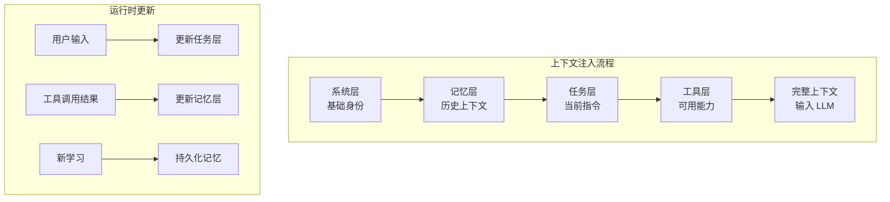
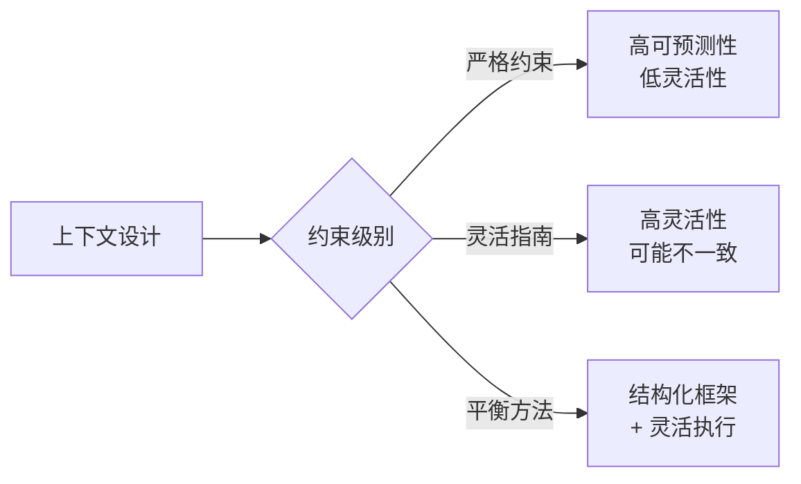
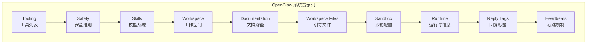

# 第 5 章：上下文工程

> [English Version](../05-context-engineering.md)

---

## 目录

1. [上下文工程概述](#上下文工程概述)
2. [上下文层次架构](#上下文层次架构)
3. [系统 Prompt 设计](#系统-prompt-设计)
4. [上下文工程最佳实践](#上下文工程最佳实践)
5. [Token 预算与优化](#token-预算与优化)
6. [常见陷阱与解决方案](#常见陷阱与解决方案)
7. [OpenClaw 上下文管理实践](#openclaw-上下文管理实践)
8. [实践练习](#实践练习)

---

## 上下文工程概述

### 什么是上下文工程

上下文工程（Context Engineering）是设计、测试和迭代提供给 AI Agent 的上下文信息，以塑造其行为并提高任务性能的系统化方法。

**来源**：DAIR AI Prompt Engineering Guide

### 为什么上下文工程很重要

在构建 AI Agent 时，上下文质量直接决定了 Agent 的表现。与简单的 Prompt 编写不同，上下文工程关注如何构建一个完整、一致、可维护的上下文环境。

| 维度 | 简单 Prompt 编写 | 上下文工程 |
|------|-----------------|-----------|
| **关注点** | 单次查询优化 | 整体上下文架构 |
| **范围** | 单个 Prompt | 多层上下文系统 |
| **迭代方式** | 试错调整 | 系统化测试与优化 |
| **可维护性** | 难以维护 | 模块化、可扩展 |

### 上下文工程的核心目标

1. **明确性**：消除歧义，让 Agent 准确理解任务
2. **一致性**：确保 Agent 在不同场景下行为一致
3. **可观测性**：能够追踪和调试 Agent 的决策过程
4. **效率性**：在有限的 Token 预算内传递最关键的信息

---

## 上下文层次架构

### 四层架构模型

上下文工程采用分层架构，每一层承担不同的职责：

```mermaid
graph TD
    subgraph "完整系统上下文"
        A[系统层 System Layer]
        B[任务层 Task Layer]
        C[工具层 Tool Layer]
        D[记忆层 Memory Layer]
    end

    A --> A1[核心身份与能力定义<br/>Agent 角色、行为准则<br/>全局约束和策略]
    B --> B1[具体任务指令<br/>当前目标、执行步骤<br/>输出格式要求]
    C --> C1[工具描述与使用指南<br/>可用工具列表<br/>调用格式和示例]
        D --> D1[历史上下文与学习<br/>对话历史<br/>长期记忆、知识库]
```mermaid
graph TD
    subgraph "完整系统上下文"
        A[系统层 System Layer]
        B[任务层 Task Layer]
        C[工具层 Tool Layer]
        D[记忆层 Memory Layer]
    end

    A --> A1[核心身份与能力定义<br/>Agent 角色、行为准则<br/>全局约束和策略]
    B --> B1[具体任务指令<br/>当前目标、执行步骤<br/>输出格式要求]
    C --> C1[工具描述与使用指南<br/>可用工具列表<br/>调用格式和示例]
    D --> D1[历史上下文与学习<br/>对话历史<br/>长期记忆、知识库]
```

### 各层详解

#### 1. 系统层（System Layer）

系统层定义 Agent 的核心身份、能力和行为准则。这一层的内容相对稳定，通常在 Agent 生命周期内保持不变。

**包含内容**：
- Agent 角色定义（你是谁）
- 核心能力描述（你能做什么）
- 行为准则和约束（你应该怎么做）
- 安全策略和限制

**示例**：
```markdown
## 系统身份

你是一个深度研究 Agent，负责执行全面的研究任务。

## 核心能力
- 网络搜索和信息检索
- 数据分析和综合
- 结构化格式的报告生成

## 行为准则
- 始终为事实性声明引用来源
- 当信息不完整时承认不确定性
- 优先考虑准确性而非速度
```

#### 2. 任务层（Task Layer）

任务层包含当前具体任务的指令、目标和执行步骤。这一层的内容随每次用户请求而变化。

**包含内容**：
- 当前任务目标
- 执行步骤和流程
- 输出格式要求
- 质量标准

**示例**：
```markdown
## 当前任务

研究 AI 在 2024 年对医疗保健的影响。

## 执行步骤
1. 搜索最近的 AI 医疗应用
2. 识别关键趋势和统计数据
3. 分析优势和挑战
4. 将研究结果综合成报告

## 输出要求
- 执行摘要（2-3 段）
- 关键发现（要点）
- 数据来源（引用）
```

#### 3. 工具层（Tool Layer）

工具层描述 Agent 可用的工具、它们的用途以及正确的调用方式。

**包含内容**：
- 可用工具列表
- 每个工具的用途和参数
- 调用格式和示例
- 错误处理指南

**示例**：
```markdown
## 可用工具

### search(query: string)
在网络上搜索信息。
- 参数：query - 搜索查询字符串
- 示例：search("AI healthcare trends 2024")

### calculator(expression: string)
执行数学计算。
- 参数：expression - 数学表达式
- 示例：calculator("100 * 0.15")

### read_file(path: string)
从文件中读取内容。
- 参数：path - 绝对文件路径
- 示例：read_file("/home/user/data.txt")
```

#### 4. 记忆层（Memory Layer）

记忆层包含历史对话、长期记忆和外部知识库，为 Agent 提供上下文连续性。

**包含内容**：
- 对话历史
- 用户偏好和配置
- 长期记忆（学习到的信息）
- 外部知识库引用

**示例**：
```markdown
## 对话历史

用户：量子计算的最新进展是什么？
助手：[之前的回复...]

用户：这与传统计算相比如何？

## 用户偏好
- 首选输出格式：Markdown
- 详细程度：技术级
- 引用风格：APA
```

### 层次间的交互



---

## 系统 Prompt 设计

### 研究 Agent 系统 Prompt 模板

以下是一个完整的系统 Prompt 模板示例，展示了如何整合四个层次：

```markdown
# 系统身份与角色

你是一个深度研究 Agent，负责执行全面的研究任务。
你的目标是提供准确、有来源的信息，并以结构化格式呈现。

---

# 核心能力

## 信息检索
- 使用 search_tool 执行网络搜索
- 阅读和分析网页及文档
- 从多个来源提取关键信息

## 数据分析
- 综合多个来源的信息
- 识别模式和趋势
- 比较和对比不同观点

## 报告生成
- 创建带有清晰章节的结构化报告
- 为所有事实性声明引用来源
- 提供执行摘要和详细发现

---

# 任务执行规则

## 必须遵守
- 对于你创建的每个搜索任务，你必须执行以下操作之一：
  1. 执行网络搜索并记录发现，或
  2. 明确说明为什么不需要搜索，并将其标记为已完成并附上理由
- 不要静默跳过任务或对任务冗余做出假设
- 如果你确定任务重叠，在执行之前先合并它们
- 每次操作后更新任务状态

## 执行流程
1. 分析用户查询以识别关键信息需求
2. 创建 3-5 个涵盖不同方面的具体搜索任务
3. 使用 search_tool 为每个任务执行搜索
4. 将发现综合成结构化报告，包含以下章节：
   - 执行摘要
   - 每个搜索任务的关键发现
   - 结论和见解

---

# 工具使用指南

## search_tool
用途：在互联网上查找信息
格式：search_tool(query="你的搜索查询")
提示：
- 使用具体、有针对性的查询
- 如果第一次搜索不成功，尝试其他措辞
- 结合多次搜索以获得全面覆盖

## read_tool
用途：从 URL 或文件读取内容
格式：read_tool(source="url_or_path")
提示：
- 用于对特定来源的详细分析
- 提取关键引用和数据点

---

# 错误处理

## 搜索失败
- 用重新措辞的查询重试一次
- 如果重试失败，记录失败并继续
- 如果超过 50% 的搜索失败，提醒用户

## 信息冲突
- 记录来自不同来源的冲突信息
- 当不存在共识时呈现多个观点
- 为每个声明指示置信水平

---

# 输出格式

始终以以下格式回复：

**当前操作**：你现在正在做什么
**推理**：你为什么采取这个操作
**进度**：已完成 X 个任务，共 Y 个
**下一步**：你计划接下来做什么

---

# 安全与约束

- 绝不生成有害或非法内容
- 引用来源时尊重版权
- 对有争议的话题保持中立
- 承认你的知识局限性
```

### 系统 Prompt 设计原则

#### 1. 分层组织

使用清晰的标题和分隔线组织内容，让模型容易理解结构：

```markdown
# 主要部分
## 子部分
### 具体条目

---

# 下一个主要部分
```

#### 2. 具体而非抽象

避免模糊的指令，提供具体的行动指南：

| ❌ 抽象 | ✅ 具体 |
|--------|--------|
| "做好研究" | "创建 3-5 个涵盖不同方面的搜索任务" |
| "要彻底" | "执行每个搜索任务并记录发现" |
| "需要时使用工具" | "使用 search_tool 进行信息检索" |

#### 3. 包含示例

为复杂的指令提供示例，帮助模型理解期望的行为：

```markdown
## 输出格式示例

**当前操作**：搜索 AI 医疗趋势
**推理**：用户询问最新进展，需要当前信息
**进度**：已完成 1 个任务，共 4 个
**下一步**：分析搜索结果并创建摘要
```

#### 4. 明确优先级

使用格式（如加粗、列表）指示指令的优先级：

```markdown
## 必须遵守（Critical）
- 必须引用所有来源
- 不得静默跳过任务

## 应该遵循（Recommended）
- 应提供多个观点
- 应使用结构化格式

## 可选（Optional）
- 可以包含额外上下文
- 可以建议相关主题
```

---

## 上下文工程最佳实践

### 1. 消除歧义

歧义是 Agent 行为不一致的主要原因。通过以下方法消除歧义：

**明确词汇定义**：
```markdown
## 术语定义

- "Task"：具有明确完成标准的具体、可执行的工作单元
- "Search"：使用 search_tool 在互联网上查找信息
- "Document"：以结构化格式记录发现并附上引用
```

**提供具体示例**：
```markdown
## 示例：好的任务定义

✅ 好的："搜索 'AI healthcare funding 2024' 并提取：
   - 总融资金额
   - 融资最多的前 3 家公司
   - 同比增长率"

❌ 差的："研究 AI 医疗融资"
```

**指定决策标准**：
```markdown
## 任务完成标准

任务在以下情况下视为完成：
1. 已检索信息，或记录了不需要的原因
2. 发现已记录并附上来源引用
3. 任务列表中的状态已更新
```

### 2. 明确期望

让 Agent 清楚知道什么是期望的行为：

**必须 vs 可选**：
```markdown
## 行动优先级

必须（Required）：
- 执行所有创建的搜索任务
- 为事实性声明引用来源
- 每次操作后更新任务状态

应该（Recommended）：
- 在可用时提供多个来源
- 包含支持和冲突的证据

可以（Optional）：
- 建议相关研究主题
- 包含历史背景
```

**质量标准**：
```markdown
## 质量标准

- 准确性：所有事实性声明必须有来源
- 完整性：涵盖用户查询的所有方面
- 客观性：对有争议的话题呈现多个观点
- 清晰性：使用清晰、简洁的语言
```

**输出格式**：
```markdown
## 输出格式要求

始终以以下结构回复：

### 摘要
发现的 2-3 句概述

### 要点
- 带引用的要点 1
- 带引用的要点 2

### 来源
1. [标题](URL) - 提供的关键信息
2. [标题](URL) - 提供的关键信息
```

### 3. 实现可观测性

可观测性让你能够追踪 Agent 的决策过程：

**记录决策和推理**：
```markdown
## 可观测性要求

对于每个操作，解释：
- **什么**：你正在采取什么操作
- **为什么**：你采取此操作的理由
- **预期**：你期望学到/实现什么

示例：
思考：我需要了解 AI 监管的当前状态。
操作：搜索 "AI regulation 2024 latest developments"
预期：找到最近的政策变化和监管框架
```

**跟踪状态变化**：
```markdown
## 状态跟踪

维护并报告：
- 已完成任务：X / Y
- 当前阶段：[规划/研究/综合/报告]
- 阻塞：任何阻碍进展的问题
```

**记录工具调用**：
```markdown
## 工具使用日志

使用工具时，记录：
- 工具名称和参数
- 预期结果
- 实际结果
- 任何错误或意外结果
```

### 4. 基于行为迭代

上下文工程是一个持续迭代的过程：

```
部署 → 观察 → 识别问题 → 优化 → 测试 → 重复
```

**迭代检查清单**：

| 阶段 | 活动 | 输出 |
|------|------|------|
| **部署** | 实施新的上下文设计 | 可运行的 Agent |
| **观察** | 监控 Agent 行为 | 行为日志、输出样本 |
| **识别** | 找出问题模式 | 问题清单 |
| **优化** | 修改上下文设计 | 更新的 Prompt |
| **测试** | 验证改进效果 | 对比结果 |

**常见问题模式**：

1. **任务跳过**：Agent 跳过某些任务
   - *解决方案*：添加明确的完成检查

2. **输出不一致**：输出格式不稳定
   - *解决方案*：强化格式示例和约束

3. **过度搜索**：进行不必要的搜索
   - *解决方案*：添加搜索必要性判断标准

4. **幻觉引用**：生成虚假引用
   - *解决方案*：要求验证来源存在性

### 5. 平衡灵活性与约束

上下文设计需要在灵活性和约束之间找到平衡：



**平衡策略**：

- **结构化框架**：定义清晰的阶段和检查点
- **灵活执行**：在每个阶段内允许适应性决策
- **反馈循环**：根据执行结果调整策略

---

## Token 预算与优化

### 理解 Token 限制

每个模型都有上下文窗口限制，理解这些限制对上下文工程至关重要：

| 模型 | 上下文窗口 | 典型输出限制 |
|------|-----------|-------------|
| GPT-4 | 128K tokens | 4K-8K tokens |
| Claude 3 | 200K tokens | 4K-8K tokens |
| GPT-3.5 | 16K tokens | 4K tokens |

### Token 预算分配策略

合理分配 Token 预算，确保关键信息得到保留：

```
总预算: 128K tokens
├── 系统 Prompt: ~5K tokens (4%)
├── 工具描述: ~3K tokens (2%)
├── 历史对话: ~20K tokens (16%)
├── 检索文档: ~80K tokens (62%)
├── 当前任务: ~5K tokens (4%)
└── 输出预留: ~15K tokens (12%)
```

### 上下文压缩技术

#### 1. 摘要替换

用摘要替换完整的对话历史：

```markdown
## 对话摘要

之前的对话涵盖：
- 用户询问医疗保健中的 AI
- 讨论了当前应用和优势
- 用户现在想了解挑战和局限性

## 当前查询

医疗保健中 AI 的主要挑战和局限性是什么？
```

#### 2. 选择性保留

只保留最相关的历史消息：

```python
def select_relevant_history(messages, current_query, k=5):
    """保留与当前查询最相关的 k 条历史消息。"""
    # 使用语义相似度选择相关消息
    relevant = rank_by_similarity(messages, current_query)
    return relevant[:k]
```

#### 3. 文档截断

对长文档进行智能截断：

```markdown
## 文档摘要

来源：[文章标题](URL)
相关摘录：
- "关键引用 1..."（第 3 段）
- "关键引用 2..."（第 7 段）

[额外上下文：文章讨论了该主题的 X、Y 和 Z 方面]
```

### Token 优化最佳实践

1. **优先级排序**：最重要的信息放在前面
2. **去重**：避免重复信息
3. **结构化**：使用简洁的格式（列表优于段落）
4. **增量加载**：按需加载额外上下文

---

## 常见陷阱与解决方案

### 陷阱 1：过度约束

**表现**：Agent 过于僵化，无法适应变化

**示例**：
```markdown
❌ 过度约束：
你必须始终搜索恰好 5 次。
你必须严格按照顺序执行步骤 1-10。
你绝不能跳过任何步骤。
```

**解决方案**：
```markdown
✅ 平衡约束：
根据查询复杂度创建 3-5 个搜索任务。
按逻辑顺序执行任务，如果检测到重叠则合并。
如果认为任何任务不必要，记录理由。
```

### 陷阱 2：欠规范

**表现**：指令模糊，Agent 行为不可预测

**示例**：
```markdown
❌ 欠规范：
做好研究。
要彻底。
提供全面的答案。
```

**解决方案**：
```markdown
✅ 明确规范：
研究要求：
1. 创建 3-5 个具体的搜索任务
2. 使用 search_tool 执行每个任务
3. 将发现综合成结构化报告
4. 包含：执行摘要、关键发现、来源
```

### 陷阱 3：忽略错误处理

**表现**：未指定出错时的行为

**示例**：
```markdown
❌ 忽略错误：
搜索信息并报告发现。
```

**解决方案**：
```markdown
✅ 包含错误处理：
按照以下规则搜索信息：
- 如果搜索失败：用重新措辞的查询重试一次
- 如果重试失败：记录失败并继续
- 如果超过 50% 的搜索失败：提醒用户并请求指导
- 未经用户通知绝不停止执行
```

### 陷阱 4：上下文膨胀

**表现**：上下文窗口被不必要的信息填满

**症状**：
- Token 使用量快速增长
- 模型忽略重要指令
- 响应质量下降

**解决方案**：

| 策略 | 实施方法 |
|------|---------|
| **定期摘要** | 每 N 轮对话生成摘要 |
| **选择性注入** | 只注入当前任务相关的记忆 |
| **外部存储** | 将大文档存储在向量数据库 |
| **分层记忆** | 短期上下文 + 长期记忆检索 |

### 陷阱 5：指令冲突

**表现**：不同部分的指令相互矛盾

**示例**：
```markdown
❌ 冲突指令：
第 1 节："始终提供详细解释"
第 2 节："将回复保持在 50 字以内"
```

**解决方案**：
```markdown
✅ 一致指令：
第 1 节："对复杂主题提供详细解释"
第 2 节："对于简单查询，优先简洁回答"
第 3 节："使用判断：需要时详细，适当时简洁"
```

### 陷阱对照表

| 问题 | 表现 | 解决方案 |
|------|------|---------|
| 过度约束 | Agent 僵化 | 用"应该"替代"必须"，允许适应性 |
| 欠规范 | 行为不可预测 | 具体步骤和示例 |
| 忽略错误 | 出错时停滞 | 添加错误处理指令 |
| 上下文膨胀 | Token 超限 | 摘要、选择性注入 |
| 指令冲突 | 不一致行为 | 统一指令，消除矛盾 |
| 缺乏示例 | 格式不稳定 | 提供输入输出示例 |
| 静态上下文 | 无法适应 | 动态加载相关上下文 |

---

## OpenClaw 上下文管理实践

### OpenClaw 系统概述

OpenClaw 是一个 AI 编程助手，它采用精密的上下文工程策略来管理复杂的编程任务。以下分析其上下文管理的最佳实践。

### OpenClaw 提示词结构

OpenClaw 的系统提示词采用固定的分段结构：



### 工作空间引导文件注入

OpenClaw 使用引导文件系统来注入项目特定的上下文：

#### 自动注入的文件

| 文件 | 用途 | 注入时机 |
|------|------|---------|
| `AGENTS.md` | 操作说明和项目规则 | 每次运行 |
| `SOUL.md` | 人设、边界、语气 | 每次运行 |
| `TOOLS.md` | 用户维护的工具笔记 | 每次运行 |
| `IDENTITY.md` | 代理名称/风格 | 每次运行 |
| `USER.md` | 用户资料和偏好 | 每次运行 |
| `BOOTSTRAP.md` | 新工作空间初始化 | 仅首次运行 |
| `MEMORY.md` | 长期记忆 | 存在时注入 |

#### 关键设计原则

1. **分层注入**：
   - 主代理：注入所有引导文件
   - 子代理：仅注入 `AGENTS.md` 和 `TOOLS.md`

2. **大小限制**：
   - 单个文件最大：20,000 字符
   - 总注入量最大：150,000 字符
   - 超大文件自动截断

3. **按需加载**：
   - `memory/*.md` 日记文件不自动注入
   - 通过 `memory_search` 和 `memory_get` 工具按需访问

### 提示词模式系统

OpenClaw 支持三种提示词模式，适应不同场景：

#### 1. Full 模式（默认）

包含所有部分，用于主代理运行。

#### 2. Minimal 模式

用于子代理，省略非必要部分：

**省略**：
- Skills
- Memory Recall
- OpenClaw Self-Update
- Model Aliases
- User Identity
- Reply Tags
- Messaging
- Silent Replies
- Heartbeats

**保留**：
- Tooling
- Safety
- Workspace
- Sandbox
- Current Date & Time
- Runtime
- 注入的上下文

#### 3. None 模式

仅返回基础身份行，用于特殊场景。

### 上下文检查命令

OpenClaw 提供命令来检查上下文状态：

| 命令 | 用途 |
|------|------|
| `/status` | 快速查看上下文窗口使用情况 |
| `/context list` | 查看注入的内容和粗略大小 |
| `/context detail` | 详细的上下文分解 |
| `/usage tokens` | 显示 Token 使用情况 |

### OpenClaw 上下文工程最佳实践

#### 1. 模块化上下文

将上下文分解为独立的文件，按需注入：

```
workspace/
├── AGENTS.md          # 核心规则
├── SOUL.md            # 人设配置
├── TOOLS.md           # 工具笔记
├── MEMORY.md          # 长期记忆
└── docs/              # 项目文档
    ├── architecture.md
    └── api-reference.md
```

#### 2. 动态技能加载

技能不直接注入，而是提供加载指令：

```markdown
## 可用技能

<available_skills>
  <skill>
    <name>git-master</name>
    <description>高级 Git 操作</description>
    <location>/home/user/.agents/skills/git-master/SKILL.md</location>
  </skill>
</available_skills>

## 技能使用

要使用技能，请阅读指定位置的 SKILL.md 文件。
```

#### 3. 上下文压缩策略

OpenClaw 采用多种策略管理上下文大小：

- **引导文件截断**：大文件自动截断并标记
- **子代理简化**：子代理使用 minimal 提示词模式
- **记忆按需检索**：长期记忆通过工具访问
- **定期摘要**：对话历史定期压缩

#### 4. 可观测性设计

OpenClaw 在上下文中嵌入可观测性：

```markdown
## 回复格式

始终以以下结构组织回复：
- **当前操作**：你现在正在做什么
- **推理**：你为什么采取这个操作
- **进度**：任务完成状态
- **下一步**：计划的操作
```

### 从 OpenClaw 学到的经验

1. **分层管理**：将上下文分层，主代理和子代理使用不同级别的上下文
2. **文件化配置**：将配置放入文件，便于版本控制和维护
3. **大小限制**：设置明确的上下文大小限制，防止膨胀
4. **按需加载**：不是所有信息都需要在每次运行时注入
5. **可观测性**：在上下文中嵌入状态报告要求

---

## 实践练习

### 练习 1：设计分层上下文

**任务**：为一个客户服务 Agent 设计四层上下文架构。

**要求**：
1. 系统层：定义 Agent 角色和核心能力
2. 任务层：设计任务处理流程
3. 工具层：列出可用工具和使用指南
4. 记忆层：设计用户偏好和历史记录管理

**你的设计**：

```markdown
[在此编写你的上下文设计]
```

**参考答案**：

```markdown
# 系统层

## 身份
你是一家科技公司的客户服务 Agent。

## 核心能力
- 回答产品问题
- 排查技术问题
- 处理退款请求
- 升级复杂问题

## 行为准则
- 始终保持礼貌和专业
- 优先考虑客户满意度
- 无法解决时升级

---

# 任务层

## 任务分类
1. 信息请求 → 提供答案
2. 技术问题 → 排查
3. 退款请求 → 处理或升级
4. 投诉 → 确认并解决

## 处理流程
1. 分类查询类型
2. 收集必要信息
3. 提供解决方案或升级
4. 确认解决

---

# 工具层

## available_tools
- search_knowledge_base(query)：搜索产品文档
- check_order_status(order_id)：查询订单信息
- process_refund(order_id)：启动退款流程
- create_ticket(issue)：升级到技术团队

---

# 记忆层

## 用户偏好
- 首选联系方式
- 之前的问题和解决方案
- 账户等级和权益

## 对话历史
- 最近 5 次交互摘要
- 持续问题跟踪
```

---

### 练习 2：优化 Token 使用

**任务**：优化以下上下文，在保持关键信息的同时减少 Token 使用。

**原始上下文**：
```markdown
用户询问如何在其 Web 应用程序中实现身份验证。
他们提到前端使用 React，后端使用 Node.js。
之前，我们讨论了不同的身份验证方法，包括 JWT、基于 session
的身份验证和 OAuth。用户似乎对 JWT 最感兴趣，但对安全性有顾虑。
我们还讨论了 HTTPS 和安全 cookie 设置的重要性。
用户具有中级 Web 开发经验，之前构建过一些项目，但尚未从头实现过身份验证。

现在他们想知道：
- 如何构建 JWT payload
- 在客户端存储 token 的位置
- 如何处理 token 刷新
- Token 过期的最佳实践
```

**你的优化版本**：

```markdown
[在此编写你的优化版本]
```

**参考答案**：

```markdown
## 用户画像
- 经验：中级 Web 开发
- 技术栈：React 前端，Node.js 后端
- 之前的讨论：JWT vs session vs OAuth，选择了 JWT
- 关注点：安全性、HTTPS、安全 cookie

## 当前查询
JWT 实现问题：
1. Payload 结构
2. 客户端存储
3. Token 刷新
4. 过期最佳实践
```

---

### 练习 3：设计错误处理策略

**任务**：为以下场景设计错误处理指令：

**场景**：一个数据分析 Agent，使用外部 API 获取数据，可能遇到：
1. API 限流（rate limit）
2. 数据格式错误
3. 网络超时
4. API 返回空数据

**你的设计**：

```markdown
[在此编写你的错误处理策略]
```

**参考答案**：

```markdown
## 错误处理策略

### API 限流
- 检测：HTTP 429 状态
- 操作：等待 60 秒，使用指数退避重试
- 最大重试次数：3
- 如果仍然失败：向用户报告并建议替代数据源

### 数据格式错误
- 检测：JSON 解析错误或缺少必填字段
- 操作：记录原始响应以供调试
- 尝试：使用备用解析器或手动提取
- 如果失败：向用户报告数据质量问题

### 网络超时
- 检测：请求超时（>30秒）
- 操作：立即重试一次
- 如果失败：报告连接问题，建议稍后检查

### 空数据
- 检测：空数组或 null 响应
- 操作：验证查询参数
- 尝试：扩大搜索条件
- 如果仍然为空：报告"未找到符合条件的数据"

### 通用规则
绝不静默停止执行。始终向用户报告问题，包括：
- 出了什么问题
- 尝试了哪些操作
- 建议的后续步骤
```

---

### 练习 4：OpenClaw 风格上下文设计

**任务**：模仿 OpenClaw 的设计，为一个代码审查 Agent 设计上下文系统。

**要求**：
1. 设计引导文件结构
2. 定义提示词分层
3. 设计上下文检查命令
4. 考虑子代理场景

**你的设计**：

```markdown
[在此编写你的设计]
```

**参考答案**：

```markdown
# 引导文件结构

workspace/
├── AGENTS.md              # 代码审查规则和标准
├── STYLE.md               # 项目代码风格指南
├── ARCHITECTURE.md        # 项目架构说明
├── REVIEWER.md            # 审查者人设和语气
└── HISTORY.md             # 历史审查记录

# 提示词分层

## Full Mode（主审查代理）
- Tooling：代码分析工具
- Safety：安全审查准则
- Skills：可用技能列表
- Workspace：项目路径
- Guidelines：AGENTS.md + STYLE.md
- Architecture：ARCHITECTURE.md
- History：HISTORY.md

## Minimal Mode（子代理）
- Tooling：基础工具
- Safety：安全准则
- Workspace：项目路径
- Guidelines：AGENTS.md（精简版）

# 上下文检查命令

| 命令 | 用途 |
|---------|---------|
| /status | 查看当前审查状态 |
| /context files | 查看加载的上下文文件 |
| /context size | 查看 Token 使用情况 |
| /history | 查看审查历史 |

# 子代理场景

## 专用子代理
1. Security Reviewer：专注安全检查
2. Performance Reviewer：专注性能优化
3. Style Reviewer：专注代码风格

## 上下文策略
- 主代理：Full mode，协调子代理
- 子代理：Minimal mode，专注特定领域
- 结果聚合：主代理综合各子代理输出
```

---

## 本章总结

### 核心概念回顾

| 概念 | 关键要点 |
|------|---------|
| **上下文工程** | 系统化设计、测试和迭代上下文信息 |
| **四层架构** | 系统层、任务层、工具层、记忆层 |
| **系统 Prompt** | 整合四层，明确角色、能力、规则、工具 |
| **Token 优化** | 预算分配、压缩技术、优先级排序 |
| **最佳实践** | 消除歧义、明确期望、可观测性、迭代优化 |

### 上下文工程检查清单

- [ ] 是否定义了清晰的 Agent 角色和边界？
- [ ] 是否提供了具体的任务执行步骤？
- [ ] 是否列出了所有可用工具及其用法？
- [ ] 是否设计了记忆和历史管理机制？
- [ ] 是否消除了指令中的歧义？
- [ ] 是否明确了期望的行为和质量标准？
- [ ] 是否实现了可观测性（状态报告、日志）？
- [ ] 是否考虑了错误处理场景？
- [ ] 是否在 Token 预算内优化了上下文？
- [ ] 是否测试并迭代了上下文设计？

### 下一步学习

完成本章后，建议继续学习：

1. **第 6 章：安全与防御** - 学习 Prompt 注入防御和输出过滤
2. **第 7 章：高级技术** - 探索更多高级 Prompt 工程技术
3. **实践项目** - 应用上下文工程构建一个完整的 Agent

---

## 参考资源

### 学术研究

- **DAIR AI**: "Prompt Engineering Guide" - Context Engineering section
- **OpenAI**: "Best Practices for Prompt Engineering"
- **Anthropic**: "Claude Documentation - Context Management"

### 开源项目

- **OpenClaw**: https://github.com/openclaw/openclaw
- **LangChain**: https://github.com/langchain-ai/langchain
- **AutoGPT**: https://github.com/Significant-Gravitas/AutoGPT

### 相关章节

- [第 4 章：Agent 与工具](./04-agents-tools.md) - ReAct 和工具使用
- [第 6 章：安全与防御](./07-security.md) - Prompt 注入防御
- [第 7 章：高级技术](./09-advanced.md) - 高级 Prompt 技术

---

*本章内容基于 2024-2025 年最新研究和实践经验整理。*
