[English Version](../09-advanced.md)

# 第 9 章：高级专题

本章深入探讨提示工程中的高级主题，包括多 Agent 编排、Skills 系统、动态提示构建和模型选择策略。这些技术在实际生产环境中被广泛应用，能够显著提升 AI 系统的性能和可靠性。

---

## 9.1 多 Agent 编排模式

多 Agent 编排是将复杂任务分解为多个子任务，并由不同专业 Agent 协同完成的架构模式。这种模式能够充分利用各 Agent 的专业能力，实现更高效的问题解决。

### 9.1.1 Leader-Worker 模式

Leader-Worker 是最基础也是最常用的多 Agent 协作模式，采用"1+N"的层级结构。

#### 模式架构

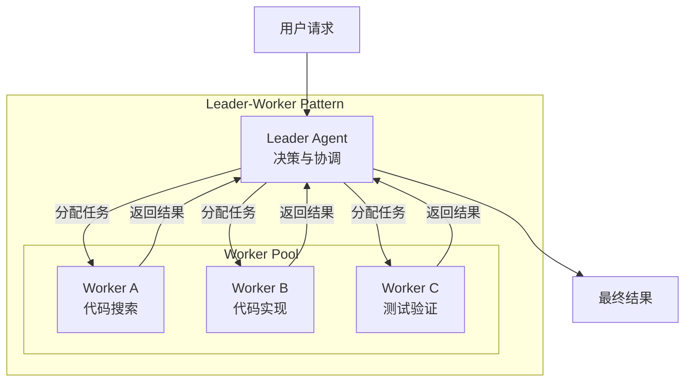

#### 协作原则

| 原则 | 说明 |
|------|------|
| 单一领导 | 每个任务链只有一个 Leader，避免多头指挥 |
| 逐级汇报 | Worker 向直接 Leader 汇报，不越级 |
| 结果导向 | Worker 交付结果，Leader 负责整合 |
| 权限隔离 | Leader 拥有分析权限，Worker 根据角色拥有不同执行权限 |

#### 典型协作流程

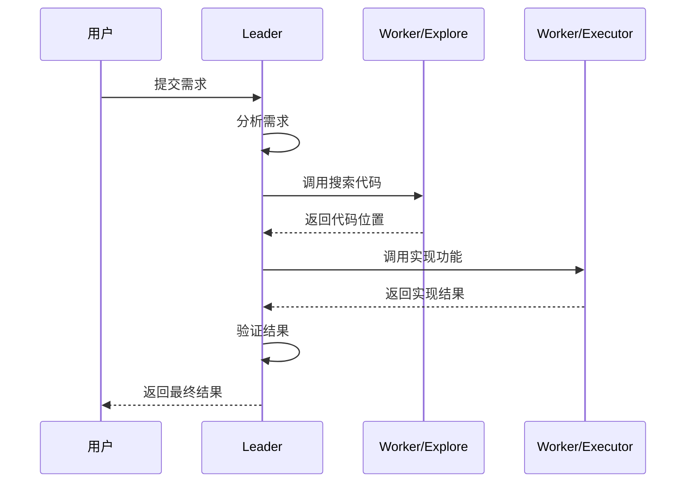

### 9.1.2 五阶段流水线模式

五阶段流水线（Team Pipeline）是一种结构化的多 Agent 协作模式，将软件开发流程划分为五个连续阶段。

#### 流水线架构

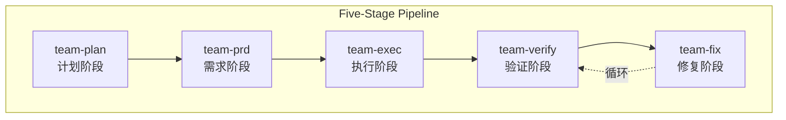

#### 各阶段详解

| 阶段 | 目标 | 参与 Agent | 输出 |
|------|------|------------|------|
| **team-plan** | 理解需求，制定执行计划 | analyst, planner, explore | 需求分析文档、任务分解清单 |
| **team-prd** | 将需求转化为技术方案 | architect, product-manager, api-designer | 架构设计文档、API 规范 |
| **team-exec** | 实现功能，编写代码 | executor, refactor, domain-experts | 功能代码、单元测试 |
| **team-verify** | 验证实现质量 | code-reviewer, tester, security-auditor | 审查报告、测试报告 |
| **team-fix** | 修复验证阶段发现的问题 | debugger, executor, refactor | 修复后的代码、问题根因分析 |

#### 状态流转

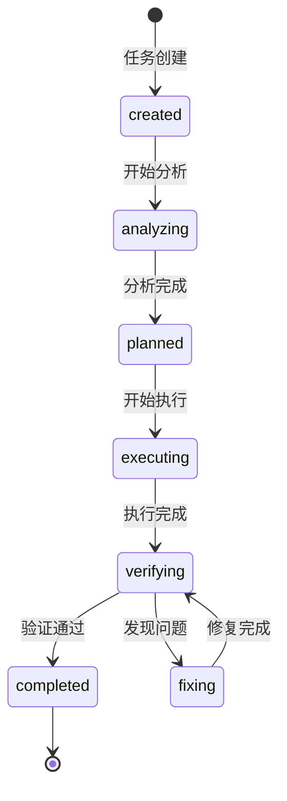

### 9.1.3 子 Agent 调度策略

子 Agent 调度是多 Agent 系统的核心机制，决定了任务如何分配给不同的 Agent。

#### 调用关系矩阵

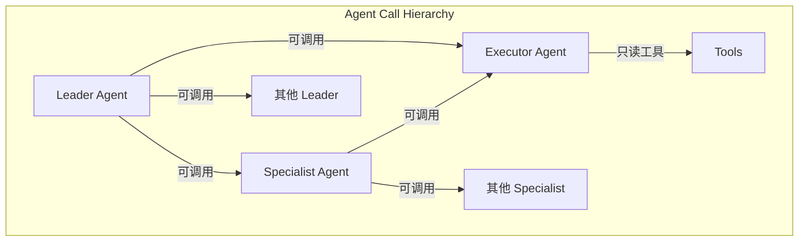

| 调用者 \ 被调用者 | Leader | Specialist | Executor |
|------------------|--------|------------|----------|
| **Leader** | 支持 | 支持 | 支持 |
| **Specialist** | 不支持 | 支持 | 支持 |
| **Executor** | 不支持 | 不支持 | 不支持 |

#### 典型调用链示例

```
场景：实现新功能
analyst (Leader)
    ↓ 调用
planner (Leader)
    ↓ 调用
explore (Specialist) → 返回代码位置
    ↓ 调用
architect (Leader) → 返回设计方案
    ↓ 调用
executor (Executor) → 实现代码
    ↓ 完成
planner (Leader) → 验证并返回
```

---

## 9.2 Skills 系统

Skills（技能）系统是一种模块化的提示词扩展机制，允许按需加载特定领域的指令和知识。

### 9.2.1 OpenClaw Skills 系统

OpenClaw 的 Skills 系统通过动态注入技能文档来扩展 Agent 的能力。

#### Skills 注入流程

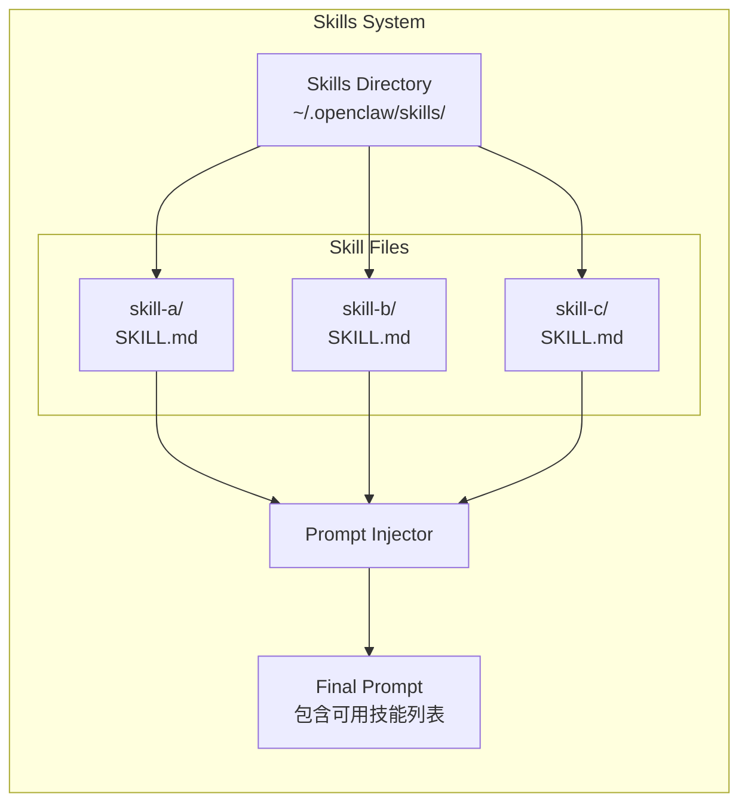

#### 技能注入格式

当存在符合条件的技能时，OpenClaw 会注入一个紧凑的可用技能列表：

```xml
<available_skills>
  <skill>
    <name>技能名称</name>
    <description>技能描述</description>
    <location>file:///path/to/skill/SKILL.md</location>
  </skill>
</available_skills>
```

#### 工作原理

1. **按需加载**：提示词指示模型使用 `read` 工具加载列出位置的 `SKILL.md`
2. **条件注入**：如果没有符合条件的技能，Skills 部分会被省略
3. **保持精简**：这保持了基础提示词的小巧，同时仍能按需使用目标技能

### 9.2.2 Oh-My-Codex Skills 系统

Oh-My-Codex 采用类似的技能系统，但更加强调 Agent 专业化。

#### 技能分类

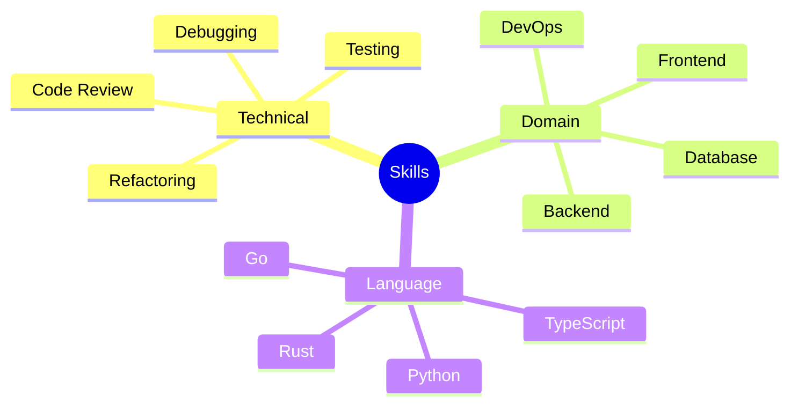

#### 技能激活流程

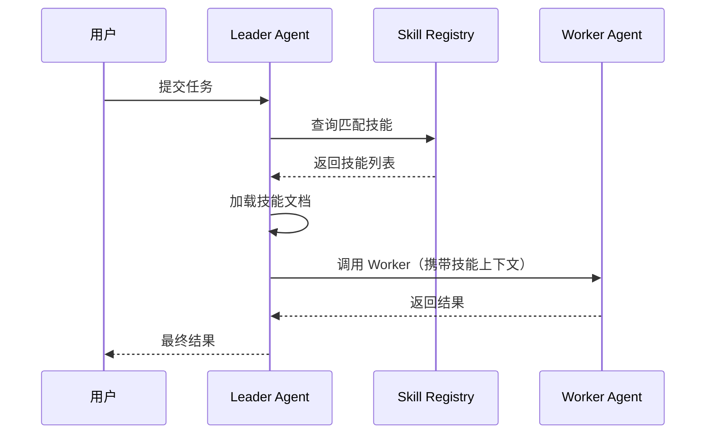

---

## 9.3 动态提示构建

动态提示构建是根据上下文、用户输入和系统状态实时组装提示词的技术。

### 9.3.1 Oh-My-OpenAgent 动态构建器

Oh-My-OpenAgent 使用多阶段提示组装流程，支持从多种来源动态构建最终提示词。

#### 提示组装架构

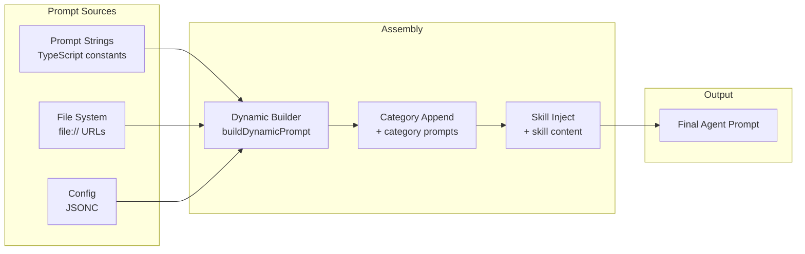

#### 构建阶段详解

| 阶段 | 功能 | 说明 |
|------|------|------|
| **Source Loading** | 加载提示词源 | 从字符串、文件、配置加载原始内容 |
| **Dynamic Builder** | 动态构建 | 根据上下文变量替换和组装 |
| **Category Append** | 类别追加 | 添加类别特定的提示词片段 |
| **Skill Inject** | 技能注入 | 注入匹配的技能文档内容 |

#### 动态变量替换

```mermaid
flowchart TB
    subgraph "Dynamic Variable Resolution"
        T[Template<br/>"你好 {{user.name}}"]
        C[Context<br/>{user: {name: "Alice"}}]
        R[Resolver]
        O[Output<br/>"你好 Alice"]

        T --> R
        C --> R
        R --> O
    end
```

### 9.3.2 提示词模式切换

OpenClaw 支持为子代理渲染更小的系统提示词，通过 `promptMode` 控制：

#### 模式对比

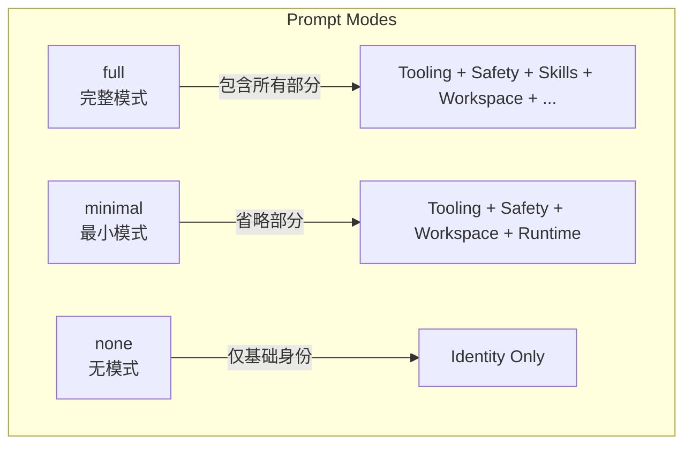

| 模式 | 适用场景 | 包含内容 |
|------|----------|----------|
| **full** | 主 Agent | 所有部分（工具、安全、技能、工作空间等） |
| **minimal** | 子 Agent | 仅核心部分（工具、安全、工作空间、运行时） |
| **none** | 特殊场景 | 仅基础身份行 |

#### minimal 模式省略内容

- Skills
- Memory Recall
- OpenClaw Self-Update
- Model Aliases
- User Identity
- Reply Tags
- Messaging
- Silent Replies
- Heartbeats

---

## 9.4 模型选择策略

模型选择策略决定了在不同场景下使用哪个 AI 模型，直接影响性能、成本和质量的平衡。

### 9.4.1 层级选择流程

Oh-My-OpenAgent 采用层级化的模型选择策略：

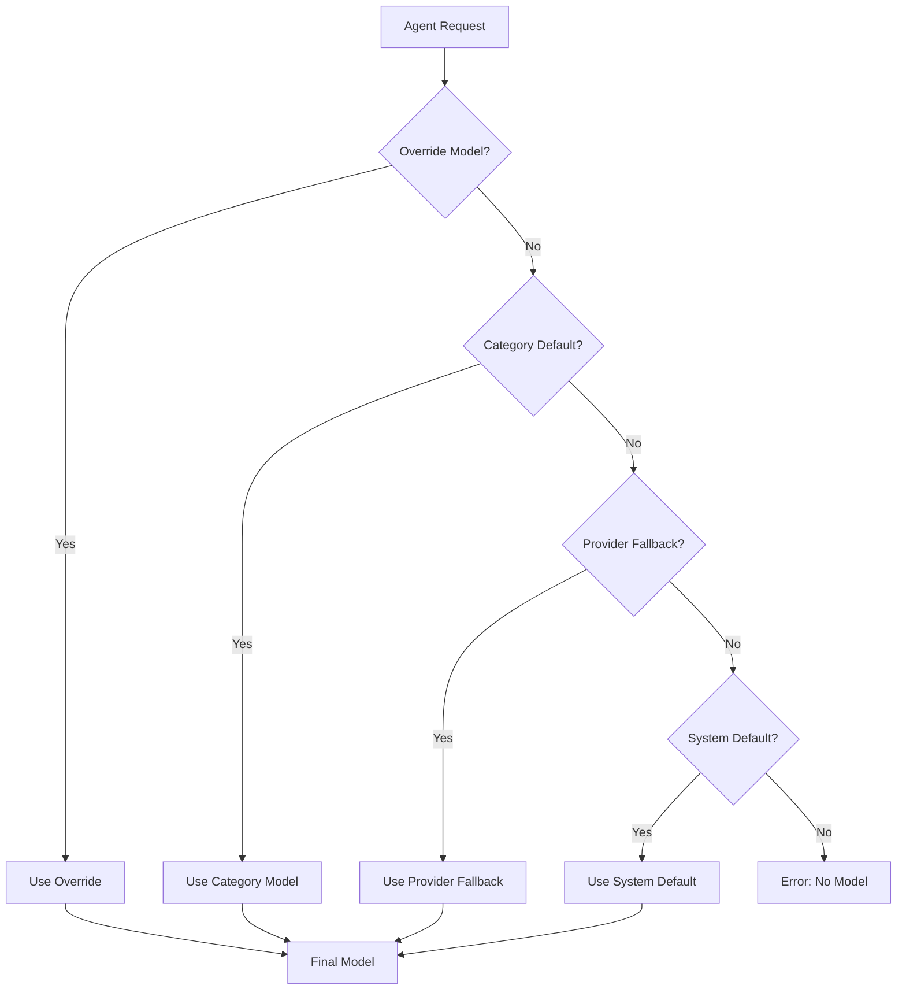

### 9.4.2 选择优先级

| 优先级 | 来源 | 说明 |
|--------|------|------|
| 1 | Override Model | 用户或代码显式指定的模型 |
| 2 | Category Default | 当前任务类别配置的默认模型 |
| 3 | Provider Fallback | 提供商级别的回退模型 |
| 4 | System Default | 系统全局默认模型 |
| 5 | Error | 无可用模型时报错 |

### 9.4.3 模型选择考量因素

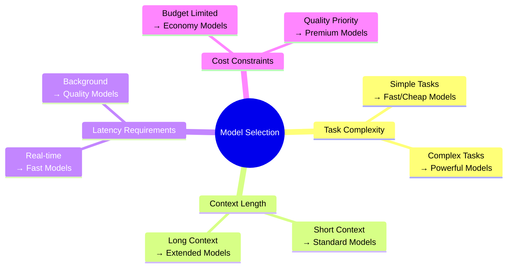

### 9.4.4 多模型变体支持

现代 AI 系统通常支持多种模型提供商和变体：

| 提供商 | 快速模型 | 平衡模型 | 强力模型 |
|--------|----------|----------|----------|
| OpenAI | GPT-4o-mini | GPT-4o | GPT-4-turbo |
| Anthropic | Claude 3 Haiku | Claude 3 Sonnet | Claude 3 Opus |
| Google | Gemini Flash | Gemini Pro | Gemini Ultra |

---

## 9.5 最佳实践总结

### 9.5.1 多 Agent 编排最佳实践

1. **明确职责边界**：每个 Agent 只负责自己的职责范围
2. **及时状态更新**：状态变更后立即通知相关 Agent
3. **结果标准化**：输出格式统一，便于下游 Agent 处理
4. **错误处理机制**：失败时明确错误原因，便于重试或人工介入
5. **超时处理**：设置合理的超时时间，避免无限等待

### 9.5.2 Skills 系统最佳实践

1. **技能粒度适中**：既不要太细（太多技能）也不要太粗（技能臃肿）
2. **文档清晰完整**：每个技能的 SKILL.md 应包含清晰的用途和使用说明
3. **版本管理**：技能文档应纳入版本控制，便于追踪变更
4. **按需加载**：避免在提示词中注入过多未使用的技能

### 9.5.3 动态提示构建最佳实践

1. **模板缓存**：对不经常变化的模板部分进行缓存
2. **变量验证**：在替换前验证所有必需变量是否存在
3. **长度控制**：监控最终提示词长度，避免超出模型上下文限制
4. **调试支持**：提供查看最终提示词的工具，便于调试

### 9.5.4 模型选择最佳实践

1. **任务分级**：根据任务复杂度选择合适的模型层级
2. **成本监控**：跟踪不同模型的使用成本，优化选择策略
3. **回退机制**：配置合理的回退链，避免单点故障
4. **A/B 测试**：对关键任务进行模型效果对比，持续优化

---

## 本章小结

本章介绍了提示工程的四个高级专题：

1. **多 Agent 编排**：通过 Leader-Worker 模式、五阶段流水线和子 Agent 调度，实现复杂任务的分解与协作
2. **Skills 系统**：通过模块化的技能文档，按需扩展 Agent 的专业能力
3. **动态提示构建**：根据上下文动态组装提示词，支持多种模式和变量替换
4. **模型选择策略**：通过层级化的选择流程，在性能、成本和质量之间取得平衡

这些高级技术在实际生产环境中相互配合，共同构建出强大而灵活的 AI 系统。掌握这些技术，能够帮助你设计出更加高效、可维护的提示工程方案。
