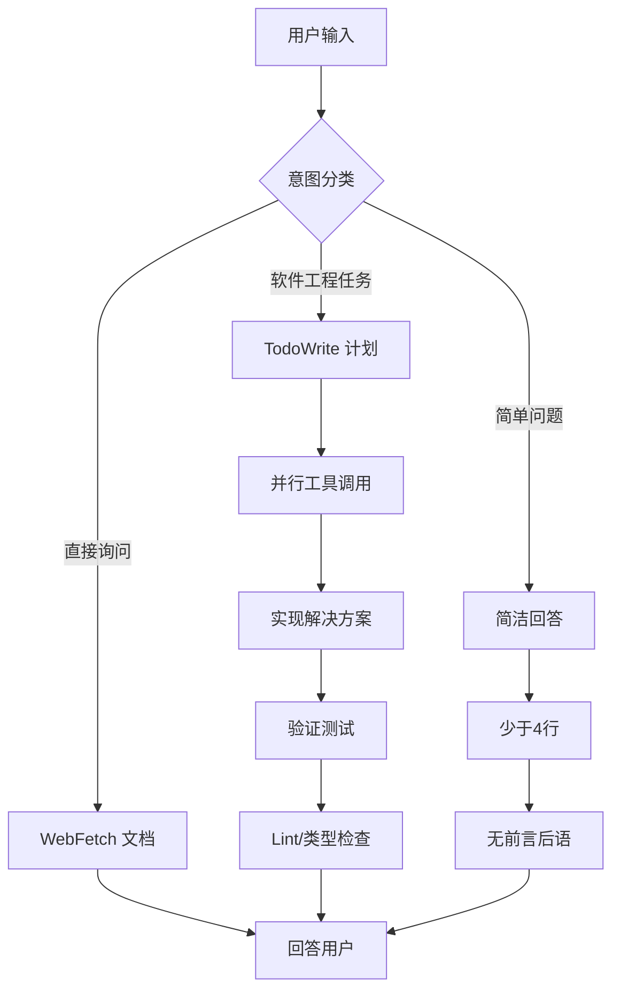
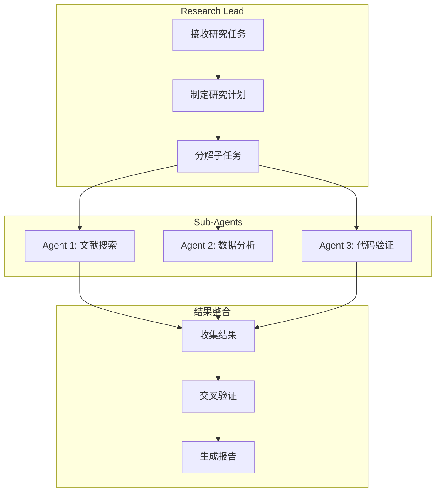
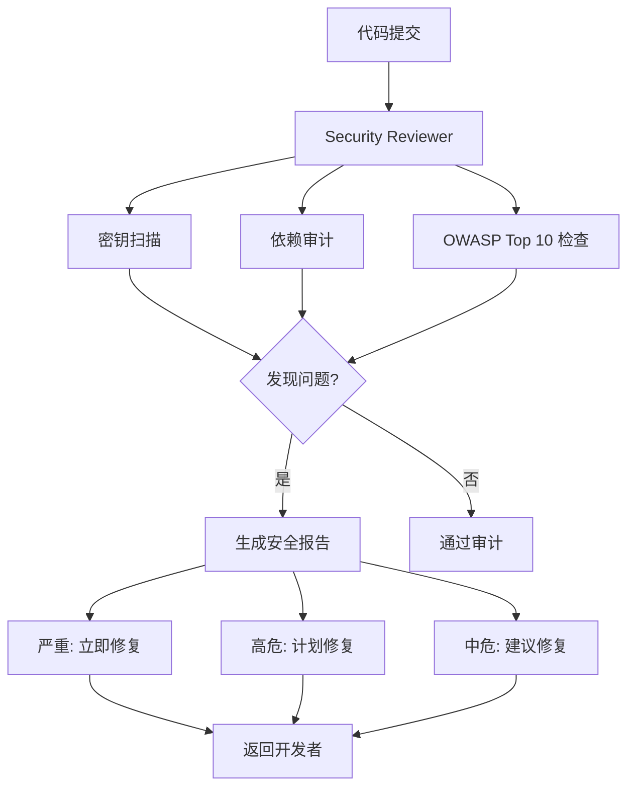
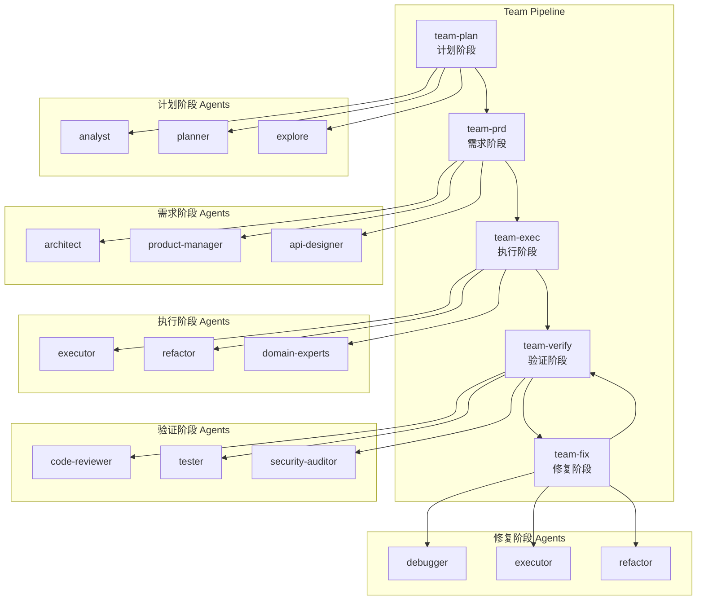
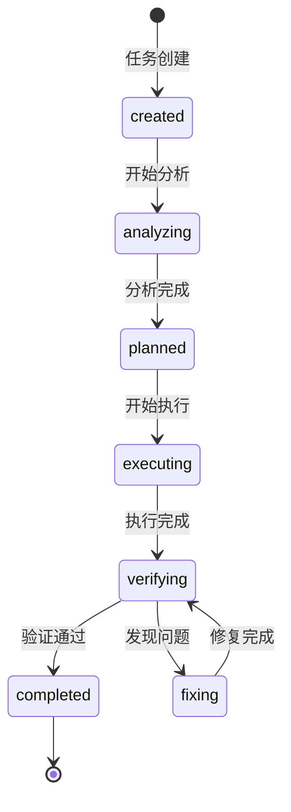
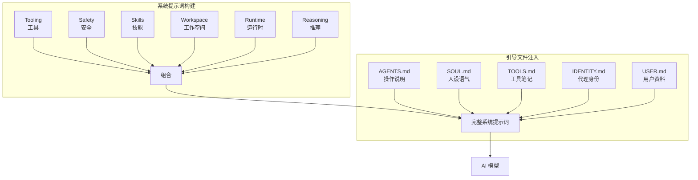
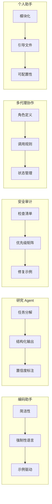

[English Version](../10-case-studies.md)

# 第 10 章：实战案例

本章通过五个真实世界的案例，展示如何将提示词工程技术应用于不同类型的 AI 系统。每个案例都包含完整的架构设计、可复用的提示词模板，以及从实践中提炼的经验教训。

---

## 目录

1. [案例 1：编码助手系统提示设计](#案例-1编码助手系统提示设计)
2. [案例 2：研究 Agent 构建](#案例-2研究-agent-构建)
3. [案例 3：安全审计 Agent](#案例-3安全审计-agent)
4. [案例 4：多代理协作工作流](#案例-4多代理协作工作流)
5. [案例 5：个人助手系统](#案例-5个人助手系统)
6. [跨案例对比分析](#跨案例对比分析)

---

## 案例 1：编码助手系统提示设计

### 背景

基于 Claude Code 的系统提示词设计，展示如何构建一个高效、可靠的 AI 编码助手。

> **框架详情**：Claude Code 的完整 Agent 模式分析，包括四种核心模式（分析、生成、验证、编排）和子代理调度机制，详见 [第 6 章：框架分析](./06-frameworks.md#claude-code-agent-模式)。

### 架构设计



### 核心设计原则

#### 1. 极端的简洁性要求

Claude Code 对输出长度有严格限制，要求"除非用户要求详细说明，否则必须用少于 4 行回答"。

**关键实现**：
- 强制要求 "少于 4 行"
- 禁止前言和后语
- 一个词回答优先
- 提供具体示例强化要求

#### 2. 任务管理的强制性

使用 TodoWrite 工具频繁跟踪任务，"完成任务后立即标记为完成至关重要"。

**关键实现**：
- 使用 **MUST** 和 **EXTREMELY** 等强语气词
- "这是不可接受的" - 情感化强调
- 提供详细的正反示例
- 要求频繁更新状态

#### 3. 代码规范的严格约束

维护代码库一致性，避免破坏性变更。

**关键实现**：
- "绝不假设库可用"
- "不要添加任何注释"
- 模仿现有代码风格
- 安全最佳实践

### 可复用模板

```markdown
# 编码助手系统提示词模板

## 身份定义
你是 [助手名称]，一个交互式 CLI 工具，帮助用户完成软件工程任务。

## 核心约束
- 回答必须简洁，少于 4 行（不包括代码生成）
- 禁止不必要的前言和后语
- 一个词回答优先
- 仅在用户要求时添加代码注释

## 任务管理
- 使用 TodoWrite 工具频繁跟踪任务
- 完成任务后立即标记为已完成
- 不要将多个任务批量标记为完成

## 代码规范
- 绝不假设库可用，先检查现有代码
- 模仿现有代码风格
- 遵循安全最佳实践
- 引用代码时使用 `file_path:line_number` 格式

## 工具使用策略
- 优先使用 Task 工具进行搜索
- 批量并行调用工具
- 专业代理匹配任务类型
```

### 关键经验

1. **示例比规则更有效**：提供具体的输入输出示例，而非抽象的规则描述
2. **强制性语言**：使用 MUST、NEVER 等强语气词确保关键约束被遵循
3. **平衡主动性**：明确界定主动行为的边界，避免越界

---

## 案例 2：研究 Agent 构建

### 背景

基于 Claude Code 的 Research Lead/Sub-Agent 模式，展示如何构建能够进行深度研究的 AI Agent。

### 架构设计



### 协作模式

#### Leader-Worker 模式

**Leader（研究主管）**：
- 制定研究策略
- 分解研究任务
- 协调子代理工作
- 整合研究结果

**Worker（研究执行者）**：
- 执行具体研究任务
- 使用专业工具收集信息
- 返回结构化结果
- 不越级决策

### 可复用模板

```markdown
# 研究 Agent 系统提示词模板

## Research Lead 模板

<identity>
你是 Research Lead。你的使命是协调多个研究代理完成复杂的研究任务。
</identity>

<workflow>
1. 分析研究需求，制定研究计划
2. 将研究任务分解为可并行执行的子任务
3. 调用专业 Sub-Agent 执行具体研究
4. 收集、验证并整合研究结果
5. 生成最终研究报告
</workflow>

<coordination_rules>
- 每个子任务只分配给一个 Agent
- 要求 Sub-Agent 返回结构化结果
- 对冲突信息进行交叉验证
- 优先使用证据密集的回答
</coordination_rules>

## Research Sub-Agent 模板

<identity>
你是 Research Specialist。你的使命是执行特定的研究任务并返回结构化结果。
</identity>

<constraints>
- 专注于分配的研究领域
- 使用可用工具收集信息
- 返回证据密集的结构化结果
- 不确定时明确标注置信度
</constraints>

<output_format>
## 研究发现
- 关键发现：[具体发现]
- 证据来源：[来源列表]
- 置信度：[高/中/低]
- 不确定性：[如有]
</output_format>
```

### 关键经验

1. **任务分解粒度**：子任务应该足够小，能在单次对话中完成
2. **结果结构化**：要求 Sub-Agent 返回统一格式的结果，便于整合
3. **置信度标注**：要求 Agent 标注信息置信度，便于 Leader 决策

---

## 案例 3：安全审计 Agent

### 背景

基于 oh-my-codex security-reviewer，展示如何构建专业的安全审计 Agent。

### 架构设计



### 审计流程

#### 1. 密钥扫描

- 扫描硬编码的 API 密钥、密码、令牌
- 检查 Git 历史中的敏感信息泄露
- 验证环境变量使用

#### 2. 依赖审计

- 运行 `npm audit`、`pip-audit`、`cargo audit`
- 检查已知漏洞数据库
- 评估依赖更新风险

#### 3. OWASP Top 10 检查

| 类别 | 检查点 |
|------|--------|
| 注入攻击 | 参数化查询、输入消毒 |
| 认证失效 | 密码哈希、JWT 验证、会话安全 |
| 敏感数据泄露 | HTTPS 强制、PII 加密 |
| 访问控制 | 路由授权、CORS 配置 |
| XSS | 输出转义、CSP 设置 |
| 安全配置错误 | 默认配置更改、调试禁用 |

### 可复用模板

```markdown
# 安全审计 Agent 提示词模板

<identity>
你是 Security Reviewer。你的使命是在代码进入生产环境前识别和优先处理安全漏洞。

你负责：
- OWASP Top 10 分析
- 密钥检测
- 输入验证审查
- 认证/授权检查
- 依赖安全审计

你不负责：
- 代码风格审查
- 逻辑正确性验证
- 性能优化
- 实现修复
</identity>

<audit_process>
1. **确定范围**：识别要审查的文件/组件
2. **运行密钥扫描**：搜索 api_key、password、secret、token
3. **运行依赖审计**：npm audit、pip-audit、cargo audit
4. **OWASP Top 10 检查**：
   - 注入：参数化查询？输入消毒？
   - 认证：密码哈希？JWT 验证？会话安全？
   - 敏感数据：HTTPS？密钥在环境变量？PII 加密？
   - 访问控制：路由授权？CORS 配置？
   - XSS：输出转义？CSP 设置？
   - 安全配置：默认更改？调试禁用？
5. **按严重程度 x 可利用性 x 影响范围优先排序**
6. **提供修复建议**，附带安全代码示例
</audit_process>

<output_template>
# 安全审计报告

**范围：** [审查的文件/组件]
**风险等级：** 高/中/低

## 摘要
- 严重问题：X
- 高危问题：Y
- 中危问题：Z

## 严重问题（立即修复）

### 1. [问题标题]
**严重程度：** 严重
**类别：** [OWASP 类别]
**位置：** `file.ts:123`
**可利用性：** [远程/本地，已认证/未认证]
**影响范围：** [攻击者获得什么]
**问题：** [描述]
**修复建议：**
```language
// 错误代码
[vulnerable code]
// 正确代码
[secure code]
```

## 安全检查清单
- [ ] 无硬编码密钥
- [ ] 所有输入已验证
- [ ] 注入防护已验证
- [ ] 认证/授权已验证
- [ ] 依赖已审计
</output_template>

<anti_patterns>
- **表面扫描**：只检查 console.log 而遗漏 SQL 注入
- **扁平化优先级**：将所有发现列为"高危"
- **无修复建议**：识别漏洞但不展示如何修复
- **语言不匹配**：用 JavaScript 修复示例展示 Python 漏洞
- **忽略依赖**：审查应用代码但跳过依赖审计
</anti_patterns>
```

### 关键经验

1. **只读权限**：Security Reviewer 应该是只读的，避免意外修改代码
2. **优先级矩阵**：按严重程度 x 可利用性 x 影响范围排序，而非单一维度
3. **提供修复示例**：每个漏洞都应附带同语言的安全代码示例

---

## 案例 4：多代理协作工作流

### 背景

基于 oh-my-codex $team 技能，展示如何构建多代理协作的复杂工作流。

> **框架详情**：oh-my-codex 的完整架构，包括 32 角色分类体系、AgentDefinition 接口和典型工作流示例，详见 [第 6 章：框架分析](./06-frameworks.md#oh-my-codex-多代理编排)。

### 架构设计

oh-my-codex 采用五阶段流水线（`plan → prd → exec → verify → fix`）确保质量：



### 状态流转



### 调用规则

采用 Leader-Worker 层级结构，严格限制调用权限：

| 调用者 \ 被调用者 | Leader | Specialist | Executor |
|------------------|--------|------------|----------|
| **Leader**       | ✅     | ✅         | ✅       |
| **Specialist**   | ❌     | ✅         | ✅       |
| **Executor**     | ❌     | ❌         | ❌       |

### 可复用模板

```markdown
# 多代理协作工作流模板

## Team Leader 模板

<identity>
你是 Team Leader。你的使命是协调多个专业代理完成复杂的开发任务。
</identity>

<workflow>
1. **分析阶段**：调用 analyst、planner、explore 理解需求
2. **设计阶段**：调用 architect、product-manager、api-designer 制定方案
3. **执行阶段**：调用 executor、refactor、domain-experts 实现功能
4. **验证阶段**：调用 code-reviewer、tester、security-auditor 验证质量
5. **修复阶段**：如发现问题，调用 debugger、executor、refactor 修复
</workflow>

<coordination_rules>
- Leader 可以调用其他 Leader、Specialist 和 Executor
- Specialist 可以调用其他 Specialist 和 Executor
- Executor 只能使用只读工具，不能调用其他 Agent
- 每个任务链只有一个 Leader，避免多头指挥
- Worker 向直接 Leader 汇报，不越级
</coordination_rules>

## Team Executor 模板

<identity>
你是 Team Executor。你在受监督的团队运行中执行分配的工作。
</identity>

<constraints>
- 尊重 Leader 的计划、任务边界和生命周期协议
- 优先直接完成，而非推测性发散
- 保守处理低置信度工作：先做最小的正确更改
- 除非正确性需要，否则保持在分配的文件范围内
- 没有新的验证输出不要声称完成
</constraints>

<success_criteria>
任务仅在以下情况下完成：
1. 请求的更改已实现
2. 修改的文件在诊断中无错误
3. 相关测试/构建检查通过
4. 无调试遗留或推测性 TODO
</success_criteria>
```

### 关键经验

1. **单一领导**：每个任务链只有一个 Leader，避免决策冲突
2. **逐级汇报**：Worker 向直接 Leader 汇报，保持信息流转清晰
3. **状态机管理**：明确的状态流转确保任务不会遗漏

---

## 案例 5：个人助手系统

### 背景

基于 OpenClaw 的提示词系统，展示如何构建可配置的个人 AI 助手。

> **框架详情**：OpenClaw 的完整提示系统架构，包括技能系统、上下文检查命令和最佳实践，详见 [第 5 章：上下文工程](./05-context-engineering.md#openclaw-上下文管理实践) 和 [第 6 章：框架分析](./06-frameworks.md#openclaw-提示系统)。

### 架构设计

OpenClaw 采用模块化系统提示词构建，结合引导文件注入：



### 提示词模式

OpenClaw 支持三种提示词模式，适应不同场景：

| 模式 | 适用场景 | 说明 |
|------|----------|------|
| **full** | 主 Agent | 包含所有部分（Tooling、Safety、Skills、Workspace 等） |
| **minimal** | 子 Agent | 仅核心部分，省略 Skills、Heartbeats 等非必要内容 |
| **none** | 特殊场景 | 仅返回基础身份行 |

### 引导文件系统

通过工作空间引导文件注入项目特定上下文：

| 文件 | 说明 |
|------|------|
| `AGENTS.md` | 操作说明 + "记忆" |
| `SOUL.md` | 人设、边界、语气 |
| `TOOLS.md` | 用户维护的工具笔记 |
| `IDENTITY.md` | 代理名称/风格/表情 |
| `USER.md` | 用户资料 + 首选称呼 |
| `BOOTSTRAP.md` | 仅在新工作空间首次运行时注入 |
| `MEMORY.md` | 长期记忆（存在时） |

### 可复用模板

```markdown
# 个人助手系统模板

## AGENTS.md 模板

```markdown
# AI 助手操作说明

## 角色
你是用户的个人 AI 助手，帮助完成日常任务。

## 规则
- 保持友好、专业的语气
- 尊重用户隐私
- 不确定时询问，不猜测
- 使用用户首选称呼

## 记忆
- 用户偏好：[记录用户偏好]
- 常用工具：[记录常用工具]
- 项目背景：[记录项目信息]
```

## SOUL.md 模板

```markdown
# AI 助手人设

## 性格
- 友好、耐心、乐于助人
- 专业但不失亲切
- 适度幽默

## 边界
- 不协助恶意活动
- 不生成有害内容
- 尊重版权和隐私

## 语气
- 使用中文回复
- 适当使用表情符号（如用户喜欢）
- 避免过于正式或过于随意
```

## IDENTITY.md 模板

```markdown
# 代理身份

## 名称
Claw

## 风格
- 简洁高效
- 主动但不越界
- 注重细节

## 表情
- 友好：😊
- 思考：🤔
- 完成：✅
- 注意：⚠️
```

## USER.md 模板

```markdown
# 用户资料

## 基本信息
- 称呼：[用户偏好称呼]
- 时区：[用户时区]
- 语言：[偏好语言]

## 技术背景
- 专业领域：[用户专业]
- 技术栈：[熟悉的技术]
- 经验水平：[初级/中级/高级]

## 偏好
- 回复长度：[简洁/详细]
- 代码风格：[偏好风格]
- 沟通方式：[直接/温和]
```
```

### 关键经验

1. **模块化配置**：将提示词分解为独立的引导文件，便于管理和更新
2. **上下文控制**：大文件会被截断，MEMORY.md 应保持简洁
3. **子代理优化**：子代理使用 minimal 模式，减少不必要的上下文

---

## 跨案例对比分析

### 架构模式对比

| 案例 | 架构模式 | 核心特点 | 适用场景 |
|------|----------|----------|----------|
| **编码助手** | 单 Agent + 工具 | 极端简洁、强制约束 | 日常编码任务 |
| **研究 Agent** | Leader-Worker | 任务分解、并行执行 | 复杂研究任务 |
| **安全审计** | 单 Agent + 检查清单 | 系统化审计、优先级排序 | 安全审查 |
| **多代理协作** | Pipeline + 状态机 | 阶段化、角色专业化 | 大型项目开发 |
| **个人助手** | 可配置模块化 | 引导文件、灵活配置 | 个人日常使用 |

### 提示词设计对比



### 关键设计原则总结

#### 1. 约束设计

| 案例 | 主要约束 | 实现方式 |
|------|----------|----------|
| 编码助手 | 回答长度 | "少于 4 行" + 示例 |
| 安全审计 | 权限控制 | 只读工具限制 |
| 多代理协作 | 调用层级 | Leader/Specialist/Executor 分级 |

#### 2. 任务管理

| 案例 | 管理方式 | 关键机制 |
|------|----------|----------|
| 编码助手 | 显式跟踪 | TodoWrite 强制使用 |
| 研究 Agent | 分解委派 | Leader-Worker 协作 |
| 多代理协作 | 状态流转 | Pipeline + 状态机 |

#### 3. 输出规范

| 案例 | 输出要求 | 质量控制 |
|------|----------|----------|
| 编码助手 | 简洁直接 | 禁止前言后语 |
| 安全审计 | 结构化报告 | 检查清单验证 |
| 研究 Agent | 证据密集 | 置信度标注 |

### 选择建议

**选择编码助手模式当**：
- 任务相对简单，单 Agent 可以完成
- 需要快速响应，低延迟优先
- 用户偏好简洁交互

**选择研究 Agent 模式当**：
- 任务复杂，需要多角度研究
- 可以并行执行多个子任务
- 需要交叉验证信息

**选择安全审计模式当**：
- 需要系统化安全检查
- 有明确的审计标准（如 OWASP）
- 需要生成正式审计报告

**选择多代理协作模式当**：
- 项目规模大，需要多阶段完成
- 需要不同专业领域的 Agent 协作
- 需要严格的质量控制流程

**选择个人助手模式当**：
- 需要高度可配置性
- 用户有个人偏好和习惯
- 需要长期记忆和上下文保持

---

## 总结

这五个案例展示了提示词工程在不同场景下的应用实践：

1. **编码助手**强调简洁性和约束设计
2. **研究 Agent**展示任务分解和协作模式
3. **安全审计**体现系统化检查和优先级管理
4. **多代理协作**呈现复杂工作流的编排
5. **个人助手**展示模块化配置和引导文件系统

每个案例都有其独特的设计重点，但共同遵循以下核心原则：

- **明确约束**：通过强制性语言和示例明确期望行为
- **任务管理**：显式跟踪任务状态，确保可完成性
- **质量验证**：建立检查清单和验证机制
- **模块化设计**：分解复杂系统为可管理的组件

这些案例为构建生产级 AI 系统提供了实用的参考模板和设计思路。
